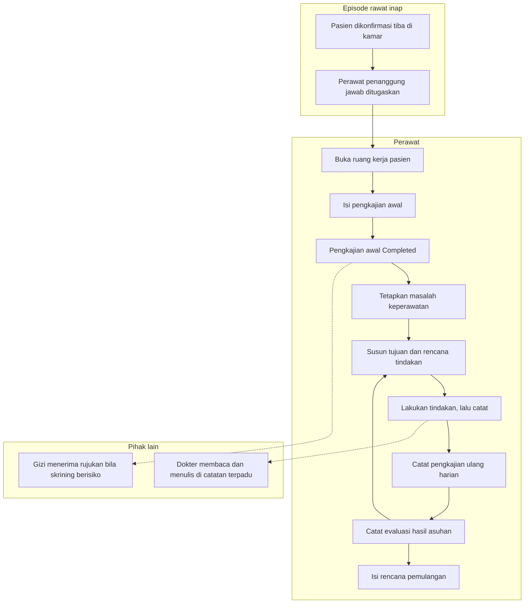
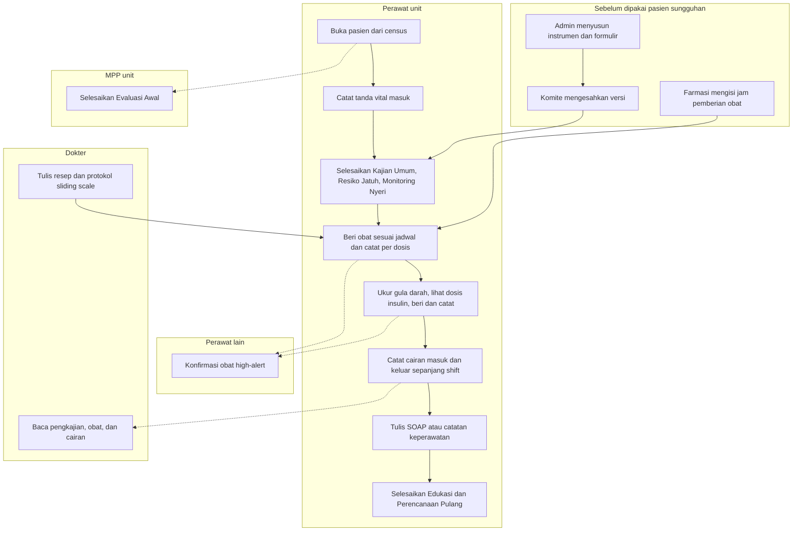

# Alur Utama Keperawatan Rawat Inap

| Field | Nilai |
| --- | --- |
| Sub-modul | `keperawatan` |
| Revision | **`0.3`** — bagian 4 penyelarasan `PRD-RWI-V2-001` |
| Status | **`draft`** untuk `0.3` |
| Isi | **Jalur normal saja.** Jalur pengecualian ada pada berkas per proses |
| Sumber | `PRD-RWI-FINAL-001` bagian 16.3 |

---

## 1. Dari pasien masuk kamar sampai rencana pulang

Diagram ini menggambarkan **urutan langkah yang dikerjakan petugas**, bukan tabel dan bukan
endpoint. Nama keadaan sama persis dengan
[`../contracts/state-transition-matrix.md`](../contracts/state-transition-matrix.md).

Garis putus-putus berarti **memberi tahu**, bukan menunggu. Rujukan gizi dan catatan terpadu
tidak menahan langkah berikutnya.

Panah balik dari evaluasi ke rencana adalah inti asuhan keperawatan: rencana diperbarui mengikuti
hasil evaluasi, dan setiap pembaruan menyimpan versi sebelumnya.

---

## 2. Tabel langkah

| No | Langkah | Pelaku | Masukan | Keluaran | Bila gagal, petugas melakukan |
| ---: | --- | --- | --- | --- | --- |
| 1 | Pasien dikonfirmasi tiba | Petugas admisi atau supervisor | Pasien hadir di kamar | Perawatan resmi berjalan | Bukan pekerjaan perawat. Hubungi admisi |
| 2 | Perawat penanggung jawab ditugaskan | Kepala ruangan | Daftar perawat yang bertugas | Penanggung jawab tercatat | **Pencatatan tetap boleh jalan.** Perawat yang bertugas di unit tetap diizinkan; episodenya muncul di daftar pantau |
| 3 | Buka ruang kerja pasien | Perawat | Daftar pasien di unitnya | Konteks pasien tampil | Muat ulang. Bila tetap gagal, jangan mengisi formulir kosong — konteksnya belum pasti |
| 4 | Isi pengkajian awal | Perawat | Keadaan pasien, riwayat, tanda vital | Pengkajian tersimpan bertahap | Isian tersimpan sebagai belum selesai; lanjutkan nanti |
| 5 | Selesaikan pengkajian awal | Perawat | Pengkajian yang sudah lengkap | Pengkajian `Completed` | Sistem menyebut bagian mana yang masih kosong |
| 6 | Tetapkan masalah keperawatan | Perawat | Temuan pada pengkajian | Butir asuhan `Active` | Periksa apakah episode masih berjalan |
| 7 | Susun tujuan dan rencana | Perawat | Masalah yang sudah ditetapkan | Rencana tercatat | — |
| 8 | Lakukan lalu catat tindakan | Perawat | Tindakan yang benar-benar dikerjakan | Catatan `Recorded` | Bila tombol tertekan dua kali, sistem tetap menyimpan satu |
| 9 | Pengkajian ulang harian | Perawat | Keadaan pasien hari itu | Catatan baru, **bukan menimpa** | — |
| 10 | Catat evaluasi | Perawat | Hasil asuhan | Evaluasi tercatat | — |
| 11 | Rencana pemulangan | Perawat | Keadaan pasien dan rencana DPJP | Rencana pulang tercatat | Dapat dimulai sejak hari pertama; tidak menunggu keputusan pulang |

---

## 3. Yang **tidak** ada di alur ini, dan kenapa

| Yang tidak ada | Alasan |
| --- | --- |
| Pengkajian sebagai gerbang sebelum dokter boleh menulis | `INV-KEP-03` dan PRD 16.3 melarangnya tegas |
| Pengkajian sebagai gerbang sebelum pasien boleh ditempatkan | Sama. Menahan penempatan karena dokumentasi belum lengkap berarti menahan pasien di lorong |
| Pemakaian alat | Dikeluarkan dari scope rilis pertama lewat `RWI-DEC-089` — `CAP-016` berstatus `DEFERRED`. Selama MVP, pemakaian alat dicatat di luar sistem sebagaimana hari ini |

---

## 4. Alur utama revision `0.3` — penyelarasan `PRD-RWI-V2-001` ★ 15 September 2026

**Status `draft`.** Bagian 1 dan 2 tetap berlaku untuk rencana asuhan dan tindakan harian. Bagian ini menambah jalur
normal satu hari perawatan dengan isi V2. Jalur pengecualian ada di tiga berkas proses:
[`02-pengkajian-pasien-dan-instrumen.md`](./02-pengkajian-pasien-dan-instrumen.md),
[`03-obat-mar-dan-sliding-scale.md`](./03-obat-mar-dan-sliding-scale.md),
[`04-pengawasan-harian-dan-cairan.md`](./04-pengawasan-harian-dan-cairan.md).

Garis putus-putus: **pekerjaan orang lain yang berjalan berdampingan**, bukan menunggu. Evaluasi Awal tidak menahan
progres perawat; konfirmasi perawat kedua menahan **dosis high-alert itu saja**, bukan pekerjaan lain.

| No | Langkah | Pelaku | Masukan | Keluaran | Bila gagal, petugas melakukan |
| ---: | --- | --- | --- | --- | --- |
| 1 | Susun dan sahkan instrumen | Admin konfigurasi, komite | Skala yang disetujui rumah sakit | Versi berlaku | Tanpa versi sah, dokumen hanya dapat disimpan sebagai konsep — laporkan ke komite |
| 2 | Isi jam pemberian obat | Farmasi | Kebiasaan jam per frekuensi | Jadwal berlaku | Obat berfrekuensi tanpa jadwal dicatat sebagai pemberian di luar jadwal beralasan |
| 3 | Buka pasien | Perawat | Census unit | Delapan menu dan progres | Konteks gagal → jangan menulis, muat ulang |
| 4 | Catat tanda vital masuk | Perawat | Hasil ukur | Satu baris tanda vital | Nyeri tidak diisi di sini — kaji di Monitoring Nyeri |
| 5 | Selesaikan pengkajian | Perawat | Kondisi pasien | Dokumen selesai beserta skor | Isian wajib kurang → lengkapi; formulir berganti versi → muat ulang |
| 6 | Beri obat dan catat | Perawat | Jadwal dosis | Dosis tercatat | Dosis ditahan atau ditolak → catat alasan; obat high-alert → minta perawat lain |
| 7 | Gula darah dan insulin | Perawat | GDS bangsal | Satu GDS, satu dosis, satu pelaksanaan | Protokol tidak aktif → hubungi dokter; satuan tidak cocok → ukur dan periksa ulang |
| 8 | Cairan | Perawat | Volume terukur | Balance terhitung | Salah catat → koreksi beralasan, jangan tambah entri kedua |
| 9 | SOAP dan catatan | Perawat | Perkembangan | CPPT berjenis | Angka cairan dan obat tidak ditulis sebagai pengganti pencatatan terstruktur |
| 10 | Edukasi dan Perencanaan Pulang | Perawat | Kebutuhan pasien dan keluarga | Progres 100% | — |
| 11 | Evaluasi Awal | MPP | Kebutuhan pelayanan pasien | Dokumen MPP selesai | Pasien pindah unit → MPP unit baru yang melanjutkan |

**Yang tidak ada pada alur ini:** handover shift dan transfusi (`RWI-DEC-145`), serah terima klinis antarunit,
pemakaian alat, pemesanan kamar operasi, dan layanan penunjang selain Laboratorium dan Radiologi — menunya tampil
"Integrasi belum tersedia".
