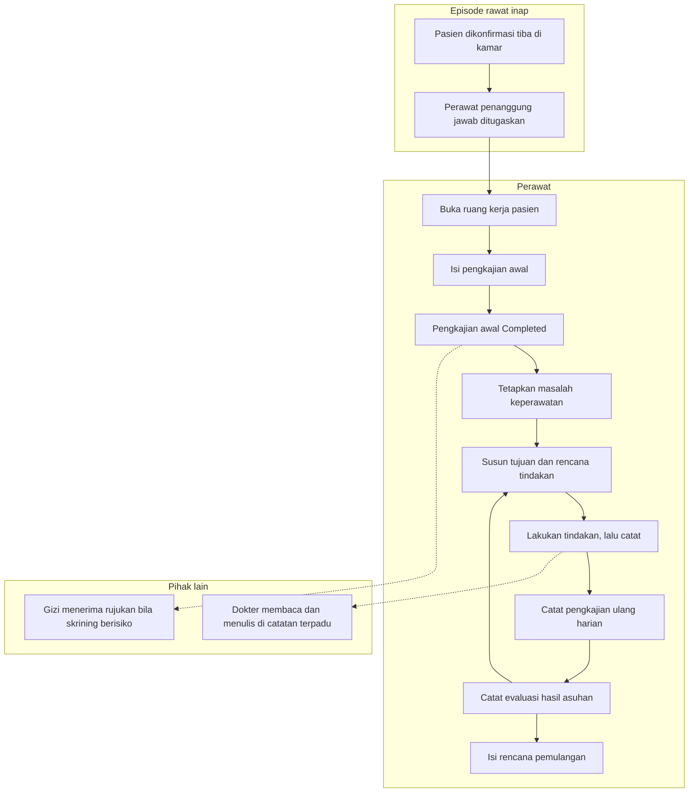

# Alur Utama Keperawatan Rawat Inap

| Field | Nilai |
| --- | --- |
| Sub-modul | `keperawatan` |
| Revision | `0.1` |
| Status | `draft` |
| Isi | **Jalur normal saja.** Jalur pengecualian ada pada berkas per proses |
| Sumber | `PRD-RWI-FINAL-001` bagian 16.3 |

---

## 1. Dari pasien masuk kamar sampai rencana pulang

Diagram ini menggambarkan **urutan langkah yang dikerjakan petugas**, bukan tabel dan bukan
endpoint. Nama keadaan sama persis dengan
[`../contracts/state-transition-matrix.md`](../contracts/state-transition-matrix.md).

Garis putus-putus berarti **memberi tahu**, bukan menunggu. Rujukan gizi dan catatan terpadu
tidak menahan langkah berikutnya.

Panah balik dari evaluasi ke rencana adalah inti asuhan keperawatan: rencana diperbarui mengikuti
hasil evaluasi, dan setiap pembaruan menyimpan versi sebelumnya.

---

## 2. Tabel langkah

| No | Langkah | Pelaku | Masukan | Keluaran | Bila gagal, petugas melakukan |
| ---: | --- | --- | --- | --- | --- |
| 1 | Pasien dikonfirmasi tiba | Petugas admisi atau supervisor | Pasien hadir di kamar | Perawatan resmi berjalan | Bukan pekerjaan perawat. Hubungi admisi |
| 2 | Perawat penanggung jawab ditugaskan | Kepala ruangan | Daftar perawat yang bertugas | Penanggung jawab tercatat | **Pencatatan tetap boleh jalan.** Perawat yang bertugas di unit tetap diizinkan; episodenya muncul di daftar pantau |
| 3 | Buka ruang kerja pasien | Perawat | Daftar pasien di unitnya | Konteks pasien tampil | Muat ulang. Bila tetap gagal, jangan mengisi formulir kosong — konteksnya belum pasti |
| 4 | Isi pengkajian awal | Perawat | Keadaan pasien, riwayat, tanda vital | Pengkajian tersimpan bertahap | Isian tersimpan sebagai belum selesai; lanjutkan nanti |
| 5 | Selesaikan pengkajian awal | Perawat | Pengkajian yang sudah lengkap | Pengkajian `Completed` | Sistem menyebut bagian mana yang masih kosong |
| 6 | Tetapkan masalah keperawatan | Perawat | Temuan pada pengkajian | Butir asuhan `Active` | Periksa apakah episode masih berjalan |
| 7 | Susun tujuan dan rencana | Perawat | Masalah yang sudah ditetapkan | Rencana tercatat | — |
| 8 | Lakukan lalu catat tindakan | Perawat | Tindakan yang benar-benar dikerjakan | Catatan `Recorded` | Bila tombol tertekan dua kali, sistem tetap menyimpan satu |
| 9 | Pengkajian ulang harian | Perawat | Keadaan pasien hari itu | Catatan baru, **bukan menimpa** | — |
| 10 | Catat evaluasi | Perawat | Hasil asuhan | Evaluasi tercatat | — |
| 11 | Rencana pemulangan | Perawat | Keadaan pasien dan rencana DPJP | Rencana pulang tercatat | Dapat dimulai sejak hari pertama; tidak menunggu keputusan pulang |

---

## 3. Yang **tidak** ada di alur ini, dan kenapa

| Yang tidak ada | Alasan |
| --- | --- |
| Pengkajian sebagai gerbang sebelum dokter boleh menulis | `INV-KEP-03` dan PRD 16.3 melarangnya tegas |
| Pengkajian sebagai gerbang sebelum pasien boleh ditempatkan | Sama. Menahan penempatan karena dokumentasi belum lengkap berarti menahan pasien di lorong |
| Pemakaian alat | Dikeluarkan dari scope rilis pertama lewat `RWI-DEC-089` — `CAP-016` berstatus `DEFERRED`. Selama MVP, pemakaian alat dicatat di luar sistem sebagaimana hari ini |
