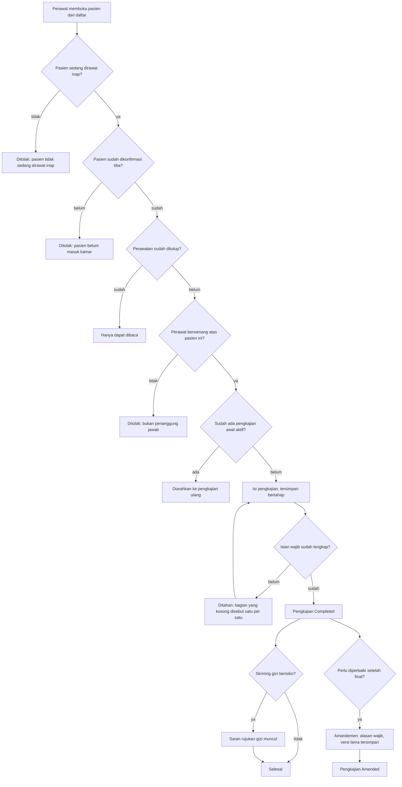

# Proses: Pengkajian Awal Keperawatan

| Field | Nilai |
| --- | --- |
| Sub-modul | `keperawatan` |
| Revision | `0.1` |
| Status | `draft` |
| Isi | Seluruh percabangan **beserta jalur pengecualiannya** |
| Kemampuan | `CAP-012` |

---

## 1. Diagram

---

## 2. Tabel langkah

| No | Langkah | Pelaku | Masukan | Keluaran | Bila gagal, petugas melakukan |
| ---: | --- | --- | --- | --- | --- |
| 1 | Membuka pasien | Perawat | Daftar pasien di unitnya | Ruang kerja terbuka | Muat ulang daftar |
| 2 | Pemeriksaan kelayakan konteks | Sistem | Keadaan perawatan pasien | Boleh atau ditolak | Lihat kolom jalur gagal di bawah |
| 3 | Mengisi pengkajian | Perawat | Keadaan pasien | Tersimpan bertahap | Isian tidak hilang; lanjutkan nanti |
| 4 | Menyelesaikan | Perawat | Pengkajian lengkap | `Completed` | Sistem menyebut bagian yang kosong; lengkapi lalu ulangi |
| 5 | Saran rujukan gizi | Sistem | Hasil skrining | Saran muncul | **Bukan penolakan.** Pengkajian tetap selesai |
| 6 | Koreksi | Perawat atau kepala ruangan | Alasan koreksi | Status **tetap** `Completed`; koreksi tersimpan sebagai catatan tambahan bernomor urut, dan isi aslinya tidak berubah | Alasan wajib diisi |

---

## 3. Jalur gagal — yang paling sering ditemui, dan apa yang dilakukan petugas

| Jalur gagal | Kapan muncul | Yang dilakukan petugas |
| --- | --- | --- |
| Pasien tidak sedang dirawat inap | Pasien poliklinik terbuka dari layar yang salah | Kembali ke daftar pasien rawat inap |
| Pasien belum masuk kamar | Admisi sudah dibuka tetapi kedatangan belum dikonfirmasi | Minta admisi atau supervisor mengonfirmasi kedatangan dari papan tempat tidur |
| Perawatan sudah ditutup | Pasien sudah pulang | Bila catatan perlu dibetulkan, minta kepala ruangan lewat sesi koreksi episode |
| Bukan penanggung jawab | Perawat dari unit lain | Minta kepala ruangan menugaskan, atau minta perawat penanggung jawabnya yang mencatat |
| Sudah ada pengkajian awal | Pengkajian awal sudah dibuat rekan sif sebelumnya | Gunakan pengkajian ulang, bukan membuat pengkajian awal kedua |
| Isian wajib kosong | Pengkajian diselesaikan terburu-buru | Lengkapi bagian yang disebut sistem |

> Enam jalur gagal ini yang paling sering ditemui petugas, dan paling sering lupa dibuatkan
> layarnya. Setiap barisnya wajib punya bunyi pesan pada
> [`../contracts/validation-matrix.md`](../contracts/validation-matrix.md).
