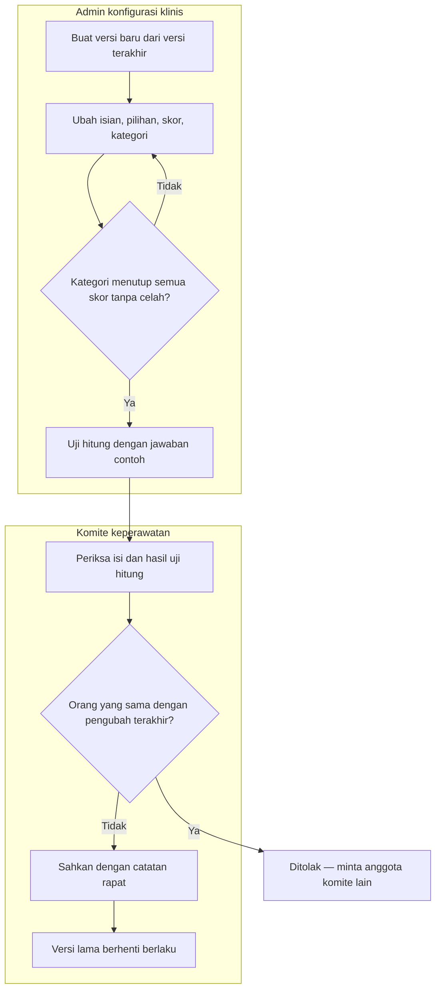
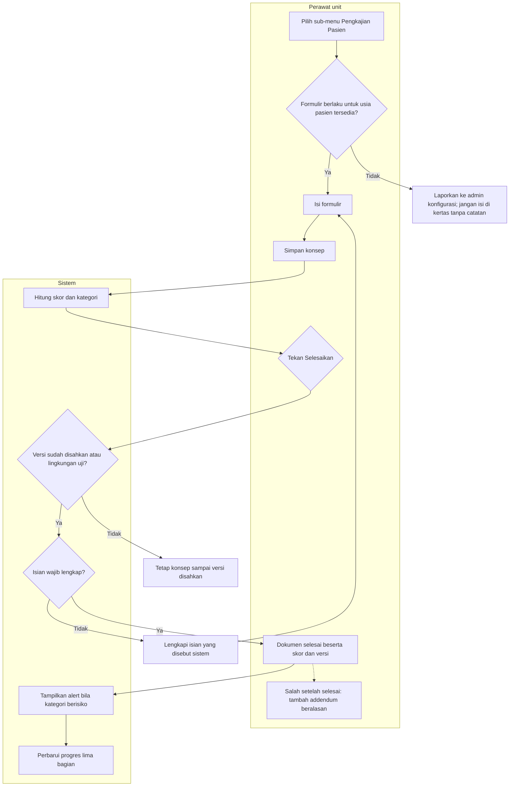
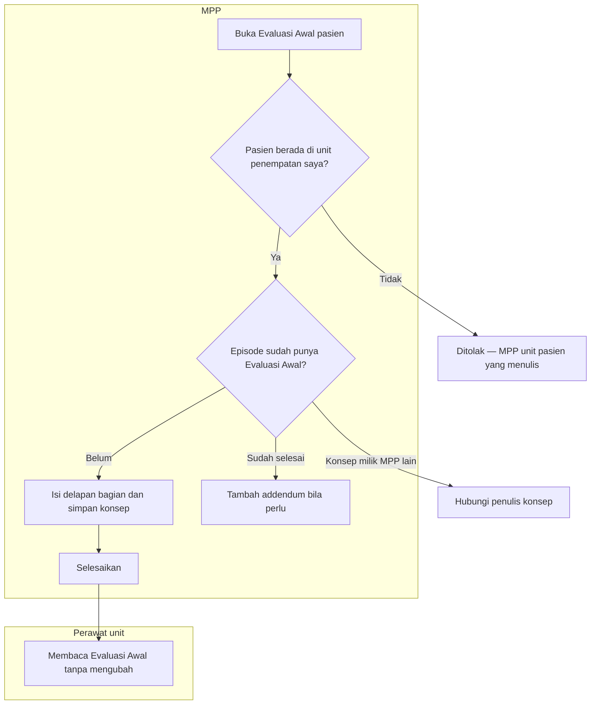

# Pengkajian Pasien dan Instrumen Klinis Berversi

| Field | Nilai |
| --- | --- |
| Sub-modul | `keperawatan` |
| Revision | `0.3` |
| Status | **`draft`** — belum disetujui manusia |
| Isi | Seluruh percabangan **beserta jalur pengecualiannya** |
| Kemampuan | `CAP-012` |
| Keputusan | `RWI-DEC-118` s.d. `120`, `124`, `131`, `136`, `141` |

---

## 1. Menyusun dan mengesahkan instrumen

| No | Langkah | Pelaku | Masukan | Keluaran | Bila gagal, petugas melakukan |
| ---: | --- | --- | --- | --- | --- |
| 1 | Buat versi baru | Admin | Versi berlaku | Versi konsep | — |
| 2 | Ubah isi | Admin | Keputusan komite | Isi konsep | Isi pernah diubah orang lain → muat ulang lalu ulangi perubahan |
| 3 | Periksa kategori | Sistem | Batas kategori | Lolos atau ditolak | Betulkan batas; misal Rendah 0–24, Sedang 25–44, Tinggi 45 ke atas |
| 4 | Uji hitung | Admin | Jawaban contoh | Skor dan kategori | Hasil tidak sesuai harapan → betulkan skor pilihan |
| 5 | Sahkan | Anggota komite **selain** pengubah terakhir | Versi konsep | Versi berlaku | Pengubah terakhir mencoba mengesahkan → minta anggota lain |
| 6 | Versi lama berhenti | Sistem | Pengesahan | Satu versi berlaku | — |

**Contoh.** Andi mengubah Morse Dewasa menjadi v2 Senin 09.00. Andi tidak dapat mengesahkannya. Ns. Wati mengesahkan
Selasa 10.00; sejak itu pengkajian baru memakai v2, sedangkan hasil Senin tetap tercatat dengan v1.

---

## 2. Mengisi dokumen Pengkajian Pasien

| No | Langkah | Pelaku | Masukan | Keluaran | Bila gagal, petugas melakukan |
| ---: | --- | --- | --- | --- | --- |
| 1 | Buka sub-menu | Perawat | Pasien terpilih | Riwayat dan formulir | Progres gagal dimuat → Coba Lagi; **jangan** menganggap bagian belum diisi |
| 2 | Formulir sesuai usia | Sistem | Tanggal lahir pasien | Formulir versi berlaku | Tidak ada instrumen untuk usia itu → laporkan ke admin |
| 3 | Isi formulir | Perawat | Hasil pengkajian | Isian di layar | Kajian Umum: pilih tanda vital yang sudah dicatat, jangan mengetik ulang angkanya |
| 4 | Simpan konsep | Perawat | Isian | Konsep dan skor sementara | Formulir berganti versi → muat ulang, isian di layar tetap ada |
| 5 | Selesaikan | Perawat | Konsep | Dokumen selesai | Versi belum sah → konsep tetap tersimpan; isian wajib kurang → lengkapi |
| 6 | Alert | Sistem | Kategori | Penanda di kepala pasien | Alert gagal dimuat → tampil sebagai galat, bukan hilang |
| 7 | Progres | Sistem | Keadaan lima dokumen | ✓ / ! / ○ | — |
| 8 | Koreksi setelah selesai | Penulis atau kepala ruangan | Alasan | Addendum bernomor | Isi asli tidak diubah |

**Monitoring Nyeri.** Sebelum skala, perawat memilih "tidak nyeri", "nyeri", atau "tidak dapat dinilai". Pasien tidak
sadar → "tidak dapat dinilai" dan instrumen perilaku bila versi berlaku menyediakannya; **tidak** dicatat "tidak nyeri".
Setelah intervensi, sistem menampilkan jam kajian ulang dari versi instrumen.

---

## 3. Evaluasi Awal MPP

| No | Langkah | Pelaku | Masukan | Keluaran | Bila gagal, petugas melakukan |
| ---: | --- | --- | --- | --- | --- |
| 1 | Periksa unit | Sistem | Unit episode saat simpan | Boleh atau tidak | Pasien baru dipindah → MPP unit baru |
| 2 | Periksa dokumen yang ada | Sistem | Episode | Buat baru atau lanjutkan | Sudah selesai → addendum, bukan dokumen kedua |
| 3 | Isi dan selesaikan | MPP | Checklist versi berlaku | Dokumen selesai | Checklist belum disahkan → tetap konsep |
| 4 | Addendum | MPP unit | Alasan | Addendum | Selama modul rekam medis belum menyediakan jenis dokumen ini, tombol nonaktif — catat kebutuhan koreksi kepada kepala ruangan |
