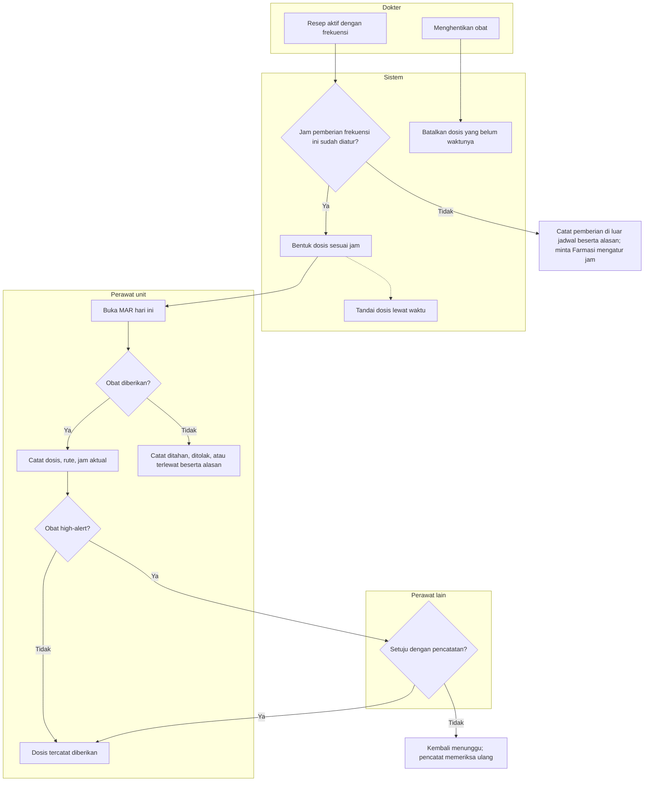
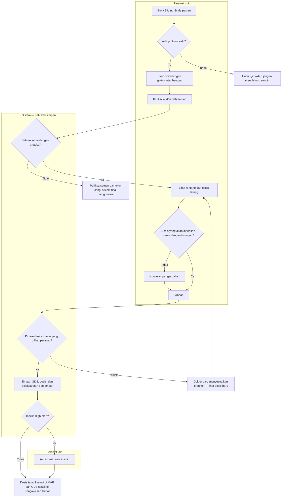

# Obat per Dosis (MAR) dan Pelaksanaan Sliding Scale

| Field | Nilai |
| --- | --- |
| Sub-modul | `keperawatan` |
| Revision | `0.3` |
| Status | **`draft`** — belum disetujui manusia |
| Isi | Seluruh percabangan **beserta jalur pengecualiannya** |
| Kemampuan | `CAP-023-MAR` |
| Keputusan | `RWI-DEC-116`, `117`, `121`, `145` s.d. `148` |
| Pasangan | Sisi dokter: [`../../dokter-rawat-inap/flowcharts/04-resep-rekonsiliasi-dan-sliding-scale.md`](../../dokter-rawat-inap/flowcharts/04-resep-rekonsiliasi-dan-sliding-scale.md) |

---

## 1. Dosis terjadwal sampai tercatat

| No | Langkah | Pelaku | Masukan | Keluaran | Bila gagal, petugas melakukan |
| ---: | --- | --- | --- | --- | --- |
| 1 | Bentuk dosis | Sistem | Resep aktif, jam frekuensi | Dosis menunggu diberikan | Jam belum diatur → pemberian di luar jadwal beralasan; lapor Farmasi |
| 2 | Buka MAR | Perawat | Pasien terpilih | Grid obat hari ini | MAR gagal dimuat → **jangan** memberi obat berdasarkan tampilan lama; muat ulang |
| 3 | Catat diberikan | Perawat | Dosis, rute, jam | Dosis tercatat | Dosis atau jam berbeda dari resep → isi catatan penyimpangan |
| 4 | Catat tidak diberikan | Perawat | Alasan | Ditahan / ditolak / terlewat | Alasan wajib |
| 5 | Konfirmasi high-alert | Perawat **lain** | Pencatatan perawat pertama | Dosis diberikan | Pencatat sendiri tidak dapat mengonfirmasi; penolakan wajib beralasan |
| 6 | Penghentian obat | Dokter → sistem | Waktu penghentian | Dosis sesudahnya dibatalkan | Dosis yang sudah dicatat tidak berubah |
| 7 | Koreksi | Kepala ruangan | Alasan | Revisi tersimpan | Nilai lama tetap terbaca |
| 8 | Dugaan reaksi obat | Perawat | Gejala setelah dosis | Alergi dugaan tertaut dosis | Dosis tidak diubah; DPJP dan apoteker membaca dari peringatan alergi |

**Contoh.** Ceftriaxone 1 g IV tiap 12 jam, jam bawaan 08.00 dan 20.00. Siti mencatat 08.05 diberikan. dr. Rina
menghentikan obat pukul 14.00 → dosis 20.00 batal, dosis 08.00 tetap. Tombol simpan tertekan dua kali → tetap satu
pemberian.

**Sambungan jaringan terputus saat menyimpan.** Layar menyatakan status tidak diketahui. Perawat memuat ulang MAR dulu;
bila dosis sudah tercatat, **jangan** mencatat ulang.

---

## 2. Pelaksanaan sliding scale

| No | Langkah | Pelaku | Masukan | Keluaran | Bila gagal, petugas melakukan |
| ---: | --- | --- | --- | --- | --- |
| 1 | Periksa protokol | Sistem | Order pasien | Protokol aktif atau tidak | Tidak ada atau sudah dihentikan → hubungi dokter |
| 2 | Ukur dan ketik GDS | Perawat | Glukometer bangsal | Nilai dan satuan | Hasil laboratorium **tidak** dipakai menghitung; hanya tampil sebagai informasi di tempat lain |
| 3 | Periksa satuan | Sistem | Satuan GDS dan protokol | Cocok atau ditolak | 280 mg/dL ≈ 15,6 mmol/L — salah pilih satuan berbahaya; periksa alat |
| 4 | Pratinjau | Sistem | Nilai GDS | Rentang dan dosis | Pratinjau gagal → jangan simpan, muat ulang |
| 5 | Pengecualian | Perawat | Alasan | Dosis berbeda tercatat beralasan | Tanpa alasan → tidak dapat disimpan |
| 6 | Simpan bersamaan | Sistem | GDS, dosis, pelaksanaan | Ketiganya tersimpan atau **tidak satu pun** | Gagal → tidak ada yang tercatat; ulangi dari layar yang sama |
| 7 | Konfirmasi | Perawat lain | Dosis insulin | Dosis diberikan | Sama dengan bagian 1 |
| 8 | Rentang 0 unit | Sistem | GDS di bawah rentang | Dosis tercatat ditahan beralasan | Usulan `G-22`; ikuti instruksi rentang bila ada |

**Contoh.** Budi, protokol v2 disesuaikan separuh dosis. 11.00 GDS 280 mg/dL → rentang 250 sampai di bawah 300 → 3 unit.
Siti menyimpan; Rina mengonfirmasi. Riwayat MAR menampilkan insulin 11.00 satu kali, grafik gula darah menampilkan 280
satu kali. Pukul 10.30 dr. Rina ternyata menyesuaikan protokol menjadi v3 → simpan Siti ditolak, pratinjau menampilkan
dosis v3, Siti memeriksa lalu menyimpan ulang.

**GDS salah ketik diketahui setelah pelaksanaan.** Perawat mengoreksi GDS di Pengawasan Harian dengan alasan. Pelaksanaan
lama tetap menyimpan angka yang dipakai saat menghitung beserta penanda bahwa GDS-nya dikoreksi; bila dosis insulin
ternyata salah, kepala ruangan mengoreksi dosis di MAR dan melaporkan kejadian sesuai prosedur keselamatan.
