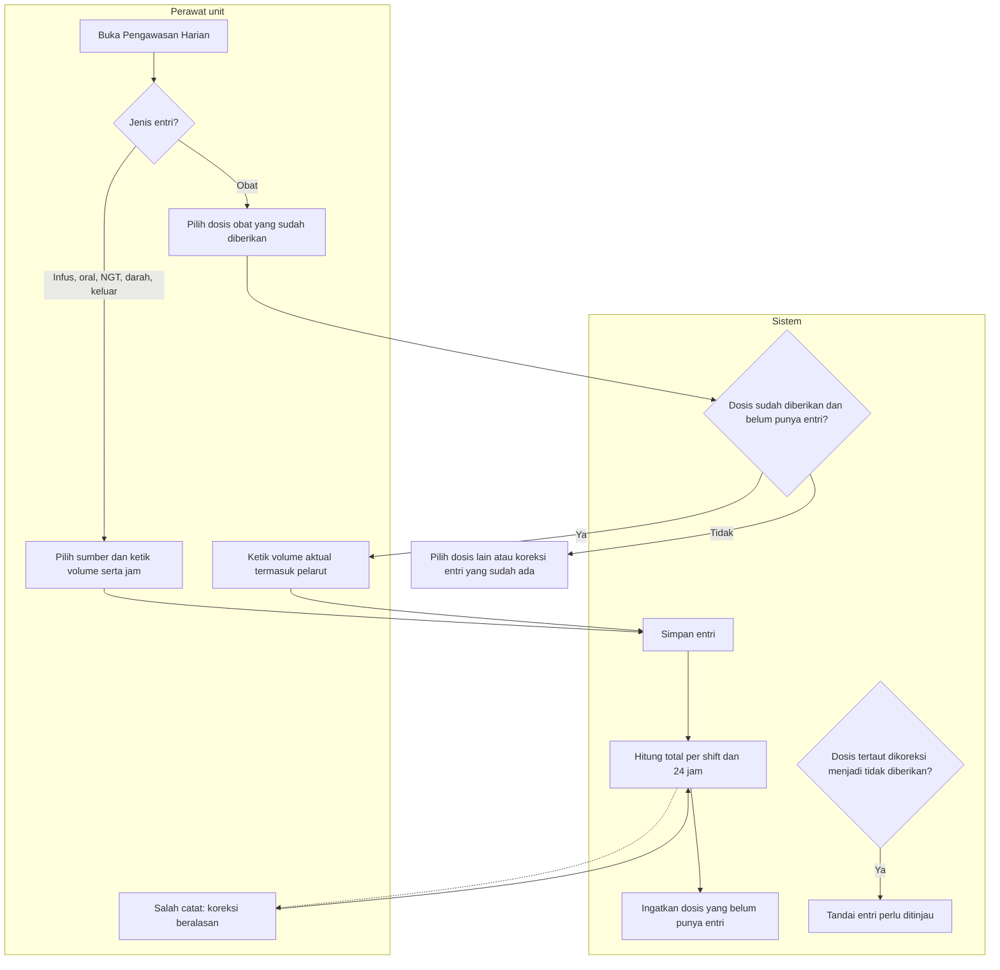
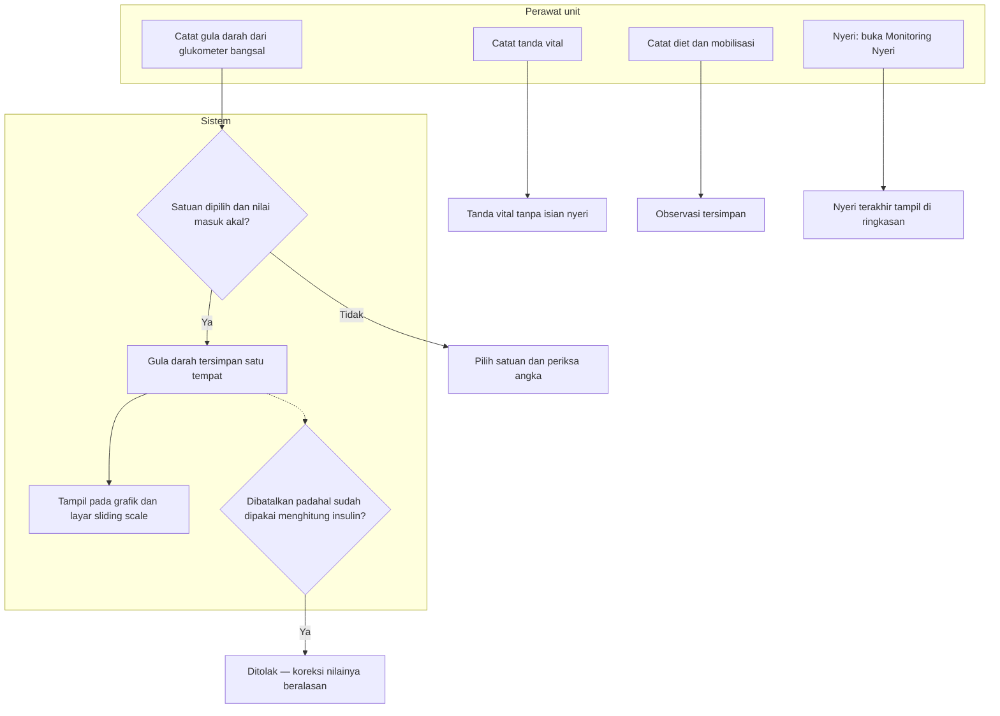

# Pengawasan Harian Pasien dan Keseimbangan Cairan

| Field | Nilai |
| --- | --- |
| Sub-modul | `keperawatan` |
| Revision | `0.3` |
| Status | **`draft`** — belum disetujui manusia |
| Isi | Seluruh percabangan **beserta jalur pengecualiannya** |
| Kemampuan | `CAP-012` Pengawasan Harian |
| Keputusan | `RWI-DEC-100`, `140`, `148`, `149` |

---

## 1. Mencatat dan menghitung cairan

| No | Langkah | Pelaku | Masukan | Keluaran | Bila gagal, petugas melakukan |
| ---: | --- | --- | --- | --- | --- |
| 1 | Buka hari klinis | Perawat | Tanggal | Ringkasan hari | Gagal dimuat → **jangan** membaca total sebagai 0 ml; muat ulang |
| 2 | Entri non-obat | Perawat | Sumber, volume, jam | Entri tersimpan | Volume nol atau lebih dari 10.000 ml → periksa ulang; jam di masa depan → betulkan |
| 3 | Entri obat | Perawat | Dosis yang sudah diberikan | Entri tertaut dosis | Dosis belum tercatat diberikan → catat dulu di MAR; dosis sudah punya entri → koreksi entri itu |
| 4 | Volume obat | Perawat | Volume aktual | Termasuk pelarut | Contoh Ceftriaxone dalam NaCl 100 ml → 100 ml |
| 5 | Hitung total | Sistem | Entri aktif | Per shift dan 24 jam | Jam shift belum diatur → hanya total 24 jam; lapor admin |
| 6 | Pengingat | Sistem | Dosis diberikan hari itu | Daftar dosis tanpa entri | Tidak mewajibkan — usulan `G-27` |
| 7 | Koreksi | Perawat unit | Nilai baru dan alasan | Nilai lama tersimpan | Data berubah oleh perawat lain → muat ulang lalu ulangi |
| 8 | Dosis tertaut dikoreksi | Sistem | Koreksi MAR | Entri "perlu ditinjau" | Perawat memutuskan koreksi atau pembatalan entri — usulan `G-26` |

**Contoh satu hari Budi** (shift bawaan usulan Pagi 07–14, Siang 14–21, Malam 21–07):

| Shift | Masuk | Keluar | Balance |
| --- | --- | --- | --- |
| Pagi | Infus 500, oral 300, obat 100, darah 200 = 1.100 | Urin 800, drain 80 = 880 | +220 |
| Siang | Infus 500, oral 200, obat 100 = 800 | Urin 550, drain 70 = 620 | +180 |
| Malam | Infus 500, oral 100 = 600 | Urin 450 = 450 | +150 |
| **24 jam** | **2.500** | **1.950** | **+550** |

Siti menulis "intake 300 ml" di Catatan Keperawatan → total tetap 2.500, karena catatan naratif bukan pencatatan cairan.

---

## 2. Gula darah, tanda vital, diet, dan mobilisasi

| No | Langkah | Pelaku | Masukan | Keluaran | Bila gagal, petugas melakukan |
| ---: | --- | --- | --- | --- | --- |
| 1 | Gula darah | Perawat | Nilai dan satuan | Satu catatan | Satuan belum dipilih → pilih; GDS dari laboratorium tidak dicatat di sini |
| 2 | Pakai ulang GDS | Sistem | Catatan yang sama | Tampil di grafik dan sliding scale | Tidak ada pengetikan kedua |
| 3 | Pembatalan GDS | Perawat | Alasan | Dibatalkan bila belum dipakai | Sudah dipakai insulin → koreksi, bukan batal |
| 4 | Tanda vital | Perawat | Hasil ukur | Deret tanda vital | Nyeri tidak ada di formulir ini |
| 5 | Diet dan mobilisasi | Perawat | Porsi habis, tingkat mobilisasi | Observasi | Belum dinilai dibiarkan kosong, **bukan** diisi "baik" |
| 6 | Nyeri | Perawat | Monitoring Nyeri | Nyeri terakhir | Belum dikaji → ringkasan menulis "belum dinilai" |

**Siapa boleh mencatat.** Perawat yang ditempatkan di unit tempat pasien berada, pada jam berapa pun. Jam shift **tidak**
menentukan kewenangan — `RWI-DEC-100`. Pasien dipindah ke ICU pukul 14.00 → perawat Melati tidak lagi dapat mencatat
sesudahnya; entri Melati sebelum 14.00 tetap terbaca.
