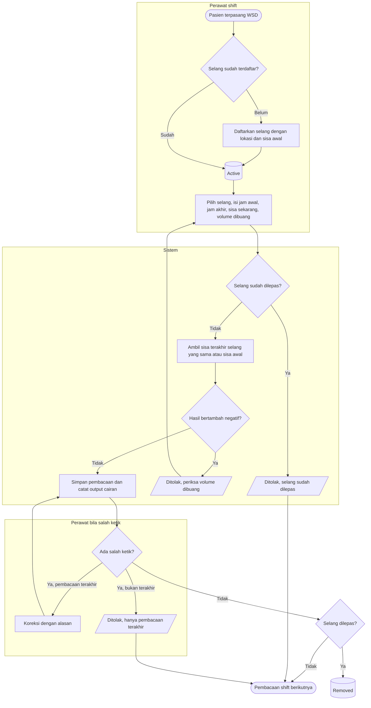

# Flowchart — Observasi pengeluaran cairan WSD per selang

| Field | Nilai |
|---|---|
| Sub-modul | `keperawatan` |
| Kontrak | `0.6.0` — `draft` |
| Proses | `BP-RWF-06` |
| Keputusan | `RWI-DEC-172`, `RWI-DEC-200` |

| Langkah | Pelaku | Masukan | Keluaran | Bila gagal |
|---|---|---|---|---|
| Daftarkan selang | Perawat | Label, lokasi, waktu pasang, sisa awal | Selang `Active` | Label sama masih aktif: pakai label lain |
| Catat pembacaan | Perawat | Jam awal, jam akhir, sisa sekarang, volume dibuang | Bertambah dihitung server; output cairan | Negatif: periksa volume dibuang; selang dilepas: tidak dapat dicatat |
| Koreksi | Perawat | Alasan | Revisi pembacaan dan entri cairan | Bukan pembacaan terakhir: ditolak |
| Lepas selang | Perawat | Waktu lepas | Selang `Removed` | Waktu lepas sebelum pembacaan terakhir: ditolak |
