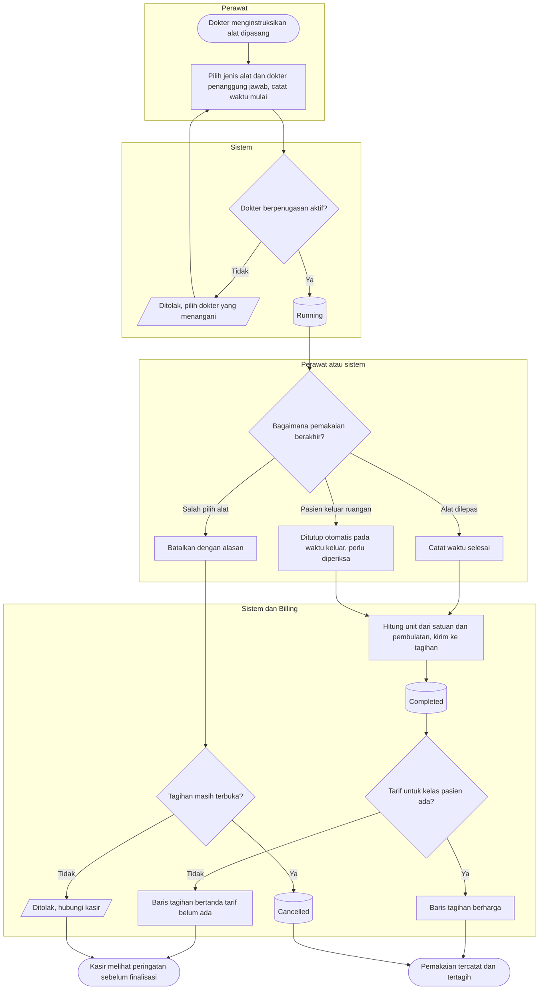

# Flowchart — Pemakaian alat medis besar

| Field | Nilai |
|---|---|
| Sub-modul | `keperawatan` |
| Kontrak | `0.6.0` — `draft` |
| Proses | `BP-RWF-04` |
| Keputusan | `RWI-DEC-179`, `RWI-DEC-180` |

| Langkah | Pelaku | Masukan | Keluaran | Bila gagal |
|---|---|---|---|---|
| Mulai | Perawat | Jenis alat, dokter, waktu mulai, jumlah bila per pakai | `Running` | Dokter tidak berpenugasan: pilih ulang |
| Selesai | Perawat | Waktu selesai | `Completed`, unit dihitung server, tagihan | Waktu selesai sebelum mulai: perbaiki |
| Tutup otomatis | Sistem | Pasien keluar ruangan | `Completed` bertanda perlu diperiksa | Gagal: pemakaian tampil di Daftar Pantau |
| Batal atau koreksi | Perawat, kepala ruangan | Alasan | Hanya tagihan pemakaian itu yang berubah | Tagihan final: hubungi kasir |
