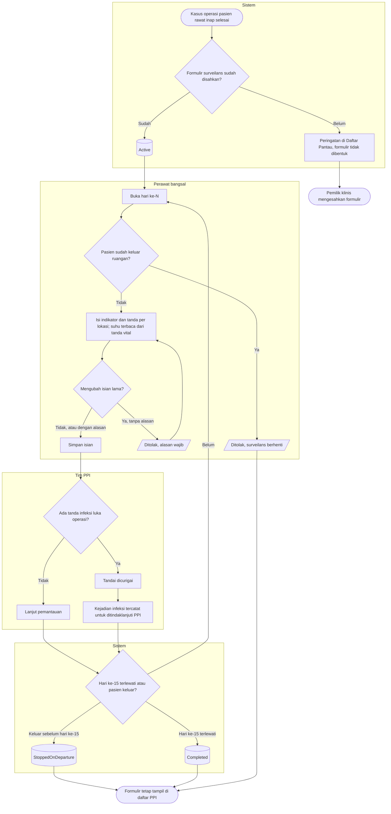

# Flowchart — Surveilans infeksi luka operasi

| Field | Nilai |
|---|---|
| Sub-modul | `keperawatan` |
| Kontrak | `0.6.0` — `draft` |
| Proses | `BP-RWF-08` langkah 6–8 |
| Keputusan | `RWI-DEC-202` |

| Langkah | Pelaku | Masukan | Keluaran | Bila gagal |
|---|---|---|---|---|
| Bentuk formulir | Sistem | Kasus OK selesai, versi formulir disahkan | Formulir `Active`, hari ke-1 esok hari | Belum disahkan: peringatan di Daftar Pantau |
| Isi harian | Perawat | Indikator, tanda per lokasi | Isian hari ke-N; suhu dari tanda vital | Pasien pulang: formulir berhenti; ubah tanpa alasan: ditolak |
| Tandai dicurigai | Tim PPI | Tanggal awal gejala, catatan | Kejadian infeksi berstatus dicurigai | Bukan tim PPI: tombol tidak tampil |
| Berhenti atau selesai | Sistem | Waktu keluar ruangan, tanggal | `StoppedOnDeparture` atau `Completed` | — |
