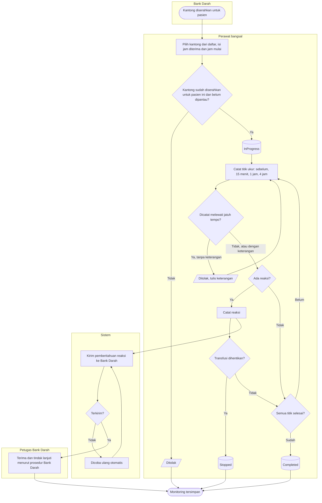

# Flowchart — Monitoring transfusi per kantong

| Field | Nilai |
|---|---|
| Sub-modul | `keperawatan` |
| Kontrak | `0.6.0` — `draft` |
| Keputusan | `RWI-DEC-203` |
| Gerbang | ~~`RWI-OQ-115`~~ — disetujui `RWI-DEC-209` |

| Langkah | Pelaku | Masukan | Keluaran | Bila gagal |
|---|---|---|---|---|
| Pilih kantong | Perawat | Kantong dari daftar Bank Darah | Monitoring `InProgress`, empat titik terjadwal | Kantong bukan untuk pasien ini atau sudah dipantau: ditolak |
| Catat titik | Perawat | Tekanan darah, suhu, nadi | Titik tercatat | Terlambat tanpa keterangan: ditolak |
| Catat reaksi | Perawat | Ringkasan reaksi | Reaksi dan pemberitahuan Bank Darah | Gagal kirim: dicoba ulang tiap menit |
| Hentikan atau selesai | Perawat | Alasan bila dihentikan | `Stopped` atau `Completed` | Titik 4 jam belum ada: belum dapat selesai |
| Terima pemberitahuan | Petugas Bank Darah | Pemberitahuan baru | Diterima | — |
