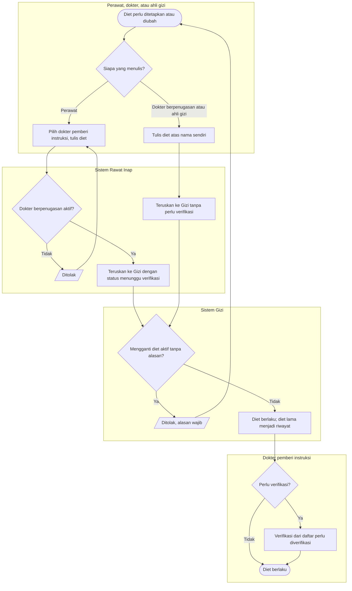

# Flowchart — Diet Medis atas instruksi dokter

| Field | Nilai |
|---|---|
| Sub-modul | `keperawatan` |
| Kontrak | `0.6.0` — `draft` |
| Keputusan | `RWI-DEC-178`, `RWI-DEC-188` |

| Langkah | Pelaku | Masukan | Keluaran | Bila gagal |
|---|---|---|---|---|
| Tulis diet | Dokter, ahli gizi, atau perawat atas instruksi | Jenis diet, bentuk makanan, instruksi | Diet berlaku | Perawat tanpa dokter: diminta memilih dokter |
| Periksa penugasan | Sistem Rawat Inap | Dokter pemberi instruksi | Diteruskan ke Gizi | Tidak berpenugasan: ditolak |
| Ganti atau hentikan | Penulis yang sama | Alasan | Diet lama menjadi riwayat | Tanpa alasan: ditolak |
| Verifikasi | Dokter pemberi instruksi | Daftar perlu diverifikasi | Diet terverifikasi atas namanya | Bukan dokter penetap: ditolak |
