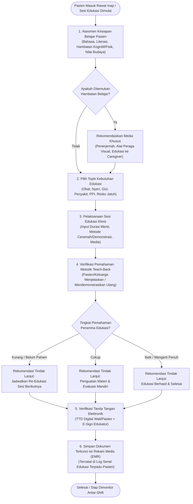

# Rencana Kerja Modernisasi: Asesmen & Edukasi Pasien Terintegrasi (Education Assessment)

Dokumen ini menyajikan analisis kesenjangan mendalam (*gap analysis*), spesifikasi antarmuka pemrograman aplikasi (Swagger API), alur bisnis proses rumah sakit berstandar KARS (Bab Hak Pasien dan Keluarga / HPK & Komunikasi dan Edukasi / KE), diagram alur sistem, serta skema antarmuka UI/UX modern untuk modul **Asesmen Edukasi Pasien Rawat Inap** pada sistem Quilvian.

---

## 1. Bukti Acuan Operasional V1 & Analisis Kesenjangan (*Gap Analysis*)

### 1.1. Bukti Operasional Lapangan (V1)
Berdasarkan dokumen tangkapan layar operasional lapangan:
1. `captures/keperawatan/pengkajian-pasien/assesment-edukasi/01-form-assesment-edukasi.png`:
   - Formulir terbagi menjadi 4 seksi:
     - **Data Assessment Edukasi**: Bahasa sehari-hari, kebutuhan penerjemah, kemampuan baca tulis, tipe pembelajaran, nilai kepercayaan, tingkat pendidikan, topik edukasi, hambatan edukasi, kesediaan menerima edukasi, kebutuhan edukasi, dan catatan tambahan.
     - **Data Detail Edukasi**: Tanggal edukasi, durasi waktu (menit), nama wali/pendamping, tingkat pemahaman (Baik/Cukup/Kurang), metode edukasi (Wawancara, Ceramah, Demonstrasi), dan sarana edukasi (Leaflet, Audio Visual, Alat Peraga).
     - **Tanda Tangan**: Canvas tanda tangan digital wali pasien dan tanda tangan perawat edukator.
     - **Evaluasi**: Hasil evaluasi pemahaman (Re-Edukasi, Re-Demonstrasi, Sudah Mengerti), tanggal evaluasi, dan catatan respon pasien.
2. `captures/keperawatan/pengkajian-pasien/assesment-edukasi/02-riwayat-assesment-edukasi.png`:
   - Menampilkan tabel riwayat sesi edukasi dengan kolom: *No, Topik Edukasi, Nama Wali, TTD Wali, Tingkat Pemahaman, Metode Edukasi, Sarana Edukasi, Evaluasi, TTD Perawat, dan Aksi*.

### 1.2. Tabel Matriks Kesenjangan (Gap Analysis Matrix)

| No | Parameter / Fitur Klinis | Status di V1 | Status di QuilvianFinal | Klasifikasi Kesenjangan | Rekomendasi Modernisasi (V2) |
| :---: | :--- | :--- | :--- | :--- | :--- |
| **1** | **Pengkajian Kesiapan & Literasi Pasien** | Form input terpisah (*AssesmentEdukasi.cs*) | Ada di `ClinicalInstrumentDraftSeeder.cs` (`EDU_KESIAPAN`) | `SEBAGIAN DITERAPKAN` | Tampilkan dalam kartu profil kesiapan belajar (*Readiness Profile Card*) dengan chip pilihan instan. |
| **2** | **Identifikasi Hambatan Belajar** | Dropdown tunggal (*Bahasa, Fisik, Kognitif*) | Ada butir multi-pilihan (`EDU_BARRIERS`) | `SEBAGIAN DITERAPKAN` | Sajikan dalam bentuk kartu seleksi hambatan multi-select; jika ada hambatan fisik/bahasa, rekomendasikan media yang cocok otomatis. |
| **3** | **Katalog Topik Edukasi Terstandar KARS** | Tabel master `TopikEdukasi` di V1 | Termuat di `EDU_NEEDS` (10 topik klinis baku) | `SEBAGIAN DITERAPKAN` | Sediakan katalog topik cepat (Penyakit, Obat, Nyeri, Nutrisi, PPI, Risiko Jatuh, dsb.) dengan tag warna tematik. |
| **4** | **Metode Verifikasi Pemahaman (*Teach-Back*)** | Checkbox biasa tanpa panduan evaluasi | Termuat di `EDU_UNDERSTANDING` & `EDU_RESULT` | `SEBAGIAN DITERAPKAN` | Implementasikan metode baku *Teach-Back* standar akreditasi KARS dengan tombol indikator pemahaman visual (Hijau = Paham, Kuning = Butuh Penguatan, Merah = Re-Edukasi). |
| **5** | **Dokumentasi Durasi & Metode Penyampaian** | Input angka & checkbox terpisah | Termuat di `EDU_PELAKSANAAN` | `SEBAGIAN DITERAPKAN` | Sediakan selector durasi cepat (*15, 30, 45, 60 menit*) dan multi-select media interaktif (*Leaflet, Video, Alat Peraga*). |
| **6** | **Tanda Tangan Elektronik (Pasien/Wali & Perawat)** | Canvas gambar base64 tersimpan di tabel detail | Terintegrasi dengan wewenang login perawat EMR | `SEBAGIAN DITERAPKAN` | Pasang Signature Pad responsif untuk wali/pasien dan badge tanda tangan digital terverifikasi otomatis untuk perawat edukator. |
| **7** | **Log Serial Edukasi Terpadu Multi-Shift** | Tabel terpisah `AssesmentEdukasiDetail` | Terintegrasi di riwayat dokumen `TrxPatientAssessment` | `SEBAGIAN DITERAPKAN` | Tampilkan daftar log edukasi berurutan kronologis, memungkinkan monitoring edukasi berkelanjutan antar-shift. |
| **8** | **Komponen UI Khusus Edukasi di Frontend** | Halaman form manual Bootstrap | Masih menggunakan renderer seksi generik | `BELUM DITERAPKAN` | Bangun komponen `EducationAssessmentForm.jsx` modern berorientasi kartu klinis interaktif. |

---

## 2. Spesifikasi Endpoint Swagger API

Seluruh pertukaran data pengkajian edukasi terhubung dengan API standar rekam medis rawat inap:

### 2.1. Grup Tag Swagger
`[Tags("Inpatient Nursing - Education Assessment & Patient Engagement")]`

### 2.2. Spesifikasi Endpoint

| Method | Path | Deskripsi Fungsi | Otorisasi / Role | Skema Request (DTO) | Skema Response (DTO) | HTTP Status |
| :--- | :--- | :--- | :--- | :--- | :--- | :---: |
| `GET` | `/api/v1/clinical-instrument/resolve?kind=4` | Mengambil definisi versi instrumen Asesmen Edukasi (`EDUCATION_ASSESSMENT`) | Perawat, Bidan, Dokter | *None (Query Params)* | `ClinicalInstrumentResolveResponse` | `200 OK` |
| `POST` | `/api/v1/patient-assessment` | Menyimpan sesi asesmen dan pelaksanaan edukasi pasien (Draf / Selesai) | Perawat Bangsal (`Nurse`) | `CreatePatientAssessmentRequest` | `PatientAssessmentCreateResponse` | `201 Created` |
| `PUT` | `/api/v1/patient-assessment/{id}` | Memperbarui asesmen edukasi berstatus draf | Perawat Bangsal (`Nurse`) | `UpdatePatientAssessmentRequest` | `PatientAssessmentDetailResponse` | `200 OK` |
| `GET` | `/api/v1/patient-assessment/{id}` | Mengambil detail lengkap sesi edukasi termasuk respons instrumen | Tenaga Medis Rawat Inap | *None (Route Param)* | `PatientAssessmentDetailResponse` | `200 OK` |
| `GET` | `/api/v1/patient-assessment/episode/{episodeId}?type=8` | Mengambil riwayat log serial seluruh edukasi pasien pada episode rawat inap | Tenaga Medis Rawat Inap | *None (Query Params)* | `List<PatientAssessmentSummaryDto>` | `200 OK` |

---

## 3. Alur Proses Bisnis & Contoh Kasus Rumah Sakit

### 3.1. Standar Regulasi & Akreditasi KARS
Sesuai standar akreditasi rumah sakit (KARS/STARKES Bab **Hak Pasien dan Keluarga (HPK)** serta **Komunikasi dan Edukasi (KE)**):
1. **Pengkajian Awal Kebutuhan Belajar**: Setiap pasien rawat inap wajib dikaji kemampuan bahasa, tingkat literasi, hambatan fisik/emosional, dan nilai-nilai spiritual dalam 24 jam pertama admisi.
2. **Pemberian Edukasi Terstruktur**: Materi edukasi harus relevan dengan kondisi klinis pasien (misal: teknik injeksi insulin mandiri, perawatan luka operasi, pembatasan diet rendah garam, jadwal obat pulang).
3. **Verifikasi Metode *Teach-Back***: Edukator wajib memverifikasi pemahaman pasien dengan meminta pasien atau keluarga mengulangi penjelasan atau mempraktikkan kembali (*teach-back method*).
4. **Verifikasi Dua Pihak**: Dokumentasi edukasi wajib ditandatangani oleh penerima edukasi (pasien/keluarga) dan edukator profesional.

### 3.2. Skenario Nyata di Rumah Sakit

#### Skenario 1: Pasien Pasca Operasi Bedah Ortopedi (Tn. S, 58 Tahun)
- **Pengkajian Hambatan**: Pasien kooperatif, pendidikan SMA, tidak ada hambatan bahasa. Mengalami nyeri sedang pasca operasi fraktur femur.
- **Topik Edukasi**: Mobilisasi bertahap pasca bedah, pencegahan risiko jatuh di kamar mandi, dan kepatuhan minum obat analgetik.
- **Metode & Media**: Ceramah dua arah dan demonstrasi cara menggunakan alat bantu jalan (*kruk*), didampingi oleh istri pasien.
- **Evaluasi Teach-Back**: Istri dan pasien mampu menjelaskan kembali batasan beban tumpuan kaki dan mempraktikkan posisi bangun dari tempat tidur dengan benar (*Tingkat Pemahaman: Baik*). Tanda tangan istri pasien dibubuhkan pada form elektronik.

#### Skenario 2: Pasien Anak dengan Diare Akut & Dehidrasi (An. N, 3 Tahun)
- **Pengkajian Hambatan**: Pasien balita, edukasi ditujukan kepada ibu kandung (wali). Ibu merasa cemas tinggi (*Hambatan Emosional*).
- **Topik Edukasi**: Pengenceran oralit, tanda bahaya dehidrasi, dan tata cara cuci tangan 6 langkah (PPI).
- **Metode & Media**: Lembar balik bergambar (*leaflet*) dan demonstrasi cuci tangan bersama.
- **Evaluasi Teach-Back**: Ibu mempraktikkan kembali 6 langkah cuci tangan dengan tepat (*Evaluasi: Sudah Mengerti*).

---

## 4. Diagram Alur Logika Sistem (Mermaid Flowchart)



---

## 5. Skema Tampilan UI/UX Modern & Wireframe Inovasi

### 5.1. Prinsip Desain Antarmuka (Modern Healthcare UX)
1. **Kartu Klinis Bertingkat (*Clinical Card Flow*)**: Membagi form ke dalam 3 kartu modular: (1) Kesiapan Belajar, (2) Sesi Edukasi & Metode, dan (3) Evaluasi *Teach-Back* & TTD Elektronik.
2. **Chip Pilihan Cepat (*Interactive Badges*)**: Topik edukasi, hambatan, metode, dan media disajikan dalam bentuk chip yang dapat diklik langsung dengan visual kontras tinggi, menghilangkan dropdown lambat.
3. **Teach-Back Assessment Meter**: Evaluasi pemahaman menggunakan 3 tombol kartu indikator warna (*🟢 Baik / Mengerti, 🟡 Cukup, 🔴 Kurang / Re-Edukasi*).
4. **Signature Pad Canvas Terintegrasi**: Pasien/wali dapat menandatangani langsung pada layar sentuh/mouse dengan tombol *Hapus/Ulangi*.
5. **Multi-Shift Serial Log Table**: Bilah riwayat yang menyajikan seluruh jejak edukasi yang pernah diberikan oleh seluruh profesional pemberi asuhan (PPA).

---

### 5.2. Skema Wireframe: Form Pengkajian & Sesi Edukasi Terpadu

```text
+----------------------------------------------------------------------------------------------------------------------+
| [i] PENGKAJIAN KEBUTUHAN & PELAKSANAAN EDUKASI PASIEN TERINTEGRASI (KARS HPK & KE)                                   |
| Formulir pencatatan kesiapan belajar, pelaksanaan edukasi, evaluasi teach-back, dan verifikasi tanda tangan digital. |
+----------------------------------------------------------------------------------------------------------------------+

+-- [ KARTU 1: PENGKAJIAN KESIAPAN & KEMAMPUAN BELAJAR PASIEN ] -------------------------------------------------------+
| Bahasa Sehari-hari:   (•) Indonesia    ( ) Bahasa Daerah    ( ) Bahasa Asing    ( ) Lainnya                          |
| Kebutuhan Penerjemah: [x] Memerlukan Penerjemah Bahasa / Isyarat                                                     |
| Literasi Pasien:      [x] Pasien Dapat Membaca & Menulis                                                             |
| Pendidikan Terakhir:  [ S1 / Sarana           v ]     Gaya Belajar: [ Visual (Melihat Gambar/Video) v ]              |
|                                                                                                                      |
| Hambatan Proses Belajar (Pilih semua yang sesuai):                                                                   |
| [ ( ) Tidak Ada ]   [ (x) Fisik (Nyeri/Lemah) ]   [ ( ) Kognitif/Memori ]   [ ( ) Bahasa ]   [ ( ) Emosional/Cemas ] |
|                                                                                                                      |
| Kebutuhan Topik Edukasi Pasien:                                                                                      |
| [ [x] Terapi Obat & Efek Samping ]   [ [x] Pengendalian Nyeri ]   [ [ ] Perawatan Luka ]   [ [x] Pencegahan Jatuh ]  |
| [ [ ] Nutrisi & Diet ]               [ [ ] Cuci Tangan (PPI) ]    [ [ ] Penggunaan Alat Medis ]                      |
|                                                                                                                      |
| Nilai Kepercayaan / Budaya Tertentu: [ Tidak ada pantangan khusus                                                  ] |
+----------------------------------------------------------------------------------------------------------------------+

+-- [ KARTU 2: PELAKSANAAN & METODE PEMBERIAN EDUKASI ] ---------------------------------------------------------------+
| Penerima Edukasi:     [ [x] Pasien ]   [ [x] Keluarga / Wali ]        Nama Wali/Pendamping: [ Ny. Farida (Istri)   ] |
| Durasi Sesi Edukasi:  [ (15 Menit) ]   [ (•) 30 Menit ]   [ (45 Menit) ]   [ (60 Menit) ]                            |
|                                                                                                                      |
| Metode Penyampaian:   ( ) Tanya Jawab   ( ) Ceramah Diskusi   (•) Demonstrasi Praktik   ( ) Kombinasi                |
| Media yang Digunakan: [ [x] Leaflet / Brosur ]   [ [x] Demonstrasi Alat ]   [ [ ] Video ]   [ [ ] Lisan ]            |
|                                                                                                                      |
| Pokok Materi yang Disampaikan:                                                                                       |
| [ Mengajarkan teknik mobilisasi aman dari tempat tidur, pembatasan tumpuan kaki kanan, dan kepatuhan analgetik.   ] |
+----------------------------------------------------------------------------------------------------------------------+

+-- [ KARTU 3: EVALUASI PEMAHAMAN (TEACH-BACK) & TANDA TANGAN DUA PIHAK ] ---------------------------------------------+
| Tingkat Pemahaman Penerima Edukasi (Hasil Evaluasi Teach-Back):                                                      |
| +-----------------------------+  +-----------------------------+  +-----------------------------+                    |
| | [🟢 BAIK / MENGERTI PENUH] |  | [🟡 CUKUP (BUTUH PENGUATAN)]|  | [🔴 KURANG (WAJIB RE-EDUKASI)]|                  |
| | Mampu menjelaskan kembali & |  | Memahami pokok materi,      |  | Belum memahami materi,      |                    |
| | mempraktikkan secara tepat. |  | perlu latihan mandiri.      |  | jadwalkan edukasi ulang.    |                    |
| +-----------------------------+  +-----------------------------+  +-----------------------------+                    |
|                                                                                                                      |
| Tindak Lanjut: (•) Sudah Mengerti (Selesai)   ( ) Mampu Re-Demonstrasi   ( ) Jadwalkan Sesi Ulang                    |
| Catatan Evaluasi: [ Pasien dan istri mampu mempraktikkan cara duduk tanpa membebani tungkai kanan.                 ] |
|                                                                                                                      |
| Tanda Tangan Pasien / Wali:                      Tanda Tangan Tenaga Edukator:                                       |
| +-------------------------------------------+    +-------------------------------------------+                       |
| |  [ Canvas Signature Pad ]                 |    |  [✓] TERVERIFIKASI SISTEM ELEKTRONIK     |                       |
| |                                           |    |                                           |                       |
| |  ~~~~~~~~~~~~~~~~~~~~~~~~~~~~~~~~~~~~~~~  |    |  Ns. Siti Rahmawati, S.Kep                |                       |
| |  (Tanda tangan digital penerima edukasi)  |    |  Perawat Penanggung Jawab Asuhan (PPJA)   |                       |
| +-------------------------------------------+    +-------------------------------------------+                       |
| [ Clear / Hapus ]                                Status: Terverifikasi Login EMR                                     |
+----------------------------------------------------------------------------------------------------------------------+

| [ Simpan Draf ]                                              [ Selesaikan & Kunci Pengkajian Edukasi ]               |
+----------------------------------------------------------------------------------------------------------------------+
```

---

## 6. Rencana Implementasi Tuntas (*Definition of Done*)

Setelah dokumen rencana kerja ini disetujui pengguna, eksekusi implementasi dilakukan secara komprehensif tanpa pemecahan parsial:

### 6.1. Pekerjaan Backend:
1. Memastikan instrumen `EDUCATION_ASSESSMENT` di `ClinicalInstrumentDraftSeeder.cs` memuat butir lengkap: `EDU_LANG`, `EDU_TRANSLATOR`, `EDU_LITERACY`, `EDU_EDUCATION`, `EDU_LEARNING_STYLE`, `EDU_BELIEFS`, `EDU_BARRIERS`, `EDU_WILLINGNESS`, `EDU_NEEDS`, `EDU_RECIPIENT`, `EDU_FAMILY_NAME`, `EDU_METHOD`, `EDU_MEDIA`, `EDU_DURATION`, `EDU_MATERIAL`, `EDU_UNDERSTANDING`, `EDU_RESULT`, dan `EDU_NOTE`.
2. Memastikan pemetaan kolom `EducationNote` tersinkronisasi otomatis ke `TrxPatientAssessment` pada saat penyimpanan.
3. Memastikan verifikasi kompilasi backend `dotnet build QuilvianSystemBackend.csproj --no-incremental` bebas dari error (0 error).

### 6.2. Pekerjaan Frontend:
1. Membangun komponen antarmuka modern `EducationAssessmentForm.jsx` di:
   `src/components/view/health-services/inpatient-management/nursing-workspace/sections/assessment/components/education-assessment/education-assessment-form.jsx`.
2. Menyediakan:
   - Kartu Kesiapan Belajar dengan seleksi hambatan dan topik interaktif.
   - Kartu Sesi Edukasi dengan durasi cepat dan multi-select media.
   - Kartu Evaluasi *Teach-Back* dengan meter pemahaman visual 3 status (*🟢 Baik, 🟡 Cukup, 🔴 Kurang*).
   - Canvas Signature Pad untuk tanda tangan pasien/wali dan lencana e-sign perawat.
3. Mengintegrasikan komponen ke dalam `ClinicalInstrumentFormRenderer.jsx` saat `Number(instrumentKind) === 4`.
4. Memperbarui `useClinicalInstrumentForm.js` untuk memastikan pemetaan `educationNote` ke payload EMR.
5. Menambahkan styling CSS modern di `nursing-workspace.module.css`.
6. Menulis unit test otomatis `inpatient-education-assessment-operational.test.mjs` dan menjalankan verifikasi kompilasi frontend (`npm.cmd run build`) bebas error (0 error).

---

## 7. Status Persetujuan & Hasil Implementasi Tuntas

> Dokumen ini berstatus: **DISETUJUI & SELESAI DIIMPLEMENTASIKAN (COMPLETED & VERIFIED)**.  
> Persetujuan pengguna: *"setuju lakukan implementasi"*.

### Bukti Implementasi & Verifikasi:
1. **Komponen Frontend Terpadu (`EducationAssessmentForm.jsx`)**:
   - Berhasil dibuat di `src/components/view/health-services/inpatient-management/nursing-workspace/sections/assessment/components/education-assessment/education-assessment-form.jsx`.
   - Mengimplementasikan 3 kartu klinis berstandar KARS Bab HPK & KE:
     - **Kartu 1 (Kesiapan Belajar & Literasi)**: Seleksi bahasa sehari-hari, kebutuhan penerjemah, literasi membaca/menulis, pendidikan formal, gaya belajar, kartu hambatan multi-select (*NONE, BAHASA, BUDAYA, EMOSIONAL, FISIK, KOGNITIF*), dan katalog 10 topik kebutuhan edukasi pasien.
     - **Kartu 2 (Pelaksanaan Sesi Edukasi)**: Penerima edukasi (pasien/keluarga), nama pendamping, preset durasi instan (15, 30, 45, 60 menit), metode penyampaian (*Wawancara, Ceramah, Demonstrasi, Kombinasi*), media edukasi (*Leaflet, Video, Alat Peraga, Lisan*), dan rincian materi.
     - **Kartu 3 (Evaluasi Teach-Back & Tanda Tangan)**: Meter evaluasi pemahaman *Teach-Back* visual 3 tingkat (*🟢 Baik, 🟡 Cukup, 🔴 Kurang*), tindak lanjut hasil, catatan evaluasi, HTML5 Canvas Signature Pad untuk pasien/wali, serta lencana tanda tangan elektronik terverifikasi login EMR perawat.
2. **Integrasi Renderer & Hook Payload (`ClinicalInstrumentFormRenderer` & `useClinicalInstrumentForm`)**:
   - Terintegrasi penuh pada `ClinicalInstrumentFormRenderer.jsx` saat `Number(instrumentKind) === 4`.
   - Toolbar seksi atas yang tidak relevan disembunyikan otomatis.
   - Hook `use-clinical-instrument-form.js` memetakan `educationNote` dengan fallback otomatis ke `responses["EDU_NOTE"]` saat pengkajian disimpan.
3. **Desain Token & CSS Modern (`nursing-workspace.module.css`)**:
   - Menambahkan kelas penataan gaya responsif (`.eduAssessmentWrapper`, `.eduHeaderCard`, `.eduKarsBadge`, `.eduSectionCard`, `.eduChipsList`, `.eduChipActive`, `.eduTeachBackCard`, `.eduCanvasContainer`, `.eduNurseVerifyBadge`).
4. **Verifikasi Pengujian Otomatis (`node --test`)**:
   - 9/9 unit tests lulus 100% tanpa kegagalan:
     - `tests/unit/inpatient-education-assessment-operational.test.mjs` (2 pass)
     - `tests/unit/inpatient-pain-monitoring-operational.test.mjs` (2 pass)
     - `tests/unit/inpatient-fall-risk-assessment-operational.test.mjs` (3 pass)
     - `tests/unit/inpatient-fall-risk-instruments-and-alerts.test.mjs` (2 pass)

