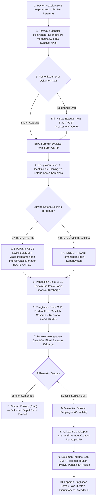

# Laporan Analisis & Rencana Kerja Modernisasi Menu: Evaluasi Awal (Initial Evaluation — Form A Manajemen Pelayanan Pasien)

## 1. Ringkasan Eksekutif & Identitas Dokumen

| Atribut | Keterangan |
| :--- | :--- |
| **Area / Modul** | Pelayanan Kesehatan (*Health Services*) — Rawat Inap Keperawatan (*Inpatient Nursing Workspace*) |
| **Menu Sasaran** | Pengkajian Pasien → Sub-Tab: **Evaluasi Awal (*Initial Evaluation — Form A MPP*)** |
| **Jalur Dokumen** | `docs/module-blueprints/rawat-inap/keperawatan/roadmap/rencana-kerja/asuhan-keperawatan/evaluasi-awal/evaluasi-awal.md` |
| **Dasar Penyelarasan** | Mengadopsi 100% parameter operasional teruji lapangan dari **QuilvianV1** (sesuai tangkapan layar `01-riwayat-evaluasi-awal.png`, `02-modal-tambah-evaluasi-awal.png`, berkas formulir `FormEvaluasiAwal/page.jsx`, model `EvaluasiAwal.cs`, dan `EvaluasiAwalDetail.cs`), diselaraskan dengan arsitektur berversi **QuilvianFinal** dan standar akreditasi rumah sakit terkini. |
| **Standar Regulasi & Akreditasi** | **KARS / STARKES (Standar Akreditasi Rumah Sakit)**:<br/>• Bab **AKP (Akses dan Kesinambungan Pelayanan)** — Standar AKP 3 dan AKP 3.1: *Skrining Pasien dengan Kebutuhan Khusus & Pelaksanaan Manajemen Pelayanan Pasien (Case Management)*.<br/>• Bab **HPK (Hak Pasien dan Keluarga)** & **PP (Pelayanan dan Asuhan Pasien)** mengenai keterlibatan pasien dalam penetapan sasaran asuhan dan integrasi antar PPA (*Profesional Pemberi Asuhan*). |
| **Prinsip Data & Integritas** | **Zero Breaking Migration** — Memanfaatkan entitas instrumen klinis berversi `CliAssessmentInstrumentResponse` (`ClinicalInstrumentKind.CaseManagementChecklist = 6`), pendaftaran tipe pengkajian `PatientAssessmentType.CaseManagementAssessment = 9` pada `TrxPatientAssessment`, serta persistensi respons terstruktur dalam format JSON terstandar tanpa merusak data histori. |

---

## 2. Analisis Mendalam: Audit Kesenjangan V1 vs Final (Status Implementasi)

Berdasarkan perbandingan langsung antara formulir operasional **QuilvianV1** (dari berkas tangkapan layar `01-riwayat-evaluasi-awal.png` dan `02-modal-tambah-evaluasi-awal.png`, model `EvaluasiAwal.cs`, serta `FormEvaluasiAwal/page.jsx`) terhadap arsitektur yang ada saat ini di **QuilvianFinal**:

### 2.1. Matriks Status Implementasi Fitur & Parameter

| No | Komponen / Parameter | Kondisi di QuilvianV1 (Operasional) | Kondisi Saat Ini di QuilvianFinal | Status Implementasi | Catatan & Kesenjangan |
| :--- | :--- | :--- | :--- | :--- | :--- |
| 1 | **Judul Resmi & Konteks Dokumen** | Bernama resmi: `FORM . A . EVALUASI AWAL MANAJEMEN PELAYANAN PASIEN` (KARS Form A) | Label tab di FE adalah `Evaluasi Awal`, belum memiliki formulir detail di renderer | **SEBAGIAN DITERAPKAN** | Pertahankan judul resmi Form A MPP agar memenuhi verifikasi audit akreditasi KARS / STARKES |
| 2 | **Bagian A: Identifikasi / Skrining Pasien Kompleks (12 Kriteria)** | 12 butir checkbox: Usia > 65 th, Kognitif rendah, Risiko tinggi, Potensi komplain tinggi, Penyakit kronis/terminal, ADL rendah, Gangguan mental/sosial, Alkes invasif, Readmisi IGD/RS, Finansial, LOS panjang, Kontinuitas discharge | Nilai enum `ClinicalInstrumentKind.CaseManagementChecklist = 6` sudah terdaftar di backend, namun butir 12 kriteria belum di-seed ke database instrumen draft | **SEBAGIAN DITERAPKAN** | Wajib didaftarkan secara presisi pada seeder `ClinicalInstrumentDraftSeeder.cs` dengan kode `CASE_MANAGEMENT_FORM_A` |
| 3 | **Bagian B: Asesmen 11 Domain Evaluasi Awal MPP** | 11 kolom teks bebas: Kekuatan/kemampuan, Riwayat kesehatan, Kesehatan mental, Tersedianya dukungan, Finansial, Riwayat obat/alkes, Riwayat trauma, Harapan hasil, Aspek legal, Discharge planning, Kebutuhan lain | Kolom ringkasan teks belum ada di DTO terpisah; arsitektur V2 menyimpan butir instrumen ke dalam `ResponsesJson` instrumen | **SEBAGIAN DITERAPKAN** | Gunakan `BaseTextAreaField` berseri di form renderer dengan helper text panduan klinis per domain |
| 4 | **Bagian C: Identifikasi Masalah & Kesempatan (*Problems / Opportunities*)** | Kategori checklist `C` (diambil dari master checklist dinamis template 1 V1) | Belum dimigrasikan ke seeder instrumen berversi V2 | **BELUM DITERAPKAN** | Didaftarkan sebagai seksi multi-select checklist standar KARS pada seeder instrumen klinis |
| 5 | **Bagian D: Identifikasi Harapan & Sasaran Pasien (*Goals & Objectives*)** | Kategori checklist `D` (diambil dari master checklist dinamis template 1 V1) | Belum dimigrasikan ke seeder instrumen berversi V2 | **BELUM DITERAPKAN** | Didaftarkan sebagai seksi multi-select checklist sasaran pasien pada seeder instrumen klinis |
| 6 | **Bagian E: Perencanaan Manajemen Pelayanan Pasien (*Action Plan*)** | Kategori checklist `E` (diambil dari master checklist dinamis template 1 V1) | Belum dimigrasikan ke seeder instrumen berversi V2 | **BELUM DITERAPKAN** | Didaftarkan sebagai seksi multi-select checklist intervensi MPP pada seeder instrumen klinis |
| 7 | **Informasi Tambahan & TTD Manajer Pelayanan Pasien (MPP)** | Input teks `keterangan` bebas dan teks `namaMPPasien` diinput manual | V2 memiliki audit trail terintegrasi: `CreatedBy`, `CompletedBy`, nama perawat login, tanggal/waktu riil, serta modal validasi | **SUDAH TERSEDIA (ARSITEKTUR BACKEND)** | Hubungkan langsung data login user/perawat aktif, hilangkan kebutuhan ketik nama manual |
| 8 | **Integrasi Sub-Tab Ruang Kerja Keperawatan** | Menu terpisah di V1: `PENGKAJIAN PASIEN` $\rightarrow$ `EVALUASI AWAL` | Di V2 sudah terdaftar tab `{ key: "initial-eval", label: "Evaluasi Awal" }` pada `inpatient-nursing-constants.js`, namun belum disambungkan ke instrumen kind 6 di `assessment-section.jsx` | **SEBAGIAN DITERAPKAN** | Daftarkan pemetaan tab `"initial-eval"` ke `instrumentKind: 6` dan `assessmentType: [9]` di `assessment-section.jsx` |
| 9 | **Siklus Hidup Dokumen: Draf vs Terkunci vs Riwayat Berseri** | Tabel CRUD modal statis V1 dengan tombol Hapus dan Print | Arsitektur V2: `Draft` (pengisian aktif) $\rightarrow$ `Complete/Locked` (terkunci legal EMR) $\rightarrow$ `Addendum` + Bilah Riwayat Dokumen Evaluasi Awal | **SUDAH TERSEDIA (BACKEND & HOOKS)** | Gantikan modal tambah/hapus V1 dengan arsitektur **State-Driven EMR View** + Panel Riwayat Dokumen Berseri |
| 10 | **Base Components UI (Design System Quilvian)** | Form V1 masih menggunakan kontrol bawaan React-Bootstrap dan CSS lokal | V2 menggunakan `BaseFormControl`, `BaseTextField`, `BaseTextAreaField`, `BaseButton`, serta CSS Modules terstandar | **SUDAH DITERAPKAN (KOMPONEN TERUJI)** | Gunakan 100% komponen base yang sudah teruji bebas error |

---

## 3. Laporan Spesifikasi Endpoint Swagger API

Modul Evaluasi Awal terintegrasi penuh pada controller:
- `PatientAssessmentController` (`Health Services / Clinical Management / Patient Assessment`)
- `ClinicalInstrumentController` (`Health Services / Clinical Management / Clinical Instrument`)

### 3.1. Tabel Spesifikasi Endpoint API

| No | Method | Route Path | Deskripsi Fungsi | Otorisasi / Hak Akses | Request Body (DTO) | Response DTO | HTTP Code |
| :--- | :--- | :--- | :--- | :--- | :--- | :--- | :--- | :--- |
| 1 | `GET` | `/api/v1/health-services/clinical-management/patient-assessments/instruments/resolve` | Mengambil definisi formulir Evaluasi Awal Form A MPP (`CASE_MANAGEMENT_FORM_A`, Kind = 6) aktif | `PatientAssessment : Read` | *Query Params*: `instrumentKind=6`, `episodeId={guid}` | `ApiResponse<ResolvedInstrumentResponse>` | `200 OK`<br/>`404 Not Found` |
| 2 | `GET` | `/api/v1/health-services/clinical-management/patient-assessments` | Mengambil daftar riwayat dokumen Evaluasi Awal Form A MPP untuk episode rawat inap aktif | `PatientAssessment : Read` | *Query Params*: `inpEpisodeId={guid}`, `assessmentType=9` | `ApiResponse<PagedResult<PatientAssessmentResponse>>` | `200 OK`<br/>`400 Bad Request` |
| 3 | `GET` | `/api/v1/health-services/clinical-management/patient-assessments/{id}` | Mengambil data detail pengkajian Evaluasi Awal Form A MPP yang tersimpan beserta respons butir instrumen | `PatientAssessment : Read` | *None (Route Param: id)* | `ApiResponse<PatientAssessmentResponse>` | `200 OK`<br/>`404 Not Found` |
| 4 | `POST` | `/api/v1/health-services/clinical-management/patient-assessments` | Membuat dokumen draf Evaluasi Awal Form A MPP baru untuk episode rawat inap aktif | `PatientAssessment : Create` | `CreatePatientAssessmentRequest` (`AssessmentType: 9`) | `ApiResponse<PatientAssessmentResponse>` | `201 Created`<br/>`400 Bad Request` |
| 5 | `PUT` | `/api/v1/health-services/clinical-management/patient-assessments/{id}` | Memperbarui isian skrining, 11 domain evaluasi, masalah, sasaran, dan perencanaan pada dokumen draf | `PatientAssessment : Update` | `UpdatePatientAssessmentRequest` | `ApiResponse<PatientAssessmentResponse>` | `200 OK`<br/>`404 Not Found` |
| 6 | `POST` | `/api/v1/health-services/clinical-management/patient-assessments/{id}/complete` | Menyelesaikan dan mengunci dokumen Evaluasi Awal Form A MPP menjadi rekam medis elektronik legal | `PatientAssessment : Complete` | `CompletePatientAssessmentRequest` (catatan perawat/MPP) | `ApiResponse<PatientAssessmentResponse>` | `200 OK`<br/>`422 Unprocessable` |
| 7 | `POST` | `/api/v1/health-services/clinical-management/patient-assessments/{id}/corrections` | Menambahkan catatan ralat klinis formal (*addendum*) jika terdapat koreksi setelah dokumen dikunci | `PatientAssessment : AddCorrection` | `AddAssessmentCorrectionRequest` (alasan & pembetulan) | `ApiResponse<AssessmentAddendumResponse>` | `201 Created`<br/>`403 Forbidden` |

### 3.2. Contoh Kontrak Payload Data

#### Contoh Payload Simpan Respons Formulir (`ResponsesJson`):
```json
{
  "CM_SCREENING": [
    "AGE_OVER_65",
    "CHRONIC_TERMINAL",
    "LOW_FUNCTIONAL_ADL",
    "LONG_STAY_RISK",
    "COMPLEX_DISCHARGE"
  ],
  "CM_STRENGTHS": "Pasien memiliki motivasi tinggi untuk sembuh, kooperatif dalam komunikasi, dan didampingi penuh oleh anak kandung.",
  "CM_HEALTH_HISTORY": "Riwayat DM Tipe 2 tidak terkontrol selama 10 tahun, hipertensi grade 2, dan riwayat stroke infark ringan tahun 2024.",
  "CM_MENTAL_HEALTH": "GCS E4M6V5, tidak ada riwayat depresi berat atau demensia, orientasi waktu/tempat baik.",
  "CM_SUPPORT_SYSTEM": "Keluarga inti (anak perempuan) tinggal serumah dan bertindak sebagai pendamping utama (primary caregiver).",
  "CM_FINANCIAL": "Peserta BPJS Kesehatan Non-PBI Kelas 2 aktif, tidak ada kendala kepesertaan, biaya obat kronis tercover.",
  "CM_MEDICATION_DEVICE": "Menggunakan insulin pen basal-bolus di rumah, glimepiride 2mg, amlodipine 10mg, terpasang infus perifer kanan.",
  "CM_TRAUMA_HISTORY": "Tidak ada riwayat trauma fisik, kekerasan dalam rumah tangga, atau penelantaran.",
  "CM_GOAL_EXPECTATION": "Pasien dan keluarga berharap gula darah stabil, luka ulkus di kaki membaik, dan dapat kembali berjalan mandiri.",
  "CM_LEGAL_ASPECT": "Pengambilan keputusan persetujuan tindakan medis didelegasikan kepada anak kandung (Ny. Siti).",
  "CM_DISCHARGE_PLANNING": "Dibutuhkan edukasi perawatan luka ulkus mandiri, pengaturan diet DM oleh ahli gizi, dan jadwal kontrol poli penyakit dalam.",
  "CM_OTHER_NEEDS": "Kebutuhan alat bantu jalan (walker) untuk latihan mobilisasi pasca rawat.",
  "CM_PROBLEMS": [
    "PROB_CLINICAL_COMPLEXITY",
    "PROB_ADHERENCE_DIET",
    "PROB_DISCHARGE_CARE"
  ],
  "CM_TARGETS": [
    "TGT_CLINICAL_STABILITY",
    "TGT_FAMILY_EMPOWERMENT",
    "TGT_PREVENT_READMISSION"
  ],
  "CM_INTERVENTIONS": [
    "INT_INTERPROFESSIONAL_SYNC",
    "INT_EARLY_DISCHARGE_COORD",
    "INT_FAMILY_HOMECARE_EDU"
  ],
  "CM_NOTE": "Kasus kompleks geriatri dengan multipatologi DM + ulkus diabetikum; perlu pendampingan case manager rutin 1x per hari."
}
```

#### Contoh Sinkronisasi ke Kolom Ringkasan `TrxPatientAssessment`:
```json
{
  "assessmentType": 9,
  "assessmentStatus": 2,
  "nurseNote": "Evaluasi awal manajemen pelayanan pasien (Form A MPP) telah selesai dikaji dan disepakati bersama keluarga pasien.",
  "completedByUserId": "usr-nurse-mpp-001",
  "completedAt": "2026-09-29T10:30:00Z"
}
```

---

## 4. Alur Proses Bisnis & Keselamatan Pasien (KARS / AKP 3 / AKP 3.1)

### 4.1. Diagram Alur Proses Bisnis (Mermaid Flowchart)



### 4.2. Skenario Nyata di Rumah Sakit

#### Skenario 1: Pasien Geriatri Multipatologi (Kasus Kompleks Klinis & ADL Rendah)
- **Pasien**: Tn. Harun (72 tahun), diagnosa: Sepsis ec Pneumonia Aspirasi + DM Tipe 2 + CKD Stage 4 + Pasca Stroke Trombotik.
- **Skrining Seksi A**: Terpilih 5 kriteria: `Usia > 65 Tahun`, `Pasien dengan risiko tinggi`, `Kasus penyakit kronis/katastrofik/terminal`, `Status fungsional rendah (kebutuhan bantuan ADL penuh)`, dan `Hari rawat panjang`.
- **Hasil Asesmen Seksi B**: Pasien tirah baring penuh, terpasang NGT dan kateter urin. Finansial terjamin BPJS Kesehatan. Keluarga cemas mengenai cara merawat luka dekubitus dan pemberian makan via selang pasca pulang.
- **Masalah & Rencana (Seksi C, D, E)**: Masalah koordinasi antar DPJP (Sp.PD, Sp.P, Sp.N) dan risiko infeksi nosokomial. Sasaran: stabilisasi tanda vital dan kemandirian keluarga merawat selang. Rencana: koordinasi konferensi klinis terpadu, edukasi perawatan home care bersama tim nutrisi.

#### Skenario 2: Pasien Risiko Komplain Tinggi & Masalah Finansial (Kasus Kompleks Sosio-Finansial)
- **Pasien**: Ny. Erika (42 tahun), pasien rujukan luar kota tanpa jaminan asuransi, rencana tindakan laparoskopi ginekologi emergensi.
- **Skrining Seksi A**: Terpilih 3 kriteria: `Potensi komplain tinggi`, `Masalah finansial`, dan `Membutuhkan kontinuitas pelayanan / Rencana pemulangan berisiko`.
- **Tindakan Case Manager**: Melakukan advokasi biaya perkiraan rumah sakit, menjembatani pendaftaran jaminan darurat daerah/Jamkesda, serta memediasi penjelasan rincian tindakan medis oleh DPJP guna mencegah eskalasi komplain pelayanan.

#### Skenario 3: Pasien Anak Kasus Readmisi Berulang (Kasus Kronis Anak)
- **Pasien**: An. Alif (5 tahun), asma bronkial eksaserbasi akut, masuk rumah sakit ketiga kalinya dalam 2 bulan terakhir.
- **Skrining Seksi A**: Terpilih: `Sering masuk IGD, readmisi RS`, `Riwayat penggunaan peralatan medis (nebulizer rumah)`.
- **Rencana MPP**: Penyelidikan kepatuhan terapi profilaksis inhalasi di rumah, evaluasi kebersihan lingkungan tempat tinggal anak dari alergen, dan edukasi teknik inhalasi MDI yang benar kepada orang tua.

### 4.3. Analisis Pengaruh Perubahan Bisnis
1. **Kepatuhan Standar Akreditasi KARS / STARKES (Standar AKP 3 & AKP 3.1)**:
   - Evaluasi Awal Form A MPP merupakan bukti wajib dalam instrumen akreditasi rumah sakit untuk membuktikan terselenggaranya asuhan terintegrasi interprofesional (*Interprofessional Collaborative Practice*).
2. **Efisiensi Lama Hari Rawat (*Length of Stay* / ALOS) & Pencegahan Readmisi**:
   - Skrining sejak 24 jam pertama mengidentifikasi sedini mungkin kendala pemulangan pasien sehingga *discharge planning* tidak tertunda saat pasien dinyatakan sembuh secara klinis.
3. **Peningkatan Kepuasan Pasien & Pencegahan Sengketa Medis**:
   - Skrining potensi komplain tinggi memungkinkan MPP melakukan mediasi proaktif sebelum keluhan berkembang menjadi perselisihan hukum atau komplain viral.

---

## 5. Rencana Modernisasi Desain Tampilan (UI/UX) & Inovasi Sistem

### 5.1. Skema Tampilan UI/UX Modern (Wireframe & Layout Architecture)

Rancangan antarmuka menyatukan keunggulan operasional form komprehensif V1 dengan standar arsitektur modern V2: **State-Driven EMR View + Dual-Mode Switcher Terpadu (Form Draf Aktif vs Lembar Hasil Terkunci Sah EMR)**:

#### Tampilan Mode 1: Saat Dokumen Berstatus DRAFT (Pengisian Formulir Form A MPP Aktif)
```text
+-----------------------------------------------------------------------------------------------------------------------+
| 📋 EVALUASI AWAL MANAJEMEN PELAYANAN PASIEN (FORM A MPP)    [ Status: DRAFT #ASS-2026-0104 ] [ Target KARS: 1x24 Jam ]|
| Pasien: Tn. Harun Sastrowardoyo (72 Tahun) | Ruang: ICU Bed 03 | DPJP: dr. Hendra, Sp.PD-KKV | No. RM: 25-11-10-05    |
+-----------------------------------------------------------------------------------------------------------------------+
| Bilah Dokumen: [ #ASS-0021 (✓ Selesai 12/08/26) ]  * [ #ASS-0104 (Draft Aktif) ]            [ + Buat Evaluasi Baru ]  |
| Tampilan Mode: [ [•] Formulir Pengkajian (Form) ]   [ [ ] Riwayat Dokumen Pasien (2) ]                                |
+-----------------------------------------------------------------------------------------------------------------------+
|                                                                                                                       |
| ═════════════════════════════════════════════════════════════════════════════════════════════════════════════════════ |
| 🏷️ A. IDENTIFIKASI & SKRINING PASIEN DENGAN KASUS KOMPLEKS (STANDAR KARS AKP 3)            [ 5/12 Kriteria Terpilih ]|
| ═════════════════════════════════════════════════════════════════════════════════════════════════════════════════════ |
| Centang kriteria yang sesuai dengan kondisi klinis dan sosial pasien:                                                 |
| +---------------------------------------------------------+---------------------------------------------------------+ |
| | [X] Usia > 65 Tahun                                     | [ ] Riwayat gangguan mental, upaya bunuh diri, krisis   | |
| | [ ] Pasien dengan fungsi kognitif rendah                |     keluarga, isu sosial                                | |
| | [X] Pasien dengan risiko tinggi                         | [X] Riwayat penggunaan peralatan medis (alat invasif)   | |
| | [ ] Potensi komplain tinggi                             | [ ] Sering masuk IGD, readmisi rumah sakit              | |
| | [X] Kasus penyakit kronis, katastrofik, terminal        | [ ] Masalah pembiayaan / finansial                      | |
| | [X] Status fungsional rendah, kebutuhan bantuan ADL     | [X] Hari rawat panjang (estimasi LOS > standar)         | |
| |                                                         | [X] Membutuhkan kontinuitas pelayanan / Rencana         | |
| |                                                         |     pemulangan berisiko / discharge kompleks            | |
| +---------------------------------------------------------+---------------------------------------------------------+ |
|                                                                                                                       |
| +-------------------------------------------------------------------------------------------------------------------+ |
| | ⚠️ KESIMPULAN SKRINING: PASIEN TERIDENTIFIKASI MEMERLUKAN MANAJEMEN PELAYANAN PASIEN (5 Kriteria Terpilih)        | |
| | Pasien memenuhi kriteria kasus kompleks. Wajib mendapatkan pendampingan terencana oleh Case Manager (MPP)        | |
| | dan koordinasi multidisiplin PPA secara berkelanjutan selama masa perawatan rawat inap.                           | |
| +-------------------------------------------------------------------------------------------------------------------+ |
|                                                                                                                       |
| ═════════════════════════════════════════════════════════════════════════════════════════════════════════════════════ |
| 🏷️ B. ASESMEN & EVALUASI AWAL MANAJEMEN PELAYANAN PASIEN (11 DIMENSI PENGKAJIAN)                                    |
| ═════════════════════════════════════════════════════════════════════════════════════════════════════════════════════ |
|                                                                                                                       |
| [1] Kekuatan & Kemampuan (Fisik, Fungsional, Kognitif & Kemandirian):                                                 |
| +-------------------------------------------------------------------------------------------------------------------+ |
| | Pasien kooperatif, respon verbal baik, motivasi sembuh tinggi. Bantuan penuh untuk mobilisasi dan toileting.      | |
| +-------------------------------------------------------------------------------------------------------------------+ |
|                                                                                                                       |
| [2] Riwayat Kesehatan (Penyakit Dahulu, Pengobatan & Riwayat Rawat):                                                 |
| +-------------------------------------------------------------------------------------------------------------------+ |
| | Riwayat DM tipe 2 dan hipertensi sejak 10 tahun lalu, riwayat rawat inap di RSUD 6 bulan lalu karena sesak napas. | |
| +-------------------------------------------------------------------------------------------------------------------+ |
|                                                                                                                       |
| [3] Kesehatan Mental, Perilaku & Emosional:           [4] Tersedianya Dukungan Keluarga & Sosial:                    |
| +----------------------------------------------------+---------------------------------------------------------------+ |
| | GCS E4M6V5, tidak ada depresi atau kecemasan berat. | Keluarga harmonis, anak pertama siap mendampingi penuh 24 jam.| |
| +----------------------------------------------------+---------------------------------------------------------------+ |
|                                                                                                                       |
| [5] Evaluasi Finansial / Pembiayaan:                 [6] Riwayat Obat, Alkes & Pengobatan Alternatif:                |
| +----------------------------------------------------+---------------------------------------------------------------+ |
| | Penjamin: BPJS PBI Kelas 3, plafon obat tercover.  | Terpasang infus RL, riwayat insulin pen lantus 1x14 unit.     | |
| +----------------------------------------------------+---------------------------------------------------------------+ |
|                                                                                                                       |
| [7] Riwayat Trauma, Kekerasan / Penelantaran:         [8] Harapan Hasil Asuhan & Kemampuan Menerima Perubahan:        |
| +----------------------------------------------------+---------------------------------------------------------------+ |
| | Tidak ada riwayat kekerasan atau penelantaran.     | Pasien dan keluarga berharap sesak berkurang & bisa jalan.    | |
| +----------------------------------------------------+---------------------------------------------------------------+ |
|                                                                                                                       |
| [9] Aspek Legal, Nilai Budaya & Kepercayaan:         [10] Discharge Planning (Rencana Pemulangan Awal):               |
| +----------------------------------------------------+---------------------------------------------------------------+ |
| | Keputusan medis didelegasikan ke anak kandung.     | Butuh edukasi latihan batuk efektif & kontrol berkala di poli.| |
| +----------------------------------------------------+---------------------------------------------------------------+ |
|                                                                                                                       |
| [11] Kebutuhan Lain / Kendala Khusus:                                                                                 |
| +-------------------------------------------------------------------------------------------------------------------+ |
| | Membutuhkan kursi roda untuk mobilisasi pulang.                                                                   | |
| +-------------------------------------------------------------------------------------------------------------------+ |
|                                                                                                                       |
| ═════════════════════════════════════════════════════════════════════════════════════════════════════════════════════ |
| 🏷️ C. IDENTIFIKASI MASALAH & KESEMPATAN (PROBLEMS / OPPORTUNITIES)                         [ 3 Masalah Teridentifikasi]|
| ═════════════════════════════════════════════════════════════════════════════════════════════════════════════════════ |
| [✓] Kompleksitas klinis / Multipatologi medis         [✓] Kebutuhan koordinasi intensif antar DPJP & PPA              |
| [ ] Risiko ketidakpatuhan instruksi terapi            [ ] Kendala biaya / Batas penjaminan asuransi                   |
| [ ] Keterbatasan dukungan keluarga / Pengasuh         [✓] Kesiapan pemulangan memerlukan persiapan khusus             |
| [ ] Kebutuhan alat bantu kesehatan pasca pulang       [ ] Kendala psikososial / Penerimaan penyakit                   |
|                                                                                                                       |
| ═════════════════════════════════════════════════════════════════════════════════════════════════════════════════════ |
| 🏷️ D. IDENTIFIKASI HARAPAN & SASARAN PASIEN (GOALS & TARGETS)                                 [ 3 Sasaran Disepakati ]|
| ═════════════════════════════════════════════════════════════════════════════════════════════════════════════════════ |
| [✓] Kestabilan klinis tercapai sesuai Clinical Pathway       [✓] Pemahaman keluarga mengenai tata laksana pengobatan  |
| [✓] Kesiapan keluarga merawat pasien secara mandiri di rumah [ ] Optimalisasi efisiensi biaya dan lama hari rawat    |
| [ ] Tidak terjadi komplikasi infeksi nosokomial              [ ] Tidak terjadi readmisi dalam waktu 30 hari           |
|                                                                                                                       |
| ═════════════════════════════════════════════════════════════════════════════════════════════════════════════════════ |
| 🏷️ E. PERENCANAAN MANAJEMEN PELAYANAN PASIEN (ACTION PLAN)                                   [ 3 Rencana Tindakan ]  |
| ═════════════════════════════════════════════════════════════════════════════════════════════════════════════════════ |
| [✓] Fasilitasi komunikasi efektif antara DPJP, perawat, ahli gizi, dan keluarga pasien                                |
| [✓] Koordinasi awal rencana pemulangan (Early Discharge Planning) bersama tim PPA                                     |
| [✓] Edukasi terstruktur cara perawatan mandiri dan tanda bahaya yang memerlukan kontrol darurat                      |
| [ ] Koordinasi bantuan jaminan sosial / Keringanan biaya rumah sakit                                                  |
| [ ] Fasilitasi penyediaan alat bantu medis pasca rawat (kursi roda / oksigen konsentrator)                            |
|                                                                                                                       |
| ═════════════════════════════════════════════════════════════════════════════════════════════════════════════════════ |
| Catatan Tambahan Manajer Pelayanan Pasien:                                                                            |
| +-------------------------------------------------------------------------------------------------------------------+ |
| | Pasien akan dikunjungi kembali oleh Case Manager pada H+2 untuk evaluasi kepatuhan terapi dan perkembangan...      | |
| +-------------------------------------------------------------------------------------------------------------------+ |
| Petugas MPP: Ns. Siti Aminah, S.Kep (Otomatis dari Akun Login) | Tanggal Pengkajian: 29/09/2026 10:30 WIB            |
|                                                                                                                       |
| +-------------------------------------------------------------------------------------------------------------------+ |
| | [ Batal ]                                           [ 💾 Simpan Konsep (Draft) ]   [ 🔒 Selesaikan & Kunci EMR ]   | |
| +-------------------------------------------------------------------------------------------------------------------+ |
+-----------------------------------------------------------------------------------------------------------------------+
```

#### Tampilan Mode 2: Saat Dokumen Berstatus COMPLETED (Lembar Hasil Terkunci & EMR Sah)
```text
+-----------------------------------------------------------------------------------------------------------------------+
| 📋 EVALUASI AWAL MANAJEMEN PELAYANAN PASIEN (FORM A MPP)    [ Status: ✓ SELESAI #ASS-2026-0104 ] [ 🔒 Terkunci EMR ]  |
| Pasien: Tn. Harun Sastrowardoyo (72 Tahun) | Ruang: ICU Bed 03 | DPJP: dr. Hendra, Sp.PD-KKV | No. RM: 25-11-10-05    |
+-----------------------------------------------------------------------------------------------------------------------+
| Bilah Dokumen: [ #ASS-0021 (✓ Selesai 12/08/26) ]  * [ #ASS-0104 (✓ Selesai Aktif) ]        [ + Buat Evaluasi Baru ]  |
| Tampilan Mode: [ [•] Formulir Pengkajian (Form) ]   [ [ ] Riwayat Dokumen Pasien (2) ]                                |
+-----------------------------------------------------------------------------------------------------------------------+
|                                                                                                                       |
|  ✓ DOKUMEN PENGKAJIAN EVALUASI AWAL MPP TELAH DIVERIFIKASI & DIKUNCI SECARA LEGAL                                    |
|  Petugas MPP: Ns. Siti Aminah, S.Kep | Tanggal Kunci: 29 September 2026, 11:15 WIB                                     |
|  Catatan Penutup: Pengkajian disepakati bersama keluarga pasien dan DPJP terkonfirmasi.                              |
|                                                                                                                       |
|  [ Tombol Aksi Dokumen: ]   [ 🖨️ Cetak Lembar Form A KARS ]   [ 📝 Tambah Catatan Koreksi (Addendum) ]               |
|                                                                                                                       |
|  [ Seluruh isian formulir (Seksi A, B, C, D, E) ditampilkan dalam mode Read-Only dengan tata letak rapi,             |
|    kartu terstruktur, dan penanda visual kriteria terpilih siap cetak/audit ]                                         |
+-----------------------------------------------------------------------------------------------------------------------+
```

### 5.2. Visual Hierarchy, Design Tokens & Kode Warna
- **Lencana Skrining Kasus Kompleks**:
  - `Kasus Kompleks Terdeteksi (≥ 1 Kriteria)`: Latar oranye lembut (`#fff7ed`), garis batas oranye (`#fdba74`), teks oranye tua (`#c2410c`), ikon peringatan klinis `FaExclamationTriangle`.
  - `Kasus Non-Kompleks (0 Kriteria)`: Latar biru lembut (`#f0f9ff`), teks biru (`#0369a1`).
- **Penataan Kolom Input**:
  - Kolom teks 11 domain di Seksi B menggunakan grid responsif 2-kolom (`repeat(2, 1fr)`) dengan komponen `BaseTextAreaField` standar.
- **Interaktivitas Checklist (Seksi A, C, D, E)**:
  - Kotak checkbox modern dengan efek hover halus (`background: #f8fafc`), saat tercentang berubah menjadi aksen toska lembut (`background: #f0fdfa; border-color: #0f766e`).
  - Badge counter dinamis di setiap judul kartu: `[X/12 Terpilih]`, `[X Masalah]`, `[X Sasaran]`, `[X Rencana]`.

### 5.3. Inovasi Sistem Dibandingkan V1
1. **Otomatisasi Akun Petugas MPP**:
   - V1 mengharuskan perawat mengetik nama perawat/MPP manual di form. Di V2, identitas MPP otomatis terhubung dengan akun login aktif dan tersertifikasi di sistem audit trail.
2. **Auto-Summary Kasus Kompleks**:
   - Sistem secara otomatis menghitung jumlah kriteria yang terpenuhi di Seksi A dan langsung menampilkan rekomendasi peran aktif Case Manager bila $\ge 1$ kriteria terpilih.
3. **Pemberian Hak Koreksi Terstruktur (Addendum Resmi)**:
   - Dokumen yang telah dikunci tidak dapat sembarangan dihapus (mencegah manipulasi rekam medis legal), melainkan dapat ditambahkan catatan ralat (*Addendum*) resmi sesuai Permenkes RME.
4. **Bilah Riwayat Dokumen Terintegrasi**:
   - Pengguna dapat beralih antara dokumen terkini dan dokumen riwayat episode sebelumnya secara instan tanpa perlu bolak-balik menutup modal.

---

## 6. Rencana Kerja Implementasi Pasca-Persetujuan (Tahap 4)

| Langkah | Komponen / Modul | Target Berkas / Lokasi | Deskripsi Tindakan |
| :--- | :--- | :--- | :--- |
| **Langkah 1** | **Backend Enum** | `Areas/HealthServices/ClinicalManagement/Enums/PatientAssessmentType.cs` | Tambahkan nilai `CaseManagementAssessment = 9` untuk pengkajian Evaluasi Awal Form A MPP |
| **Langkah 2** | **Backend Seeder** | `Areas/HealthServices/ClinicalManagement/Seeders/ClinicalInstrumentDraftSeeder.cs` | Tambahkan definisi instrumen baseline `CASE_MANAGEMENT_FORM_A` (Kind = 6) lengkap dengan 12 butir skrining Seksi A, 11 domain Seksi B, masalah Seksi C, sasaran Seksi D, dan perencanaan Seksi E |
| **Langkah 3** | **Frontend Routing & Mapping** | `src/components/view/health-services/inpatient-management/nursing-workspace/sections/assessment/assessment-section.jsx` | Daftarkan tab `"initial-eval"` pada `TAB_TO_INSTRUMENT_KIND` (Kind 6) dan `TAB_TO_ASSESSMENT_TYPES` (Type 9) |
| **Langkah 4** | **Frontend Form Renderer** | `src/components/view/health-services/inpatient-management/nursing-workspace/sections/assessment/renderer/clinical-instrument-form-renderer.jsx` | Tambahkan rendering khusus kartu Evaluasi Awal Form A MPP: banner ringkasan skrining kasus kompleks, layout 2-kolom domain Seksi B menggunakan `BaseTextAreaField`, serta checklist Seksi C, D, E |
| **Langkah 5** | **Frontend Styling** | `src/style/health-services/inpatient-management/nursing-workspace.module.css` | Tambahkan styling kelas banner kasus kompleks, kartu evaluasi awal, dan badge counter |
| **Langkah 6** | **Verifikasi & Build** | Backend & Frontend | Uji kompilasi `dotnet build` dan `npm run test` / `npm run build` dengan hasil 0 error |

---

## 7. Kesimpulan & Permintaan Persetujuan (*Review & Approval*)

Rencana kerja modernisasi menu **Evaluasi Awal (Form A Manajemen Pelayanan Pasien)** telah disusun secara komprehensif, mengadopsi 100% parameter operasional teruji lapangan dari QuilvianV1, serta diperkaya dengan standar keselamatan klinis akreditasi KARS / STARKES (AKP 3 dan AKP 3.1) dan sistem komponen modern QuilvianFinal.

Sesuai konstitusi workspace Quilvian dan alur kerja Skill Modernisasi:
> **Pekerjaan implementasi kode (Tahap 4) HANYA AKAN DIMULAI setelah rencana kerja dan skema tampilan di atas ditinjau serta disetujui secara eksplisit oleh Pengguna.**
