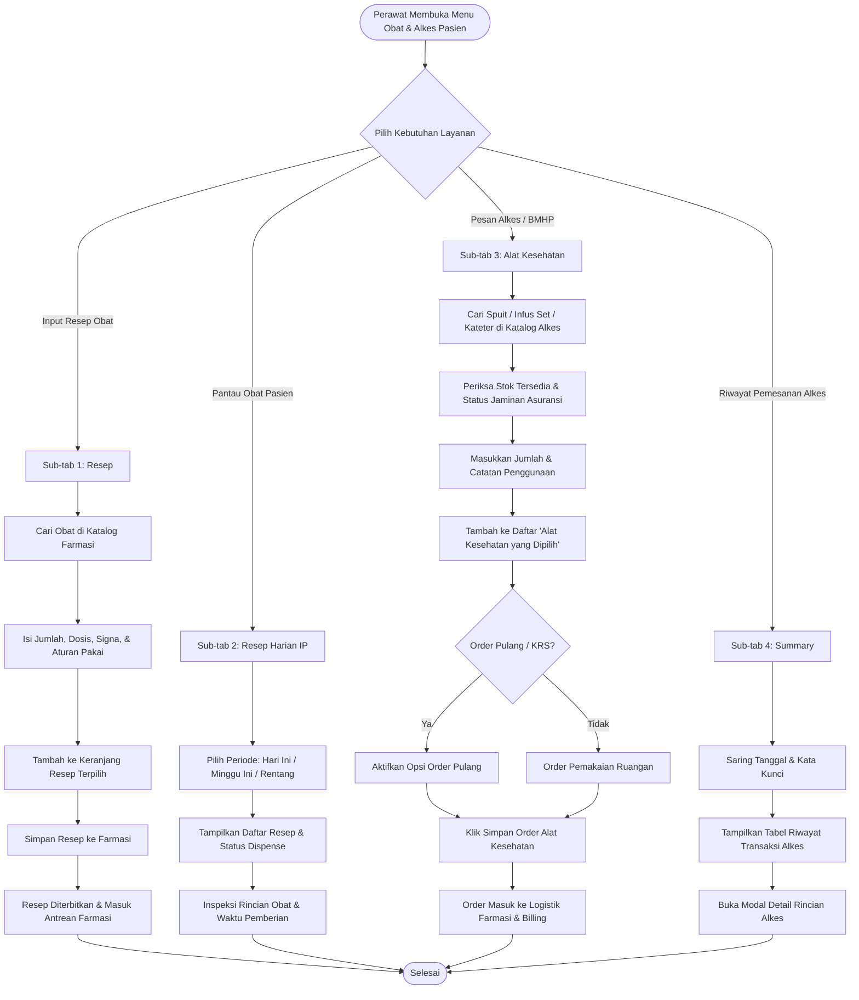

# Cetak Biru dan Rencana Kerja Modernisasi: Modul Obat & Alat Kesehatan Keperawatan Rawat Inap

**Nomor Dokumen**: `BP-RWI-KEP-MED-001`  
**Area Modul**: Rawat Inap (*Inpatient Management*) & Farmasi (*Pharmacy Management*)  
**Peran Pengguna**: Perawat Rawat Inap (*Inpatient Nurse*), Dokter DPJP, Farmasi Bangsal  
**Status**: Disetujui untuk Implementasi  
**Target Versi**: Quilvian Final V2  
**Tanggal**: 30 September 2026  

---

## 1. Ringkasan Eksekutif & Latar Belakang

Menu **Obat & Alat Kesehatan (Alkes)** pada Asuhan Keperawatan Rawat Inap merupakan salah satu instrumen kerja paling vital di lingkungan rumah sakit. Menu ini menghubungkan instruksi medis dokter (peresepan obat), kebutuhan penunjang fisik perawatan (alat kesehatan habis pakai/BMHP seperti spuit, perban, kateter, selang infus), pemantauan jadwal dan riwayat pemberian, serta integrasi penagihan dan pemotongan stok logistik farmasi rumah sakit.

Pada sistem sebelumnya (Quilvian V1), menu ini terdiri dari 4 sub-tab utama:
1. **Resep**: Formulir peresepan obat reguler dan racikan dengan split-view katalog obat, formulir signa/aturan pakai, dan keranjang resep terpilih.
2. **Resep Harian [IP]**: Lembar pantau daftar resep harian pasien rawat inap yang telah diterbitkan, status pemenuhan farmasi, dan rincian obat.
3. **Alat Kesehatan**: Formulir pemesanan alat kesehatan dan bahan medis habis pakai (BMHP) dengan katalog terpisah, informasi ketersediaan stok, status jaminan penjamin/asuransi, keranjang pemesanan, dan opsi order pulang.
4. **Summary**: Lembar riwayat pemesanan alat kesehatan sebelumnya untuk episode rawat inap aktif, dilengkapi filter periode waktu dan modal rincian transaksi.

Modernisasi ke **Quilvian Final V2** menyelaraskan tampilan UI/UX menjadi jauh lebih ergonomis, responsif, dan konsisten dengan token desain sistem Quilvian, menghilangkan ketergantungan data statis/hardcoded, menerapkan validasi jaminan asuransi secara real-time, serta memfasilitasi peran ganda perawat: baik sebagai pembuat order BMHP maupun pelaksana pemberian obat ke pasien (*Medication Administration Record* / MAR).

---

## 2. Analisis Kesenjangan (Gap Analysis) V1 vs V2

| Dimensi Evaluasi | Kondisi Quilvian V1 | Desain Quilvian Final V2 | Keunggulan Klinis & Bisnis |
| :--- | :--- | :--- | :--- |
| **Tata Letak Navigasi** | Menggunakan tab Bootstrap kaku dengan ikon FontAwesome klasik | Menggunakan navigasi segmen klinis terpadu Quilvian Design System (`ClinicalSegmentedNav` / sub-navigasi modern) | Lebih ringan, responsif pada tablet bangsal keperawatan, visual kontras ramah mata |
| **Katalog Alkes & BMHP** | Daftar katalog campur aduk tanpa filter coverage asuransi otomatis | Terintegrasi endpoint `prescribing-drugs` dengan filter `isConsumable=true` dan pengecekan coverage penjamin real-time | Mencegah kekeliruan pemilihan alkes yang tidak dijamin BPJS/asuransi pasien |
| **Formulir Order Alkes** | Input jumlah manual tanpa validasi stok gudang ruangan | Menampilkan stok riil depo ruangan rawat inap, peringatan stok kritis, dan validasi jumlah min 1 | Mengeliminasi order kosong (*stock-out cancellation*) oleh logistik farmasi |
| **Order Pulang (KRS)** | Checkbox sederhana yang rawan terlewat | Toggle eksplisit "Order Pulang" dengan penandaan badge status yang jelas ke billing | Memisahkan tagihan pemakaian harian ruangan dengan obat/alkes yang dibawa pulang pasien |
| **Resep Harian** | Tabel sederhana tanpa pemfilteran periode waktu rumah sakit | Filter waktu bisnis (*Asia/Jakarta*) dengan opsi Hari Ini, Minggu Ini, Bulan Ini, dan Rentang Tanggal | Memudahkan perawat shift memantau instruksi resep DPJP pada periode dinasnya |
| **Arsitektur Kode & Audit** | Banyak manipulasi state lokal dan mutasi langsung redux | Clean Hook architecture (`useInpatientPrescriptionTab`, `useInpatientMedicationAdministration`, Axios terisolasi) | Bebas memory leak, pelacakan audit jelas, audit trail pencatat transaksi tercatat |

---

## 3. Alur Proses Bisnis Rumah Sakit

Berikut adalah alur lengkap operasional perawat dalam mengelola Obat dan Alat Kesehatan pasien rawat inap:



---

## 4. Skenario Konkret Rumah Sakit

### Skenario 1: Pemasangan Jalur Intravena Pasien Baru Rawat Inap
- **Pasien**: Tn. Ahmad Ridwan (54 tahun), masuk ruang rawat rawat inap Aster kamar 204 dengan keluhan dehidrasi berat dan demam tinggi.
- **Kebutuhan**: Perawat Ns. Siti membutuhkan jarum infus (*Abocath 20G*), cairan infus *Ringer Lactate 500ml*, *Infusion Set Dewasa*, dan *Tegaderm dressing*.
- **Alur di Sistem**:
  1. Ns. Siti membuka Ruang Kerja Keperawatan -> Asuhan Keperawatan -> **Obat & Alkes** -> Sub-tab **Alat Kesehatan**.
  2. Ns. Siti mengetik "Infusion Set" pada kolom pencarian alkes. Sistem menampilkan item dengan stok tersedia 85 pcs dan badge hijau **"Ditanggung BPJS"**.
  3. Ns. Siti memasukkan jumlah: 1 pcs, catatan: "Pemasangan infus perifer tangan kiri". Klik **Tambah ke Daftar**.
  4. Ns. Siti menambahkan "Abocath 20G" (1 pcs) dan "Tegaderm" (1 pcs).
  5. Semua item terkumpul di tabel **Alat Kesehatan yang Dipilih** dengan total estimasi Rp 42.500 (Covered by BPJS).
  6. Ns. Siti menekan tombol **Simpan Order Alat Kesehatan**. Sistem memvalidasi, membuat nomor order otomatis, memotong stok depo ruangan Aster, dan menerbitkan catatan transaksi.

### Skenario 2: Persiapan Pasien Pulang (KRS) Membawa Perlengkapan Perawatan Luka
- **Pasien**: Ny. Kartini (62 tahun), pasca operasi debridement ulkus diabetikum di Ruang Melati kamar 102.
- **Kebutuhan**: DPJP mengizinkan pulang dengan edukasi perawatan luka mandiri. Pasien memerlukan kasa steril 10 box, cairan NaCl 0.9% 500ml 2 botol, dan plester micropore 1 roll.
- **Alur di Sistem**:
  1. Perawat membuka sub-tab **Alat Kesehatan**, lalu mengaktifkan toggle **Order Pulang (KRS)**.
  2. Perawat memilih item kasa steril, NaCl, dan plester, lalu memasukkan instruksi pemakaian di rumah.
  3. Saat disimpan, order diklasifikasikan sebagai *Discharge Order* (`PrescriptionOrderType = Discharge`), sehingga bagian Farmasi Rawat Inap menyiapkan barang untuk diserahkan kepada keluarga pasien di loket penyerahan obat pulang beserta tagihan akhir di kasir/billing.

---

## 5. Spesifikasi Antarmuka Pengguna (UI/UX Specification)

Tata letak modern dirancang mengikuti standar visual Quilvian UI Design System:

```text
+---------------------------------------------------------------------------------------------------+
| ASUHAN KEPERAWATAN  >  OBAT & ALAT KESEHATAN                                                      |
+---------------------------------------------------------------------------------------------------+
|  [ Resep ]  |  [ Resep Harian (IP) ]  |  [ Alat Kesehatan ]  |  [ Summary Alkes ]  |  [ MAR ]     |
+---------------------------------------------------------------------------------------------------+
|                                                                                                   |
| SUB-TAB: ALAT KESEHATAN                                                                           |
|                                                                                                   |
|  [Header] Order Alat Kesehatan & BMHP                                      [✓] Order Pulang (KRS) |
|  Pemesanan jarum, spuit, kateter, infus set, dan alat habis pakai medis.                          |
|                                                                                                   |
|  +-------------------------------------------------+  +-----------------------------------------+ |
|  | KATALOG ALAT KESEHATAN (BMHP)                   |  | FORM DETAIL ORDER ALKES                 | |
|  +-------------------------------------------------+  +-----------------------------------------+ |
|  | [🔍 Cari nama alat kesehatan / BMHP...]         |  | Nama Item:                              | |
|  +-------------------------------------------------+  | [ Abocath 20G                         ] | |
|  | Nama Item          | Stok | Jaminan   | Aksi    |  |                                         | |
|  |--------------------+------+-----------+---------|  | Jumlah (Qty):                           | |
|  | Abocath 20G        | 45   | [Covered] | [Pilih] |  | [ 1      ] Pcs                          | |
|  | Infusion Set Dws   | 85   | [Covered] | [Pilih] |  |                                         | |
|  | Cateter Foley 16Fr | 12   | [Covered] | [Pilih] |  | Catatan / Aturan Pemakaian:             | |
|  | Kassa Steril 10x10 | 120  | [Covered] | [Pilih] |  | [ Pasang di tangan kiri                ] | |
|  | Spuit 3cc Terumo   | 200  | [Covered] | [Pilih] |  |                                         | |
|  | Spuit 5cc Terumo   | 150  | [Covered] | [Pilih] |  | [+ Tambah ke Daftar Order]              | |
|  +-------------------------------------------------+  +-----------------------------------------+ |
|                                                                                                   |
|  +----------------------------------------------------------------------------------------------+ |
|  | ALAT KESEHATAN YANG DIPILIH (KERANJANG SEMENTARA)                                            | |
|  +----------------------------------------------------------------------------------------------+ |
|  | No | Nama Item           | Qty | Satuan | Catatan                  | Estimasi Biaya | Aksi   | |
|  |----+---------------------+-----+--------+--------------------------+----------------+--------| |
|  | 1  | Abocath 20G         | 1   | Pcs    | Pasang tangan kiri       | Rp 18.500      | [Hapus]| |
|  | 2  | Infusion Set Dewasa | 1   | Pcs    | Terhubung ke RL 500ml    | Rp 24.000      | [Hapus]| |
|  +----------------------------------------------------------------------------------------------+ |
|  | Total Estimasi: Rp 42.500 (Status Penjamin: BPJS Kesehatan Ditanggung Penuh)                | |
|  |                                                        [Reset / Batal]  [💾 Simpan Order]    | |
|  +----------------------------------------------------------------------------------------------+ |
+---------------------------------------------------------------------------------------------------+
```

---

## 6. Spesifikasi Antarmuka Pemrograman Aplikasi (Swagger API Documentation)

### Tabel Ringkasan Endpoint

| Method | Endpoint Path | Tag Swagger | Deskripsi Operasional | Otorisasi & Hak Akses |
| :---: | :--- | :--- | :--- | :--- |
| `GET` | `/api/v1/health-services/clinical-management/prescribing-drugs` | `[Tags("Health Services / Clinical Management / Prescribing Drug")]` | Mengambil katalog obat & alat kesehatan BMHP dengan filter status penjamin dan ketersediaan stok | `PrescribingDrug` - `Read` |
| `GET` | `/api/v1/health-services/pharmacy-management/prescriptions/episodes/{episodeId}` | `[Tags("Health Services / Pharmacy Management / Prescription")]` | Mengambil daftar resep harian pasien rawat inap beserta status penyiapan farmasi | `Prescription` - `Read` |
| `POST` | `/api/v1/health-services/pharmacy-management/prescriptions` | `[Tags("Health Services / Pharmacy Management / Prescription")]` | Membuat pesanan resep obat atau order alat kesehatan (harian / pulang) | `Prescription` - `Create` |
| `GET` | `/api/v1/health-services/pharmacy-management/drug-usages` | `[Tags("Health Services / Pharmacy Management / Drug Usage")]` | Mengambil riwayat pencatatan pemakaian alat kesehatan & obat di ruangan | `DrugUsage` - `Read` |
| `POST` | `/api/v1/health-services/pharmacy-management/drug-usages` | `[Tags("Health Services / Pharmacy Management / Drug Usage")]` | Mencatat pemakaian langsung alat kesehatan & BMHP di bangsal rawat inap | `DrugUsage` - `Create` |

---

### Rincian Spesifikasi Teknis Endpoint

#### 1. Katalog Obat & Alkes Berpenjamin
- **URL**: `GET /api/v1/health-services/clinical-management/prescribing-drugs`
- **Controller**: `PrescribingDrugController`
- **Tags Swagger**: `[Tags("Health Services / Clinical Management / Prescribing Drug")]`
- **Query Parameters**:
  - `encounterId` (Guid, Wajib): ID registrasi kunjungan pasien.
  - `isConsumable` (bool?, Opsional): Nilai `true` untuk memfilter alat kesehatan / BMHP; `false` untuk obat murni.
  - `search` (string?, Opsional): Kata kunci nama barang, kode, atau kategori.
  - `pageNumber` (int): Standar halaman (default: 1).
  - `pageSize` (int): Ukuran data per halaman (default: 25).
- **Contoh Respons Sukses (200 OK)**:
```json
{
  "statusCode": 200,
  "message": "Katalog obat resep berhasil diambil.",
  "data": {
    "encounterId": "550e8400-e29b-41d4-a716-446655440000",
    "paymentTypeName": "BPJS Kesehatan",
    "insuranceProviderName": "BPJS Kesehatan Cabang Utama",
    "items": [
      {
        "id": "11111111-2222-3333-4444-555555555555",
        "drugCode": "BMHP-0012",
        "drugName": "Abocath 20G Surflo",
        "isConsumable": true,
        "baseUnitName": "Pcs",
        "dispenseUnitName": "Pcs",
        "price": 18500.00,
        "isCovered": true,
        "coverageStatus": "Covered",
        "stockQuantity": 45.00
      }
    ],
    "pageNumber": 1,
    "pageSize": 25,
    "totalData": 1,
    "totalPage": 1
  }
}
```

#### 2. Daftar Resep Harian Rawat Inap
- **URL**: `GET /api/v1/health-services/pharmacy-management/prescriptions/episodes/{episodeId}`
- **Controller**: `PrescriptionController`
- **Tags Swagger**: `[Tags("Health Services / Pharmacy Management / Prescription")]`
- **Query Parameters**:
  - `episodeId` (Guid, Pada Path, Wajib): ID episode rawat inap.
  - `period` (string?, Opsional): Filter waktu (`today`, `thisWeek`, `thisMonth`, `range`).
  - `from` (DateOnly?, Opsional): Tanggal awal jika `period=range`.
  - `to` (DateOnly?, Opsional): Tanggal akhir jika `period=range`.
- **Contoh Respons Sukses (200 OK)**:
```json
{
  "statusCode": 200,
  "message": "Daftar resep harian episode berhasil diambil.",
  "data": {
    "pageNumber": 1,
    "pageSize": 25,
    "totalData": 1,
    "totalPage": 1,
    "items": [
      {
        "id": "22222222-3333-4444-5555-666666666666",
        "prescriptionNumber": "RX-IP-20260930-0014",
        "prescriptionDateTime": "2026-09-30T08:30:00Z",
        "doctorName": "dr. Rina Suryani, Sp.A",
        "orderType": "Daily",
        "fulfillmentStatus": "Dispensed",
        "totalItemCount": 2,
        "items": [
          {
            "id": "33333333-4444-5555-6666-777777777777",
            "drugName": "Paracetamol 500mg Infus 100ml",
            "dose": "1",
            "unitName": "Botol",
            "signa": "3 x 1 botol IV",
            "status": "Active"
          }
        ]
      }
    ]
  }
}
```

#### 3. Pembuatan Order Resep / Alat Kesehatan
- **URL**: `POST /api/v1/health-services/pharmacy-management/prescriptions`
- **Controller**: `PrescriptionController`
- **Tags Swagger**: `[Tags("Health Services / Pharmacy Management / Prescription")]`
- **Request Body (JSON)**:
```json
{
  "encounterId": "550e8400-e29b-41d4-a716-446655440000",
  "consultationId": "44444444-5555-6666-7777-888888888888",
  "orderType": "Daily",
  "clinicalNote": "Order pemakaian alat kesehatan infus perifer",
  "idempotencyKey": "ord-alkes-20260930-001",
  "items": [
    {
      "drugId": "11111111-2222-3333-4444-555555555555",
      "quantity": 1,
      "signa1": 1,
      "signa2": 1,
      "instructions": "Pasang di tangan kiri",
      "route": "Topical"
    }
  ]
}
```
- **Contoh Respons Sukses (201 Created)**:
```json
{
  "statusCode": 201,
  "message": "Header resep dan butir order berhasil dibuat.",
  "data": {
    "id": "55555555-6666-7777-8888-999999999999",
    "prescriptionNumber": "RX-ALK-20260930-0008",
    "totalItemCount": 1,
    "status": "Created"
  }
}
```

---

## 7. Rencana Kerja Implementasi & Verifikasi

1. **Frontend Modernisasi `NursingMedicationSection`**:
   - Memperbarui `nursing-medication-section.jsx` untuk menampilkan sub-navigasi lengkap:
     * `resep`: Resep Obat (Regular & Racikan, Builder Dokter Paritas)
     * `resep-harian`: Resep Harian [IP] (Pemantauan Resep Pasien per Periode)
     * `alat-kesehatan`: Order Alat Kesehatan & BMHP (Katalog Alkes, Form Qty/Catatan, Keranjang Alkes Terpilih, Order Pulang)
     * `summary`: Summary Riwayat Alkes (Tabel Order Alkes, Filter Tanggal, Detail Item)
     * `mar`: Pemberian Obat MAR (Pencatatan Dosis Pasien)
     * `sliding-scale`: Sliding Scale (Pemantauan GDS)
     * `reconciliation`: Rekonsiliasi Obat Bawaan
2. **Pembuatan Komponen Khusus Alkes**:
   - `OrderAlatKesehatanPanel`: Menggunakan `getPrescribingDrugs({ isConsumable: true })`, split view katalog, formulir pesanan, keranjang sementara, dan pengiriman ke backend.
   - `SummaryAlatKesehatanPanel`: Mengambil riwayat order alkes dan pemakaian alkes dari `getPrescriptionsByEpisode` atau `getDrugUsages`, tabel responsif, filter tanggal, dan modal rincian alkes.
3. **Pengujian & Validasi Kualitas**:
   - Eksekusi linter ESLint memastikan 0 error dan 0 warning.
   - Pengecekan status migrasi database via `dotnet ef database update`.
   - Verifikasi interaksi sub-tab dan kelancaran alur pemesanan.
