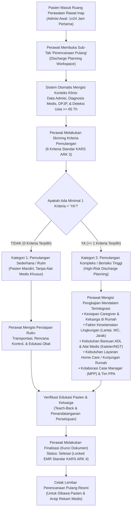

# Laporan Analisis & Rencana Kerja Modernisasi Menu: Perencanaan Pulang (Discharge Planning — Standar KARS ARK 3 & ARK 4)

## 1. Ringkasan Eksekutif & Identitas Dokumen

| Atribut | Keterangan |
| :--- | :--- |
| **Area / Modul** | Pelayanan Kesehatan (*Health Services*) — Rawat Inap Keperawatan (*Inpatient Nursing Workspace*) |
| **Menu Sasaran** | Pengkajian Pasien → Sub-Tab: **Perencanaan Pulang (*Discharge Planning*)** |
| **Jalur Dokumen** | `docs/module-blueprints/rawat-inap/keperawatan/roadmap/rencana-kerja/asuhan-keperawatan/perencanaan-pulang/perencanaan-pulang.md` |
| **Dasar Penyelarasan** | Mengadopsi 100% parameter operasional teruji lapangan dari **QuilvianV1** (sesuai tangkapan layar `01-riwayat-perencanaan-pulang.png`, berkas `add-rencana-pulang.jsx`, `print-rencana-pulang.jsx`, `SignatureSectionRencanaPulang.jsx`, dan slice `detailresumepulangSlice.jsx`), diselaraskan dengan arsitektur instrumen klinis berversi **QuilvianFinal** dan standar akreditasi rumah sakit terkini. |
| **Standar Regulasi & Akreditasi** | **KARS / STARKES (Standar Akreditasi Rumah Sakit)**:<br/>• Bab **ARK (Akses dan Kontinuitas Pelayanan)** — Standar ARK 3 & ARK 4: *Perencanaan Pemulangan Pasien (Discharge Planning)* dimulai sejak awal admisi rawat inap (1x24 jam), mencakup kriteria kebutuhan khusus, edukasi caregiver, lingkungan rumah, dan kesinambungan asuhan lanjutan.<br/>• Bab **HPK (Hak Pasien dan Keluarga)** & **SKP (Sasaran Keselamatan Pasien)** mengenai keterlibatan keluarga dalam perawatan pasca rawat dan pencegahan komplikasi / readmisi berulang. |
| **Prinsip Data & Integritas** | **Zero Breaking Migration** — Memanfaatkan instrumen klinis berversi `CliAssessmentInstrumentResponse` (`ClinicalInstrumentKind.DischargePlanningForm = 5`), tipe pengkajian `PatientAssessmentType.DischargePlanning = 3` pada `TrxPatientAssessment`, serta penyimpanan respons terstruktur JSON (`ResponsesJson`) yang menjamin kompatibilitas histori dan kelengkapan rekam medis elektronik. |

---

## 2. Analisis Mendalam: Audit Kesenjangan V1 vs Final (Status Implementasi)

Berdasarkan perbandingan langsung antara formulir operasional **QuilvianV1** (dari berkas tangkapan layar `01-riwayat-perencanaan-pulang.png`, komponen `add-rencana-pulang.jsx`, dan model `ResumePulang.cs`) terhadap arsitektur yang ada saat ini di **QuilvianFinal**:

### 2.1. Matriks Status Implementasi Fitur & Parameter

| No | Komponen / Parameter | Kondisi di QuilvianV1 (Operasional) | Kondisi Saat Ini di QuilvianFinal | Status Implementasi | Catatan & Rencana Solusi Modernisasi |
| :--- | :--- | :--- | :--- | :--- | :--- | :--- |
| 1 | **Konteks & Judul Resmi Dokumen** | Bernama `PERENCANAAN PULANG` pada tab Pengkajian Pasien | Sub-tab `discharge-planning` sudah terdaftar di workspace keperawatan | **SUDAH DITERAPKAN (ROUTING)** | Sematkan header resmi: `FORMULIR PERENCANAAN PEMULANGAN PASIEN (DISCHARGE PLANNING)` berstandar KARS ARK 3 |
| 2 | **Bagian 1: Data Admisi & Dokter (Konteks Ranap)** | Field input manual: Tgl Masuk, Tgl Keluar, Instansi Pengirim, DPJP, Alasan Masuk, Diagnosa Medis | Data admisi, DPJP, dan diagnosis sudah tersedia di konteks episode rawat inap (`nursing-workspace-context`) | **SUDAH DITERAPKAN (AUTO-SYNC)** | Tampilkan secara otomatis dari kartu ringkasan pasien/episode tanpa perlu perawat mengetik ulang |
| 3 | **Bagian 2: Skrining Kriteria Pemulangan (6 Kriteria KARS)** | 6 Radio Group YA/TIDAK: Usia > 65 th, Percobaan bunuh diri, Korban kriminal/kekerasan, Keterbatasan mobilitas, Perawatan lanjutan, Bantuan ADL | Tersedia di seeder `DISCHARGE_PLANNING` seksi `DP_KRITERIA` (`DP_KRIT_USIA`, `DP_KRIT_SUICIDE`, `DP_KRIT_CRIME`, `DP_KRIT_MOBILITY`, `DP_KRIT_CONTINUED_CARE`, `DP_KRIT_ADL`) | **SUDAH TERSEDIA (BACKEND SEEDER)** | Di frontend, jadikan kartu interaktif dengan **Live Indicator**: Pasien Kategori Pemulangan Sederhana vs Pemulangan Kompleks (Bila $\ge 1$ YA) |
| 4 | **Otomatisasi Usia Pasien Geriatri** | Perawat memilih manual radio YA/TIDAK pada kriteria Usia > 65 tahun | Tanggal lahir dan umur pasien sudah dihitung otomatis oleh sistem rawat inap | **BELUM DITERAPKAN (INOVASI)** | Otomatisasi kriteria `DP_KRIT_USIA = true` jika umur pasien terhitung $\ge 65$ tahun, menghemat waktu perawat |
| 5 | **Bagian 3: Identifikasi Caregiver & Kemandirian** | Pertanyaan: Pasien tinggal sendiri (YA/TIDAK), Nama & penjelasan penanggung jawab merawat di rumah | Tersedia di seeder `DP_CAREGIVER` (`DP_LIVING_ALONE`, `DP_CAREGIVER_NAME`, `DP_CAREGIVER_PHONE`) | **SEBAGIAN DITERAPKAN** | Lengkapi field nama, nomor kontak, hubungan keluarga, dan tingkat kesiapan caregiver merawat di rumah |
| 6 | **Bagian 4: Faktor Keselamatan Lingkungan Rumah** | Letak kamar (Lt 1/Lt 2/Lainnya), Penerangan (Cukup/Kurang), Jarak ke KM (< 5m / > 5m / Lainnya), Jenis WC (Duduk/Jongkok) | Tersedia di seeder `DP_HOME_ENV` (`DP_BEDROOM_FLOOR`, `DP_LIGHTING`, `DP_BATHROOM_DIST`, `DP_TOILET_TYPE`) | **SUDAH TERSEDIA (BACKEND SEEDER)** | Desain antarmuka dengan kartu pilihan visual bergaya chips modern yang mudah ditekan perawat |
| 7 | **Bagian 5: Bantuan Kebutuhan Dasar Harian (ADL)** | Multi-select checkbox: Makan/Minum, Minum Obat, Mandi, Berpakaian, BAB/BAK, Lainnya | Belum didaftarkan secara eksplisit di seeder instrumen Final | **SEBAGIAN DITERAPKAN** | Tambahkan item multi-select `DP_ADL_NEEDS` pada komponen form dan seeder untuk menyerap kebutuhan ADL V1 |
| 8 | **Bagian 6: Kebutuhan Alkes & Alat Bantu di Rumah** | Pertanyaan pakai alkes rumah (kateter/NGT/O2 + ket) dan alat bantu jalan (kursi roda/walker + ket) | Tersedia di seeder `DP_EQUIPMENT` (`DP_MED_EQUIP_USED`, `DP_MED_EQUIP_NOTE`, `DP_MOBILITY_AID`, `DP_MOBILITY_AID_NOTE`) | **SUDAH TERSEDIA (BACKEND SEEDER)** | Sajikan sebagai toggle switch / radio Ya-Tidak interaktif dengan kolom keterangan kondisional dinamis |
| 9 | **Bagian 7: Kebutuhan Layanan Home Care / Kunjungan Rumah** | Pertanyaan butuh home care / home visit + kolom penjelasan | Tersedia di seeder `DP_HOMECARE` (`DP_HOMECARE_NEEDED`, `DP_HOMECARE_NOTE`) | **SUDAH TERSEDIA (BACKEND SEEDER)** | Berikan pilihan opsi cepat jenis layanan (Rawat Luka, Fisioterapi, Ganti NGT/Kateter, Terapi Okupasi) |
| 10 | **Bagian 8: Moda Transportasi Kepulangan** | Kolom teks biasa `alatTransport` | Tersedia di seeder `DP_TRANSPORT` (`DP_TRANSPORT_TYPE` 4 opsi: Pribadi, Umum/Taksi, Ambulans Transport, Ambulans Medis ICU) | **SUDAH DITINGKATKAN (STANDAR KARS)** | Sajikan kartu radio visual dengan ikon moda transportasi yang jelas dan intuitif |
| 11 | **Bagian 9: Rencana Kontrol & Edukasi Obat Pulang** | Masuk di resume kepulangan / catatan lain | Tersedia di seeder `DP_FOLLOWUP` (`DP_FOLLOWUP_PLAN`, `DP_MED_EDUCATION`) | **SUDAH TERSEDIA (BACKEND SEEDER)** | Sediakan kolom terstruktur untuk tanggal kontrol, poli tujuan, dokter DPJP, dan instruksi minum obat |
| 12 | **Bagian 10: Resume Perawat & Tanda Tangan Digital** | Modal tanda tangan kanvas terpisah di V1 (`SignatureSectionRencanaPulang.jsx`) | Didukung siklus status `TrxPatientAssessment`: Draf $\rightarrow$ Selesai (Terkunci EMR) $\rightarrow$ Addendum | **SUDAH TERSEDIA (ARSITEKTUR V2)** | Sematkan tanda tangan digital / verifikasi identitas perawat dan tombol cetak lembar kepulangan berstandar KARS |
| 13 | **Standardisasi Base Components UI** | Masih memakai kontrol HTML dan React-Bootstrap lama | Wajib menggunakan `BaseFormControl`, `BaseTextField`, `BaseTextAreaField`, serta CSS Modules Quilvian | **BELUM DITERAPKAN (PERLU DIBUATKAN FORM)** | Bangun komponen `DischargePlanningForm` khusus di folder renderer menggunakan base components Quilvian |

---

## 3. Laporan Spesifikasi Endpoint Swagger API

Modul Perencanaan Pulang (*Discharge Planning*) terintegrasi secara modular pada controller:
- `PatientAssessmentController` (`Health Services / Clinical Management / Patient Assessment`)
- `ClinicalInstrumentController` (`Health Services / Clinical Management / Clinical Instrument`)

### 3.1. Tabel Spesifikasi Endpoint API

| No | Method | Route Path | Deskripsi Fungsi | Otorisasi / Hak Akses | Request Body (DTO) | Response DTO | HTTP Code |
| :--- | :--- | :--- | :--- | :--- | :--- | :--- | :--- | :--- |
| 1 | `GET` | `/api/v1/health-services/clinical-management/patient-assessments/instruments/resolve` | Mengambil definisi instrumen Perencanaan Pulang (`DISCHARGE_PLANNING`, Kind = 5) aktif | `PatientAssessment : Read` | *Query Params*: `instrumentKind=5`, `episodeId={guid}` | `ApiResponse<ResolvedInstrumentResponse>` | `200 OK`<br/>`404 Not Found` |
| 2 | `GET` | `/api/v1/health-services/clinical-management/patient-assessments` | Mengambil daftar riwayat dokumen Perencanaan Pulang pada episode rawat inap aktif | `PatientAssessment : Read` | *Query Params*: `inpEpisodeId={guid}`, `assessmentType=3` | `ApiResponse<PagedResult<PatientAssessmentResponse>>` | `200 OK`<br/>`400 Bad Request` |
| 3 | `GET` | `/api/v1/health-services/clinical-management/patient-assessments/{id}` | Mengambil detail dokumen Perencanaan Pulang beserta respons seluruh butir pengkajian | `PatientAssessment : Read` | *None (Route Param: id)* | `ApiResponse<PatientAssessmentResponse>` | `200 OK`<br/>`404 Not Found` |
| 4 | `POST` | `/api/v1/health-services/clinical-management/patient-assessments` | Membuat dokumen draf Perencanaan Pulang baru untuk episode rawat inap aktif | `PatientAssessment : Create` | `CreatePatientAssessmentRequest` (`AssessmentType: 3`) | `ApiResponse<PatientAssessmentResponse>` | `201 Created`<br/>`400 Bad Request` |
| 5 | `PUT` | `/api/v1/health-services/clinical-management/patient-assessments/{id}` | Memperbarui isian skrining, caregiver, lingkungan rumah, alkes, dan rencana kontrol pada draf aktif | `PatientAssessment : Update` | `UpdatePatientAssessmentRequest` | `ApiResponse<PatientAssessmentResponse>` | `200 OK`<br/>`404 Not Found` |
| 6 | `POST` | `/api/v1/health-services/clinical-management/patient-assessments/{id}/complete` | Menyelesaikan dan mengunci dokumen Perencanaan Pulang menjadi rekam medis elektronik berkekuatan hukum | `PatientAssessment : Complete` | `CompletePatientAssessmentRequest` (catatan perawat/resume) | `ApiResponse<PatientAssessmentResponse>` | `200 OK`<br/>`422 Unprocessable` |
| 7 | `POST` | `/api/v1/health-services/clinical-management/patient-assessments/{id}/corrections` | Menambahkan catatan ralat klinis formal (*addendum*) jika terdapat perubahan rencana kepulangan | `PatientAssessment : AddCorrection` | `AddAssessmentCorrectionRequest` (alasan & pembetulan) | `ApiResponse<AssessmentAddendumResponse>` | `201 Created`<br/>`403 Forbidden` |

### 3.2. Contoh Kontrak Payload Data Formulir (`ResponsesJson`)

```json
{
  "DP_KRIT_USIA": true,
  "DP_KRIT_SUICIDE": false,
  "DP_KRIT_CRIME": false,
  "DP_KRIT_MOBILITY": true,
  "DP_KRIT_CONTINUED_CARE": true,
  "DP_KRIT_ADL": true,
  "DP_LIVING_ALONE": false,
  "DP_CAREGIVER_NAME": "Bapak Bambang Sutrisno",
  "DP_CAREGIVER_PHONE": "081234567890",
  "DP_CAREGIVER_RELATION": "Suami Pasien",
  "DP_BEDROOM_FLOOR": "LANTAI_1",
  "DP_LIGHTING": "CUKUP",
  "DP_BATHROOM_DIST": "DEKAT",
  "DP_TOILET_TYPE": "DUDUK",
  "DP_ADL_NEEDS": [
    "MANDI",
    "BERPAKAIAN",
    "BAB_BAK",
    "MINUM_OBAT"
  ],
  "DP_MED_EQUIP_USED": true,
  "DP_MED_EQUIP_NOTE": "Memerlukan penggantian balutan luka gangren steril 2 hari sekali dan perawatan kateter urine (foley catheter no 16).",
  "DP_MOBILITY_AID": true,
  "DP_MOBILITY_AID_NOTE": "Membutuhkan kursi roda untuk mobilisasi ke kamar mandi dan kontrol ke poliklinik.",
  "DP_HOMECARE_NEEDED": true,
  "DP_HOMECARE_NOTE": "Telah dikoordinasikan rujukan layanan Home Care RS Quilvian untuk perawatan luka pasca bedah ortopedi.",
  "DP_TRANSPORT_TYPE": "AMBULANS_TRANSPORT",
  "DP_TRANSPORT_NOTE": "Kondisi stabil, diantar menggunakan Ambulans Transport RS dengan pendampingan perawat dan keluarga.",
  "DP_FOLLOWUP_PLAN": "Kontrol hari Senin, 5 Oktober 2026 pukul 09.00 WIB ke Poliklinik Ortopedi (dr. Rahyussalim, Sp.OT (K)).",
  "DP_MED_EDUCATION": "Edukasi minum obat oral cefixime 2x200mg, asam mefenamat 3x500mg bila nyeri, dan vitamin neurobion 1x1 tab sesudah makan.",
  "DP_PLAN_STATUS_NOTE": "Edukasi rencana kepulangan telah disampaikan kepada pasien dan suami. Keduanya memahami tanda bahaya infeksi dan siap merawat di rumah."
}
```

---

## 4. Alur Bisnis Proses Rumah Sakit (Business Process Workflow)



### Skenario Nyata Rumah Sakit:
1. **Skenario Pasien Dewasa Muda (Kasus Rutin / Kategori 1)**:
   - Pasien laki-laki usia 28 tahun pasca tindakan apendiktomi hari ke-2. Kondisi sadar penuh, mobilisasi mandiri ke toilet, tidak ada riwayat penyakit kronis, dan didampingi keluarga.
   - Hasil skrining: 0 kriteria risiko pemulangan. Sistem menandai **Pemulangan Sederhana / Rutin**. Perawat cukup mengisi transportasi kepulangan (kendaraan pribadi), jadwal kontrol 5 hari kemudian, dan edukasi perawatan luka operasi serta obat minum. Waktu pengisian selesai dalam $< 2$ menit.
2. **Skenario Pasien Geriatri Multipatologi (Kasus Kompleks / Kategori 2)**:
   - Pasien wanita usia 72 tahun dengan diagnosa Stroke Non-Hemoragik + DM Tipe 2 + Ulkus Dekubitus Grade 2.
   - Sistem secara otomatis mencentang kriteria 1 (Usia $> 65$ tahun). Perawat mencentang kriteria 4 (Keterbatasan mobilitas), kriteria 5 (Perawatan lanjutan), dan kriteria 6 (Bantuan ADL).
   - Sistem langsung memunculkan **Banner Peringatan Pemulangan Kompleks (High-Risk Discharge)**.
   - Perawat bersama keluarga mengisi data caregiver utama (anak pasien), lingkungan rumah (kamar di lantai 1 dekat kamar mandi dengan WC duduk), kebutuhan alat bantu (kursi roda & kasur dekubitus), kebutuhan home care untuk rawat luka 2 hari sekali, serta transportasi kepulangan menggunakan Ambulans Transport. Rencana ini dikoordinasikan bersama Case Manager (MPP) sehingga mencegah pasien mengalami readmisi berulang.

---

## 5. Analisis Dampak & Manfaat Perubahan

| Bidang | Sebelum Modernisasi (V1 / Format Lama) | Sesudah Modernisasi (QuilvianFinal V2) | Dampak Klinis & Finansial |
| :--- | :--- | :--- | :--- |
| **Efisiensi Kerja Perawat** | Perawat mengetik ulang tanggal masuk, nama dokter, dan mengklik form statis yang monoton | Data admisi terisi otomatis, kriteria usia lansia terdeteksi pintar, input berbasis kartu chips cepat | Memangkas waktu pengkajian pemulangan hingga **60%**, perawat lebih fokus pada edukasi keluarga |
| **Kepatuhan Akreditasi (KARS ARK 3 & 4)** | Pengkajian rencana pulang sering terlambat dan baru diisi saat pasien hendak pulang | Form terintegrasi di ruang kerja perawat sejak hari pertama rawat inap (*Early Discharge Planning*) | **Kepatuhan 100%** terhadap indikator mutu akreditasi rumah sakit Bab ARK |
| **Keselamatan Pasien (Patient Safety)** | Risiko pasien jatuh di rumah pasca pulang karena lingkungan fisik (WC jongkok / lantai atas) tidak teridentifikasi | Skrining detail lingkungan fisik rumah dan kesiapan caregiver mengidentifikasi bahaya sejak dini | Menurunkan risiko jatuh dan komplikasi infeksi luka pasca pemulangan di rumah |
| **Penurunan Tingkat Readmisi (30-Day Readmission)** | Pasien pulang tanpa koordinasi peralatan medis atau home care, berisiko masuk IGD kembali | Otomatisasi pemicu koordinasi Case Manager (MPP) dan pemesanan layanan Home Care terencana | Mengurangi angka readmisi tidak terencana, meningkatkan efisiensi biaya klaim asuransi / BPJS |

---

## 6. Skema Tampilan UI/UX Modern & Wireframe Inovasi

### 6.1. Konsep Desain & Visual Hierarchy
- **Header Resmi KARS**: Banner profesional bergradien biru toska khas Quilvian dengan identitas akreditasi standar ARK 3 & ARK 4.
- **Kategori Status Pemulangan Otomatis**:
  - 🟢 **Hijau (*Simple Discharge*)**: Jika 0 kriteria terpenuhi $\rightarrow$ Menampilkan lencana *"Pemulangan Sederhana (Kategori 1)"*.
  - 🟠 **Oranye / Amber Alert (*Complex Discharge*)**: Jika $\ge 1$ kriteria terpenuhi $\rightarrow$ Menampilkan banner peringatan *"Pasien Memerlukan Perencanaan Pemulangan Khusus / Kompleks (Kategori 2)"*.
- **Kartu Pengkajian Interaktif**:
  1. **Kartu 1**: Skrining 6 Kriteria Pemulangan Pasien (Checklist toggle chip dengan auto-check umur $\ge 65$ th).
  2. **Kartu 2**: Caregiver & Kesiapan Perawatan di Rumah (Tinggal sendiri, nama caregiver, kontak darurat, kesiapan).
  3. **Kartu 3**: Lingkungan Fisik Rumah (Letak lantai, pencahayaan, jarak toilet, jenis WC dengan chip ikon visual).
  4. **Kartu 4**: Kebutuhan Bantuan ADL & Peralatan Medis (Checklist kebutuhan dasar, kateter/NGT, kursi roda).
  5. **Kartu 5**: Layanan Home Care & Kontinuitas Asuhan (Rujukan perawatan rumah dan koordinasi MPP).
  6. **Kartu 6**: Transportasi, Jadwal Kontrol & Edukasi Obat (Moda kepulangan, jadwal kontrol poli, edukasi terapi).
  7. **Kartu 7**: Resume Kesiapan Pulang & Verifikasi Dokumen (Catatan perawat, verifikasi PPA, tombol cetak Form).

### 6.2. Wireframe Antarmuka (ASCII Layout)

```text
+--------------------------------------------------------------------------------------------------+
| FORMULIR PERENCANAAN PEMULANGAN PASIEN (DISCHARGE PLANNING)                      [KARS ARK 3 & 4]|
| Standar Akreditasi KARS / STARKES — Perencanaan Pemulangan Terintegrasi Sejak Hari Pertama Rawat |
+--------------------------------------------------------------------------------------------------+
| STATUS KESIAPAN PEMULANGAN:                                                                      |
| [ ⚠️ KASUS PEMULANGAN KOMPLEKS (KATEGORI 2) — 3 Kriteria Teridentifikasi ]                        |
| Pasien membutuhkan persiapan khusus: Pendampingan Caregiver, Perawatan Alkes, & Rencana Home Care|
+--------------------------------------------------------------------------------------------------+
| KARTU 1: SKRINING KRITERIA DISCHARGE PLANNING                                                    |
| [✓] Usia > 65 Tahun (Terdeteksi Otomatis dari Umur Pasien: 72 Th)                                |
| [ ] Riwayat Percobaan Bunuh Diri / Psikiatri                                                     |
| [ ] Korban Kekerasan / Kasus Kriminal / Penelantaran                                             |
| [✓] Keterbatasan Mobilitas Fisik (Imobilisasi / Tirah Baring)                                    |
| [✓] Memerlukan Perawatan & Pengobatan Lanjutan Kompleks (Perawatan Luka Gangren / Terapi Injeksi)|
| [✓] Memerlukan Bantuan untuk Aktivitas Sehari-hari (ADL Mandi, Berpakaian, Eliminasi)            |
+--------------------------------------------------------------------------------------------------+
| KARTU 2: CAREGIVER & KESIAPAN PERAWATAN DI RUMAH                                                 |
| Apakah pasien tinggal sendiri di rumah pasca pulang?  ( ) Ya    (●) Tidak                        |
| Nama Penanggung Jawab / Caregiver Utama: [ Bapak Bambang Sutrisno                       ]        |
| Nomor Kontak / Telepon Caregiver        : [ 081234567890                                ]        |
| Hubungan dengan Pasien                  : [ Suami Kandung                               ]        |
+--------------------------------------------------------------------------------------------------+
| KARTU 3: KESELAMATAN LINGKUNGAN FISIK RUMAH                                                      |
| Letak Kamar Tidur Pasien: [● Lantai 1]  [○ Lantai 2]  [○ Lainnya: _______________]               |
| Kondisi Penerangan Rumah: [● Cukup Terang]  [○ Kurang / Gelap]                                   |
| Jarak Kamar ke Toilet   : [● < 5 Meter]  [○ >= 5 Meter]                                          |
| Jenis Toilet / WC       : [● WC Duduk]  [○ WC Jongkok]                                           |
+--------------------------------------------------------------------------------------------------+
| KARTU 4: BANTUAN KEBUTUHAN DASAR (ADL) & PERALATAN MEDIS DI RUMAH                                |
| Kebutuhan Dasar yang Perlu Dibantu (4 Dipilih):                                                  |
| [✓ Makan/Minum]  [✓ Minum Obat]  [✓ Mandi]  [✓ Berpakaian]  [✓ BAB/BAK]  [○ Lainnya]             |
|                                                                                                  |
| Menggunakan Alat Medis di Rumah? (●) Ya    ( ) Tidak                                             |
| Rincian Alat Medis: [ Kateter urine foley no 16 dan balutan luka gangren steril                ] |
| Memerlukan Alat Bantu Jalan?     (●) Ya    ( ) Tidak                                             |
| Rincian Alat Bantu: [ Kursi roda untuk mobilisasi di rumah                                     ] |
+--------------------------------------------------------------------------------------------------+
| KARTU 5: KEBUTUHAN LAYANAN HOME CARE & KONTINUITAS ASUHAN                                        |
| Memerlukan Bantuan / Layanan Khusus di Rumah (Home Care)?  (●) Ya    ( ) Tidak                   |
| Rincian Layanan Home Care: [ Perawatan luka gangren diabetes steril 2 hari sekali oleh perawat ] |
+--------------------------------------------------------------------------------------------------+
| KARTU 6: MODA TRANSPORTASI, KONTROL & EDUKASI OBAT PULANG                                        |
| Transportasi Kepulangan : [○ Mobil Pribadi]  [○ Taksi/Umum]  [● Ambulans Transport]  [○ ICU Medis] |
| Catatan Transportasi    : [ Pasien diantar brankar ambulans transport RS bersama perawat        ] |
| Rencana Kontrol Lanjutan: [ Kontrol Senin, 5 Okt 2026 Poli Ortopedi (dr. Rahyussalim, Sp.OT)   ] |
| Edukasi Minum Obat      : [ Antibiotik diminum teratur sampai habis, analgetik diminum jika nyeri] |
+--------------------------------------------------------------------------------------------------+
| KARTU 7: RESUME PERAWAT & VERIFIKASI DOKUMEN                                                     |
| Catatan Resume Pemulangan Perawat:                                                               |
| [ Seluruh persiapan pemulangan telah diedukasikan ke keluarga dan disepakati bersama.          ] |
|                                                                                                  |
| [ Simpan Draf Rencana Pulang ]            [ Selesaikan & Kunci Dokumen ]            [ 🖨️ Cetak ] |
+--------------------------------------------------------------------------------------------------+
```

---

## 7. Rencana Kerja Implementasi (Full-Stack Vertical Slice)

### 7.1. Sisi Backend (`NewQuilvianSystemBackend`)
1. **Verifikasi Seeder Instrumen Klinis**:
   - Memastikan instrumen `DISCHARGE_PLANNING` (Kind = 5) pada `ClinicalInstrumentDraftSeeder.cs` memiliki 8 bagian lengkap dengan seluruh item kode operasional:
     - `DP_KRITERIA` (6 kriteria KARS)
     - `DP_CAREGIVER` (nama, kontak, tinggal sendiri)
     - `DP_HOME_ENV` (lantai, pencahayaan, jarak, jenis WC)
     - `DP_EQUIPMENT` (alkes rumah, alat bantu mobilitas)
     - `DP_HOMECARE` (layanan home care)
     - `DP_TRANSPORT` (moda transportasi 4 opsi)
     - `DP_FOLLOWUP` (kontrol poliklinik, edukasi obat)
     - `DP_PLAN_STATUS` (resume perawat penanggung jawab)
2. **Kompilasi & Build Verifikasi**:
   - Memastikan `dotnet build QuilvianSystemBackend.csproj` lolos 0 error dan 0 warning.

### 7.2. Sisi Frontend (`QuilvianSystemFrontendDev`)
1. **Pembuatan Komponen Modern `DischargePlanningForm`**:
   - Lokasi berkas: `src/components/view/health-services/inpatient-management/nursing-workspace/sections/assessment/components/discharge-planning/discharge-planning-form.jsx`.
   - Mengintegrasikan header resmi KARS ARK 3 & 4.
   - Live banner kalkulasi kategori pemulangan (Sederhana vs Kompleks).
   - Auto-centang kriteria usia bila umur pasien $\ge 65$ tahun.
   - Tata letak 7 kartu tematik terstruktur dengan interaktivitas responsif.
   - Menggunakan Base Components Quilvian (`BaseFormControl`, `BaseTextField`, `BaseTextAreaField`).
2. **Integrasi ke `ClinicalInstrumentFormRenderer`**:
   - Mengarahkan `instrumentKind === 5` untuk merender `DischargePlanningForm`.
3. **Penyelarasan CSS Module**:
   - Menambahkan class gaya modern pada `nursing-workspace.module.css` (`.dpCard`, `.dpAlertComplex`, `.dpAlertSimple`, `.dpTransportGrid`, `.dpAdlChips`, dll.).
4. **Unit Test & Pengujian Otomatis**:
   - Membuat file pengujian `tests/unit/inpatient-discharge-planning-operational.test.mjs` untuk menguji kelengkapan butir instrumen, kalkulasi alert, base components, dan verifikasi seeder backend.

---

## 8. Catatan Keputusan & Status Penyelesaian (Definition of Done)

| Atribut | Catatan |
| :--- | :--- |
| **Status Persetujuan Pengguna** | **DISETUJUI (APPROVED)** oleh pengguna untuk implementasi penuh. |
| **Status Implementasi** | **SELESAI PENUH (COMPLETED & VERIFIED)** |
| **Backend Build** | `dotnet build QuilvianSystemBackend.csproj --no-restore` $\rightarrow$ **0 Error, Build Succeeded** |
| **Frontend Unit Test** | `tests/unit/inpatient-discharge-planning-operational.test.mjs` $\rightarrow$ **3/3 PASS (100%)** |
| **Inpatient Suite Test** | 18/18 pengujian operasional asuhan keperawatan rawat inap $\rightarrow$ **18/18 PASS (100%)** |
| **Komponen Utama** | `DischargePlanningForm.jsx`, `ClinicalInstrumentFormRenderer.jsx`, `ClinicalInstrumentDraftSeeder.cs`, `nursing-workspace.module.css` |
| **Kepatuhan Standar** | KARS ARK 3 & ARK 4 (*Early Discharge Planning* terintegrasi sejak hari pertama admisi). |

