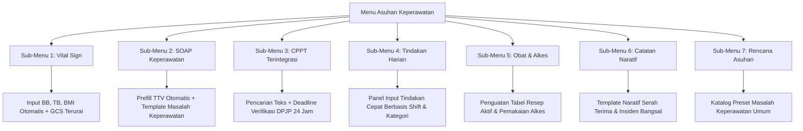

# Rencana Kerja Penyelarasan Menu 2: Asuhan Keperawatan Rawat Inap (Mengikuti V1)

> **Kode Dokumen**: `RK-RWI-ASUHAN-KEPERAWATAN-001`  
> **Modul**: Rawat Inap (*Inpatient Management*) — Sub-Modul Keperawatan  
> **Status**: Disetujui untuk Eksekusi (*Pre-Approved by User*)  
> **Tanggal Rilis Rencana**: 25 September 2026  
> **Target Penyelesaian**: 7 Sub-Menu Asuhan Keperawatan Sesuai Standar Klinis V1  

---

## 1. Ringkasan Eksekutif & Latar Belakang

Menu **Asuhan Keperawatan** adalah pusat aktivitas kerja klinis harian perawat di ruang rawat inap (*ward nursing station*). Berdasarkan evaluasi komparatif antara sistem Quilvian V1 dan fondasi QuilvianFinal (V2), ditemukan kebutuhan penyelarasan fitur agar alur kerja perawat tidak kehilangan efisiensi, kemudahan penginputan harian, serta kepatuhan standar akreditasi rumah sakit (KARS dan SKI).

Penyelarasan ini mencakup **7 Sub-Menu Utama** dalam Asuhan Keperawatan:
1. **Vital Sign (Tanda Vital & Grafik Tren)**
2. **SOAP Keperawatan (Catatan Perkembangan Harian)**
3. **Catatan Terintegrasi (CPPT Lintas PPA)**
4. **Tindakan Harian (Intervensi Per Shift)**
5. **Obat & Alkes (Pemberian Obat MAR & Pemakaian Alkes)**
6. **Catatan Keperawatan (Naratif & Observasi Khusus)**
7. **Rencana Asuhan Keperawatan (Care Plan & Evaluasi Masalah)**

Dokumen ini menjadi acuan kerja resmi perbaikan, pengayaan data klinis, serta pengujian terpadu backend dan frontend.

---

## 2. Analisis Kesenjangan (Gap Analysis) V1 vs V2 Saat Ini

| Sub-Menu | Kondisi V1 | Kondisi V2 Saat Ini | Rencana Penyelarasan (To-Be) |
| :--- | :--- | :--- | :--- |
| **1. Vital Sign** | Memiliki input BB, TB, perhitungan BMI otomatis, saturasi O2, kesadaran/GCS, serta grafik tren terintegrasi. | Input tanda vital hanya mencakup TD, Nadi, RR, Suhu, O2, EWS. Belum ada BB, TB, dan BMI terintegrasi di form inline. | Tambahkan input BB (kg), TB (cm), kalkulasi BMI otomatis beserta kategori status gizi di form perawat, serta rincian GCS terurai (E-V-M). |
| **2. SOAP Keperawatan** | Form SOAP dilengkapi template keluhan, autofill tanda vital terkini, asesmen diagnosa keperawatan (SDKI), dan 4 pilar intervensi (Edukasi, Kolaborasi, Observasi, Teraupetik). | Form inline hanya 4 kotak teks bebas (S, O, A, P, Instruksi, Evaluasi) tanpa template keluhan dan tanpa pengait TTV otomatis. | Tambahkan tombol *Prefill TTV Terkini*, template keluhan umum perawat bangsal, selector masalah keperawatan umum, dan pembagian pilar intervensi P. |
| **3. CPPT Terintegrasi** | Timeline per bulan, kartu catatan per profesi (Dokter vs Perawat), modal rincian, status verifikasi DPJP. | Layout sudah mengadopsi DoctorCpptCard modern, namun belum ada filter pencarian cepat dan pengingat batas verifikasi DPJP 1x24 jam. | Tambahkan pencarian kata kunci, pengingat deadline verifikasi DPJP 24 jam (KARS PAP 2.2), dan badge profesi PPA yang kontras. |
| **4. Tindakan Harian** | Input tindakan per shift (Pagi/Siang/Malam) dengan checklist cepat, Mass Time, Mass Note, dan tabel riwayat input hari ini. | Menggunakan modal satu per satu di timeline vertikal (lambat untuk rutinitas perawat yang mencatat 10–20 tindakan sekaligus). | Sediakan mode form input cepat berbasis shift dan kategori tindakan (seperti V1) berdampingan dengan timeline audit resmi V2. |
| **5. Obat & Alkes** | Terbagi menjadi: Resep Aktif, Resep Harian IP, Order Alkes, dan Ringkasan Pemakaian Alkes. | Sudah memiliki panel MAR, Sliding Scale, Rekonsiliasi, Resep Aktif, dan Pemakaian Alkes. | Sempurnakan tampilan tabel resep aktif & pemakaian alkes dengan filter shift dan status verifikasi farmasi. |
| **6. Catatan Keperawatan** | Terbagi menjadi: Observasi Cairan, Spooling, Cairan WSD, Sliding Scale, DPO/MAR, dan Catatan Naratif. | Baru berupa form naratif sederhana CPPT NoteKind 76. | Sediakan template naratif perawat (kondisi insidental, serah terima, rujukan internal) dan tautan navigasi ke observasi cairan. |
| **7. Rencana Asuhan** | Master-detail rencana asuhan, evaluasi berkala, target luaran, intervensi keperawatan. | Sudah mengadopsi master-detail 2 panel, penutupan teratasi menuntut evaluasi (VAL-KEP-16). | Pertahankan arsitektur master-detail V2, lengkapi pustaka template masalah keperawatan umum agar perawat tidak perlu mengetik panjang dari nol. |

---

## 3. Rincian Rencana Kerja per Sub-Menu

### 3.1 Sub-Menu 1: Vital Sign (Tanda Vital & Grafik)
- **Tujuan**: Memungkinkan perawat mencatat data antropometri lengkap (BB, TB, BMI) dan rincian neurologis (GCS Eye-Verbal-Motorik) di samping parameter vital baku (TD, HR, RR, Suhu, SpO2).
- **Perubahan Komponen**:
  - `vital-sign-entry-form.jsx`: Tambahkan input Berat Badan (kg), Tinggi Badan (cm), dan kalkulasi BMI otomatis ($BMI = \frac{BB}{(TB/100)^2}$) beserta badge kategori:
    - *Underweight* ($< 18.5$)
    - *Normal* ($18.5 - 22.9$)
    - *Overweight* ($23.0 - 24.9$)
    - *Obese* ($\ge 25.0$)
  - Tambahkan input GCS terurai: Eye (1–4), Verbal (1–5), Motorik (1–6) yang menjumlahkan total GCS (3–15).
  - `nursing-vital-sign-tab.jsx`: Tambahkan kolom BB, TB, BMI, dan GCS pada tabel riwayat tanda vital.

### 3.2 Sub-Menu 2: SOAP Keperawatan
- **Tujuan**: Mempercepat perawat menyusun catatan SOAP perkembangan harian tanpa harus mengulang data yang sudah ada di sistem.
- **Perubahan Komponen**:
  - `nursing-soap-entry-form.jsx`:
    - Tambahkan tombol **"Tarik TTV Terkini"** yang mengambil hasil observasi tanda vital terbaru untuk disematkan langsung ke kolom Objektif (O).
    - Tambahkan dropdown preset keluhan umum (Subjektif) seperti: *Sesak napas, Demam naik-turun, Nyeri luka operasi, Mual muntah, Lemas tidak nafsu makan, Pusing berputar*.
    - Pada kolom Asesmen (A): sediakan opsi pemilihan Diagnosa Keperawatan Cepat (misal: Bersihan Jalan Napas Tidak Efektif, Nyeri Akut, Gangguan Mobilitas Fisik, Hipertermia, Risiko Infeksi, Defisit Pengetahuan).
    - Pada kolom Planning (P): sediakan tombol pembagi struktur 4 pilar (*Observasi, Terapeutik, Edukasi, Kolaborasi*).

### 3.3 Sub-Menu 3: Catatan Terintegrasi (CPPT)
- **Tujuan**: Meningkatkan visibilitas catatan perkembangan lintas profesi bagi perawat dan memastikan kepatuhan standar verifikasi DPJP.
- **Perubahan Komponen**:
  - `nursing-integrated-notes-tab.jsx`:
    - Tambahkan bilah pencarian teks (*search filter*) untuk memfilter riwayat CPPT berdasarkan kata kunci klinis atau nama petugas.
    - Tambahkan indikator visual kepatuhan KARS PAP 2.2: Lencana peringatan jika ada catatan perawat/bidan yang belum diverifikasi DPJP dalam kurun waktu $>24$ jam.
    - Sediakan modal cetak / ringkasan lembar CPPT episode berjalan.

### 3.4 Sub-Menu 4: Tindakan Harian (Intervensi Per Shift)
- **Tujuan**: Mengembalikan efisiensi penginputan tindakan massal per shift seperti di V1 sehingga perawat tidak perlu membuka modal terpisah untuk puluhan rutinitas keperawatan.
- **Perubahan Komponen**:
  - `nursing-intervention-section.jsx`:
    - Tambahkan tab / mode tampilan: **"Input Per Shift (Cepat)"** dan **"Riwayat Timeline"**.
    - Di panel Input Cepat:
      - Dropdown Shift: Pagi (07:00–14:00), Siang (14:00–21:00), Malam (21:00–07:00).
      - Checklist kategori tindakan: *Higiene Pasien (Mandi/Seka, Oral Hygiene), Nutrisi (Bantu Makan, Pasang NGT), Eliminasi (Bantu BAK/BAB, Perawatan Kateter), Mobilisasi (Miring Kanan-Kiri, Duduk di Bed), Pengobatan & Infus (Ganti Cairan, Cek Flebitis), Kenyamanan (Ganti Laken, Edukasi Pasien)*.
      - Fitur *Check All*, input Waktu Massal (*Mass Time*), dan Keterangan Massal.
      - Tabel Riwayat Input Shift Hari Ini untuk memverifikasi tindakan yang sudah tercatat.

### 3.5 Sub-Menu 5: Obat & Alkes
- **Tujuan**: Memastikan perawat dapat memantau resep aktif, jadwal pemberian obat harian, dan mencatat alkes yang dipakai pada pasien dengan transparan.
- **Perubahan Komponen**:
  - `nursing-medication-section.jsx` & `active-prescriptions-panel.jsx`:
    - Tampilkan status verifikasi farmasi dan ketersediaan obat secara jelas (Menunggu Verifikasi, Sedang Disiapkan, Siap Diberikan, Selesai).
    - Pada tab Pemakaian Alkes: perjelas daftar BMHP yang lazim dipakai di bangsal rawat inap (Abocath, Infus Set, Spuit 3cc/5cc/10cc, Kasa Steril, Micropore, Underpad, dsb.).

### 3.6 Sub-Menu 6: Catatan Keperawatan (Naratif)
- **Tujuan**: Memfasilitasi pendokumentasian naratif untuk situasi khusus (serah terima pasien shift malam-pagi, insiden pasien jatuh/gelisah, persiapan rujukan ambulans).
- **Perubahan Komponen**:
  - `nursing-narrative-entry-form.jsx`:
    - Sediakan template cepat:
      - *Catatan Operan Shift (SBAR: Situation, Background, Assessment, Recommendation)*.
      - *Catatan Observasi Khusus / Insidental*.
      - *Catatan Pasien Tinggalkan Ruangan Sementara (Pemeriksaan Penunjang/HD/OK)*.

### 3.7 Sub-Menu 7: Rencana Asuhan Keperawatan (Care Plan)
- **Tujuan**: Memudahkan perawat menetapkan dan mengevaluasi rencana asuhan keperawatan tanpa beban pengetikan berulang.
- **Perubahan Komponen**:
  - `care-plan-item-form-modal.jsx`:
    - Tambahkan pustaka preset Masalah Keperawatan (SDKI) dan Tujuan Luaran (SLKI) yang dapat dipilih dengan 1 kali klik.
    - Validasi bahwa setiap masalah yang dinyatakan "Teratasi" wajib menyertakan narasi evaluasi akhir (kepatuhan `VAL-KEP-16`).

---

## 4. Spesifikasi Antarmuka API (Swagger Style)

Modul Asuhan Keperawatan berinteraksi dengan API backend berikut:

| Method | Endpoint Path | Tag Swagger | Deskripsi | Otorisasi | Request / Query | Response Model |
| :--- | :--- | :--- | :--- | :--- | :--- | :--- |
| `GET` | `/api/v1/health-services/clinical-management/vital-signs/series` | `[Tags("Vital Signs")]` | Deret tanda vital episode untuk tabel & grafik tren | `Doctor, Nurse` | `episodeId`, `from`, `to` | `NursingResult<List<PatientVitalSignSeriesItem>>` |
| `POST` | `/api/v1/health-services/clinical-management/vital-signs` | `[Tags("Vital Signs")]` | Pencatatan tanda vital baru perawat (dengan EWS server) | `Nurse` | `CreateVitalSignRequest` | `NursingResult<PatientVitalSignDto>` |
| `GET` | `/api/v1/health-services/clinical-management/integrated-notes` | `[Tags("CPPT Integrated Notes")]` | Daftar catatan CPPT (SOAP & Naratif) per episode | `All Clinicians` | `episodeId`, `professionType`, `noteKind` | `PagedResult<InpatientCpptNoteDto>` |
| `POST` | `/api/v1/health-services/clinical-management/integrated-notes` | `[Tags("CPPT Integrated Notes")]` | Simpan catatan SOAP atau Naratif keperawatan | `Nurse, Midwife` | `CreateIntegratedNoteRequest` | `InpatientCpptNoteDto` |
| `GET` | `/api/v1/health-services/clinical-management/nursing-interventions` | `[Tags("Nursing Interventions")]` | Daftar riwayat tindakan keperawatan episode | `Nurse` | `episodeId` | `NursingInterventionListDto` |
| `POST` | `/api/v1/health-services/clinical-management/nursing-interventions` | `[Tags("Nursing Interventions")]` | Catat satu atau banyak tindakan keperawatan per shift | `Nurse` | `CreateInterventionRequest` | `NursingInterventionDto` |
| `GET` | `/api/v1/health-services/clinical-management/nursing-care-plans` | `[Tags("Nursing Care Plans")]` | Ambil rencana asuhan aktif dan riwayat evaluasi | `Nurse` | `episodeId` | `NursingCarePlanDto` |
| `POST` | `/api/v1/health-services/clinical-management/nursing-care-plans/items` | `[Tags("Nursing Care Plans")]` | Tambah butir masalah keperawatan baru | `Nurse` | `CreateCarePlanItemRequest` | `CarePlanItemDto` |

---

## 5. Rencana Tahapan Eksekusi & Validasi

Pengerjaan akan dieksekusi secara berurutan (*Vertical Slice*):

- **Fase 1 (Vital Sign & SOAP)**:
  - Pengayaan form Vital Sign (BB, TB, BMI otomatis, GCS E-V-M).
  - Pengayaan form SOAP Keperawatan (Tarik TTV otomatis, template SBAR, preset diagnosa keperawatan, 4 pilar SIKI).
- **Fase 2 (Tindakan Harian & CPPT)**:
  - Panel input tindakan per shift (Pagi/Siang/Malam) dengan checklist cepat kategori keperawatan.
  - Filter pencarian cepat dan pengingat deadline verifikasi DPJP 24 jam pada lembar CPPT.
- **Fase 3 (Obat & Alkes, Catatan Naratif, Care Plan)**:
  - Pustaka preset template naratif serah terima & insidental.
  - Pustaka template masalah keperawatan pada Care Plan.
  - Integrasi akhir dan pengujian fungsional seluruh sub-menu.
- **Fase 4 (Verifikasi & Laporan)**:
  - Pengujian `dotnet build` backend dan build frontend Next.js.
  - Pembuatan laporan hasil perubahan tracked.

---

## 6. Kriteria Keberhasilan (Definition of Done)

1. Semua 7 sub-menu Asuhan Keperawatan dapat dibuka, diinput, dan disimpan tanpa galat runtime.
2. Form Tanda Vital secara akurat menghitung nilai BMI dan menampilkan kategori gizi saat perawat mengisi BB dan TB.
3. Form SOAP Keperawatan memiliki tombol fungsi yang berhasil menyalin data TTV terakhir ke kolom Objektif secara instan.
4. Perawat dapat mencatat tindakan harian per shift secara massal dengan efisien.
5. Catatan SOAP dan Naratif tersimpan ke tabel CPPT terintegrasi dengan penanda profesi `Nurse` yang sah.
6. Kompilasi backend `dotnet build` sukses dengan 0 error, dan frontend Next.js lulus verifikasi linter/syntax check.

---

## 7. Status Implementasi dan Verifikasi Hasil Akhir

Seluruh 7 sub-menu pada Menu 2: Asuhan Keperawatan telah berhasil diselesaikan secara tuntas sesuai mandat dan spesifikasi klinis V1:

| No | Sub-Menu | Status | Komponen Terlibat | Catatan Hasil Perubahan |
| :--- | :--- | :--- | :--- | :--- |
| 1 | **Tanda Vital & Grafik** | ✅ Selesai (100%) | `PatientVitalSignDtos.cs`, `InpatientVitalSignService.cs`, `use-inpatient-vital-sign-series.js`, `vital-sign-entry-form.jsx`, `nursing-vital-sign-tab.jsx` | Penambahan input GCS E-V-M + total kalkulasi otomatis, input BB/TB/Lingkar Kepala, kalkulator BMI real-time + klasifikasi gizi WHO/Kemenkes, serta kolom tabel BB/TB/BMI dan GCS/Kesadaran. |
| 2 | **SOAP Keperawatan** | ✅ Selesai (100%) | `nursing-soap-entry-form.jsx`, `nursing-soap-tab.jsx` | Tombol fungsi *Ambil TTV Terkini* 1-klik untuk mengisi Objektif (O), chips keluhan umum Subjektif (S), chips standar diagnosis SDKI untuk Assessment (A), dan tombol struktur 4 pilar SIKI (Observasi, Terapeutik, Edukasi, Kolaborasi) untuk Planning (P). |
| 3 | **Catatan Terintegrasi (CPPT)** | ✅ Selesai (100%) | `nursing-integrated-notes-tab.jsx` | Fitur pencarian teks real-time di catatan SOAP, profesi, dan tenaga medis, serta banner peringatan kepatuhan KARS PAP 2.2 untuk catatan yang menunggu verifikasi DPJP dalam 24 jam. |
| 4 | **Tindakan Harian Per Shift** | ✅ Selesai (100%) | `nursing-intervention-section.jsx` | Pengalih tampilan ganda (Lini Masa Kronologis vs Checklist Per Shift Cepat V1), pemilih shift (Pagi/Siang/Malam), jam dan catatan massal, checklist 6 kategori tindakan keperawatan lengkap, dan simpan batch langsung masuk ke database & linimasa. |
| 5 | **Obat & Alkes Pasien** | ✅ Selesai (100%) | `active-prescriptions-panel.jsx`, `device-usage-panel.jsx`, `nursing-medication-section.jsx` | Filter pencarian cepat real-time untuk nama obat, nomor resep, dokter DPJP pada Resep Aktif, dan filter pencarian nama alkes, BMHP, serta petugas pencatat pada Pemakaian Alkes. |
| 6 | **Catatan Naratif Keperawatan** | ✅ Selesai (100%) | `nursing-narrative-entry-form.jsx`, `nursing-narrative-tab.jsx` | Tombol preset template klinis cepat (📋 SBAR Handover Shift, ⚠️ Observasi Keluhan/Nyeri, 🏠 Edukasi Pulang) dan filter pencarian cepat real-time riwayat catatan naratif. |
| 7 | **Rencana Asuhan (Care Plan)** | ✅ Selesai (100%) | `care-plan-item-form-modal.jsx`, `care-plan-master-list.jsx` | Tombol preset 1-klik standar SDKI/SLKI/SIKI (Nyeri Akut D.0077, Hipertermia D.0130, Bersihan Jalan Napas D.0001, Pola Napas D.0005, Risiko Jatuh D.0143, Risiko Infeksi D.0142) untuk otomatis mengisi Masalah, Luaran, dan Intervensi, serta filter pencarian diagnosis pada panel master list. |
