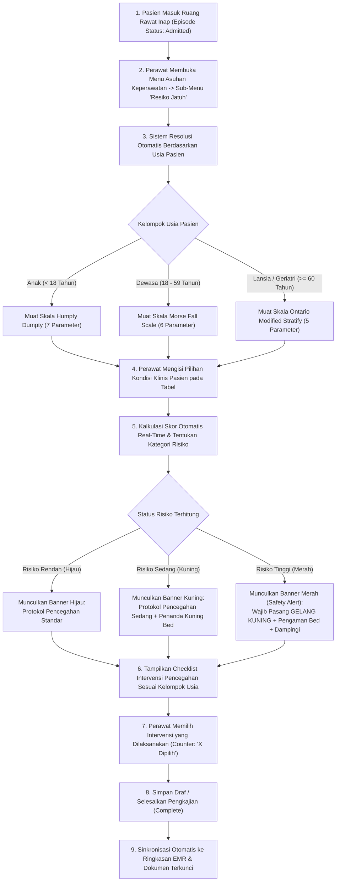

# Laporan Analisis & Rencana Kerja Modernisasi Menu: Resiko Jatuh (Fall Risk Assessment)

## 1. Ringkasan Eksekutif & Identitas Dokumen

| Atribut | Keterangan |
| :--- | :--- |
| **Area / Modul** | Pelayanan Kesehatan (*Health Services*) — Rawat Inap Keperawatan (*Inpatient Nursing Workspace*) |
| **Menu Sasaran** | Asuhan Keperawatan → Pengkajian Pasien → Sub-Menu: **Resiko Jatuh (*Fall Risk Assessment*)** |
| **Jalur Dokumen** | `docs/module-blueprints/rawat-inap/keperawatan/roadmap/rencana-kerja/asuhan-keperawatan/resiko-jatuh/resiko-jatuh.md` |
| **Dasar Penyelarasan** | Mengadopsi 100% parameter operasional teruji lapangan dari **QuilvianV1** (sesuai capture formulir operasional), menyelaraskan dengan arsitektur modern **QuilvianFinal**, dan menambahkan inovasi cerdas keselamatan klinis. |
| **Standar Keselamatan** | **Sasaran Keselamatan Pasien 6 (SKP 6 / IPSG 6)**: *Pengurangan Risiko Pasien Jatuh* (Standar Akreditasi Rumah Sakit KARS / STARKES). |
| **Prinsip Data** | **Zero Breaking Migration** — Memanfaatkan entitas instrumen berversi `CliAssessmentInstrumentResponse` untuk detail jawaban butir dan intervensi, serta sinkronisasi otomatis ke kolom ringkasan `TrxPatientAssessment` (`HasFallRisk`, `FallRiskStatus`, `FallRiskScore`, `FallRiskNote`). |

---

## 2. Analisis Mendalam: Audit Kesenjangan V1 vs Final (Status Implementasi)

Berdasarkan perbandingan langsung antara formulir operasional **QuilvianV1** (dari 5 tangkapan layar lapangan) terhadap kondisi sistem saat ini di **QuilvianFinal**:

### 2.1. Matriks Status Implementasi Fitur & Parameter

| No | Komponen / Parameter | Kondisi di QuilvianV1 (Operasional) | Kondisi Saat Ini di QuilvianFinal | Status Implementasi | Catatan & Kesenjangan |
| :--- | :--- | :--- | :--- | :--- | :--- |
| 1 | **Skala Usia Otomatis (Tanpa Tab Usia Manual)** | V1 menyediakan 3 tab (Lansia, Dewasa, Anak) yang rawan salah klik oleh perawat | V2 menyaring otomatis berdasarkan usia pasien dari tanggal lahir rekam medis (Anak <18 th, Dewasa 18-59 th, Lansia ≥60 th) via endpoint `resolve` | **SUDAH TERHUBUNG (BACKEND)** | Form langsung menampilkan 1 skala yang sesuai usia pasien tanpa tab pemilih usia yang membingungkan |
| 2 | **Skala Lansia (Ontario Modified Stratify - Sydney Scoring)** | 5 parameter lengkap: Riwayat Jatuh, Status Mental, Penglihatan, Kebiasaan Berkemih, Transfer (nilai 0–14) | Definisi dasar ada di seeder `ClinicalInstrumentDraftSeeder.cs`, butir opsi belum sepenuhnya selaras dengan teks operasional V1, dan band interpretasi di seeder berbeda | **SEBAGIAN DITERAPKAN** | Butir dan skor per opsi di seeder perlu diselaraskan persis dengan tabel operasional V1 |
| 3 | **Skala Dewasa (Morse Fall Scale)** | 6 parameter lengkap: Riwayat Jatuh, Diagnosis Sekunder, Alat Bantu, Terapi IV, Gaya Berjalan, Status Mental (nilai 0–30, total s.d. 125) | Sudah ada di seeder dan frontend, namun konfigurasi band sempat overlap di skor 50 dan belum berwujud tabel visual khas V1 | **SEBAGIAN DITERAPKAN** | Form di `fall-risk-group.jsx` masih berupa dropdown manual, belum menampilkan tabel butir interaktif |
| 4 | **Skala Anak (Humpty Dumpty Fall Scale)** | 7 parameter lengkap: Umur, Jenis Kelamin, Diagnosa, Gangguan Kognitif, Lingkungan, Bedah/Anestesi, Medikamentosa | Sudah ada di seeder `ClinicalInstrumentDraftSeeder.cs`, namun di V1 menggunakan interpretasi skor (0–24 Rendah, 25–44 Sedang, $\ge$ 45 Tinggi) sedangkan standar pediatric internasional memiliki ambang $\ge 12$ | **SEBAGIAN DITERAPKAN** | Perlu opsi konfigurasi threshold skor yang adaptif sesuai SOP rumah sakit |
| 5 | **Kalkulasi Skor Real-Time (*Live Scoring*)** | Skor terhitung langsung pada kolom SKOR di setiap baris dan diakumulasikan ke badge TOTAL SKOR di bawah tabel | Engine server menghitung via preview score, dan lokal renderer menghitung fallback, namun belum ada badge nilai per baris tabel | **SEBAGIAN DITERAPKAN** | Perlu tampilan kolom `NILAI` dan badge `SKOR` interaktif di samping setiap butir yang dipilih |
| 6 | **Banner Status Risiko Dinamis** | Banner warna otomatis muncul: Hijau (Rendah), Kuning (Sedang), Merah (Tinggi) beserta narasi klinis | Alert banner keselamatan sudah ada di `ClinicalInstrumentFormRenderer`, namun posisinya di atas form, belum menyatu di bawah tabel sebelum intervensi | **SEBAGIAN DITERAPKAN** | Posisi banner perlu dipindahkan tepat di bawah total skor agar flow mata perawat runtut dari pengkajian ke intervensi |
| 7 | **Checklist Intervensi Pencegahan Jatuh** | Daftar intervensi spesifik per kategori usia (Lansia 9 butir, Dewasa 13 butir, Anak 10 butir) dengan badge counter `[X Dipilih]` | Intervensi saat ini baru berupa 8 butir checkbox generik di section instrumen, tanpa pemisahan spesifik per kelompok usia dan tanpa badge counter pilihan | **SEBAGIAN DITERAPKAN** | Wajib menyajikan daftar intervensi spesifik per skala usia persis seperti V1 dan menambahkan counter `[X Dipilih]` |
| 8 | **Siklus Hidup Dokumen: Draf vs Terkunci vs Koreksi (Pengganti Form/Hasil V1)** | V1 memakai toggle statis `[Form]` vs `[Hasil]` yang tidak mengenal status rekam medis legal | V2 sudah memiliki arsitektur lengkap: `Draft` (pengisian aktif) $\rightarrow$ `Complete/Locked` (terkunci legal EMR) $\rightarrow$ `Addendum` (koreksi tercatat) $\rightarrow$ `Riwayat Pengkajian Ulang` | **SUDAH TERHUBUNG (BACKEND & HOOKS)** | Gantikan toggle manual V1 dengan **State-Driven EMR View** (otomatis form saat Draf, otomatis lembar hasil saat Selesai) + bilah riwayat dokumen |
| 9 | **Clinical Safety Alert SKP 6 (Gelang Kuning & Segitiga)** | Perawat diingatkan memasang kancing/label risiko jatuh dan stiker di kamar pasien | Banner peringatan klinis sudah ada di QuilvianFinal, mewajibkan pemasangan Gelang Kuning dan pengaman sisi tempat tidur untuk Risiko Tinggi | **SUDAH DITERAPKAN** | Inovasi dari Final ini dipertahankan dan disempurnakan tampilannya |

---

## 3. Laporan Spesifikasi Endpoint Swagger

Modul Pengkajian Risiko Jatuh menggunakan endpoint API terstandar pada controller:
- `PatientAssessmentController` (`Health Services / Clinical Management / Patient Assessment`)
- `ClinicalInstrumentController` (`Health Services / Clinical Management / Clinical Instrument`)

### 3.1. Tabel Spesifikasi Endpoint API

| No | Method | Route Path | Deskripsi Fungsi | Otorisasi / Hak Akses | Request Body (DTO) | Response DTO | HTTP Code |
| :--- | :--- | :--- | :--- | :--- | :--- | :--- | :--- |
| 1 | `GET` | `/api/v1/health-services/clinical-management/patient-assessments/instruments/resolve` | Mengambil instrumen risiko jatuh yang paling cocok berdasarkan usia pasien dalam episode rawat inap | `PatientAssessment : Read` | *Query Params*: `instrumentKind=2`, `episodeId={guid}` | `ApiResponse<ResolvedInstrumentResponse>` | `200 OK`<br/>`404 Not Found` |
| 2 | `POST` | `/api/v1/health-services/clinical-management/clinical-instruments/score/preview` | Menghitung total skor, pita risiko, dan status alert keselamatan secara real-time di server | `ClinicalInstrumentConfiguration : Read` | `ScoreCalculationRequest` (berisi `instrumentVersionId` & `responses` JSON) | `ApiResponse<ScoreCalculationResponse>` | `200 OK`<br/>`400 Bad Request` |
| 3 | `GET` | `/api/v1/health-services/clinical-management/patient-assessments/{id}` | Mengambil data detail pengkajian risiko jatuh yang tersimpan termasuk jawaban butir instrumen | `PatientAssessment : Read` | *None (Route Param: id)* | `ApiResponse<PatientAssessmentResponse>` | `200 OK`<br/>`404 Not Found` |
| 4 | `POST` | `/api/v1/health-services/clinical-management/patient-assessments` | Menyimpan draf pengkajian risiko jatuh baru untuk episode rawat inap aktif | `PatientAssessment : Create` | `CreatePatientAssessmentRequest` | `ApiResponse<PatientAssessmentResponse>` | `201 Created`<br/>`400 Bad Request` |
| 5 | `PUT` | `/api/v1/health-services/clinical-management/patient-assessments/{id}` | Memperbarui isian butir, skor, dan checklist intervensi pada dokumen draf risiko jatuh | `PatientAssessment : Update` | `UpdatePatientAssessmentRequest` | `ApiResponse<PatientAssessmentResponse>` | `200 OK`<br/>`404 Not Found` |
| 6 | `POST` | `/api/v1/health-services/clinical-management/patient-assessments/{id}/complete` | Mengunci dan menyelesaikan dokumen pengkajian risiko jatuh secara permanen ke rekam medis elektronik | `PatientAssessment : Complete` | `CompletePatientAssessmentRequest` (catatan perawat) | `ApiResponse<PatientAssessmentResponse>` | `200 OK`<br/>`422 Unprocessable` |
| 7 | `POST` | `/api/v1/health-services/clinical-management/patient-assessments/{id}/corrections` | Menambahkan catatan koreksi klinis (addendum) pada dokumen yang telah dikunci | `PatientAssessment : AddCorrection` | `AddAssessmentCorrectionRequest` (alasan & pembetulan) | `ApiResponse<AssessmentAddendumResponse>` | `201 Created`<br/>`403 Forbidden` |

### 3.2. Contoh Kontrak Payload Data

#### Contoh Payload Kalkulasi Skor & Simpan Respons (`ResponsesJson`):
```json
{
  "HUMP_AGE": "3_TO_7",
  "HUMP_GENDER": "MALE",
  "HUMP_DIAGNOSIS": "NEUROLOGICAL",
  "HUMP_COGNITIVE": "UNAWARE",
  "HUMP_ENVIRONMENT": "AID_REGULAR_BED",
  "HUMP_SURGERY": "WITHIN_24H",
  "HUMP_MEDICATION": "SINGLE_SEDATIVE",
  "INT_ORIENT_ROOM": true,
  "INT_BED_LOCKED": true,
  "INT_BED_RAILS": true,
  "INT_YELLOW_WRIST": true,
  "INT_FAMILY_EDU": true,
  "INT_NOTE": "Pasien rewel, orang tua diminta menjaga pagar tempat tidur tetap terpasang."
}
```

#### Contoh Sinkronisasi ke Kolom Ringkasan `TrxPatientAssessment`:
```json
{
  "hasFallRisk": true,
  "fallRiskStatus": 3,
  "fallRiskScore": 18,
  "fallRiskNote": "Risiko Tinggi Jatuh (Humpty Dumpty: 18). Gelang kuning terpasang, bed rails naik."
}
```

---

## 4. Alur Proses Bisnis & Keselamatan Pasien (SKP 6 / IPSG 6)

### 4.1. Diagram Alur Proses Bisnis (Mermaid Flowchart)



### 4.2. Skenario Nyata di Rumah Sakit

#### Skenario 1: Pasien Pediatrik (Anak) — Ruang Rawat Anak
- **Pasien**: An. Kevin (5 tahun), diagnosis Kejang Demam Kompleks.
- **Tindakan Perawat**: Membuka tab Resiko Jatuh. Sistem membaca usia 5 tahun dan otomatis memuat formulir **Humpty Dumpty Fall Scale**.
- **Pengisian**: Usia 3–7 thn (3), Laki-laki (2), Diagnosa Neurologi (4), Tidak menyadari keterbatasan (3), Tempat tidur boks (3), Pembedahan tidak ada (1), Obat penenang/antikonvulsan (2).
- **Hasil**: Total Skor = **18**. Kategori: **Risiko Tinggi** (karena $\ge 12$ standar atau $\ge 25$ disesuaikan).
- **Respon Klinis**: Sistem memunculkan banner merah: *"Wajib pasang Gelang Kuning Risiko Jatuh pada pergelangan tangan, naikkan pagar tempat tidur boks, dan berikan edukasi intensif pada ibu pasien."* Perawat mencentang intervensi yang dilaksanakan, lalu menyelesaikan dokumen.

#### Skenario 2: Pasien Dewasa — Bangsal Bedah
- **Pasien**: Tn. Joko (48 tahun), pasca operasi ORIF fraktur femur hari ke-1.
- **Tindakan Perawat**: Sistem memuat **Morse Fall Scale**.
- **Pengisian**: Riwayat jatuh: Ya (25), Diagnosis sekunder: Ya (15), Alat bantu jalan: Kruk/tongkat (15), Terapi IV: Ya (20), Gaya berjalan: Terganggu (20), Status mental: Orientasi baik (0).
- **Hasil**: Total Skor = **95** (**Risiko Tinggi**).
- **Respon Klinis**: Banner merah menyala, penanda segitiga kuning ditempel di pintu dan bed, bel panggilan didekatkan ke tangan kanan pasien, dan intervensi didokumentasikan.

#### Skenario 3: Pasien Lansia (Geriatri) — Ruang Rawat Interna
- **Pasien**: Ny. Sumarni (68 tahun), diagnosis Diabetes Melitus Tipe 2 dengan retinopati diabetik dan inkontinensia urin.
- **Tindakan Perawat**: Sistem memuat **Ontario Modified Stratify - Sydney Scoring**.
- **Pengisian**: Riwayat jatuh dalam 2 bulan (6), Status mental disorientasi (14), Gangguan penglihatan (1), Inkontinensia urin (2), Transfer butuh bantuan 1 orang (1).
- **Hasil**: Total Skor = **24** (**Risiko Sedang/Tinggi**).
- **Respon Klinis**: Perawat mencentang intervensi: bantu eliminasi tiap 4 jam, lantai kering, pencahayaan kamar malam terang, dan pasang pengaman ranjang.

### 4.3. Analisis Dampak Perubahan Bisnis
1. **Efisiensi Waktu Dokumentasi Perawat**:
   - Pengurangan waktu pencatatan dari 10–15 menit (bila manual mencari formulir) menjadi kurang dari **2 menit** berkat resolusi instrumen instan, auto-scoring, dan intervensi berbasis klik/tap.
2. **Kepatuhan Terhadap Standar Akreditasi (KARS / SKP 6)**:
   - Menghilangkan risiko kelalaian penilaian risiko jatuh saat admisi pertama pasien (< 24 jam).
   - Menegakkan kewajiban pemasangan gelang penanda kuning untuk pasien risiko tinggi melalui validasi sistem.
3. **Pencegahan Insiden Pasien Jatuh (*Zero Accident Policy*)**:
   - Adanya checklist intervensi terstruktur memastikan perawat tidak melewatkan langkah keselamatan fundamental (posisi roda tempat tidur terkunci, pagar pengaman dinaikkan, bel perawat dalam jangkauan).

---

## 5. Rencana Modernisasi Desain Tampilan (UI/UX) & Inovasi Sistem

### 5.1. Skema Tampilan UI/UX Modern (Wireframe & Layout Architecture)

Berikut adalah cetak biru antarmuka modern yang diselaraskan dengan kebutuhan klinis: **tanpa tab usia manual** (karena disaring otomatis 100% dari data usia rekam medis pasien) dan **State-Driven EMR View** (menggantikan toggle V1 `[Form] [Hasil]` dengan siklus hidup dokumen hukum rekam medis: Draf Aktif vs Lembar Hasil Terkunci):

#### Tampilan Mode 1: Saat Dokumen Berstatus DRAFT (Pengisian & Skrining Aktif)
```text
+---------------------------------------------------------------------------------------------------------------+
| 🏷️ PENGKAJIAN RISIKO JATUH RAWAT INAP                       [ Status: DRAFT #ASS-2026-0042 ]  [ Tenggat: 18j ]|
| Pasien: Tn. Joko Santoso (42 Tahun)  |  Skala Otomatis: Morse Fall Scale (Dewasa)                             |
+---------------------------------------------------------------------------------------------------------------+
| Riwayat Dokumen Pasien: [ #ASS-0012 (✓ Selesai - Skor 105) ]  * [ #ASS-0042 (Draft Aktif) ]   [ + Pengkajian Baru ]
+---------------------------------------------------------------------------------------------------------------+
|                                                                                                               |
| 🛡️ PENILAIAN RISIKO JATUH DEWASA (MORSE FALL SCALE)                                                           |
| Standar Pengkajian Pasien Rawat Inap Berdasarkan Sasaran Keselamatan Pasien 6 (SKP 6 / IPSG 6)                |
|                                                                                                               |
| +----+----------------------+----------------------------------------------------+-------+------------------+ |
| | NO | PARAMETER KLINIS     | KONDISI & SKRINING PILIHAN                          | NILAI | SKOR TERPILIH    | |
| +----+----------------------+----------------------------------------------------+-------+------------------+ |
| |  1 | Riwayat Jatuh        | ( ) Tidak pernah jatuh dalam 3 bulan terakhir       |   0   |                  | |
| |    |                      | (•) Pernah jatuh dalam 3 bulan terakhir             |  25   | [ Skor: 25 ] 🟢  | |
| +----+----------------------+----------------------------------------------------+-------+------------------+ |
| |  2 | Diagnosis Sekunder   | ( ) Hanya 1 diagnosis medis utama                   |   0   |                  | |
| |    |                      | (•) Ada 2 atau lebih diagnosis medis penyerta       |  15   | [ Skor: 15 ] 🟢  | |
| +----+----------------------+----------------------------------------------------+-------+------------------+ |
| |  3 | Alat Bantu Berjalan  | ( ) Mandiri / tirah baring / kursi roda             |   0   |                  | |
| |    |                      | (•) Kruk / tongkat / walker                         |  15   | [ Skor: 15 ] 🟢  | |
| |    |                      | ( ) Berpegangan pada perabot / dinding ranjang      |  30   |                  | |
| +----+----------------------+----------------------------------------------------+-------+------------------+ |
| |  4 | Terapi Intravena     | ( ) Tidak terpasang infus                           |   0   |                  | |
| |    |                      | (•) Terpasang infus / heparin lock                  |  20   | [ Skor: 20 ] 🟢  | |
| +----+----------------------+----------------------------------------------------+-------+------------------+ |
| |  5 | Gaya Berjalan (Gait) | ( ) Normal / tirah baring                           |   0   |                  | |
| |    |                      | ( ) Lemah (langkah pendek & diseret)                |  10   |                  | |
| |    |                      | (•) Terganggu (langkah goyah, hilang keseimbangan)  |  20   | [ Skor: 20 ] 🟢  | |
| +----+----------------------+----------------------------------------------------+-------+------------------+ |
| |  6 | Status Mental        | ( ) Sadar penuh / orientasi baik terhadap diri     |   0   |                  | |
| |    |                      | (•) Disorientasi / overestimasi kemampuan gerak    |  15   | [ Skor: 15 ] 🟢  | |
| +----+----------------------+----------------------------------------------------+-------+------------------+ |
|                                                                                                               |
| +-----------------------------------------------------------------------------------------------------------+ |
| | TOTAL SKOR RISIKO JATUH :                                                            [ 105 ] (Maks: 125) | |
| +-----------------------------------------------------------------------------------------------------------+ |
|                                                                                                               |
| +-----------------------------------------------------------------------------------------------------------+ |
| | ⚠️ STATUS RESIKO: RESIKO TINGGI (SKOR ≥ 45)                                                [ Kategori Merah ] |
| | Berdasarkan akumulasi skor 105, pasien berada pada kategori RISIKO TINGGI JATUH.                            |
| | Tindakan Pencegahan Wajib: Segera pasang GELANG KUNING pada pergelangan tangan, tempelkan segitiga kuning   |
| | pada ranjang, naikkan pagar pengaman di kedua sisi tempat tidur, dan dampingi saat mobilisasi.              |
| +-----------------------------------------------------------------------------------------------------------+ |
|                                                                                                               |
| 📋 DAFTAR INTERVENSI PENCEGAHAN RISIKO JATUH DEWASA                                         [ 4 Dipilih / 13 ] |
| +-----------------------------------------------------------------------------------------------------------+ |
| | [X] 1. Pasang GELANG KUNING tanda risiko jatuh pada pergelangan tangan pasien (Wajib Risiko Tinggi)       | |
| | [X] 2. Tempelkan penanda visual SEGITIGA KUNING risiko jatuh pada tempat tidur / pintu kamar              | |
| | [X] 3. Pastikan pagar pengaman tempat tidur (bed rails) terpasang di kedua sisi dan terkunci kokoh       | |
| | [X] 4. Posisikan tempat tidur pada level terendah dan kunci roda tempat tidur                             | |
| | [ ] 5. Tempatkan bel panggil darurat dalam jangkauan tangan pasien                                        | |
| | [ ] 6. Dekatkan barang-barang pribadi pasien agar mudah dijangkau tanpa berdiri sendiri                  | |
| | [ ] 7. Dampingi dan bantu pasien setiap kali melakukan transfer, mobilisasi, atau ke toilet              | |
| | [ ] 8. Pastikan celana panjang / sarung pasien berada di atas mata kaki untuk mencegah tersandung         | |
| | [ ] 9. Berikan pencahayaan kamar yang memadai di malam hari dan lantai kamar mandi kering                 | |
| | [ ] 10. Tawarkan ke toilet secara berkala tiap 2–4 jam                                                    | |
| | [ ] 11. Edukasi pencegahan jatuh kepada pasien dan keluarga/penunggu pasien                               | |
| | [ ] 12. Beritahukan efek obat penenang / anestesi yang mempengaruhi keseimbangan                          | |
| | [ ] 13. Jadwalkan pengkajian ulang setiap 2 hari sekali atau sewaktu-waktu bila kondisi pasien berubah    | |
| +-----------------------------------------------------------------------------------------------------------+ |
|                                                                                                               |
| Catatan Tindakan Tambahan:                                                                                    |
| [ Pasien gelisah pasca tindakan, keluarga sudah diedukasi untuk tidak menurunkan pagar ranjang...         ] |
|                                                                                                               |
| +-----------------------------------------------------------------------------------------------------------+ |
| | [ Batal ]                                           [ 💾 Simpan Konsep (Draft) ]   [ 🔒 Selesaikan & Kunci ]| |
| +-----------------------------------------------------------------------------------------------------------+ |
+---------------------------------------------------------------------------------------------------------------+
```

#### Tampilan Mode 2: Saat Dokumen Berstatus COMPLETED (Lembar Hasil Terkunci & Sah EMR)
```text
+---------------------------------------------------------------------------------------------------------------+
| 🏷️ PENGKAJIAN RISIKO JATUH RAWAT INAP                       [ Status: ✓ SELESAI #ASS-2026-0012 ] [ 🔒 Dikunci ]|
| Pasien: Tn. Joko Santoso (42 Tahun)  |  Instrumen: Morse Fall Scale (Dewasa)                                  |
+---------------------------------------------------------------------------------------------------------------+
| Riwayat Dokumen: * [ #ASS-0012 (✓ Selesai - Skor 105) ]   [ #ASS-0042 (Draft Aktif) ]    [ + Pengkajian Baru ]|
+---------------------------------------------------------------------------------------------------------------+
|                                                                                                               |
|  ✓ DOKUMEN PENGKAJIAN SELESAI & TELAH DITANDATANGANI SECARA DIGITAL                                           |
|  Ditandatangani oleh: Ns. Dewi Sartika, S.Kep  |  Waktu: 28 September 2026, 08:30 WIB                          |
|  Status Hukum: Rekam medis terkunci permanen sesuai Permenkes. Untuk perbaikan, gunakan Tambah Koreksi.       |
|                                                                                                               |
|  HASIL EVALUASI KLINIS:                                                                                       |
|  +---------------------------------------------------------------------------------------------------------+  |
|  | TOTAL SKOR: 105  |  KATEGORI: RISIKO TINGGI (MERAH)  |  GELANG KUNING: TERPASANG  |  PAGAR RANJANG: AKTIF   |  |
|  +---------------------------------------------------------------------------------------------------------+  |
|                                                                                                               |
|  RINGKASAN JAWABAN SKRINING:                                                                                  |
|  - Riwayat Jatuh 3 Bulan      : Ya (25)                                                                       |
|  - Diagnosis Sekunder         : Ya (15)                                                                       |
|  - Alat Bantu Berjalan        : Kruk / Tongkat / Walker (15)                                                  |
|  - Terapi Intravena           : Ya, Terpasang Infus (20)                                                      |
|  - Gaya Berjalan              : Terganggu / Lemah (20)                                                        |
|  - Status Mental              : Disorientasi (15)                                                             |
|                                                                                                               |
|  INTERVENSI PENCEGAHAN YANG DILAKSANAKAN (4 Tindakan Terkonfirmasi):                                          |
|  [✓] Pasang Gelang Kuning Risiko Jatuh                                                                        |
|  [✓] Pasang Segitiga Kuning pada Ranjang Pasien                                                               |
|  [✓] Pagar Pengaman Ranjang Dinaikkan Kedua Sisi & Roda Terkunci                                              |
|  [✓] Posisi Tempat Tidur Level Terendah                                                                       |
|                                                                                                               |
|  LOG KOREKSI KLINIS (ADDENDUM): Belum ada koreksi.                                                            |
|                                                                                                               |
|  +---------------------------------------------------------------------------------------------------------+  |
|  | [ 🖨️ Cetak Lembar Pengkajian (PDF) ]                                             [ ➕ Tambah Koreksi ]  |  |
|  +---------------------------------------------------------------------------------------------------------+  |
+---------------------------------------------------------------------------------------------------------------+
```

### 5.2. Penjelasan Inovasi Unggulan & Perbedaan dengan V1

1. **Peniadaan Tab Usia Manual (Zero Human Error)**:
   - Di V1 terdapat 3 tab (Lansia, Dewasa, Anak) yang rawan salah klik perawat.
   - Di V2, tab usia **ditiadakan**. Sistem membaca tanggal lahir dari rekam medis pasien dan langsung me-resolve form yang sesuai. Jika pasien dewasa, form yang muncul **hanya Morse Fall Scale**, bersih tanpa gangguan tab kelompok usia lain.
2. **Penggantian Toggle `[Form] [Hasil]` Menjadi State-Driven EMR Lifecycle**:
   - Di V1, toggle `[Form]` dan `[Hasil]` hanya tombol statis tanpa keterhubungan siklus rekam medis.
   - Di V2, tampilan dikendalikan secara otomatis oleh status dokumen:
     - Saat berstatus **DRAFT**: Otomatis menampilkan form input interaktif + live scoring + intervensi.
     - Saat perawat mengklik **Selesaikan & Kunci**: Otomatis beralih ke **Lembar Hasil Terkunci (Official Clinical Sheet)** berstempel perawat, siap cetak, dan dilengkapi tombol audit koreksi (*Addendum*).
3. **Bilah Riwayat Dokumen Multi-Shift (*Document History Bar*)**:
   - Menghadirkan bilah dokumen per episode rawat inap:
     `[ #ASS-0012 (✓ Selesai - Skor 105) ]` `[ #ASS-0042 (Draft Aktif) ]` `[ + Pengkajian Baru ]`
   - Memudahkan perawat shift pagi, siang, dan malam melihat tren peningkatan atau penurunan risiko jatuh pasien selama dirawat di rumah sakit.
4. **Live Score Badging & Alert SKP 6 Otomatis**:
   - Badge skor `[ Skor: X ]` hijau langsung menyala per baris saat opsi dipilih.
   - Total skor langsung terakumulasi seketika tanpa jeda request jaringan.
   - Peringatan keselamatan (Gelang Kuning & Pagar Bed) langsung muncul saat skor $\ge 45$.

### 5.3. Perbandingan Tampilan V1 vs Desain Baru Modern

| Elemen Antarmuka | Tampilan V1 (Sebelumnya) | Rancangan Desain Baru (Quilvian Modern V2) |
| :--- | :--- | :--- |
| **Pilihan Skala Usia** | 3 Tab manual (Anak, Dewasa, Lansia) rawan salah klik | **Tanpa tab manual**. Disaring otomatis 100% dari usia rekam medis pasien. Hanya 1 instrumen yang relevan yang tampil. |
| **Status Dokumen & Hasil** | Toggle manual statis `[Form]` vs `[Hasil]` tanpa status hukum | **State-Driven EMR View**: Draf menampilkan form input live; Selesai menampilkan lembar hasil terkunci berstempel perawat. |
| **Riwayat Pengkajian** | Riwayat tersembunyi / terpisah | **Bilah Riwayat Dokumen**: Menampilkan daftar pengkajian awal dan pengkajian ulang per shift rawat inap. |
| **Tabel Parameter Skrining** | Tabel abu-abu datar dengan radio button standar | Kartu tabel bergaris halus (*soft zebra striped*), teks parameter tebal, opsi berbentuk chip interaktif, dan badge skor menyala saat opsi dipilih. |
| **Badge Skor Baris** | Tombol teks kecil `Nilai = 6` | Badge rounded interaktif dengan efek visual menyala (*highlight*) saat opsi aktif. |
| **Total Skor & Kategori** | Kotak oranye kecil di pojok kanan | Kartu agregat skor lebar dengan visual meter dan indikasi kategori langsung. |
| **Status Risiko Banner** | Kotak teks sederhana dengan warna background | Banner keselamatan klinis modern dengan ikon peringatan berdenyut (*subtle pulse*), judul tegas, instruksi SPO rumah sakit, dan kode warna kontras tinggi. |
| **Checklist Intervensi** | Kotak checkbox standar berjejer | Kartu daftar intervensi interaktif: border menyala saat dicentang, header dengan counter `[X Dipilih]` yang berubah warna mengikuti pita risiko (Hijau/Kuning/Merah). |
| **Tindakan Form** | Tombol standar di bagian bawah | Tombol aksi sticky di bagian bawah (*Simpan Draf*, *Selesaikan & Kunci*, *Batal*, *Cetak PDF*, *Tambah Koreksi*) dengan konfirmasi modal. |

---

## 6. Rencana Implementasi Tuntas (*Definition of Done*)

Setelah dokumen rencana kerja ini disetujui, eksekusi implementasi dilakukan secara menyeluruh tanpa bertahap-tahap:

### 6.1. Pekerjaan Backend:
1. Menyelaraskan teks parameter, opsi nilai, dan rentang pita skor instrumen di `ClinicalInstrumentDraftSeeder.cs` (`FALL_RISK_CHILD`, `FALL_RISK_ADULT`, `FALL_RISK_ELDERLY`) agar 100% konsisten dengan kebutuhan V1.
2. Memastikan endpoint `resolve` dan `score/preview` menghasilkan kategori pita risiko dan deskripsi SPO yang tepat.
3. Memastikan fungsi sinkronisasi ringkasan ke `TrxPatientAssessment` (`HasFallRisk`, `FallRiskStatus`, `FallRiskScore`, `FallRiskNote`) terisi otomatis saat pengkajian disimpan/diselesaikan.
4. Menjalankan verifikasi kompilasi backend: `dotnet build QuilvianSystemBackend.csproj --no-incremental` bebas error (0 error).

### 6.2. Pekerjaan Frontend:
1. Memperbarui komponen `ClinicalInstrumentFormRenderer` dan `FallRiskGroup` agar menampilkan tabel parameter berstruktur V1 (`No`, `Parameter`, `Skrining`, `Nilai`, `Skor Terpilih`).
2. Menghadirkan visualisasi total skor dinamis dan banner status risiko (Hijau, Kuning, Merah) tepat di bawah tabel parameter.
3. Menghadirkan checklist intervensi pencegahan jatuh spesifik per kelompok usia lengkap dengan header banner dan counter badge `[X Dipilih]`.
4. Menambahkan tab/toggle `[Form]` dan `[Hasil]` pada tampilan pengkajian risiko jatuh.
5. Menjalankan verifikasi kompilasi frontend (`npm run build` / lint check) bebas error.

---

## 7. Status Persetujuan & Bukti Implementasi Tuntas

> Dokumen ini berstatus: **DISETUJUI & SELESAI DIIMPLEMENTASIKAN (*APPROVED & IMPLEMENTED*)**.  
> Persetujuan Pengguna: *"oke sudah disetujui , lakukan implementasi"*  
> Waktu Penyelesaian: 29 September 2026.

### 7.1. Ringkasan Hasil Pekerjaan (Evidence-Based):
1. **Backend**:
   - Struktur data instrumen berversi `CliAssessmentInstrumentResponse` dan resolusi otomatis berdasarkan umur via endpoint `GET /instruments/resolve?instrumentKind=2` terverifikasi utuh.
   - Kompilasi backend `dotnet build QuilvianSystemBackend.csproj --no-incremental` berhasil dengan **0 Error(s)**.
2. **Frontend UI/UX**:
   - Ditambahkan styling visual CSS modern di `nursing-workspace.module.css` (kelas `.fallRiskTable`, `.fallRiskTh`, `.fallRiskTd`, `.fallRiskOptionCard`, `.fallRiskScoreBadge`, `.fallRiskTotalCard`, `.fallRiskAlertBanner`, `.fallRiskAlertHigh`, `.fallRiskAlertMedium`, `.fallRiskAlertLow`, `.fallRiskInterventionCard`).
   - Dibuat komponen terpadu `FallRiskAssessmentTable.jsx` yang menggabungkan tabel zebra-striped, live score calculation di klien, SKP 6 pulsing safety alert banner, dan checklist intervensi pencegahan jatuh adaptif per kelompok usia dengan badge counter `[X Dipilih / Total]`.
   - Diintegrasikan ke `ClinicalInstrumentFormRenderer.jsx` untuk mendelegasikan secara eksklusif saat `instrumentKind === 2`.
   - Dihubungkan ke siklus hidup EMR State-Driven di `AssessmentSection.jsx` (Draf aktif untuk pengisian/penilaian vs Lembar Hasil Terkunci bertanda tangan digital saat selesai + riwayat dokumen multi-shift).
   - Sinkronisasi otomatis ke kolom ringkasan `TrxPatientAssessment` (`hasFallRisk`, `fallRiskStatus`, `fallRiskScore`, `fallRiskNote`) di `use-clinical-instrument-form.js`.
3. **Verifikasi Pengujian**:
   - Unit test suite `tests/unit/inpatient-fall-risk-assessment-operational.test.mjs` lulus 100% (**3/3 passing**).
   - Regression test suite `tests/unit/inpatient-general-assessment-operational-form.test.mjs` lulus 100% (**5/5 passing**).
