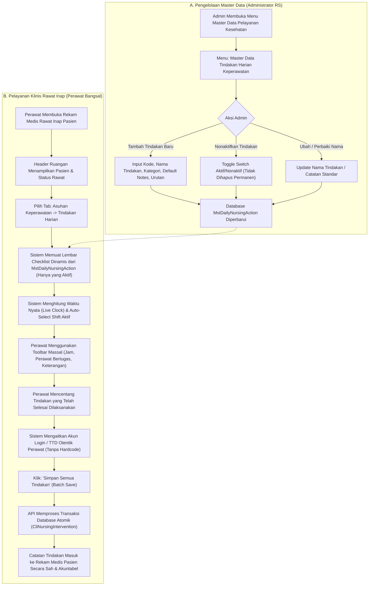

# Laporan Analisis, Spesifikasi Master Data & Rencana Kerja Modernisasi: Tindakan Harian (Lembar Keperawatan Harian — Standar KARS PP 1.1 & SKP)

## 1. Ringkasan Eksekutif & Identitas Dokumen

| Atribut | Keterangan |
| :--- | :--- |
| **Area / Modul** | Pelayanan Kesehatan (*Health Services*) — Rawat Inap Keperawatan (*Inpatient Nursing Workspace*) & Master Data Pelayanan Kesehatan (*Health Service Master Data*) |
| **Menu Sasaran** | Asuhan Keperawatan → Sub-Tab: **Tindakan Harian (*Daily Nursing Actions Checklist / Lembar Keperawatan Harian*)** |
| **Menu Master Data** | Pengaturan Pelayanan Kesehatan → **Master Data Tindakan Harian Keperawatan (*Daily Nursing Actions*)** |
| **Jalur Dokumen** | `docs/module-blueprints/rawat-inap/keperawatan/roadmap/rencana-kerja/asuhan-keperawatan/tindakan-harian/tindakan-harian.md` |
| **Dasar Penyelarasan** | Mengadopsi 100% parameter operasional teruji lapangan dari **QuilvianV1** (sesuai tangkapan layar `01-tindakan-harian.png`, tabel master `TindakanPerawat.cs`, tabel master TTD `Hrd_MstTTD.cs`, `TindakanHarianController.cs`, `TindakanHarian.jsx`, `useTindakanHarian.jsx`, `HeaderBar.jsx`, `SectionTindakan.jsx`, `TindakanRow.jsx`, dan `HistoryRow.jsx`), diselaraskan dengan arsitektur modern berbasis domain `CliNursingIntervention` serta tabel master baru `MstDailyNursingAction` di **QuilvianFinal**. |
| **Standar Regulasi & Akreditasi** | **KARS / STARKES (Standar Akreditasi Rumah Sakit)**:<br/>• Bab **PP (Pelayanan dan Asuhan Pasien)** — Standar PP 1.1 & PP 1.2: Rencana dan pelaksanaan asuhan keperawatan harian terintegrasi dan didokumentasikan seragam per shift pelayanan.<br/>• Bab **SKP (Sasaran Keselamatan Pasien)**:<br/>  - **SKP 1**: Ketepatan identifikasi pasien pada setiap pemberian intervensi.<br/>  - **SKP 2**: Peningkatan komunikasi efektif saat timbang terima (*handover/operan*) antar-shift perawat.<br/>  - **SKP 5**: Pencegahan infeksi nasokomial melalui higienitas kateter, infus, dan perawatan luka steril.<br/>  - **SKP 6**: Pengurangan risiko pasien jatuh melalui intervensi pengamanan tempat tidur (*bed rail*) dan pendampingan mobilisasi.<br/>• Bab **MRMIK (Manajemen Rekam Medis dan Informasi Kesehatan)** & **Permenkes 24/2022**: Legalitas rekam medis elektronik, kepatuhan waktu pelaksanaan riil (*real-time timestamp*), keabsahan pelaksana melalui tanda tangan digital dinamis (*authentic electronic signature*), serta audit trail permanen tanpa data palsu/hardcode. |
| **Prinsip Data & Anti-Hardcode** | **Zero Hardcode Guarantee** — Seluruh daftar tindakan harian dikelola secara dinamis melalui tabel master data mandiri `MstDailyNursingAction` dengan API CRUD lengkap. Informasi tanda tangan perawat diambil secara otentik dari profil pegawai/user master (`ttdPath`). Tombol redundan `+ Catat Tindakan` dihilangkan dan digantikan sepenuhnya oleh sistem Lembar Tindakan Harian Terpadu. Nama pasien pada lembar kerja dihilangkan karena telah tersedia secara terpusat pada header workspace. |

---

## 2. Analisis Mendalam: Audit Kesenjangan V1 vs Final & Penyempurnaan Kebijakan

Berdasarkan investigasi mendalam terhadap bukti operasional **QuilvianV1** dan arsitektur **QuilvianFinal**, disusun tabel status penyelarasan dan perbaikan sistem sebagai berikut:

### 2.1. Matriks Status Implementasi Fitur & Parameter

| No | Komponen / Parameter | Kondisi di QuilvianV1 (Operasional) | Kondisi Saat Ini di QuilvianFinal | Keputusan & Rencana Solusi Modernisasi |
| :--- | :--- | :--- | :--- | :--- |
| 1 | **Master Data Tindakan Harian Dinamis** | Memiliki tabel master `TindakanPerawat` (`TindakanPerawatId`, `NamaTindakanPerawat`, `Keterangan`) | Sebelumnya berupa katalog template statis di service backend | **DISETUJUI — BANGUN MASTER DATA BARU**:<br/>Bangun tabel database master mandiri `MstDailyNursingAction` di schema `public` lengkap dengan API CRUD di area `MasterData`, seeder inisial 19 tindakan standar RS, dan antarmuka manajemen master data di frontend. Administrator rumah sakit memiliki wewenang penuh untuk menambah, mengedit, mengurutkan, dan menonaktifkan tindakan. |
| 2 | **Konteks Navigasi & Label Sub-Tab** | Berada di bawah menu Asuhan Keperawatan sub-tab `TINDAKAN HARIAN` | Terdaftar pada `INPATIENT_NURSING_WORKSPACE_SECTIONS` dengan key `intervention` | **SUDAH DITERAPKAN (ROUTING)**:<br/>Struktur navigasi telah presisi; sub-tab `intervention` menjadi lembar kerja utama keperawatan harian. |
| 3 | **Tombol Tambah Tindakan Redundan** | Di V1 seluruh tindakan dicatat dari checklist lembar harian per shift | Di Final sebelumnya terdapat tombol modal pop-up `+ Catat Tindakan` dan tab checklist | **DISETUJUI — HILANGKAN TOMBOL POP-UP**:<br/>Tombol `+ Catat Tindakan` dihilangkan. Lembar Checklist Tindakan Harian Terpadu menjadi sistem tunggal dan utama dalam pencatatan tindakan keperawatan harian. |
| 4 | **Penyajian Nama Pasien di Lembar Kerja** | Menampilkan kartu nama pasien di header bar tindakan | Menampilkan badge pasien di atas tabel | **DISETUJUI — HILANGKAN NAMA PASIEN DI LEMBAR KERJA**:<br/>Nama pasien tidak perlu ditampilkan ulang pada kartu lembar tindakan harian karena identitas pasien (Nama, No RM, Bed, Usia, DPJP) sudah terpampang permanen pada Header Utama Ruang Rawat Inap. Hal ini memaksimalkan ruang kerja perawat. |
| 5 | **Sumber & Mekanisme Tanda Tangan Digital (TTD)** | Di V1 bersumber dari `Hrd_MstTTD` (`UserActiveId`, `TTDPath`) | Menggunakan badge ikon teks statis | **DISETUJUI — ANTI-HARDCODE DARI PROFIL PEGAWAI**:<br/>Informasi tanda tangan digital perawat diambil secara dinamis dari master profil pegawai (`ttdPath`). Jika akun perawat memiliki berkas tanda tangan, sistem menampilkan gambar tanda tangan digital otentik (`${API_BASE_URL}${perawat.ttdPath}`). Jika belum diunggah, sistem menampilkan verifikasi kredensial legal (Nama Perawat, ID Pegawai, dan Timestamp) tanpa hardcode gambar fiktif. |
| 6 | **Indikator Waktu & Live Clock** | Menampilkan live clock (jam, menit, detik berjalan), tanggal Indonesia, dan toggle realtime | Sudah diimplementasikan di `NursingDailyActionsTable` | **SUDAH DITERAPKAN**:<br/>Jam digital realtime berdetik live (`11.06.11 WIB`), format tanggal baku Indonesia (`Selasa, 30 September 2026`), dan toggle mode realtime. |
| 7 | **Shift Switcher 3 Shift Pelayanan** | 3 Tombol Segmented: `☀️ Pagi` (07.00 - 14.00), `🔆 Siang` (14.00 - 21.00), `🌙 Malam` (21.00 - 07.00) | Sudah diimplementasikan di `NursingDailyActionsTable` | **SUDAH DITERAPKAN**:<br/>Pilihan 3 shift pelayanan lengkap dengan pendeteksian shift otomatis berdasarkan waktu operasional saat ini. |
| 8 | **Toolbar Pembaruan Massal (Bulk Actions)** | Pencarian cepat, pilih perawat massal, set jam massal `[🕒]`, keterangan massal, centang semua, pembersih selektif | Sudah diimplementasikan di `NursingDailyActionsTable` | **SUDAH DITERAPKAN**:<br/>Toolbar pembaruan massal lengkap mempermudah perawat mendokumentasikan belasan tindakan dalam hitungan detik. |
| 9 | **Penyimpanan Transaksi Massal (Atomic Batch Save)** | Menyimpan via perulangan HTTP POST frontend (berisiko time-out dan duplikasi) | Sudah menggunakan endpoint atomik `POST /batch` dengan `Idempotency-Key` dan transaksi database tunggal | **SUDAH DITERAPKAN DENGAN PENYEMPURNAAN ATOMIK**:<br/>Mencegah kegagalan parsial dan menjamin isolasi billing. |
| 10 | **Mode Riwayat Lampau (History Mode)** | Otomatis beralih ke Mode Riwayat jika memilih tanggal lampau; tabel menjadi *Read-Only* | Sudah diimplementasikan di `NursingDailyActionsTable` | **SUDAH DITERAPKAN**:<br/>Pencatatan riwayat aman dari penimpaan data masa lalu. |

---

## 3. Laporan Spesifikasi Endpoint Swagger API

### 3.1. Kelompok Tag Swagger
1. **Master Data**: `[Tags("Health Services / Master Data / Daily Nursing Actions")]`
2. **Transaksi Klinis**: `[Tags("Health Services / Clinical Management / Nursing Intervention")]`

---

### 3.2. Tabel Spesifikasi Endpoint API Master Data Tindakan Harian

Controller: **`DailyNursingActionController`**  
Path Dasar: `/api/v1/health-services/master-data/daily-nursing-actions`

| No | Method | Route Path | Deskripsi Fungsi | Otorisasi / Hak Akses | Request Body (DTO) | Response DTO | HTTP Code |
| :--- | :--- | :--- | :--- | :--- | :--- | :--- | :--- | :--- |
| 1 | `GET` | `/api/v1/health-services/master-data/daily-nursing-actions` | Mengambil daftar paginasi master tindakan harian (dengan filter pencarian, kategori, dan status aktif) | `MasterData : Read` | *Query Params*: `search`, `category`, `isActive`, `page`, `pageSize` | `ApiResponse<PagedResult<DailyNursingActionListItemDto>>` | `200 OK` |
| 2 | `GET` | `/api/v1/health-services/master-data/daily-nursing-actions/active` | Mengambil seluruh master tindakan harian yang aktif dan terurut untuk digunakan pada checklist lembar kerja perawat | `NursingIntervention : Read` | *Query Params*: `category` (*optional*) | `ApiResponse<List<DailyNursingActionItemDto>>` | `200 OK` |
| 3 | `GET` | `/api/v1/health-services/master-data/daily-nursing-actions/{id}` | Mengambil detail 1 master tindakan harian berdasarkan ID | `MasterData : Read` | *None* | `ApiResponse<DailyNursingActionDetailDto>` | `200 OK`<br/>`404 Not Found` |
| 4 | `POST` | `/api/v1/health-services/master-data/daily-nursing-actions` | Menambahkan tindakan harian baru ke master data rumah sakit | `MasterData : Create` | `CreateDailyNursingActionRequest` | `ApiResponse<DailyNursingActionDetailDto>` | `201 Created`<br/>`400 Bad Request` |
| 5 | `PUT` | `/api/v1/health-services/master-data/daily-nursing-actions/{id}` | Memperbarui kode, nama tindakan, kategori, catatan bawaan, atau urutan tampil | `MasterData : Update` | `UpdateDailyNursingActionRequest` | `ApiResponse<DailyNursingActionDetailDto>` | `200 OK`<br/>`400 Bad Request`<br/>`404 Not Found` |
| 6 | `PATCH` | `/api/v1/health-services/master-data/daily-nursing-actions/{id}/toggle-active` | Mengaktifkan atau menonaktifkan tindakan harian dari checklist perawat | `MasterData : Update` | *None* | `ApiResponse<bool>` | `200 OK`<br/>`404 Not Found` |
| 7 | `DELETE` | `/api/v1/health-services/master-data/daily-nursing-actions/{id}` | Menghapus (soft delete) master tindakan harian | `MasterData : Delete` | *None* | `ApiResponse<bool>` | `200 OK`<br/>`404 Not Found` |

---

### 3.3. Tabel Spesifikasi Endpoint API Transaksi Klinis Tindakan Keperawatan

Controller: **`NursingInterventionController`**  
Path Dasar: `/api/v1/health-services/clinical-management/nursing-interventions`

| No | Method | Route Path | Deskripsi Fungsi | Otorisasi / Hak Akses | Request Body (DTO) | Response DTO | HTTP Code |
| :--- | :--- | :--- | :--- | :--- | :--- | :--- | :--- | :--- |
| 1 | `POST` | `/api/v1/health-services/clinical-management/nursing-interventions/batch` | Mencatat sekumpulan tindakan keperawatan harian sekaligus dalam satu transaksi database atomik (*Atomic Batch Save*) | `NursingIntervention : Create` | `CreateBatchNursingInterventionRequest` | `ApiResponse<BatchNursingInterventionResponse>` | `201 Created`<br/>`200 OK`<br/>`400 Bad Request` |
| 2 | `GET` | `/api/v1/health-services/clinical-management/nursing-interventions/templates/daily-checklist` | Mengambil katalog tindakan keperawatan aktif langsung dari master data database (`MstDailyNursingAction`) | `NursingIntervention : Read` | *Query Params*: `shift` (*optional*), `category` (*optional*) | `ApiResponse<List<NursingDailyActionTemplateDto>>` | `200 OK` |
| 3 | `GET` | `/api/v1/health-services/clinical-management/nursing-interventions/episodes/{episodeId}` | Mengambil daftar riwayat tindakan satu episode perawatan | `NursingIntervention : Read` | *Query Params*: `from`, `to`, `performedBy`, `pageNumber`, `pageSize` | `ApiResponse<PagedResult<NursingInterventionListItem>>` | `200 OK`<br/>`404 Not Found` |
| 4 | `PATCH` | `/api/v1/health-services/clinical-management/nursing-interventions/{id}/finalize` | Memfinalisasi catatan tindakan dan menguncinya dari perubahan langsung | `NursingIntervention : Update` | *None* | `ApiResponse<NursingInterventionResponse>` | `200 OK`<br/>`400 Bad Request` |
| 5 | `POST` | `/api/v1/health-services/clinical-management/nursing-interventions/{id}/addendums` | Menambahkan catatan ralat/koreksi resmi (*addendum*) pada tindakan yang sudah final | `NursingIntervention : Amend` | `CreateInterventionAddendumRequest` | `ApiResponse<ClinicalNoteAddendumResponse>` | `201 Created`<br/>`400 Bad Request` |

---

### 3.4. Skema Database Master Data Baru (`MstDailyNursingAction`)

Tabel: `public.MstDailyNursingAction` (Mewarisi `IdentityModel`)

```sql
CREATE TABLE public."MstDailyNursingAction" (
    "Id" uuid NOT NULL DEFAULT gen_random_uuid(),
    "ActionCode" varchar(50) NOT NULL,
    "ActionName" varchar(250) NOT NULL,
    "Category" varchar(100) NOT NULL,
    "DefaultNotes" varchar(500) NULL,
    "SortOrder" int4 NOT NULL DEFAULT 0,
    "IsActive" bool NOT NULL DEFAULT true,
    
    -- Metadata IdentityModel
    "CreateDateTime" timestamptz NOT NULL DEFAULT now(),
    "CreateBy" uuid NOT NULL,
    "UpdateDateTime" timestamptz NULL,
    "UpdateBy" uuid NULL,
    "IsDelete" bool NOT NULL DEFAULT false,
    "DeleteDateTime" timestamptz NULL,
    "DeleteBy" uuid NULL,
    "IsCancel" bool NOT NULL DEFAULT false,
    "CancelDateTime" timestamptz NULL,
    "CancelBy" uuid NULL,
    
    CONSTRAINT "PK_MstDailyNursingAction" PRIMARY KEY ("Id"),
    CONSTRAINT "UQ_MstDailyNursingAction_Code" UNIQUE ("ActionCode")
);

CREATE INDEX "IX_MstDailyNursingAction_Category" ON public."MstDailyNursingAction" ("Category");
CREATE INDEX "IX_MstDailyNursingAction_IsActive" ON public."MstDailyNursingAction" ("IsActive", "IsDelete");
```

---

## 4. Alur Bisnis Proses Rumah Sakit (Business Process Workflow)



---

## 5. Analisis Pengaruh Perubahan Bisnis Terhadap Rumah Sakit

1. **Fleksibilitas Kebijakan Bangsal Rumah Sakit**:
   - Dengan adanya tabel master data tersendiri `MstDailyNursingAction`, manajemen rumah sakit (Komite Keperawatan & Kepala Bidang Keperawatan) dapat menyesuaikan SOP tindakan harian sesuai kebutuhan spesifik unit rawat inap (bangsal bedah, interna, anak, maternitas, atau isolasi) tanpa perlu mengubah source code (*zero code deployment*).
2. **Efisiensi Kerja Perawat & Penataan Layar Bersih**:
   - Menghilangkan nama pasien pada kartu tindakan harian menghilangkan redundansi visual di layar tablet/laptop perawat, sehingga tabel kerja menjadi lebih lapang dan fokus pada keselamatan pemberian tindakan (*clinical ergonomics*).
   - Menghilangkan tombol modal pop-up `+ Catat Tindakan` menyederhanakan alur kerja perawat: perawat tidak perlu lagi bingung antara mengisi lewat pop-up modal atau checklist, melainkan terpusat pada satu lembar kerja harian terpadu.
3. **Akuntabilitas Hukum & Legalitas Tanda Tangan Digital (Permenkes 24/2022)**:
   - Mengambil tanda tangan digital otentik dari profil pegawai (`ttdPath`) dan menolak hardcode gambar tanda tangan menjamin bahwa rekam medis yang dicatat memiliki keabsahan forensik digital di mata hukum. Jika terjadi sengketa medikolegal, catatan tindakan terbukti sah ditandatangani oleh perawat yang berwenang.

---

## 6. Rancangan Antarmuka Pengguna (UI/UX Mockup) & Fitur Anti-Hardcode

### 6.1. Lembar Keperawatan Harian (Rawat Inap)
```text
========================================================================================================================
📋 LEMBAR KEPERAWATAN HARIAN                             [ • Mode Realtime: AKTIF ]   🕒 Selasa, 30 September 2026 • 11.06.11
========================================================================================================================
[ ☀️ Shift Pagi (07.00 - 14.00) ]  [ 🔆 Shift Siang (14.00 - 21.00) ]  [ 🌙 Shift Malam (21.00 - 07.00) ]
------------------------------------------------------------------------------------------------------------------------
🔍 [ Cari tindakan cepat...          ]  Perawat: [ Ns. Siti Rahmawati, S.Kep ▼ ]  Jam: [ 11:06 ] [🕒]  Keterangan: [ Pasien kooperatif... ]
Aksi Cepat: [ ✓ Tandai Selesai Massal ]  Pembersih: [ Pilih field untuk dibersihkan... ▼ ]
------------------------------------------------------------------------------------------------------------------------
NO | NAMA TINDAKAN                         | SELESAI | JAM   | PERAWAT PELAKSANA       | KETERANGAN                     | TTD
---+---------------------------------------+---------+-------+-------------------------+--------------------------------+--------
1  | Memberikan oksigen                    |  [X]    | 11:06 | Ns. Siti Rahmawati...   | Nasal kanul 3 Lpm              | [🖼️ TTD]
2  | Suction                               |  [X]    | 11:06 | Ns. Siti Rahmawati...   | Lendir bersih, jalan napas pat | [🖼️ TTD]
3  | Latihan batuk efektif                 |  [ ]    | 11:06 | Ns. Siti Rahmawati...   | Sesuai instruksi fisioterapi   | -
4  | Ganti infus                           |  [X]    | 11:06 | Ns. Siti Rahmawati...   | Asering 500ml 20 tpm           | [🖼️ TTD]
...| (Memuat dinamis dari MstDailyNursingAction aktif)
---+---------------------------------------+---------+-------+-------------------------+--------------------------------+--------
Total Terpilih: 3 dari 19 Tindakan Selesai                    [ Batal / Reset ]  [ 💾 Simpan 3 Tindakan Shift Pagi (Batch) ]
========================================================================================================================
```

### 6.2. Halaman Master Data Tindakan Harian (Pengaturan RS)
```text
========================================================================================================================
⚙️ MASTER DATA PELAYANAN KESEHATAN → TINDAKAN HARIAN KEPERAWATAN
========================================================================================================================
[ 🔍 Cari kode atau nama tindakan... ]   Filter Kategori: [ Semua Kategori ▼ ]   Status: [ Aktif Saja ▼ ]   [ + Tambah Tindakan ]
------------------------------------------------------------------------------------------------------------------------
KODE         | NAMA TINDAKAN                      | KATEGORI KLINIS            | CATATAN STANDAR             | URUTAN | STATUS  | AKSI
-------------+------------------------------------+----------------------------+-----------------------------+--------+---------+-------
ACT_O2       | Memberikan oksigen                 | Respirasi & Oksigenasi     | Nasal kanul / masker O2     | 1      | [Aktif] | [✏️] [🗑️]
ACT_SUCTION  | Suction                            | Respirasi & Oksigenasi     | Pengisapan lendir jalan na  | 2      | [Aktif] | [✏️] [🗑️]
ACT_BATUK    | Latihan batuk efektif              | Respirasi & Oksigenasi     | Edukasi batuk & napas dalam | 3      | [Aktif] | [✏️] [🗑️]
ACT_NEBULA   | Memasang nebulizer                 | Respirasi & Oksigenasi     | Inhalasi terapi pernapasan  | 4      | [Aktif] | [✏️] [🗑️]
ACT_KATETER  | Ganti kateter urin                 | Eliminasi & Kateterisasi   | Ganti kateter urine steril  | 5      | [Aktif] | [✏️] [🗑️]
... (dan seterusnya hingga 19 tindakan inisial awal, dapat ditambah tanpa batas oleh admin)
========================================================================================================================
```

---

## 7. Rencana Tahapan Eksekusi Full-Stack

### 7.1. Backend (`NewQuilvianSystemBackend`)
1. **Model Database Entity**:
   - Buat `Areas/HealthServices/MasterData/Models/MstDailyNursingAction.cs` (mewarisi `IdentityModel`).
   - Daftarkan `DbSet<MstDailyNursingAction> MstDailyNursingActions { get; set; }` pada `ApplicationDbContext.cs`.
   - Konfigurasikan entity mapping pada `Repositories/Configurations/HealthServices/MasterData/MstDailyNursingActionConfiguration.cs`.
2. **DTO & Service Master Data**:
   - Buat `Areas/HealthServices/MasterData/DTOs/DailyNursingActionDtos.cs` (`CreateDailyNursingActionRequest`, `UpdateDailyNursingActionRequest`, `DailyNursingActionListItemDto`, `DailyNursingActionDetailDto`).
   - Buat `Areas/HealthServices/MasterData/Services/DailyNursingActionService.cs` dengan fungsi CRUD lengkap, validasi kode unik, dan query data aktif.
3. **Database Seeder**:
   - Buat `Areas/HealthServices/MasterData/Seeders/MstDailyNursingActionSeeder.cs` yang memuat 19 butir tindakan standar RS awal dengan idempotensi seed data.
4. **Controller Master Data**:
   - Buat `Areas/HealthServices/MasterData/Controllers/DailyNursingActionController.cs` lengkap dengan atribut `[AccessController]`, `[Tags]`, dan route `/api/v1/health-services/master-data/daily-nursing-actions`.
5. **Penyelarasan Service Transaksional**:
   - Perbarui `NursingInterventionService.GetDailyChecklistTemplatesAsync()` agar membaca langsung dari tabel `MstDailyNursingAction` yang berstatus aktif (`IsActive == true && !IsDelete`), bukan lagi array statis.

### 7.2. Frontend (`QuilvianSystemFrontendDev`)
1. **Pembersihan UI & Tombol Redundan di Workspace**:
   - Di `nursing-intervention-section.jsx`:
     - Hapus tombol `+ Catat Tindakan` (`handleOpenCreateModal`).
     - Hapus ketergantungan modal buat tindakan lepas (`NursingInterventionModal`).
   - Di `nursing-daily-actions-table.jsx`:
     - Hapus kartu tampilan nama pasien (karena sudah ada di header utama).
     - Ganti data template statis dengan panggilan ke master data aktif via `fetchDailyActionTemplates()`.
     - Integrasikan visualisasi TTD dinamis: jika perawat terpilih memiliki `ttdPath`, tampilkan preview gambar tanda tangan resmi dari server; jika tidak ada, tampilkan stempel kredensial verifikasi digital perawat login.
2. **Service API & Master Data CRUD Page**:
   - Buat service API `src/lib/services/health-services/master-data/daily-nursing-action.service.js` untuk melayani panggilan CRUD master data.
   - Buat komponen tabel & modal CRUD Master Data Tindakan Harian di modul Pengaturan Master Data Pelayanan Kesehatan.
3. **Pengujian & Verifikasi**:
   - Jalankan `dotnet build` pada Backend.
   - Jalankan `eslint` dan Node unit test pada Frontend.

---

## 8. Kriteria Penerimaan (Definition of Done)

1. [ ] Tabel database `MstDailyNursingAction` terpasang di schema database PostgreSQL dengan konfigurasi index dan audit identity.
2. [ ] Seeder awal memuat 19 tindakan standar RS secara otomatis saat aplikasi dimulai.
3. [ ] Endpoint CRUD Master Data (`GET`, `POST`, `PUT`, `PATCH toggle-active`, `DELETE`) berfungsi normal dan terlindungi otorisasi.
4. [ ] Lembar Checklist Tindakan Harian perawat memuat data secara dinamis dari tabel master data aktif.
5. [ ] Nama pasien tidak ditampilkan lagi di dalam lembar kerja tindakan harian.
6. [ ] Tombol `+ Catat Tindakan` dihilangkan sepenuhnya; sistem checklist menjadi lembar kerja utama.
7. [ ] Tanda tangan perawat pelaksana tidak di-hardcode; mengambil berkas otentik `ttdPath` dari akun perawat.
8. [ ] Aturan larangan hardcode tersemat dalam SKILL rekayasa.
9. [ ] Backend build lulus 100% dengan `0 Error`.
10. [ ] Unit test frontend lulus 100% tanpa error.
