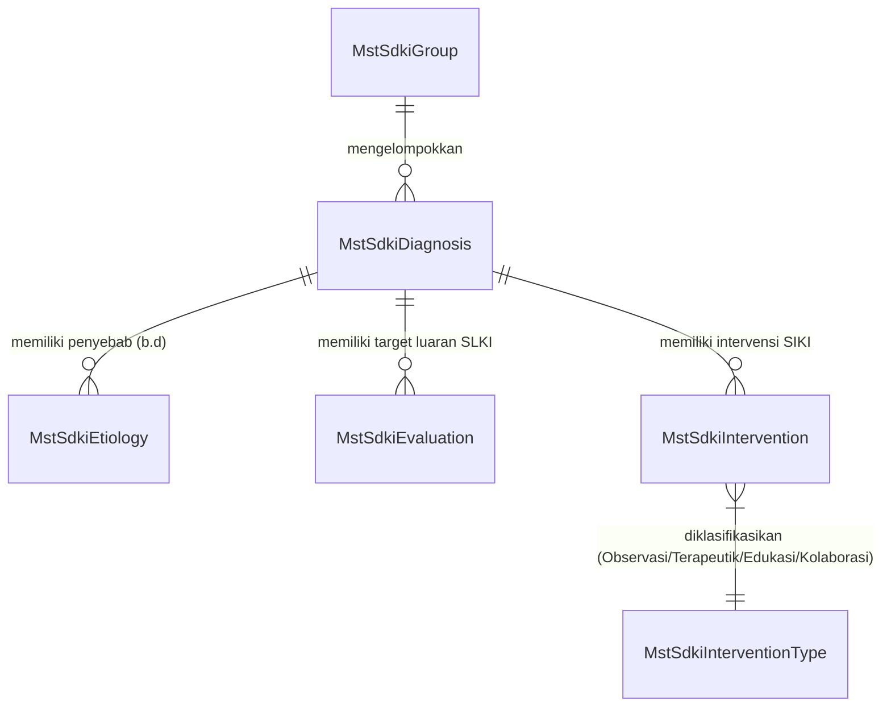
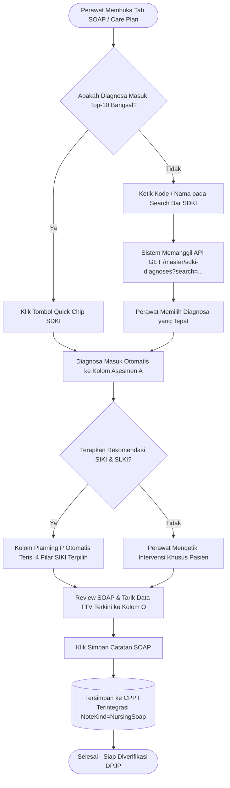
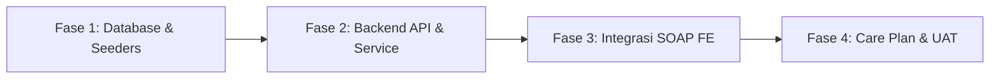

# Rencana Kerja Penerapan Master Data SDKI, SLKI, dan SIKI pada Sistem Rawat Inap V2

> **Kode Dokumen**: `RK-RWI-MASTER-SDKI-001`  
> **Modul**: Rawat Inap (*Inpatient Management*) — Sub-Modul Keperawatan  
> **Kategori**: Standarisasi Data Klinis Keperawatan (PPNI: SDKI, SLKI, SIKI)  
> **Status**: Rencana Kerja Rekayasa (*Engineered Work Plan*)  
> **Tanggal Pembuatan**: 28 September 2026  
> **Target Rilis**: Sistem Rawat Inap V2 (`QuilvianFinal`)  

---

## 1. Ringkasan Eksekutif & Latar Belakang

Dokumentasi asuhan keperawatan di rumah sakit Indonesia mengacu pada standar profesi resmi yang diterbitkan oleh Persatuan Perawat Nasional Indonesia (PPNI), yaitu **3S**:
1. **SDKI**: Standar Diagnosis Keperawatan Indonesia
2. **SLKI**: Standar Luaran Keperawatan Indonesia (Tujuan & Kriteria Hasil)
3. **SIKI**: Standar Intervensi Keperawatan Indonesia (Observasi, Terapeutik, Edukasi, Kolaborasi)

Pada sistem terdahulu (**V1**), telah dibangun **8 tabel master data SDKI/SIKI** lengkap di basis data dengan relasi antar diagnosa dan rincian intervensi. Namun, pada proses migrasi awal ke **V2 (QuilvianFinal)**, tabel-tabel master data ini belum dimigrasikan ke backend baru (`NewQuilvianSystemBackend`), sehingga sistem V2 saat ini hanya mengandalkan **9 diagnosa statis (*hardcoded preset*)** di frontend JavaScript (`nursing-soap-entry-form.jsx`).

Kondisi ini membatasi fleksibilitas perawat bangsal rawat inap dalam mencatat masalah keperawatan di luar 9 diagnosa tersebut, serta menyulitkan komite keperawatan dalam menambah atau memutakhirkan katalog terminologi tanpa mengubah kode program.

Dokumen rencana kerja ini menetapkan langkah rekayasa menyeluruh untuk:
1. Membangun **Master Data 3S (SDKI, SLKI, SIKI)** yang modular, terstandar, dan berkinerja tinggi di backend V2.
2. Mengintegrasikan pencarian dinamis (*async search*) master SDKI pada formulir **SOAP Keperawatan** dan **Rencana Asuhan (*Care Plan*)**.
3. Menyediakan antarmuka manajemen master data bagi Komite Keperawatan / Administrator Rumah Sakit.

---

## 2. Analisis Kesenjangan (Gap Analysis) V1 vs V2 Saat Ini vs Target To-Be

| Dimensi | Kondisi V1 (Legacy) | Kondisi V2 Saat Ini (Baseline) | Target Penyelarasan (To-Be) |
| :--- | :--- | :--- | :--- |
| **Penyimpanan Master SDKI** | 8 Tabel di schema `public`: `SDKIGroup`, `SDKIDiagnosa`, `SDKIEtiologi`, `SDKIObservasi`, `SDKITeraupetik`, `SDKIEdukasi`, `SDKIKolaborasi`, `SDKIEvaluasi`. | **Nol tabel master**. Belum ada master data SDKI di backend `NewQuilvianSystemBackend`. | 8 Tabel Master Data terstandar di bounded context `ClinicalManagement` dengan audit trail lengkap dan soft delete. |
| **Katalog Diagnosa** | Ratusan diagnosa tersimpan di database via API paginasi. | Hanya **9 diagnosa statis** di array frontend (`QUICK_SDKI_DIAGNOSES`). | Katalog lengkap 149 Diagnosa SDKI PPNI yang tersimpan di database dan dapat dikelola secara dinamis. |
| **Input SOAP Keperawatan (A)** | Dropdown select besar via Redux yang memicu 6 pemanggilan API bertingkat (lambat & berat). | 4-9 tombol *quick chips* teks statis, selebihnya harus diketik manual bebas. | **Pencarian Cepat (*Async Search*)** berbasis kode/nama diagnosa + tombol *Quick Chips* untuk 10 diagnosa paling sering di bangsal. |
| **Input Planning SIKI (P)** | Accordion 6 tab berisi ratusan checklist per diagnosa. | Template teks statis 4 pilar kosong (`[Observasi]`, `[Terapeutik]`, `[Edukasi]`, `[Kolaborasi]`). | Tombol sematkan otomatis intervensi terstandar SIKI sesuai diagnosa SDKI yang dipilih pada kolom Asesmen. |
| **Integrasi Care Plan** | Belum ada master-detail modern. | Preset 6 item terisolasi di modal frontend. | Integrasi penuh dengan master data SDKI-SLKI-SIKI, otomatis mengisi Masalah, Luaran SLKI, dan Intervensi SIKI. |
| **Manajemen Admin / Komite** | Tidak ada antarmuka khusus (hanya lewat database). | Tidak ada. | Halaman Master Data SDKI/SIKI di menu Pengaturan Medis/Keperawatan untuk aktivasi, penambahan, dan penyesuaian. |

---

## 3. Arsitektur Data & Model Relasi (Database Schema)

Seluruh entitas master data ditempatkan di bawah modul `ClinicalManagement` pada skema database PostgreSQL, mewarisi kelas dasar audit (`UserActivityAudit`).



### 3.1 Spesifikasi Entitas Master Data

#### 1. `MstSdkiGroup` (Kelompok / Kategori Diagnosa)
Mengelompokkan diagnosis berdasarkan 5 kategori utama PPNI: Fisiologis, Psikologis, Perilaku, Relasional, dan Lingkungan.
- `SdkiGroupId` (`uuid`, PK)
- `GroupCode` (`varchar(10)`, misal: `KAT-01`)
- `GroupName` (`varchar(100)`, misal: `Fisiologis`)
- `Description` (`text`, nullable)
- `IsActive` (`boolean`, default `true`)

#### 2. `MstSdkiDiagnosis` (Katalog Diagnosis SDKI)
Tabel utama memuat 149 diagnosa keperawatan Indonesia.
- `SdkiDiagnosisId` (`uuid`, PK)
- `SdkiGroupId` (`uuid`, FK ke `MstSdkiGroup`, nullable)
- `DiagnosisCode` (`varchar(20)`, Unique, Indexed, misal: `D.0077`)
- `DiagnosisName` (`varchar(250)`, Indexed, misal: `Nyeri Akut`)
- `SubCategory` (`varchar(100)`, misal: `Nyeri dan Kenyamanan`)
- `Definition` (`text`, definisi resmi SDKI)
- `IsActive` (`boolean`, default `true`)

#### 3. `MstSdkiEtiology` (Etiologi / Faktor yang Berhubungan)
Daftar penyebab atau faktor risiko yang lazim menjadi penghubung (`b.d` / berhubungan dengan) untuk diagnosis terkait.
- `SdkiEtiologyId` (`uuid`, PK)
- `SdkiDiagnosisId` (`uuid`, FK ke `MstSdkiDiagnosis`, Indexed)
- `EtiologyName` (`varchar(250)`, misal: `Agen Pencedera Fisiologis (mis. inflamasi, iskemia, neoplasma)`)
- `Description` (`text`, nullable)
- `IsActive` (`boolean`, default `true`)

#### 4. `MstSdkiEvaluation` (Standar Luaran SLKI)
Kriteria evaluasi dan target hasil yang diharapkan menurut Standar Luaran Keperawatan Indonesia (SLKI).
- `SdkiEvaluationId` (`uuid`, PK)
- `SdkiDiagnosisId` (`uuid`, FK ke `MstSdkiDiagnosis`, Indexed)
- `SlkiCode` (`varchar(20)`, misal: `L.08066`)
- `OutcomeName` (`varchar(250)`, misal: `Tingkat Nyeri Menurun`)
- `OutcomeExpectation` (`text`, misal: `Keluhan nyeri menurun, meringis menurun, gelisah menurun, kesulitan tidur menurun`)
- `IsActive` (`boolean`, default `true`)

#### 5. `MstSdkiIntervention` (Standar Intervensi SIKI)
Tindakan keperawatan terstandar yang terbagi menjadi 4 pilar utama.
- `SdkiInterventionId` (`uuid`, PK)
- `SdkiDiagnosisId` (`uuid`, FK ke `MstSdkiDiagnosis`, Indexed)
- `PillarType` (`enum` / `smallint`: `1 = Observasi`, `2 = Terapeutik`, `3 = Edukasi`, `4 = Kolaborasi`)
- `SikiCode` (`varchar(20)`, misal: `I.08238`)
- `InterventionLabel` (`varchar(250)`, misal: `Manajemen Nyeri: Identifikasi lokasi, karakteristik, dan skala nyeri`)
- `IsDefaultRecommendation` (`boolean`, default `true` — untuk rekomendasi 1-klik)
- `IsActive` (`boolean`, default `true`)

---

## 4. Alur Proses Bisnis & Skenario Kasus Klinis

### 4.1 Diagram Alur Kerja Perawat di Ruang Rawat Inap



### 4.2 Contoh Konkret Skenario Rumah Sakit

> **Skenario Kasus:**  
> Pasien **Tn. B (54 tahun)** dirawat di Ruang Mawar Pasca-Operasi Laparatomi Hari ke-1.  
> Perawat **Ns. Siti** melakukan operan dinas pagi dan mendokumentasikan kondisi pasien ke sistem.
>
> 1. **Subjektif (S):** Ns. Siti memilih preset keluhan: *"Pasien mengeluh nyeri luka operasi skala sedang (NRS 5-6)"*.
> 2. **Objektif (O):** Ns. Siti mengklik tombol **"Ambil TTV Terkini"**; sistem langsung menyalin TD 135/85 mmHg, Nadi 88x/mnt, RR 20x/mnt, Suhu 37.1 °C, GCS 15.
> 3. **Asesmen (A):** Ns. Siti mengetik kata `"nyeri"` pada kolom Asesmen. Muncul hasil pencarian dari master data: **`Nyeri Akut (D.0077)`**. Begitu dipilih, teks terstandar langsung disematkan:
>    ```text
>    - Nyeri Akut (D.0077) b.d Agen Pencedera Fisik (Prosedur Operasi Laparatomi)
>    ```
> 4. **Planning (P):** Ns. Siti mengklik tombol **"Terapkan Intervensi SIKI"**; sistem secara otomatis menyusun 4 pilar intervensi yang terkait dengan kode `D.0077`:
>    ```text
>    [Observasi]:
>    - Identifikasi lokasi, karakteristik, durasi, frekuensi, dan skala nyeri (skala saat ini: 5/10)
>    - Monitor efek samping penggunaan analgetik
>    [Terapeutik]:
>    - Fasilitasi istirahat dan posisikan tidur semi-Fowler
>    - Ajarkan teknik non-farmakologis relaksasi napas dalam
>    [Edukasi]:
>    - Edukasi pasien mengenai penyebab timbulnya rasa nyeri
>    [Kolaborasi]:
>    - Kolaborasi pemberian injeksi Ketorolac 30mg IV per 8 jam sesuai advis DPJP
>    ```
> 5. **Hasil:** Waktu pendokumentasian SOAP perawat terpangkas dari 10 menit menjadi **kurang dari 2 menit**, dengan tata bahasa dan terminologi yang 100% patuh standar akreditasi KARS & PPNI.

---

## 5. Spesifikasi Antarmuka API Backend (Swagger Style)

Seluruh endpoint API Master Data dilindungi oleh autentikasi JWT dan otorisasi berbasis peran medis (`Nurse`, `Doctor`, `ClinicalGovernance`, `SuperAdmin`).

### 5.1 Kelompok Endpoint: `[Tags("Master SDKI Diagnosa")]`

| Method | Endpoint Path | Tag Swagger | Deskripsi | Otorisasi | Request / Query | Response Model |
| :--- | :--- | :--- | :--- | :--- | :--- | :--- |
| `GET` | `/api/v1/health-services/clinical-management/master/sdki-diagnoses` | `[Tags("Master SDKI Diagnosa")]` | Daftar diagnosa SDKI dengan pencarian teks, kode, dan filter kategori | `Nurse, Doctor, Clinician` | `query`, `groupId`, `page`, `pageSize` | `PagedResult<SdkiDiagnosisListItemDto>` |
| `GET` | `/api/v1/health-services/clinical-management/master/sdki-diagnoses/{id}` | `[Tags("Master SDKI Diagnosa")]` | Rincian 1 diagnosa SDKI beserta daftar etiologi, luaran SLKI, dan intervensi SIKI bawaan | `Nurse, Doctor, Clinician` | `id` (GUID) | `NursingResult<SdkiDiagnosisDetailDto>` |
| `POST` | `/api/v1/health-services/clinical-management/master/sdki-diagnoses` | `[Tags("Master SDKI Diagnosa")]` | Tambah diagnosa SDKI baru ke katalog rumah sakit | `ClinicalGovernance, Admin` | `CreateSdkiDiagnosisRequest` | `NursingResult<SdkiDiagnosisDetailDto>` |
| `PUT` | `/api/v1/health-services/clinical-management/master/sdki-diagnoses/{id}` | `[Tags("Master SDKI Diagnosa")]` | Perbarui data diagnosa SDKI | `ClinicalGovernance, Admin` | `id`, `UpdateSdkiDiagnosisRequest` | `NursingResult<SdkiDiagnosisDetailDto>` |
| `DELETE` | `/api/v1/health-services/clinical-management/master/sdki-diagnoses/{id}` | `[Tags("Master SDKI Diagnosa")]` | Nonaktifkan diagnosa SDKI (*soft delete*) | `ClinicalGovernance, Admin` | `id` (GUID) | `NursingResult<bool>` |

### 5.2 Kelompok Endpoint: `[Tags("Master SDKI Intervensi & Luaran")]`

| Method | Endpoint Path | Tag Swagger | Deskripsi | Otorisasi | Request / Query | Response Model |
| :--- | :--- | :--- | :--- | :--- | :--- | :--- |
| `GET` | `/api/v1/health-services/clinical-management/master/sdki-diagnoses/{id}/bundles` | `[Tags("Master SDKI Intervensi & Luaran")]` | Paket instan 3S: Luaran SLKI + 4 Pilar Intervensi SIKI untuk pengisian otomatis SOAP / Care Plan | `Nurse, Doctor` | `id` (GUID diagnosa) | `NursingResult<SdkiDiagnosisBundleDto>` |
| `POST` | `/api/v1/health-services/clinical-management/master/sdki-interventions` | `[Tags("Master SDKI Intervensi & Luaran")]` | Tambah butir intervensi SIKI baru pada suatu diagnosa | `ClinicalGovernance, Admin` | `CreateSdkiInterventionRequest` | `NursingResult<SdkiInterventionDto>` |
| `PUT` | `/api/v1/health-services/clinical-management/master/sdki-interventions/{id}` | `[Tags("Master SDKI Intervensi & Luaran")]` | Perbarui butir intervensi SIKI | `ClinicalGovernance, Admin` | `id`, `UpdateSdkiInterventionRequest` | `NursingResult<SdkiInterventionDto>` |
| `DELETE` | `/api/v1/health-services/clinical-management/master/sdki-interventions/{id}` | `[Tags("Master SDKI Intervensi & Luaran")]` | Hapus butir intervensi SIKI (*soft delete*) | `ClinicalGovernance, Admin` | `id` (GUID) | `NursingResult<bool>` |

---

## 6. Penyelarasan Komponen Frontend (UI/UX)

Penerapan pada aplikasi frontend Next.js melibatkan 3 komponen utama:

### 6.1 Formulir SOAP Keperawatan (`nursing-soap-entry-form.jsx`)
1. **Async Search Selector pada Asesmen (A):**
   - Menambahkan input pencarian cerdas berbasis komponen `react-select/async` atau *Combobox* mandiri Quilvian.
   - Perawat mengetik minimal 2 karakter (misal: `"napas"` atau `"D.0001"`), sistem memanggil API master data dengan *debounce* 300ms.
2. **Preset Favorit (*Quick Chips*) Tetap Ada:**
   - 6–10 diagnosa paling sering di ruang rawat inap tetap tampil sebagai tombol *chip* instan di bawah input pencarian untuk efisiensi perawat tanpa perlu mengetik.
3. **Penyisipan Cerdas Intervensi 4 Pilar SIKI:**
   - Ketika diagnosa SDKI dipilih, muncul tombol kontekstual: **"⚡ Sisipkan Intervensi Standar SIKI"**.
   - Jika diklik, sistem langsung memanggil endpoint `/bundles` dan memformat teks 4 pilar (Observasi, Terapeutik, Edukasi, Kolaborasi) ke kolom Planning (P).

### 6.2 Formulir Rencana Asuhan Keperawatan (`care-plan-item-form-modal.jsx`)
1. Menggantikan *array* statis `SDKI_CARE_PLAN_PRESETS` dengan pemanggilan API master data SDKI.
2. Saat perawat memilih satu diagnosa master SDKI:
   - Kolom **Masalah Keperawatan** otomatis terisi kode & nama diagnosa SDKI.
   - Kolom **Tujuan & Kriteria Luaran** otomatis terisi standar luaran SLKI bawaan.
   - Kolom **Rencana Intervensi** otomatis terisi 4 pilar tindakan SIKI bawaan.

### 6.3 Halaman Pengaturan Master Data SDKI (Untuk Komite Keperawatan)
- Menyediakan tabel data master SDKI di menu Pengaturan Medis (*Clinical Management Master Data*).
- Komite Keperawatan dapat menonaktifkan diagnosa yang tidak relevan, menambah diagnosa baru, atau mengubah teks intervensi lokal rumah sakit.

---

## 7. Rencana Tahapan Eksekusi (Vertical Slice Roadmap)

Pekerjaan dibagi menjadi **4 Fase Bertahap** yang dapat diuji secara independen:



### Fase 1: Desain Basis Data & Seeder Awal (Estimasi: 1 Hari Kerja)
- Pembuatan 5 file model entitas C# di `NewQuilvianSystemBackend/Areas/HealthServices/ClinicalManagement/Models/`.
- Konfigurasi Fluent API Entity Framework Core di `ApplicationDbContext.cs` (indeks, foreign key, soft delete filter).
- Pembuatan migrasi database: `AddMasterDataSdkiTables`.
- Pembuatan file seeder data SQL / C# untuk **25 Diagnosa SDKI Terbanyak di Rawat Inap** beserta pasangan SLKI dan SIKI resminya.

### Fase 2: Implementasi Layanan Backend & Kontrak API (Estimasi: 1-2 Hari Kerja)
- Pembuatan DTO (Request/Response) dan Mapper di namespace Dtos.
- Pembuatan *Service Class*: `SdkiMasterService.cs` dengan fungsi pencarian berbasis kata kunci dan pengambilan bundel 3S.
- Pembuatan Controller API Swagger: `SdkiMasterController.cs` dengan dokumentasi lengkap tag Swagger.
- Verifikasi kompilasi `dotnet build` (target 0 error) dan pengujian endpoint via Postman / Swagger UI.

### Fase 3: Integrasi Frontend pada Formulir SOAP (Estimasi: 1-2 Hari Kerja)
- Pembuatan API client service di frontend: `sdki-master.service.js`.
- Penambahan komponen pencarian dinamis (*async search*) pada kolom Asesmen di `nursing-soap-entry-form.jsx`.
- Penambahan fitur sematkan otomatis 4 pilar intervensi SIKI ke kolom Planning.
- Pengujian interaksi formulir di ruang kerja perawat (*Nursing Workspace*).

### Fase 4: Penyelarasan Care Plan & Verifikasi Menyeluruh (Estimasi: 1 Hari Kerja)
- Penyelarasan modal formulir Care Plan (`care-plan-item-form-modal.jsx`) agar mengambil data dari master SDKI.
- Verifikasi penyimpanan riwayat versi rencana asuhan (kepatuhan `BE-RWI-060`).
- Uji coba skenario lengkap dari penerimaan pasien, pengisian tanda vital, pencatatan SOAP dengan SDKI, hingga cetak ringkasan CPPT.

---

## 8. Kriteria Keberhasilan (Definition of Done)

1. **Integritas Basis Data:**  
   Tabel master SDKI, SLKI, dan SIKI berhasil dibuat pada basis data PostgreSQL dengan relasi referensial yang valid dan indeks pencarian yang optimal.
2. **Katalog Awal Siap Pakai:**  
   Minimal 25 diagnosa keperawatan prioritas rawat inap (termasuk Nyeri Akut, Hipertermia, Bersihan Jalan Napas, Risiko Jatuh, Risiko Infeksi) terisi lengkap beserta intervensi 4 pilarnya.
3. **Pencarian Cepat & Ringan:**  
   Pencarian diagnosa SDKI pada formulir SOAP merespons dalam waktu $\le 300\text{ ms}$ tanpa membebani browser perawat.
4. **Otomasi SOAP Berjalan Mulus:**  
   Mengklik diagnosa SDKI dan tombol intervensi SIKI berhasil mengisi teks terstruktur pada kolom Asesmen (A) dan Planning (P) secara instan.
5. **Kepatuhan Rekam Medis (CPPT):**  
   Catatan SOAP yang dihasilkan tetap tersimpan dengan sah ke tabel CPPT terintegrasi (`TrxPatientIntegratedProgressNote`) dengan `NoteKind = 2` (`NursingSoap`) dan dapat diverifikasi oleh DPJP sesuai standar KARS PAP 2.2.
6. **Kompilasi Bersih:**  
   Kompilasi backend `dotnet build` menghasilkan **0 Error**, dan frontend Next.js lulus verifikasi linting serta pengujian fungsional.

---

*Dokumen ini disusun untuk menjadi panduan kerja terpadu bagi Tim Rekayasa Sistem Quilvian (Backend & Frontend) dalam merealisasikan standarisasi asuhan keperawatan Indonesia yang modern, efisien, dan patuh regulasi.*
