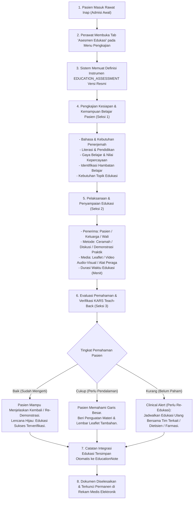

# Rencana Kerja Penyelarasan Modul Keperawatan — Menu 1: Asesmen Edukasi (Education Assessment)

## 1. Ringkasan Eksekutif & Identitas Dokumen

| Atribut | Keterangan |
| :--- | :--- |
| **Nama Modul** | Pelayanan Kesehatan — Rawat Inap (*Inpatient Nursing Workspace*) |
| **Menu Sasaran** | Menu 1: Pengkajian Pasien (*Patient Assessment*) — Sub-Menu 4: Asesmen Edukasi (*Education Assessment*) |
| **Dasar Penyelarasan** | Mengadopsi kelengkapan bisnis pengkajian kesiapan belajar pasien, hambatan belajar, kebutuhan edukasi komprehensif, metode & media edukasi, serta evaluasi pemahaman berstandar KARS dari **QuilvianV1** (`RLN3-CAP-08`) ke dalam **QuilvianFinal** (arsitektur modern, bersih, dan berstandar Akreditasi Rumah Sakit HPK/KE). |
| **Prinsip Kerja** | `QuilvianV1` berstatus **READ-ONLY** (hanya dibaca sebagai acuan bisnis). Seluruh implementasi kode baru dan penyelarasan dilakukan **hanya di QuilvianFinal**. |
| **Status Database** | **Zero Migration** (Tidak ada penambahan tabel atau alter table baru). Memanfaatkan entitas `TrxPatientAssessment` (`EducationNote`), `CliClinicalInstrument`, `CliClinicalInstrumentVersion`, dan `ResponsesJson` pada `CliAssessmentInstrumentResponse`. |

---

## 2. Latar Belakang & Masalah Bisnis

Standar Akreditasi Rumah Sakit (KARS) pada Bab **Komunikasi dan Edukasi (KE)** dan **Hak Pasien dan Keluarga (HPK)** mewajibkan setiap pasien yang dirawat inap dilakukan pengkajian kebutuhan edukasi sejak awal admisi:
1. Menilai kesiapan belajar pasien, bahasa sehari-hari, kebutuhan penerjemah, literasi (baca-tulis), dan tingkat pendidikan formal.
2. Mengidentifikasi hambatan fisik, kognitif, emosional, budaya, atau agama yang dapat membatasi penyerapan informasi medis.
3. Menetapkan kebutuhan topik edukasi prioritas (penyakit, obat-obatan, nutrisi, perawatan luka, cuci tangan, pencegahan jatuh, dan manajemen nyeri).
4. Melakukan edukasi kolaboratif menggunakan metode dan media yang tepat (audio-visual, leaflet, peraga, demonstrasi praktik).
5. **Wajib melakukan evaluasi pemahaman (Verifikasi KARS)** dengan teknik *teach-back* (menjelaskan kembali) atau *show-me* (re-demonstrasi praktik mandiri) guna memastikan pasien dan keluarga benar-benar mampu merawat diri.

### Temuan Perbandingan Bisnis V1 vs Final:

1. **QuilvianV1 (Kelebihan Bisnis Teruji - `RLN3-CAP-08`):**
   - **Pengkajian Kesiapan Belajar Komprehensif:**
     - Bahasa yang digunakan & kebutuhan penerjemah.
     - Kemampuan baca-tulis & tingkat pendidikan pasien.
     - Gaya belajar (Visual, Auditori, Kinestetik, Membaca/Menulis, Kombinasi).
     - Hambatan edukasi (Bahasa, Budaya, Emosional, Fisik, Kognitif, Tidak Ada).
     - Kesediaan menerima edukasi & kebutuhan materi edukasi spesifik.
   - **Pelaksanaan Edukasi Detail:**
     - Topik edukasi, nama wali/keluarga pendamping, tanggal & durasi waktu pemberian edukasi (menit).
     - Metode edukasi (Wawancara, Ceramah, Demonstrasi).
     - Sarana edukasi (Leaflet/Buku, Audio Visual, Alat Peraga).
   - **Evaluasi Pemahaman:**
     - Tingkat pemahaman: Baik (Sudah Mengerti), Cukup (Perlu Pendalaman), Kurang (Edukasi Ulang).
     - Tindak lanjut evaluasi: Sudah Mengerti, Re-Demonstrasi, Re-Edukasi.

2. **QuilvianFinal (Kelemahan & Kesenjangan Saat Ini):**
   - **Backend Seeder Belum Dipetakan (`ClinicalInstrumentDraftSeeder.cs:613`):**
     - Definisi instrumen `EDUCATION_ASSESSMENT` saat ini hanya 1 seksi generik dengan 7 isian teks bebas singkat.
     - Review flag di kode sumber secara eksplisit menyatakan: *"Isian dari PRD bagian 31 sebagai usulan gate G-01; isian V1 (RLN3-CAP-08) belum dipetakan."*
     - Belum ada opsi checklist terstandar untuk kesiapan belajar, gaya belajar, hambatan, media edukasi, dan evaluasi *teach-back*.
   - **Frontend UI & Pelaporan:**
     - Perawat hanya melihat formulir minimalis tanpa panduan pengkajian kebutuhan edukasi standar akreditasi rumah sakit.

---

## 3. Alur Proses Bisnis & Verifikasi Pemahaman Pasien (KARS KE / HPK)

---

## 4. Struktur Rencana Kerja (3 Tahap Eksekusi)

```mermaid
flowchart LR
    subgraph Tahap1["Tahap 1: Backend Seeder Alignment"]
        T1A["Perbarui Seeder EDUCATION_ASSESSMENT<br/>(Kesiapan Belajar, PQRST Edukasi, Teach-Back)"]
        T1B["Hubungkan Binding EducationNote<br/>(Zero Migration)"]
        T1C["Hapus Review Flag G-01 & RLN3-CAP-08"]
        T1D["Kompilasi dotnet build (0 Error)"]
    end
    
    subgraph Tahap2["Tahap 2: Frontend Form Rendering & Badges"]
        T2A["Render 3 Seksi Terstruktur Formulir Edukasi<br/>(Kesiapan Belajar, Pelaksanaan, Evaluasi)"]
        T2B["Lencana Status Verifikasi Pemahaman<br/>(Teach-Back Status: Baik/Cukup/Kurang)"]
        T2C["Penyaringan Kolom Terikat (ISSUE-KEP-004)"]
    end
    
    subgraph Tahap3["Tahap 3: Verifikasi & Laporan Tracked"]
        T3A["Unit Test Baru Asesmen Edukasi"]
        T3B["Regresi Seluruh Test Pengkajian"]
        T3C["Laporan BE-RWI-130 & FE-RWI-130"]
    end
    
    Tahap1 --> Tahap2 --> Tahap3
```

---

### Tahap 1: Backend Seeder Alignment (`BE-RWI-130`)

1. **Pembaruan Seeder `ClinicalInstrumentDraftSeeder.cs` untuk `EDUCATION_ASSESSMENT`:**
   - **Seksi 1: Pengkajian Kesiapan & Kemampuan Belajar Pasien (`EDU_KESIAPAN`):**
     - `EDU_LANG`: Bahasa sehari-hari yang digunakan (Single: `ID` = Indonesia, `DAERAH` = Bahasa Daerah, `ASING` = Bahasa Asing / Inggris, `OTHER` = Lainnya).
     - `EDU_TRANSLATOR`: Kebutuhan penerjemah bahasa / bahasa isyarat (Boolean: Ya / Tidak).
     - `EDU_LITERACY`: Kemampuan membaca dan menulis / literasi (Boolean: Bisa / Tidak).
     - `EDU_EDUCATION`: Tingkat pendidikan formal (Single: `SD`, `SMP`, `SMA`, `DIPLOMA`, `SARJANA`, `TIDAK_SEKOLAH`).
     - `EDU_LEARNING_STYLE`: Gaya belajar yang disukai (Single: `VISUAL` = Visual/Bagan, `AUDITORI` = Auditori/Lisan, `KINESTETIK` = Kinestetik/Praktik, `BACA_TULIS` = Membaca/Menulis, `KOMBINASI` = Kombinasi Multimedia).
     - `EDU_BELIEFS`: Nilai kepercayaan / budaya / spiritual yang mempengaruhi edukasi (Text).
     - `EDU_BARRIERS`: Hambatan proses edukasi (Multi: `NONE` = Tidak Ada Hambatan, `BAHASA` = Kendala Bahasa, `BUDAYA` = Faktor Budaya, `EMOSIONAL` = Emosional/Cemas, `FISIK` = Fisik/Nyeri/Lemah, `KOGNITIF` = Kognitif/Daya Ingat Menurun).
     - `EDU_WILLINGNESS`: Pasien dan/atau keluarga bersedia menerima edukasi (Boolean: Ya / Tidak).
     - `EDU_NEEDS`: Kebutuhan topik edukasi pasien (Multi: `PENYAKIT` = Diagnosis & Proses Penyakit, `OBAT` = Penggunaan Obat & Efek Samping, `PERAWATAN` = Perawatan Luka & Mandiri, `NUTRISI` = Diet Gizi & Nutrisi, `REHABILITASI` = Rehabilitasi & Mobilisasi, `MANAJEMEN_NYERI` = Manajemen Nyeri, `PENCEGAHAN_INFEKSI` = Cuci Tangan & Pencegahan Infeksi, `PENCEGAHAN_JATUH` = Pencegahan Risiko Jatuh, `PENGGUNAAN_ALAT` = Penggunaan Alat Medis, `OTHER` = Lainnya).
     - `EDU_NEEDS_OTHER`: Kebutuhan edukasi spesifik lainnya (Text).
   - **Seksi 2: Pelaksanaan & Metode Pemberian Edukasi (`EDU_PELAKSANAAN`):**
     - `EDU_RECIPIENT`: Penerima materi edukasi (Multi: `PATIENT` = Pasien, `FAMILY` = Keluarga, `CAREGIVER` = Wali / Caregiver).
     - `EDU_FAMILY_NAME`: Nama keluarga / wali yang mendampingi dan menerima edukasi (Text).
     - `EDU_METHOD`: Metode penyampaian edukasi (Single: `TANYA_JAWAB` = Wawancara & Tanya Jawab, `CERAMAH` = Ceramah & Diskusi Dua Arah, `DEMONSTRASI` = Demonstrasi & Simulasi Praktik, `KOMBINASI` = Kombinasi Ceramah dan Praktik).
     - `EDU_MEDIA`: Media / sarana edukasi yang digunakan (Multi: `LEAFLET` = Buku / Leaflet / Lembar Informasi, `AUDIO_VISUAL` = Video Audio Visual, `ALAT_PERAGA` = Alat Peraga / Lembar Balik, `LISAN` = Penjelasan Lisan Langsung).
     - `EDU_DURATION`: Durasi waktu edukasi dalam menit (Number).
     - `EDU_MATERIAL`: Rincian materi pokok yang disampaikan (Text).
   - **Seksi 3: Evaluasi Pemahaman & Verifikasi KARS (`EDU_EVALUASI`):**
     - `EDU_UNDERSTANDING`: Tingkat pemahaman penerima edukasi (Single: `BAIK` = Baik (Mengerti penuh & mampu menjelaskan kembali), `CUKUP` = Cukup (Memahami sebagian materi, butuh penguatan), `KURANG` = Kurang (Belum memahami, wajib re-edukasi)).
     - `EDU_RESULT`: Tindak lanjut hasil evaluasi (Single: `MENGERTI` = Sudah Mengerti (Edukasi Selesai), `RE_DEMONSTRASI` = Mampu Re-Demonstrasi Praktik Mandiri, `RE_EDUKASI` = Perlu Jadwal Re-Edukasi Lanjutan).
     - `EDU_NOTE`: Catatan edukasi terpadu perawat — terikat pada kolom `EducationNote` di `TrxPatientAssessment` (Text).

2. **Kompilasi Backend:**
   - Jalankan `dotnet build` untuk memverifikasi nol kesalahan kompilasi.

---

### Tahap 2: Frontend Form Rendering & Pemahaman Badges (`FE-RWI-130`)

1. **Peningkatan Form Renderer `clinical-instrument-form-renderer.jsx`:**
   - Menampilkan formulir Asesmen Edukasi 3 seksi secara runtut dan terstruktur.
   - Peringatan Klinis jika terdapat **Hambatan Kritis** (misal: butuh penerjemah bahasa tetapi belum tersedia, atau hambatan kognitif berat).
   - Indikator Status Pemahaman (Lencana Hijau: *Tervalidasi Teach-Back Baik*, Lencana Merah/Kuning: *Memerlukan Re-Edukasi*).
   - Memastikan butir `EDU_NOTE` yang ber-binding `EducationNote` diproses secara aman tanpa konflik JSON responses (sesuai aturan `ISSUE-KEP-004`).

---

### Tahap 3: Verifikasi Komprehensif, Unit Test, & Pelaporan Tracked

1. **Unit Test Spesifik Asesmen Edukasi:**
   - Buat file test baru: `QuilvianSystemFrontendDev/tests/unit/inpatient-education-assessment-instruments.test.mjs`.
   - Menguji:
     - Kelengkapan 3 seksi instrumen `EDUCATION_ASSESSMENT` (Kesiapan, Pelaksanaan, Evaluasi).
     - Validasi isian wajib dan opsi akreditasi KARS.
     - Penilaian tingkat pemahaman dan penentuan tindak lanjut re-edukasi.
2. **Laporan Tracked:**
   - `BE-RWI-130-asesmen-edukasi-seeder-alignment.md`
   - `FE-RWI-130-asesmen-edukasi-ui-dan-evaluasi.md`
   - Pembaruan matriks keterlacakan `requirement-traceability-v2.md`.
