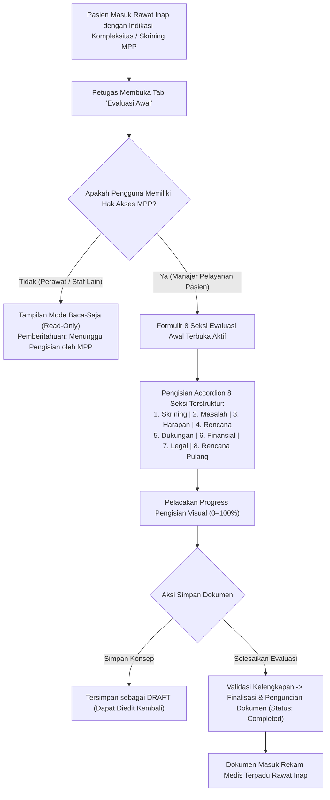

# Rencana Kerja Penyelarasan Modul Keperawatan — Menu 1: Evaluasi Awal MPP (Case Management Initial Evaluation)

## 1. Ringkasan Eksekutif & Identitas Dokumen

| Atribut | Keterangan |
| :--- | :--- |
| **Nama Modul** | Pelayanan Kesehatan — Rawat Inap (*Inpatient Nursing Workspace*) |
| **Menu Sasaran** | Menu 1: Pengkajian Pasien (*Patient Assessment*) — Sub-Menu 6: Evaluasi Awal MPP (*Case Management Initial Evaluation*) |
| **Dasar Penyelarasan** | Mengadopsi kelengkapan telaah Manajer Pelayanan Pasien (MPP) / *Case Manager* dari **QuilvianV1** (`evaluasi-awal/form/page.jsx`) ke dalam arsitektur modern **QuilvianFinal** (`EPIC KEP-12`, `FR-KEP-053` s.d. `FR-KEP-055`, standar KARS PAP 2.1 & TKRS). |
| **Prinsip Kerja** | `QuilvianV1` berstatus **READ-ONLY**. Seluruh implementasi kode dan penyelarasan dilakukan di **QuilvianFinal**. |
| **Status Database** | **Zero Migration Baru** (Tabel `TrxCaseManagementEvaluation` dan instrumen `CASE_MANAGEMENT_CHECKLIST` sudah tersedia). |

---

## 2. Analisis Kebutuhan Bisnis & Standar KARS

Standar Akreditasi Rumah Sakit (KARS) pada Bab **Pelayanan dan Asuhan Pasien (PAP 2.1)** menetapkan peran Manajer Pelayanan Pasien (MPP) untuk mengoordinasikan asuhan pasien dengan kompleksitas tinggi, kendala pembiayaan, potensi lama rawat panjang (*high LOS*), dan rencana pemulangan rumit:
1. **8 Seksi Evaluasi Terstruktur (Standar PRD 33)**:
   - `MPP_SCREENING`: 1. Identifikasi / Skrining Pasien
   - `MPP_PROBLEM`: 2. Identifikasi Masalah Pasien & Keluarga
   - `MPP_GOAL`: 3. Harapan / Sasaran Asuhan Manajer Pelayanan
   - `MPP_PLAN`: 4. Perencanaan Pelayanan & Kolaborasi Klinis
   - `MPP_SUPPORT`: 5. Dukungan Sosial & Sistem Keluarga
   - `MPP_FINANCIAL`: 6. Aspek Finansial & Jaminan Pembiayaan
   - `MPP_LEGAL`: 7. Aspek Legal & Etika Pelayanan
   - `MPP_DISCHARGE`: 8. Perencanaan Pemulangan (Discharge Planning)
2. **Kewenangan & Keamanan Akses (`FR-KEP-054`)**:
   - Kontrol tulis eksklusif bagi staf berwewenang MPP di unit pasien.
   - Staf non-MPP (perawat pelaksana/dokter) berstatus baca-saja (*read-only*) dengan pemberitahuan wewenang dokumen yang informatif.
3. **Integritas Dokumen (`FR-KEP-055`)**:
   - Tepat satu dokumen aktif per episode (*single active document*).
   - Dokumen yang telah disahkan (*Completed*) dikunci permanen.
   - Alur addendum/koreksi mengikuti regulasi rekam medis elektronik.

---

## 3. Alur Kerja Evaluasi Awal MPP

---

## 4. Rencana Eksekusi & Tahapan
1. **Tahap 1: Backend Baseline Alignment (`BE-RWI-132`)**:
   - Perbarui definisi `CASE_MANAGEMENT_CHECKLIST` di `ClinicalInstrumentDraftSeeder.cs:738-756`.
   - Tetapkan 8 seksi definitif standar KARS PAP 2.1.
   - Selesaikan penanda tinjauan `G-07`.
   - Jalankan `dotnet build` (0 Error).
2. **Tahap 2: Frontend Verification (`FE-RWI-132`)**:
   - Pastikan integrasi `InitialEvaluationSection.jsx` bekerja optimal bersama hook `useCaseManagementEvaluation`.
   - Verifikasi penegakan hak akses MPP dan mode baca-saja staf pelaksana.
3. **Tahap 3: Pengujian & Laporan**:
   - Jalankan suite unit test `inpatient-case-management-evaluation.test.mjs`.
   - Catat laporan penyelarasan task dan perbarui `requirement-traceability-v2.md`.
