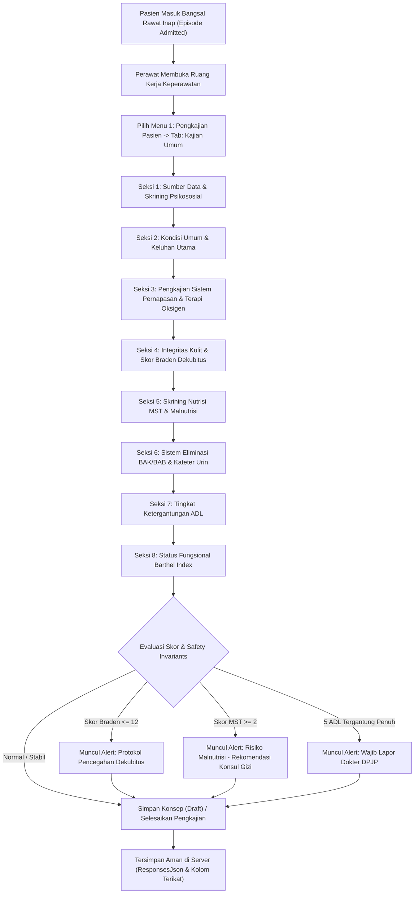

# Rencana Kerja Penyelarasan Modul Keperawatan — Menu 1: Kajian Umum

## 1. Ringkasan Eksekutif & Identitas Dokumen

| Atribut | Keterangan |
| :--- | :--- |
| **Nama Modul** | Rawat Inap — Pelayanan Keperawatan (*Inpatient Nursing Workspace*) |
| **Menu Sasaran** | Menu 1: Pengkajian Pasien (*Patient Assessment*) — Sub-Menu: Kajian Umum |
| **Dasar Penyelarasan** | Mengadopsi kelengkapan bisnis, formulir, dan alur operasional dari **QuilvianV1** (acuan approved klien) ke dalam **QuilvianFinal** (arsitektur modern, bersih, dan bebas cacat). |
| **Prinsip Kerja** | `QuilvianV1` berstatus **READ-ONLY** (hanya dibaca). Seluruh implementasi kode baru/perbaikan dilakukan **hanya di QuilvianFinal**. |
| **Status Database** | **Zero Migration** (Tidak ada penambahan tabel atau perubahan skema database baru). Memanfaatkan kolom `ResponsesJson` pada tabel `CliAssessmentInstrumentResponse` dan kolom terikat pada `TrxPatientAssessment`. |

---

## 2. Latar Belakang & Masalah Bisnis

Pada saat presentasi operasional bersama pihak rumah sakit, formulir **Kajian Umum Keperawatan** di `QuilvianV1` telah mencakup seluruh kebutuhan klinis perawat bangsal (pengkajian pernapasan, integritas kulit/dekubitus, skrining gizi MST, eliminasi, ketergantungan ADL, dan status fungsional Barthel Index).

Namun, saat migrasi ke `QuilvianFinal`, pengembang terdahulu menyederhanakan formulir tersebut menjadi kolom teks kosong (*textarea*) dengan catatan pada seeder:
> *"Susunan delapan bagian mengikuti RWI-DEC-141; isian bagian Pernapasan, Integritas Kulit, Eliminasi, dan Ketergantungan belum dipetakan dari label V1 (RLN3-CAP-05) dan hanya berupa catatan."* (`ClinicalInstrumentDraftSeeder.cs:290`)

Akibatnya, perawat bangsal di rumah sakit tidak dapat melakukan pengkajian klinis secara terstruktur, akurat, dan cepat sesuai standar akreditasi rumah sakit (KARS/STARKES). Dokumen ini menjadi panduan kerja terpadu untuk menyelaraskan kembali Kajian Umum secara paripurna.

---

## 3. Alur Proses Bisnis Pengkajian Pasien Rawat Inap

Alur pengkajian berjalan urut sejak pasien masuk bangsal rawat inap hingga pengkajian divalidasi:



### Skenario Nyata Rumah Sakit:
> **Contoh Kasus:**  
> Ns. Siti menerima pasien baru bernama **Tn. Budi (58 tahun)** di Ruang Rawat Aster dengan diagnosis stroke iskemik.  
> 1. Ns. Siti membuka tab **Kajian Umum**.  
> 2. Pada seksi **Pernapasan**, Ns. Siti mencentang *"Kesulitan Bernapas: Ya"*, *"Terapi O2: Ya, 3 L/menit via Nasal Kanul"*, *"Pola Napas: Regular"*.  
> 3. Pada seksi **Integritas Kulit**, Ns. Siti menilai Braden Scale menghasilkan skor **11** (Risiko Tinggi). Sistem secara otomatis memunculkan banner peringatan: *"Pasien berisiko tinggi dekubitus. Pasang kasur anti-dekubitus dan jadwalkan alih baring setiap 2 jam."*  
> 4. Pada seksi **Ketergantungan ADL**, kelima aktivitas dinilai *"Ketergantungan Penuh"*. Sistem menampilkan peringatan *"Wajib Lapor Dokter DPJP"*.  
> 5. Ns. Siti menekan tombol **"Simpan Pengkajian"**. Seluruh data tersimpan ke server secara terstruktur tanpa ada catatan yang tercecer di kertas.

---

## 4. Kamus Data & Spesifikasi Formulir 8 Seksi Kajian Umum

Berikut adalah spesifikasi butir isian lengkap yang diadopsi dari `QuilvianV1` ke `QuilvianFinal`:

### Seksi 1: Sumber Data Pasien & Psikososial
| Kode Butir | Label UI | Tipe Kontrol | Pilihan Opsi / Rentang Nilai | Keterangan & Binding |
| :--- | :--- | :--- | :--- | :--- |
| `SD_SOURCE` | Sumber Data | `single` | `PATIENT` (Pasien), `OTHER` (Orang Lain) | Wajib dipilih. |
| `SD_OTHER_NAME` | Nama Orang Lain | `text` | Bebas teks | Tampil jika sumber data = Orang Lain. |
| `SD_RELATION` | Hubungan Keluarga | `single` | `SUAMI`, `ISTRI`, `ORANG_TUA`, `ANAK`, `KAKAK`, `ADIK`, `OTHER` (Lainnya) | Hubungan pemberi informasi. |
| `SD_RELATION_OTHER`| Hubungan Lainnya | `text` | Bebas teks | Tampil jika hubungan = Lainnya. |
| `SD_BELIEFS` | Nilai Kepercayaan | `text` | Bebas teks | Pantangan agama/keyakinan medis. |
| `SD_PSYCHOLOGY` | Kondisi Psikologis | `multi` | `TENANG`, `CEMAS`, `TAKUT`, `MARAH`, `SEDIH`, `BUNUH_DIRI`, `OTHER` | Skrining psikologi awal. |
| `SD_FAMILY_RELATION`| Hubungan Keluarga | `single` | `BAIK` (Baik/Harmonis), `TIDAK_BAIK` (Tidak Baik) | Keadaan dukungan sosial. |
| `SD_RESIDENCE` | Tempat Tinggal | `multi` | `RUMAH_PRIBADI`, `KONTRAK`, `RUMAH_KELUARGA`, `PANTI_JOMPO` | Profil tempat tinggal. |
| `SD_FUNCTIONAL_DIS`| Gangguan Fungsional| `multi` | `BUTA`, `TULI`, `DAYA_INGAT`, `LEMAH_GERAK` | Defisit neurologis/fisik. |
| `SD_NOTE` | Catatan Tambahan | `text` | Bebas teks | Informasi relevan lainnya. |

### Seksi 2: Kondisi Umum & Keluhan Utama
| Kode Butir | Label UI | Tipe Kontrol | Pilihan Opsi / Rentang Nilai | Binding Entitas |
| :--- | :--- | :--- | :--- | :--- |
| `KU_CHIEF_COMPLAINT` | Keluhan Utama | `text` | Bebas teks | `TrxPatientAssessment.ChiefComplaint` |
| `KU_ILLNESS_HISTORY` | Riwayat Penyakit Sekarang | `text` | Bebas teks | `TrxPatientAssessment.CurrentIllnessHistory` |
| `KU_MEDICATION_HIST` | Riwayat Pengobatan | `text` | Bebas teks | `TrxPatientAssessment.MedicationHistory` |
| `KU_CONSCIOUSNESS` | Tingkat Kesadaran | `single` | `ComposMentis`, `Apatis`, `Somnolen`, `Sopor`, `Coma` | `TrxPatientAssessment.ConsciousnessStatus` |
| `KU_ALLERGY` | Ada Riwayat Alergi | `boolean` | `true` (Ya), `false` (Tidak) | `TrxPatientAssessment.HasAllergy` |
| `KU_ALLERGY_NOTE` | Rincian Alergi | `text` | Alergi obat, makanan, udara, dll. | `TrxPatientAssessment.AllergyNote` |

### Seksi 3: Sistem Pernapasan
| Kode Butir | Label UI | Tipe Kontrol | Pilihan Opsi / Rentang Nilai | Keterangan & Binding |
| :--- | :--- | :--- | :--- | :--- |
| `RESP_DIFFICULTY` | Kesulitan Bernapas | `boolean` | `true` (Ya / Sesak), `false` (Tidak) | `ResponsesJson` |
| `RESP_O2_USAGE` | Memakai Terapi Oksigen | `boolean` | `true` (Ya), `false` (Tidak) | `TrxPatientAssessment.IsUsingOxygen` |
| `RESP_O2_FLOW` | Aliran Oksigen | `number` | Satuan L/menit (contoh: 3, 5, 10) | `TrxPatientAssessment.OxygenFlowRate` |
| `RESP_O2_DEVICE` | Jenis Alat Oksigen | `single` | `NasalCannula`, `SimpleMask`, `NonRebreathingMask`, `VenturiMask`, `Other` | `TrxPatientAssessment.OxygenSupportType` |
| `RESP_COUGH` | Batuk | `boolean` | `true` (Ya), `false` (Tidak) | `ResponsesJson` |
| `RESP_PATTERN` | Pola Pernapasan | `single` | `REGULAR`, `IRREGULAR`, `TACHYPNEA`, `BRADYPNEA`, `KUSSMAUL`, `CHEYNE_STOKES` | `ResponsesJson` |
| `RESP_SYMPTOMS` | Gejala Pernapasan | `multi` | `DYSPNEA`, `ORTHOPNEA`, `CYANOSIS`, `PRODUCTIVE_COUGH`, `NON_PRODUCTIVE_COUGH`, `WHEEZING`, `STRIDOR` | `ResponsesJson` |
| `RESP_NOTE` | Catatan Tambahan | `text` | Bebas teks | `ResponsesJson` |

### Seksi 4: Integritas Kulit & Risiko Dekubitus
| Kode Butir | Label UI | Tipe Kontrol | Pilihan Opsi / Rentang Nilai | Keterangan & Binding |
| :--- | :--- | :--- | :--- | :--- |
| `SKIN_IMPAIRED` | Integritas Terganggu | `boolean` | `true` (Terganggu), `false` (Utuh/Baik) | `ResponsesJson` |
| `SKIN_BRADEN_SCORE` | Braden Scale Score | `number` | Skor 6 s.d. 23 | $\le 12$ = Risiko Tinggi Dekubitus. |
| `SKIN_CONDITION` | Kondisi Kulit | `multi` | `NORMAL`, `RASH`, `SCAR`, `BRUISE`, `CYANOTIC`, `SWEATING`, `DRY`, `DECUBITUS` | `ResponsesJson` |
| `SKIN_DECUBITUS_STG`| Stadium Dekubitus | `single` | `STAGE_1`, `STAGE_2`, `STAGE_3`, `STAGE_4` | Tampil jika ada luka tekan. |
| `SKIN_NOTE` | Lokasi & Keterangan | `text` | Contoh: *"Luka lecet di area sakrum"* | `ResponsesJson` |

### Seksi 5: Skrining Nutrisi (Malnutrition Screening Tool)
| Kode Butir | Label UI | Tipe Kontrol | Pilihan Opsi / Rentang Nilai | Binding Entitas |
| :--- | :--- | :--- | :--- | :--- |
| `NUT_APPETITE` | Nafsu Makan | `single` | `Normal`, `Decreased`, `Increased`, `Poor` | `TrxPatientAssessment.AppetiteStatus` |
| `NUT_NAUSEA` | Mual | `boolean` | `true` (Ya), `false` (Tidak) | `TrxPatientAssessment.HasNausea` |
| `NUT_VOMITING` | Muntah | `boolean` | `true` (Ya), `false` (Tidak) | `TrxPatientAssessment.HasVomiting` |
| `NUT_MST_WT_LOSS` | Penurunan BB 3-6 Bln | `single` | `NO` (0), `UNSURE` (2), `KG_1_5` (1), `KG_6_10` (2), `KG_11_15` (3), `KG_OVER_15` (4) | Parameter Baku MST. |
| `NUT_MST_INTAKE` | Penurunan Asupan Makan | `single` | `NO` (0), `YES` (1) | Asupan berkurang dlm 1 minggu. |
| `NUT_MST_SEVERE` | Menderita Penyakit Berat | `boolean` | `true` (Ya), `false` (Tidak) | ICU, Kanker, Stroke berat. |
| `NUT_METABOLIC` | Gangguan Metabolisme | `multi` | `DM` (Diabetes), `HT` (Hipertensi), `DISLIPIDEMIA`, `CKD` (Ginjal) | Skrining komorbid gizi. |
| `NUT_RISK` | Status Risiko Nutrisi | `single` | `NoRisk`, `LowRisk`, `MediumRisk`, `HighRisk` | `TrxPatientAssessment.NutritionRiskStatus` |
| `NUT_RISK_SCORE` | Total Skor Gizi | `number` | Angka akumulasi skor MST | `TrxPatientAssessment.NutritionRiskScore` |

### Seksi 6: Sistem Eliminasi
| Kode Butir | Label UI | Tipe Kontrol | Pilihan Opsi / Rentang Nilai | Keterangan & Binding |
| :--- | :--- | :--- | :--- | :--- |
| `ELIM_URINE_PROB` | Masalah Perkemihan | `boolean` | `true` (Ada Masalah), `false` (Normal) | `ResponsesJson` |
| `ELIM_URINE_ISSUES` | Jenis Masalah BAK | `multi` | `STRIKTUR`, `RETENSI`, `INKONTINENSIA`, `DIALISIS`, `DISURIA` | `ResponsesJson` |
| `ELIM_URINE_COLOR` | Warna Urin / BAK | `text` | Kuning jernih, Kuning pekat, Hematuria, dll. | `ResponsesJson` |
| `ELIM_CATHETER` | Terpasang Kateter Urin | `boolean` | `true` (Ya), `false` (Tidak) | `ResponsesJson` |
| `ELIM_CATHETER_TYPE`| Jenis Kateter | `single` | `FOLEY`, `SILICONE`, `CONDOM`, `SUPRAPUBIC` | `ResponsesJson` |
| `ELIM_CATHETER_SIZE`| Ukuran Kateter | `text` | No. 14, 16, 18 Fr | `ResponsesJson` |
| `ELIM_CATHETER_DATE`| Tgl Pasang Kateter | `text` | Format tanggal (YYYY-MM-DD) | Pemantauan masa ganti kateter. |
| `ELIM_DEFEC_PROB` | Masalah Defekasi / BAB | `boolean` | `true` (Ada Masalah), `false` (Normal) | `ResponsesJson` |
| `ELIM_DEFEC_ISSUES` | Jenis Masalah BAB | `multi` | `STOMA`, `ATRESIA_ANI`, `KONSTIPASI`, `INKONTINENSIA_ALVI`, `DIARE`, `MELENA` | `ResponsesJson` |
| `ELIM_NOTE` | Catatan Tambahan | `text` | Bebas teks | `ResponsesJson` |

### Seksi 7: Tingkat Ketergantungan ADL
| Kode Butir | Label UI | Tipe Kontrol | Pilihan Opsi / Rentang Nilai | Invarian Klinis |
| :--- | :--- | :--- | :--- | :--- |
| `DEP_MOBILITY` | Mobilisasi | `single` | `MANDIRI`, `DIBANTU`, `TERGANTUNG_PENUH` | Ketergantungan ADL harian. |
| `DEP_HYGIENE` | Kebersihan Diri | `single` | `MANDIRI`, `DIBANTU`, `TERGANTUNG_PENUH` | Ketergantungan ADL harian. |
| `DEP_TOILETING` | Toileting | `single` | `MANDIRI`, `DIBANTU`, `TERGANTUNG_PENUH` | Ketergantungan ADL harian. |
| `DEP_DRESSING` | Berpakaian | `single` | `MANDIRI`, `DIBANTU`, `TERGANTUNG_PENUH` | Ketergantungan ADL harian. |
| `DEP_FEEDING` | Makan dan Minum | `single` | `MANDIRI`, `DIBANTU`, `TERGANTUNG_PENUH` | Ketergantungan ADL harian. |
| `DEP_MOBILITY_AID` | Alat Bantu Mobilitas | `multi` | `WHEELCHAIR` (Kursi Roda), `CANE` (Tongkat), `WALKER`, `BED` (Tirah Baring) | `ResponsesJson` |
| `DEP_ALERT_DPJP` | Notifikasi Lapor DPJP | `boolean` | Otomatis `true` bila $\ge 5$ aktivitas bernilai `TERGANTUNG_PENUH` | Perlindungan keselamatan pasien. |

### Seksi 8: Status Fungsional (Barthel Index)
| Kode Butir | Parameter Barthel | Tipe Kontrol | Skor & Pilihan |
| :--- | :--- | :--- | :--- |
| `FUNC_BARTHEL_FEED` | Makan | `single` | Mandiri (10), Butuh Bantuan (5), Tergantung Penuh (0) |
| `FUNC_BARTHEL_BATH` | Mandi | `single` | Mandiri (5), Tergantung Penuh (0) |
| `FUNC_BARTHEL_GROOM`| Perawatan Diri / Berhias | `single` | Mandiri (5), Tergantung Penuh (0) |
| `FUNC_BARTHEL_DRESS`| Berpakaian | `single` | Mandiri (10), Butuh Bantuan (5), Tergantung Penuh (0) |
| `FUNC_BARTHEL_BOWEL`| Defekasi (BAB) | `single` | Terkontrol (10), Kadang Inkontinensia (5), Inkontinensia (0) |
| `FUNC_BARTHEL_BLADD`| Miksi (BAK) | `single` | Terkontrol (10), Kadang Inkontinensia (5), Inkontinensia (0) |
| `FUNC_BARTHEL_TOIL` | Penggunaan Toilet | `single` | Mandiri (10), Butuh Bantuan (5), Tergantung Penuh (0) |
| `FUNC_BARTHEL_TRANS`| Transfer Bed ke Kursi | `single` | Mandiri (15), Bantuan Minimal (10), Bantuan Fisik (5), Tidak Mampu (0) |
| `FUNC_BARTHEL_MOBIL`| Mobilitas Permukaan Datar| `single` | Mandiri (15), Dengan Bantuan (10), Kursi Roda (5), Immobile (0) |
| `FUNC_BARTHEL_STAIR`| Naik Turun Tangga | `single` | Mandiri (10), Butuh Bantuan (5), Tidak Mampu (0) |
| `FUNC_STATUS` | Status Fungsional Umum | `single` | `Independent`, `NeedPartialAssistance`, `FullyDependent` |

---

## 5. Spesifikasi Kontrak API (Swagger-Style)

### Endpoint: Mengambil Definisi Instrumen Klinis
* **Tag**: `[Tags("Clinical Instrument")]`
* **Method & Path**: `GET /api/v1/health-services/clinical-management/clinical-instruments/resolve`
* **Deskripsi**: Mengambil skema formulir aktif untuk `GeneralNursingAssessmentForm` (Kind: 1) berdasarkan episode pasien.
* **Otorisasi**: Bearer Token (`PatientAssessment:Read`)
* **Query Parameters**:
  - `kind`: `1` (Integer)
  - `episodeId`: `Guid`
* **Contoh Response (200 OK)**:
```json
{
  "success": true,
  "data": {
    "instrumentId": "c1a1f000-0107-4a01-9b01-000000000004",
    "instrumentName": "Kajian Umum Keperawatan Rawat Inap",
    "instrumentKind": 1,
    "versionId": "c1a1f000-0107-4a01-9b02-000000000004",
    "definition": {
      "sections": [
        {
          "code": "SUMBER_DATA",
          "label": "Sumber Data Pasien",
          "items": [...]
        },
        {
          "code": "PERNAPASAN",
          "label": "Pernapasan",
          "items": [...]
        }
      ]
    }
  }
}
```

### Endpoint: Menyimpan Pengkajian Pasien
* **Tag**: `[Tags("Patient Assessment")]`
* **Method & Path**: `POST /api/v1/health-services/clinical-management/patient-assessments`
* **Deskripsi**: Menyimpan jawaban pengkajian awal/ulang keperawatan.
* **Otorisasi**: Bearer Token (`PatientAssessment:Write`)
* **Request Body Payload**:
```json
{
  "episodeId": "3fa85f64-5717-4562-b3fc-2c963f66afa6",
  "assessmentType": 0,
  "chiefComplaint": "Nyeri dada dan sesak napas sejak 2 hari lalu",
  "currentIllnessHistory": "Riwayat hipertensi tidak terkontrol",
  "consciousnessStatus": 1,
  "isUsingOxygen": true,
  "oxygenSupportType": 1,
  "oxygenFlowRate": 3.0,
  "hasAllergy": false,
  "appetiteStatus": 2,
  "hasNausea": true,
  "hasVomiting": false,
  "nutritionRiskStatus": 2,
  "nutritionRiskScore": 2,
  "functionalStatus": 2,
  "instrumentVersionId": "c1a1f000-0107-4a01-9b02-000000000004",
  "responsesJson": "{\"RESP_DIFFICULTY\":true,\"RESP_PATTERN\":\"REGULAR\",\"RESP_SYMPTOMS\":[\"DYSPNEA\"],\"SKIN_BRADEN_SCORE\":18,\"ELIM_CATHETER\":false,\"DEP_MOBILITY\":\"DIBANTU\"}"
}
```

---

## 6. Rencana Eksekusi Bertahap

| Tahap | Tindakan | File Target |
| :---: | :--- | :--- |
| **Tahap 1** | **Pembaruan Seeder Backend**: Mengganti placeholder teks pada `ClinicalInstrumentDraftSeeder.cs` dengan definisi lengkap 8 seksi Kajian Umum. | `NewQuilvianSystemBackend/Areas/HealthServices/ClinicalManagement/Seeders/ClinicalInstrumentDraftSeeder.cs` |
| **Tahap 2** | **Penyempurnaan Renderer Frontend**: Menambahkan fitur Accordion / Expandable Section pada `ClinicalInstrumentFormRenderer.jsx` agar perawat dapat membuka/menutup seksi secara ergonomis. | `QuilvianSystemFrontendDev/src/components/view/health-services/inpatient-management/nursing-workspace/sections/assessment/renderer/clinical-instrument-form-renderer.jsx` |
| **Tahap 3** | **Penegakan Invarian & Alert Klinis**: Mengintegrasikan banner alert real-time (Braden $\le 12$, MST $\ge 2$, Ketergantungan $\ge 5$). | `QuilvianSystemFrontendDev/src/components/view/health-services/inpatient-management/nursing-workspace/sections/assessment/components/` |
| **Tahap 4** | **Validasi & Verifikasi**: Memastikan linting frontend lolos, build bebas galat, dan pengujian simpan data berjalan sempurna. | Browser verification & build check |

---
*Dokumen ini disusun sebagai kontrak acuan pengerjaan Menu 1 Kajian Umum Keperawatan pada QuilvianFinal.*
