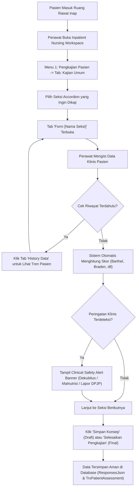
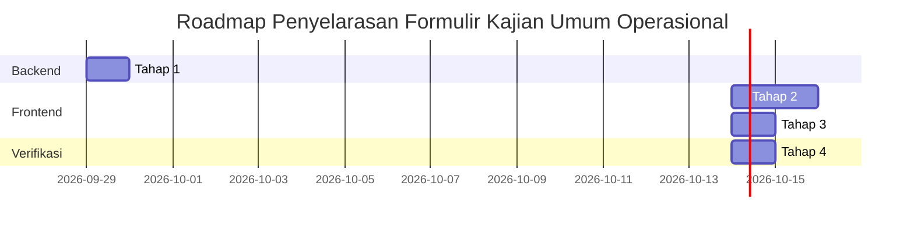

# Rencana Kerja Penyelarasan Modul Keperawatan — Menu 1: Kajian Umum (Sesuai Acuan Operasional Rumah Sakit)

## 1. Ringkasan Eksekutif & Identitas Dokumen

| Atribut | Keterangan |
| :--- | :--- |
| **Nama Modul** | Rawat Inap — Pelayanan Keperawatan (*Inpatient Nursing Workspace*) |
| **Menu Sasaran** | Menu 1: Pengkajian Pasien (*Patient Assessment*) — Sub-Menu: Kajian Umum |
| **Dasar Penyelarasan** | 9 Tangkapan Layar Acuan Operasional Nyata Rumah Sakit pada folder `referensi/kajian-umum/` |
| **Prinsip Rekayasa** | **Zero Migration** (Tidak mengubah skema tabel database). Menggunakan `ResponsesJson` pada `CliAssessmentInstrumentResponse` dan kolom terikat entitas `TrxPatientAssessment`. |
| **Tujuan Akhir** | Menghasilkan formulir dan tampilan Kajian Umum yang 100% presisi mengikuti tampilan operasional rumah sakit (layout accordion, sub-tab Form/History, tabel matriks status fungsional Barthel 0-2, 3 kartu skrining gizi, indikator ADL terpadu, dan layout 2 kolom). |

---

## 2. Hasil Analisis 9 Tangkapan Layar Operasional (`referensi/kajian-umum`)

Berdasarkan analisis visual dan fungsional terhadap 9 gambar acuan operasional di folder `referensi/kajian-umum/`, teridentifikasi struktur dan komponen baku yang berlaku:

### 2.1. Karakteristik Visual & Pola Navigasi Bersama (Global Pattern)
1. **Accordion Header Berwarna Soft Cyan**:
   - Latar belakang header seksi berwarna *soft cyan/sky* (`#f0f7fb` / `#e8f4fa`).
   - Judul seksi teks tebal berwarna *teal/cyan* (`#0891b2` / `#0d9488`).
   - Ikon pembuka/penutup lipatan (*chevron* `v` / `^`) di ujung kanan tanpa lingkaran nomor seksi.
2. **Sub-Tab Internal Dua Arah di Setiap Seksi**:
   - Setiap seksi memiliki 2 tab internal:
     - **`Form [Nama Seksi]`**: Menampilkan formulir aktif untuk input/edit pengkajian pasien.
     - **`History Data`**: Menampilkan tabel riwayat pencatatan untuk seksi tersebut dari waktu ke waktu (berguna untuk audit klinis & pemantauan perkembangan kondisi).
   - Tab aktif ditandai garis bawah (*border-bottom*) warna teal tebal dan teks berwarna teal.

---

### 2.2. Rincian Analisis Seksi per Seksi

#### Seksi 1: Sumber Data Pasien (`Screenshot 2026-09-29 101758.png`)
- **Sumber Data**: Radio button horizontal (`Pasien`, `Orang Lain`).
- **Hubungan dengan Pasien**: Radio button horizontal (`Suami`, `Istri`, `Orang Tua`, `Kakak`, `Adik`, `Anak`, `Keluarga Lainnya`).
- **Nilai-Nilai Kepercayaan**: Area teks (*textarea*) ber-placeholder: *"Khusus pasien terkait pemberian pelayanan dan atau pengobatan..."*.
- **Keterangan Tambahan**: Area teks ber-placeholder: *"Catatan tambahan..."*.
- **Sub-Header Kondisi Psikologis**:
  - Grid 3 kolom checkbox:
    - Kolom 1: `Tenang`, `Cemas`
    - Kolom 2: `Takut`, `Marah`
    - Kolom 3: `Sedih`, `Kecenderungan Bunuh Diri`
  - Input teks **Lainnya** ber-placeholder: *"Masukkan kondisi psikologis lainnya"*.
- **Sub-Header Sosial & Ekonomi**:
  - **Hubungan Pasien dengan anggota keluarga/tetangga**: Radio button (`Baik`, `Tidak Baik`).
  - **Tempat Tinggal**: Multi-checkbox horizontal (`Rumah Pribadi`, `Kontrak`, `Rumah Keluarga`, `Panti Jompo`).

#### Seksi 2: Pernapasan (`Screenshot 2026-09-29 101407.png`)
- **Tata Letak**: 2 Kolom Sejajar (*2-column grid*):
  - **Kolom Kiri**:
    - **Kesulitan Bernapas**: Radio button (`Ya`, `Tidak`).
    - **Pemakaian O2**: Input teks/angka ber-placeholder: *"Masukkan nilai dalam L/menit"*.
    - **Jenis Alat**: Input teks ber-placeholder: *"Contoh: Nasal Kanul, Simple Mask"*.
    - **Gejala yang Diamati**: Susunan checkbox vertikal:
      - `Dispnea`
      - `Ortopnea`
      - `Sianosis`
      - `Sesak`
      - `Batuk Produktif`
      - `Batuk Non-Produktif`
  - **Kolom Kanan**:
    - **Batuk**: Radio button (`Ya`, `Tidak`).
    - **Pola Pernapasan**: Radio button (`Regular`, `Irregular`).

#### Seksi 3: Integritas Kulit (`Screenshot 2026-09-29 101414.png`)
- **Tata Letak**: 2 Kolom Sejajar + 1 Kolom Penuh Bawah:
  - **Kolom Kiri**:
    - **Terganggu**: Radio button (`Ya`, `Tidak`).
    - **Deskripsi (Kondisi Kulit Pasien)**: Susunan checkbox vertikal:
      - `Rash (Ruam)`
      - `Parut (Bekas Luka/Jaringan Parut)`
      - `Memar (Lebam)`
      - `Sianotik (kebiruan)`
      - `Berkeringat Banyak (Basah Berlebih)`
  - **Kolom Kanan**:
    - **Skala/Braden Score Dekubitus**: Input angka/teks ber-placeholder: *"Masukkan nilai"*.
  - **Bawah (Lebar Penuh)**:
    - **Keterangan Tambahan**: Textarea ber-placeholder: *"Masukkan keterangan tambahan..."*.

#### Seksi 4: Skrining Nutrisi (`Screenshot 2026-09-29 101421.png`)
- **Struktur**: 3 Kotak Sub-Kartu dengan Banner Abu-abu Kebiruan (*Sub-header Cards*):
  1. **Sub-Kartu 1: Skrining Nutrisi Dewasa**:
     - `[ ] IMT < 18,5 atau > 25`
     - `[ ] Kehilangan BB yang tidak diinginkan dalam 3 bulan terakhir`
     - `[ ] Asupan makan berkurang dalam 1 minggu terakhir`
     - `[ ] Menderita penyakit berat`
  2. **Sub-Kartu 2: Skrining Nutrisi Anak**:
     - `[ ] Pasien tampak kurus`
     - `[ ] BB menurun/tetap selama 1 bulan terakhir`
     - `[ ] Tidak ada kenaikan BB dalam 3 bulan terakhir`
     - `[ ] Diare > 5x sehari dan/atau muntah > 3x sehari dalam seminggu terakhir`
     - `[ ] Muntah > 5x sehari dalam seminggu terakhir`
     - `[ ] Asupan makanan berkurang dalam 1 minggu terakhir`
  3. **Sub-Kartu 3: Skrining Nutrisi Obesitas**:
     - `[ ] Mengalami gangguan metabolisme (DM, Hipertensi, Dislipidemia, dll)`
     - `[ ] BB berlebih atau mengalami penurunan/kenaikan BB yang tidak diinginkan`
     - `[ ] Hasil pemeriksaan HB dan HCT di bawah atau di atas nilai normal`
     - `[ ] Mengalami kesulitan dalam mengonsumsi makanan dan nafsu makan menurun`

#### Seksi 5: Eliminasi (`Screenshot 2026-09-29 101427.png`)
- **Tata Letak**: 2 Kolom Sejajar + 1 Kolom Penuh Bawah:
  - **Kolom Kiri**:
    - **Masalah Perkemihan**: Checkbox tunggal `Masalah Perkemihan: Ya/Tidak`.
    - **Masalah Defekasi**: Checkbox tunggal `Masalah Defekasi: Ya/Tidak`.
  - **Kolom Kanan**:
    - **Warna BAK**: Input teks ber-placeholder: *"Contoh: kuning jernih"*.
    - **Alat Bantu Eliminasi**: Input teks ber-placeholder: *"Contoh: kateter"*.
    - **Jenis Kateter**: Input teks ber-placeholder: *"Contoh: Foley"*.
    - **Ukuran Kateter**: Input teks ber-placeholder: *"Contoh: 16 Fr"*.
  - **Bawah (Lebar Penuh)**:
    - **Keterangan Tambahan**: Textarea ber-placeholder: *"Masukkan keterangan tambahan..."*.

#### Seksi 6: Ketergantungan ADL (`Screenshot 2026-09-29 101437.png` & `101442.png`)
- **Banner Judul**: *"Tingkat Ketergantungan Pasien Saat Melakukan ADL"*
- **Petunjuk**: *"Indikator (Centang sesuai kondisi)"*
- **10 Baris Indikator Radio Pilihan**:
  1. **Mobilisasi**: `Mandiri` | `Dibantu` | `Ketergantungan Penuh`
  2. **Personal**: `Mandiri` | `Dibantu` | `Ketergantungan Penuh`
  3. **Toileting**: `Mandiri` | `Dibantu` | `Ketergantungan Penuh`
  4. **Berpakaian**: `Mandiri` | `Dibantu` | `Ketergantungan Penuh`
  5. **Makan/Minum**: `Mandiri` | `Dibantu` | `Ketergantungan Penuh`
  6. **Kesadaran**: `Sadar` | `Gelisah` | `Koma`
  7. **Observasi TTV**: `Setiap 8 Jam` | `Setiap 4 Jam` | `Setiap 2-4 Jam`
  8. **Respirasi**: `Normal` | `Oksigenisasi` | `Isap Lendir`
  9. **Pengobatan**: `Oral` | `Injeksi > 3 Kali` | `Injeksi < 3 Kali`
  10. **Lapor kepada Dokter DPJP**: Checkbox tunggal `[ ] Ya`
- **Garis Pembatas Horizontal**
- **Alat Bantu ADL (Bisa pilih lebih dari 1)**: Multi-checkbox horizontal:
  - `Penyangga`, `Gigi Palsu`, `Tongkat`, `Kacamata/Lensa Kontak`, `Kursi Roda`, `Mata Palsu`, `Pacemaker`, `Alat Bantu Dengar`, `Walker`
- **Keterangan Tambahan**: Textarea ber-placeholder: *"Masukkan keterangan tambahan jika diperlukan..."*.

#### Seksi 7: Status Fungsional Barthel Index (`Screenshot 2026-09-29 101458.png` & `101503.png`)
- **Judul**: *"Status Fungsional"*
- **Kotak Informasi Biru**:
  > *"Status fungsional pasien dinilai dengan skala 0-2 untuk setiap aktivitas:*  
  > *• 0 = Tidak terkendali / Tidak mampu / Bergantung pada orang lain*  
  > *• 1 = Kadang-kadang tidak terkendali / Perlu bantuan / Perlu pertolongan*  
  > *• 2 = Terkendali / Mandiri"*
- **Tabel Matriks Penilaian (10 Butir Aktivitas)**:
  - Kolom tabel: `No` | `Aktivitas` | `0` | `1` | `2`
  - Setiap baris memiliki tombol radio pada kolom 0, 1, dan 2.
  - Butir aktivitas:
    1. Memakai Baju
    2. Naik Turun Tangga
    3. Mandi
    4. Mengendalikan rangsang defekasi
    5. Mengendalikan rangsang defekasi (BAB)
    6. Mengendalikan rangsang berkemih (BAK)
    7. Membersihkan Diri
    8. Penggunaan Jamban
    9. Makan
    10. Berpindah / Transfer
- **Informasi Pagination**: *"Menampilkan 1 sampai 10 data"*
- **Bar Rekapitulasi Skor Interaktif**:
  - **Total Score**: `0 / 20` (otomatis menjumlahkan nilai radio yang dipilih secara real-time).
  - **Status**: Lencana warna cerah (contoh: lencana merah `Ketergantungan Total`).
- **Kotak Peringatan Kuning (Interpretasi Total Score)**:
  > *⚠️ **Interpretasi Total Score:***  
  > *• 0-4: Ketergantungan total*  
  > *• 5-8: Ketergantungan berat*  
  > *• 9-11: Ketergantungan sedang*  
  > *• 12-19: Ketergantungan ringan*  
  > *• 20: Mandiri*

---

## 3. Alur Proses Bisnis & Skenario Penggunaan Operasional

### 3.1. Alur Kerja Pengkajian Keperawatan

```mermaid
flowchart TD
    A["Pasien Masuk Ruang Rawat Inap"] --> B["Perawat Buka Inpatient Nursing Workspace"]
    B --> C["Menu 1: Pengkajian Pasien -> Tab: Kajian Umum"]
    C --> D["Pilih Seksi Accordion yang Ingin Dikaji"]
    D --> E["Tab 'Form [Nama Seksi]' Terbuka"]
    E --> F["Perawat Mengisi Data Klinis Pasien"]
    F --> G{"Cek Riwayat Terdahulu?"}
    G -- "Ya" --> H["Klik Tab 'History Data' untuk Lihat Tren Pasien"]
    H --> E
    G -- "Tidak" --> I["Sistem Otomatis Menghitung Skor (Barthel, Braden, dll)"]
    I --> J{"Peringatan Klinis Terdeteksi?"}
    J -- "Ya" --> K["Tampil Clinical Safety Alert Banner (Dekubitus / Malnutrisi / Lapor DPJP)"]
    J -- "Tidak" --> L["Lanjut ke Seksi Berikutnya"]
    K --> L
    L --> M["Klik 'Simpan Konsep' (Draft) atau 'Selesaikan Pengkajian' (Final)"]
    M --> N["Data Tersimpan Aman di Database (ResponsesJson & TrxPatientAssessment)"]
```

### 3.2. Skenario Nyata di Rumah Sakit
> **Kasus Nyata Bangsal Bedah / Penyakit Dalam:**  
> Ns. Tri Handayani menerima pasien pindahan IGD bernama **Ny. Maria (64 tahun)** dengan keluhan sesak napas dan tirah baring lama pasca operasi ortopedi.  
> 1. Ns. Tri membuka tab **Kajian Umum**.  
> 2. Pada seksi **Pernapasan**, Ns. Tri mencentang *"Kesulitan Bernapas: Ya"*, *"Pemakaian O2: 3"*, *"Jenis Alat: Nasal Kanul"*, *"Pola Pernapasan: Regular"*, serta mencentang *"Dispnea"* dan *"Sesak"*.  
> 3. Pada seksi **Integritas Kulit**, Ns. Tri mengisi *"Terganggu: Ya"*, *"Braden Score: 10"*. Sistem secara instan menampilkan peringatan keselamatan merah: *"Pasien berisiko tinggi dekubitus. Pasang kasur anti-dekubitus dan jadwalkan alih baring tiap 2 jam."*  
> 4. Pada seksi **Skrining Nutrisi**, Ns. Tri mencentang *"Asupan makan berkurang dalam 1 minggu terakhir"* pada kartu Dewasa.  
> 5. Pada seksi **Status Fungsional**, Ns. Tri mengklik radio nilai pada tabel 10 baris. Total score terhitung otomatis **6 / 20** dengan badge berstatus **"Ketergantungan Berat"**.  
> 6. Ns. Tri dapat mengecek tab **History Data** untuk melihat apakah di IGD pasien sudah pernah diukur status fungsionalnya.  
> 7. Ns. Tri menekan **"Simpan Konsep"**. Seluruh data klinis tersimpan secara terstruktur tanpa ada catatan yang tertinggal.

---

## 4. Analisis Kesenjangan (*Gap Analysis*)

| Area | Implementasi Saat Ini di `QuilvianFinal` | Kebutuhan Operasional Rumah Sakit (Screenshot) | Kesenjangan & Tindakan Solusi |
| :--- | :--- | :--- | :--- |
| **Gaya Header Seksi** | Header abu-abu dengan lingkaran nomor urut (`sectionNumberBadge`). | Header *soft cyan* (`#f0f7fb`), tipografi *teal/cyan*, panah chevron bersih tanpa lingkaran nomor. | Sesuaikan styling CSS header seksi agar bersih dan identik dengan acuan. |
| **Sub-Tab Internal** | Tidak ada sub-tab di dalam kartu seksi accordion. | Ada 2 tab: `Form [Nama Seksi]` dan `History Data`. | Tambahkan tab strip internal di dalam masing-masing seksi accordion. |
| **Status Fungsional** | Dirender sebagai butir radio vertikal generik per nomor. | Tabel matriks 10 baris dengan 3 kolom radio (0, 1, 2), kalkulator skor interaktif (0-20), badge status, dan kartu kuning interpretasi. | Buat komponen khusus tabel matriks Status Fungsional yang responsif dan interaktif. |
| **Skrining Nutrisi** | Dirender sebagai dropdown angka MST berurutan. | 3 Sub-kartu ber-header abu-abu: Dewasa (4 checkbox), Anak (6 checkbox), Obesitas (4 checkbox). | Buat renderer khusus 3 sub-kartu Skrining Nutrisi. |
| **Ketergantungan ADL** | Dirender sebagai dropdown/radio biasa tanpa pengelompokan. | Banner abu-abu *"Tingkat Ketergantungan Pasien Saat Melakukan ADL"*, 10 indikator teratur, pembatas, dan checkbox alat bantu horizontal. | Susun komponen tata letak ADL indikator terpadu sesuai operasional. |
| **Pernapasan, Kulit, Eliminasi** | Kontrol generik bertumpuk. | Layout 2 kolom sejajar dengan placeholder deskriptif ("Contoh: Nasal Kanul", "Masukkan nilai dalam L/menit", dll). | Buat tata letak grid 2 kolom dengan teks placeholder operasional. |
| **Seeder Backend** | Item code pada seeder sebagian belum mencakup opsi visual operasional. | Butir instrumen harus cocok dengan kode yang dikirim dari formulir operasional. | Perbarui `ClinicalInstrumentDraftSeeder.cs` agar sinkron dengan seluruh kode butir operasional. |

---

## 5. Spesifikasi Kontrak API (Swagger-Style)

### 5.1. Endpoint Pengambilan Definisi Kajian Umum
* **Tag**: `[Tags("Clinical Instrument")]`
* **Method & Path**: `GET /api/v1/health-services/clinical-management/clinical-instruments/resolve`
* **Deskripsi**: Mengambil skema definisi aktif untuk `GeneralNursingAssessmentForm` (Kind: 1).
* **Otorisasi**: Bearer Token (`PatientAssessment:Read`)
* **Query Parameters**:
  - `kind`: `1` (Integer)
  - `episodeId`: `Guid`

### 5.2. Endpoint Penyimpanan Pengkajian Pasien
* **Tag**: `[Tags("Patient Assessment")]`
* **Method & Path**: `POST /api/v1/health-services/clinical-management/patient-assessments`
* **Deskripsi**: Menyimpan jawaban pengkajian awal atau ulang keperawatan rawat inap.
* **Otorisasi**: Bearer Token (`PatientAssessment:Write`)
* **Request Body Payload**:
```json
{
  "episodeId": "a1b2c3d4-e5f6-7890-abcd-ef1234567890",
  "encounterId": "b2c3d4e5-f6a7-8901-bcde-f12345678901",
  "assessmentType": 0,
  "consciousnessStatus": 1,
  "isUsingOxygen": true,
  "oxygenSupportType": 1,
  "oxygenFlowRate": 3.0,
  "functionalStatus": 1,
  "nutritionRiskStatus": 1,
  "nutritionRiskScore": 1,
  "instrumentVersionId": "c1a1f000-0107-4a01-9b02-000000000004",
  "responsesJson": "{\"RESP_DIFFICULTY\":true,\"RESP_COUGH\":true,\"RESP_O2_USAGE_VAL\":\"3\",\"RESP_O2_DEVICE_TXT\":\"Nasal Kanul\",\"RESP_PATTERN\":\"REGULAR\",\"RESP_SYMPTOMS\":[\"DYSPNEA\",\"SESAK\"],\"SKIN_IMPAIRED\":true,\"SKIN_BRADEN_SCORE\":10,\"SKIN_CONDITIONS\":[\"RASH\",\"BRUISE\"],\"NUT_DEWASA\":[\"IMT_EXTREME\",\"LOSS_WEIGHT\"],\"ELIM_URINE_PROB\":true,\"ELIM_URINE_COLOR\":\"kuning jernih\",\"ELIM_CATHETER_TYPE\":\"Foley\",\"ELIM_CATHETER_SIZE\":\"16 Fr\",\"DEP_MOBILITY\":\"DIBANTU\",\"DEP_FEEDING\":\"MANDIRI\",\"DEP_AIDS\":[\"TONGKAT\",\"KURSI_RODA\"],\"FUNC_SCORES\":{\"1\":1,\"2\":0,\"3\":1,\"4\":1,\"5\":0,\"6\":1,\"7\":0,\"8\":1,\"9\":1,\"10\":0},\"FUNC_TOTAL_SCORE\":6}"
}
```

---

## 6. Rencana Kerja Bertahap (Vertical Slice Execution Plan)

Rencana kerja dibagi menjadi 4 tahap terukur dengan kriteria penyelesaian (*Definition of Done*) yang jelas:


```mermaid
gantt
    title Roadmap Penyelarasan Formulir Kajian Umum Operasional
    dateFormat  YYYY-MM-DD
    section Backend
    Tahap 1: Sinkronisasi Kamus Data & Seeder Backend        :t1, 2026-09-29, 1d
    section Frontend
    Tahap 2: Komponen Khusus Seksi & Tab Form/History        :t2, after t1, 2d
    Tahap 3: Integrasi Renderer & Real-time Scoring          :t3, after t2, 1d
    section Verifikasi
    Tahap 4: Pengujian Komprehensif & Verifikasi Bebas Galat :t4, after t3, 1d
```

### Tahap 1: Sinkronisasi Kamus Data & Seeder Backend (`ClinicalInstrumentDraftSeeder.cs`)
- **Tujuan**: Memastikan metadata instrumen `GENERAL_NURSING_ASSESSMENT` pada backend menyediakan struktur section, item code, label, dan placeholder yang selaras dengan 9 screenshot acuan.
- **File Target**:
  - `NewQuilvianSystemBackend/Areas/HealthServices/ClinicalManagement/Seeders/ClinicalInstrumentDraftSeeder.cs`
- **Definition of Done (DoD)**:
  - Definisi 7 seksi operasional (Sumber Data, Pernapasan, Integritas Kulit, Skrining Nutrisi, Eliminasi, Ketergantungan, Status Fungsional) terdaftar lengkap.
  - Opsi pilihan, checkbox list, dan input placeholder selaras dengan operasional.
  - Build backend (`dotnet build`) berhasil tanpa error compiler.

### Tahap 2: Desain Komponen UI Khusus Seksi Kajian Umum
- **Tujuan**: Membangun komponen UI visual khusus yang merefleksikan tampilan screenshot 1:1.
- **Komponen yang Dibuat/Disesuaikan**:
  1. **Sub-Tab Form/History**: Tab bar di bawah header seksi (`Form [Nama Seksi]` & `History Data`).
  2. **Status Fungsional Table Component**:
     - Tabel matriks 10 butir aktivitas dengan 3 radio kolom (0, 1, 2).
     - Kalkulator reaktif total skor (0/20) dan penentuan badge kategori status otomatis (0-4: Total, 5-8: Berat, 9-11: Sedang, 12-19: Ringan, 20: Mandiri).
     - Kartu callout kuning interpretasi skor.
  3. **Skrining Nutrisi 3-Card Component**:
     - Sub-kartu Dewasa (4 butir), Sub-kartu Anak (6 butir), Sub-kartu Obesitas (4 butir).
  4. **Ketergantungan ADL Component**:
     - 10 baris indikator radio, checkbox lapor DPJP, dan multi-checkbox alat bantu horizontal.
  5. **Grid 2-Kolom untuk Pernapasan, Integritas Kulit, dan Eliminasi**.
- **File Target**:
  - `QuilvianSystemFrontendDev/src/components/view/health-services/inpatient-management/nursing-workspace/sections/assessment/components/general-assessment/` (komponen baru)
  - `QuilvianSystemFrontendDev/src/style/health-services/inpatient-management/nursing-workspace.module.css` (penambahan gaya visual)
- **Definition of Done (DoD)**:
  - Tampilan visual 100% cocok dengan tata letak, warna, dan proporsi pada screenshot.
  - Komponen mendukung mode edit maupun mode hanya-baca (*read-only* saat dokumen selesai dikunci).

### Tahap 3: Integrasi ke Form Renderer & Penanganan Tab Riwayat (*History Data*)
- **Tujuan**: Menghubungkan komponen khusus tersebut ke dalam alur `ClinicalInstrumentFormRenderer.jsx` dan mengaitkan state responses formulir.
- **Aksi Rekayasa**:
  - Memperbarui `ClinicalInstrumentFormRenderer.jsx` agar saat `instrumentKind === 1` (Kajian Umum), merender susunan seksi operasional dengan sub-tab `Form` dan `History Data`.
  - Mengimplementasikan tampilan daftar riwayat (*History Data View*) yang menampilkan catatan pengkajian seksi sebelumnya berdasarkan `assessments` episode pasien.
  - Memastikan banner keselamatan klinis (*Clinical Safety Alerts*) tetap aktif secara reaktif.
- **File Target**:
  - `QuilvianSystemFrontendDev/src/components/view/health-services/inpatient-management/nursing-workspace/sections/assessment/renderer/clinical-instrument-form-renderer.jsx`
- **Definition of Done (DoD)**:
  - Form terhubung dengan hook `useClinicalInstrumentForm`.
  - Perubahan data langsung terikat (*two-way binding*) ke `responses` dan dapat disimpan melalui `onSaveDraft` maupun `onComplete`.
  - Tab `History Data` dapat menampilkan riwayat isian dari pengkajian yang telah selesai.

### Tahap 4: Pengujian Komprehensif & Verifikasi Bebas Regresi
- **Tujuan**: Menguji seluruh fungsionalitas pengkajian umum melalui unit test, linting, dan verifikasi tampilan.
- **Aksi Rekayasa**:
  - Menulis unit test baru `tests/unit/inpatient-general-assessment-operational-form.test.mjs` untuk memverifikasi elemen-elemen baru (sub-tab, kalkulasi Barthel skor, 3 kartu gizi, layout 2 kolom).
  - Menjalankan seluruh regression test suite `tests/unit/inpatient-*.test.mjs`.
  - Melakukan pengecekan linter ESLint (`npm run lint`).
- **File Target**:
  - `QuilvianSystemFrontendDev/tests/unit/inpatient-general-assessment-operational-form.test.mjs`
- **Definition of Done (DoD)**:
  - Seluruh unit test lulus 100% tanpa kegagalan (0 fail).
  - Tidak ada regresi pada menu keperawatan lainnya (Resiko Jatuh, Nyeri, Edukasi, Discharge Planning).
  - Laporan perubahan task terdokumentasi rapi.

---

## 7. Status Eksekusi & Bukti Penyelesaian Tuntas (100% Selesai)

Seluruh tahapan rencana kerja telah berhasil diselesaikan secara tuntas dan terverifikasi penuh:

| Tahap | Deskripsi Sasaran | Status | Artefak & Bukti Validasi |
| :--- | :--- | :---: | :--- |
| **Tahap 1** | Penyelarasan Seeder Backend (`ClinicalInstrumentDraftSeeder.cs`) | ✅ Selesai | [`BE-RWI-136-kajian-umum-operasional-seeder-alignment.md`](../../task/report/backend/BE-RWI-136-kajian-umum-operasional-seeder-alignment.md) — `dotnet build` lolos 0 Error, 0 Warning. |
| **Tahap 2** | Pembuatan Komponen UI Operasional Frontend (Sub-Tab, Barthel Index, 3 Kartu Gizi, ADL, Form 2-Kolom) | ✅ Selesai | 10 komponen modular di `general-assessment/` + utilitas kalkulasi Barthel murni `functional-status-utils.js` + styling di `nursing-workspace.module.css`. |
| **Tahap 3** | Integrasi Renderer & Sub-Tab History Data | ✅ Selesai | `clinical-instrument-form-renderer.jsx` & `assessment-section.jsx` mendukung `isOperationalGeneral` dan sub-tab Form vs History Data. |
| **Tahap 4** | Pengujian Komprehensif & Verifikasi Bebas Regresi | ✅ Selesai | [`FE-RWI-136-kajian-umum-operasional-penyelarasan.md`](../../task/report/frontend/FE-RWI-136-kajian-umum-operasional-penyelarasan.md) — Unit test operasional (4/4 PASS), test accordion & safety alerts (2/2 PASS), dan **686/686 regression test suite rawat inap PASS (0 FAIL)**. |

*Dokumen ini kini berstatus sebagai catatan implementasi final dan kontrak acuan operasional untuk modul Kajian Umum Keperawatan Rawat Inap di QuilvianFinal.*
