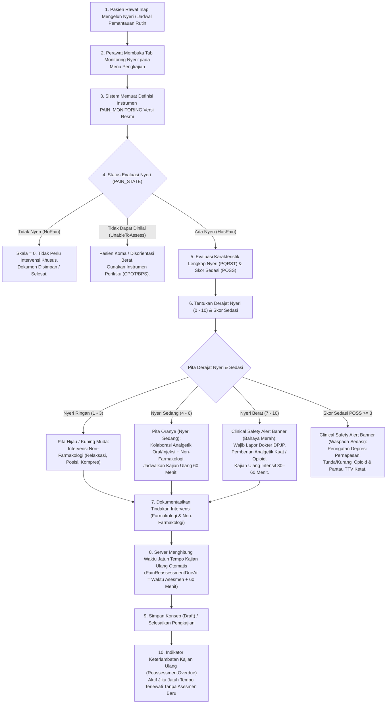

# Rencana Kerja Penyelarasan Modul Keperawatan — Menu 1: Monitoring Nyeri (Pain Assessment)

## 1. Ringkasan Eksekutif & Identitas Dokumen

| Atribut | Keterangan |
| :--- | :--- |
| **Nama Modul** | Pelayanan Kesehatan — Rawat Inap (*Inpatient Nursing Workspace*) |
| **Menu Sasaran** | Menu 1: Pengkajian Pasien (*Patient Assessment*) — Sub-Menu 3: Monitoring Nyeri (*Pain Assessment / Monitoring*) |
| **Dasar Penyelarasan** | Mengadopsi kelengkapan bisnis, parameter pengkajian komprehensif PQRST, skor sedasi (*Pasero Opioid-Induced Sedation Scale* - POSS), intervensi farmakologi & non-farmakologi, serta interval kajian ulang terjadwal dari **QuilvianV1** (acuan approved klien) ke dalam **QuilvianFinal** (arsitektur modern, bersih, dan berstandar KARS/SKP/JCI). |
| **Prinsip Kerja** | `QuilvianV1` berstatus **READ-ONLY** (hanya dibaca sebagai acuan bisnis). Seluruh implementasi kode baru dan penyelarasan dilakukan **hanya di QuilvianFinal**. |
| **Status Database** | **Zero Migration** (Tidak ada penambahan tabel atau alter table baru). Memanfaatkan entitas `TrxPatientAssessment` (`PainAssessmentState`, `PainScale`, `PainTrigger`, `PainQuality`, `PainLocation`, `PainFrequency`, `PainManagement`, `PainNote`, `PainReassessmentDueAt`, `VitalSignId`), `CliClinicalInstrument`, `CliClinicalInstrumentVersion`, dan `ResponsesJson` pada `CliAssessmentInstrumentResponse`. |

---

## 2. Latar Belakang & Masalah Bisnis

Pengendalian dan pemantauan nyeri merupakan hak asasi pasien dan indikator mutu pelayanan klinis utama rumah sakit. Akreditasi KARS (Komisi Akreditasi Rumah Sakit) dan standar JCI (Joint Commission International) menetapkan bahwa:
1. Setiap pasien rawat inap wajib diskrining keluhan nyeri saat admisi dan dipantau secara berkala selama masa perawatan.
2. Setiap pasien yang mengalami nyeri sedang hingga berat wajib mendapatkan intervensi adekuat (farmakologi dan/atau non-farmakologi).
3. Efektivitas penanganan nyeri **wajib dievaluasi ulang (*pain reassessment*)** dalam batas waktu tertentu (maksimal 30–60 menit setelah intervensi analgetik).
4. Penggunaan analgesia kuat (khususnya golongan opioid) wajib dipantau tingkat sedasinya menggunakan skala baku seperti **POSS (*Pasero Opioid-Induced Sedation Scale*)** guna mencegah komplikasi fatal depresi pernapasan.

### Temuan Perbandingan Bisnis V1 vs Final:

1. **QuilvianV1 (Kelebihan Bisnis Teruji):**
   - **Formulir Pengkajian & Intervensi Nyeri Lengkap:**
     - Penilaian skala nyeri numerik (0–10).
     - Pemantauan **Skor Sedasi** (0–4: *Alert*, Mengantuk Ringan, Sering Mengantuk, hingga Somnolen/Sulit Dibangunkan).
     - Formulir **Intervensi Farmakologi**: Pencatatan sumber obat (dari resep aktif pasien atau master obat), nama obat analgetik, takaran dosis, dan rute pemberian (Oral, IV, IM, SC, Topikal, Rektal, Inhalasi).
     - Formulir **Intervensi Non-Farmakologi**: Checklist tindakan mandiri perawat (Kompres Dingin, Kompres Hangat, Posisi Semifowler, Pijat Lembut, Terapi Musik, TENS, Relaksasi & Nafas Dalam).
     - Jadwal **Waktu Kajian Ulang (*Reassessment Time*)**: Perawat mencatat kapan evaluasi pasca-intervensi harus dilakukan.
     - Penandatanganan / paraf digital perawat penilai dan perawat pelaksana intervensi.
   - **Kelemahan Teknis V1:** Menggunakan tabel terisolasi (`TrxMonitoringNyeri`), menduplikasi tanda vital secara manual (tidak terintegrasi ke rekam medis utama), dan belum memiliki sistem peringatan dini otomatis.

2. **QuilvianFinal (Kelemahan & Kesenjangan Saat Ini):**
   - **Backend Seeder Sangat Minimalis (`ClinicalInstrumentDraftSeeder.cs:510`):**
     - Definisi instrumen `PAIN_MONITORING` saat ini hanya berupa 1 seksi generik dengan 7 butir teks/angka bebas.
     - Parameter penting seperti **Skor Sedasi (POSS)**, rute dan intervensi farmakologi terstandar, serta checklist intervensi non-farmakologi belum terdefinisi dalam struktur instrumen.
     - Pita risiko nyeri (*Bands*) belum dikonfigurasi: Tidak Nyeri (0), Nyeri Ringan (1–3), Nyeri Sedang (4–6), dan Nyeri Berat (7–10).
     - **Interval Kajian Ulang Nyeri Masih Kosong (`ReassessmentMinutes = null`):** Terdapat catatan penanda *review flag* bahwa gate `G-04` belum diputuskan, sehingga kolom `PainReassessmentDueAt` tidak pernah terhitung otomatis oleh server saat dokumen disimpan.
   - **Frontend UI & Visual Experience:**
     - Renderer formulir berinstrumen terpadu (`ClinicalInstrumentFormRenderer`) sudah memiliki pemilih status evaluasi nyeri (`PAIN_STATE`: Tidak Nyeri / Nyeri / Tidak Dapat Dinilai), namun belum memiliki tampilan visual skala nyeri interaktif (gradasi warna dan indikator visual Wong-Baker FACES) seperti yang ada di `base-skala-pain.jsx`.
     - Belum ada banner peringatan keselamatan klinis (*Clinical Safety Alerts*) ketika pasien mengalami **Nyeri Berat ($\ge 7$)** atau **Sedasi Berlebih (Skor POSS $\ge 3$)**.

---

## 3. Alur Proses Bisnis & Keselamatan Pasien

Alur monitoring nyeri terpadu berjalan dengan urutan proses sebagai berikut:



### Skenario Nyata di Rumah Sakit:

#### Skenario 1: Pasien Pasca Operasi dengan Nyeri Sedang (Ruang Bedah)
> **Profil:** Tn. Bambang (48 tahun), 6 jam pasca operasi apendektomi, sadar penuh (*Compos Mentis*).  
> 1. Perawat Ns. Rian membuka tab **Monitoring Nyeri** dan memilih status **"Ada Nyeri"**.  
> 2. Ns. Rian memilih metode pengukuran **NRS (*Numeric Rating Scale*)** dengan skor **5** (Nyeri Sedang).  
> 3. Skor sedasi POSS dinilai **1** (Sadar penuh dan waspada).  
> 4. Karakteristik PQRST diisi: Lokasi *Abdomen kanan bawah*, Kualitas *Pegal dan tertusuk*, Faktor pemicu *Saat batuk atau bergerak miring*, Frekuensi *Hilang timbul*.  
> 5. Intervensi yang diberikan:
>    - Non-farmakologi: *Pengaturan posisi semifowler dan latihan nafas dalam*.
>    - Farmakologi: *Ketorolac 30 mg IV bolus sesuai instruksi DPJP*.  
> 6. Dokumen diselesaikan. Server secara otomatis menetapkan `PainReassessmentDueAt` 60 menit kemudian (pukul 15.00).  
> 7. Jika hingga pukul 15.00 belum ada asesmen nyeri lanjutan, kartu progres keperawatan memunculkan status `ReassessmentOverdue` berwarna amber untuk mengingatkan perawat bangsal.

#### Skenario 2: Pasien Kanker / Nyeri Berat dengan Pemantauan Sedasi Opioid
> **Profil:** Ny. Suryani (56 tahun), dirawat di Ruang Onkologi dengan nyeri tulang akibat metastasis.  
> 1. Perawat Ns. Fitri melakukan evaluasi nyeri berkala. Pasien mengeluh nyeri hebat dengan skala **8** (Nyeri Berat).  
> 2. Sistem langsung menampilkan banner merah berkedip: *"PERHATIAN KLINIS: Pasien Mengalami Nyeri Berat (Skala: 8 ≥ 7). Wajib lapor dokter DPJP untuk pemberian analgetik adekuat dan lakukan pemantauan ketat."*  
> 3. Pasien mendapatkan injeksi Morfin 5 mg IV.  
> 4. Saat evaluasi 30 menit kemudian, perawat menilai skala sedasi POSS pasien berada pada level **3** (*Sering mengantuk, tertidur saat diajak berbicara*).  
> 5. Sistem memunculkan banner bahaya keselamatan: *"PERINGATAN KESELAMATAN: Pasien Mengalami Sedasi Berlebih (Skor POSS 3). Risiko depresi pernapasan tinggi! Segera laporkan DPJP untuk titrasi penurunan dosis opioid dan pantau saturasi oksigen."*

---

## 4. Struktur Rencana Kerja (3 Tahap Eksekusi)

```mermaid
flowchart LR
    subgraph Tahap1["Tahap 1: Backend Seeder & Interval Alignment"]
        T1A["Perbarui Seeder PAIN_MONITORING<br/>(PQRST, POSS Sedasi, Intervensi)"]
        T1B["Tetapkan ReassessmentMinutes = 60<br/>(Kajian Ulang Otomatis)"]
        T1C["Konfigurasi 4 Pita Skor Nyeri Baku<br/>(0, 1-3, 4-6, 7-10 Alert)"]
        T1D["Kompilasi dotnet build (0 Error)"]
    end
    
    subgraph Tahap2["Tahap 2: Frontend Visual Selector & Alerts"]
        T2A["Injeksi Visual Pain Scale Selector<br/>(Wong-Baker FACES & Gradasi Skor)"]
        T2B["Banner Peringatan Keselamatan Real-Time<br/>(Nyeri Berat >= 7 & Sedasi POSS >= 3)"]
        T2C["Binding Kolom Otomatis Tanpa Eror<br/>(Sesuai ISSUE-KEP-004)"]
    end
    
    subgraph Tahap3["Tahap 3: Verifikasi & Laporan Tracked"]
        T3A["Unit Test Baru Monitoring Nyeri"]
        T3B["Regresi Seluruh Test Pengkajian"]
        T3C["Laporan BE-RWI-129 & FE-RWI-129"]
    end
    
    Tahap1 --> Tahap2 --> Tahap3
```



---

### Tahap 1: Backend Seeder, Interval Reassessment, & Bands Alignment (`BE-RWI-129`)

1. **Pembaruan Seeder `ClinicalInstrumentDraftSeeder.cs` untuk `PAIN_MONITORING`:**
   - **Seksi 1: Status & Skala Nyeri (`NYERI_SKALA`):**
     - `PAIN_STATE`: Status evaluasi nyeri (Single: `NoPain` / `HasPain` / `UnableToAssess`) — terikat pada kolom `PainAssessmentState`.
     - `PAIN_TOOL`: Pilihan alat ukur klinis terstandar:
       - `NRS`: *Numeric Rating Scale* (Dewasa kooperatif, angka 0–10)
       - `WONG_BAKER`: *Wong-Baker FACES Pain Rating Scale* (Anak > 3 tahun & lansia dengan kendala bahasa)
       - `CPOT`: *Critical-Care Pain Observation Tool* (Pasien ICU / ventilator / tidak sadar)
       - `FLACC`: *Face, Legs, Activity, Cry, Consolability* (Bayi & balita < 3 tahun)
     - `PAIN_SCALE`: Derajat intensitas nyeri (Number: 0–10) — terikat pada kolom `PainScale`.
     - `PAIN_SEDATION`: Tingkat sedasi pasien berbasis skala POSS (*Pasero Opioid-Induced Sedation Scale*):
       - `0`: Tidur, mudah dibangunkan
       - `1`: Sadar penuh dan waspada
       - `2`: Mengantuk ringan, mudah dibangunkan
       - `3`: Sering mengantuk, tertidur saat diajak bicara (Waspada overdosis opioid)
       - `4`: Somnolen, sulit atau tidak dapat dibangunkan (Bahaya depresi napas)
   - **Seksi 2: Karakteristik Klinis Nyeri PQRST (`NYERI_PQRST`):**
     - `PAIN_LOCATION`: Lokasi anatomis nyeri — terikat pada kolom `PainLocation` (Text).
     - `PAIN_RADIATION`: Penjalaran nyeri (Single: `NO` = Tidak menjalar, `YES` = Menjalar ke area lain).
     - `PAIN_QUALITY_SEL`: Karakter / kualitas sensasi nyeri (Single: `TERTUSUK` = Tertusuk-tusuk, `BERDENYUT` = Berdenyut, `TERBAKAR` = Panas / Terbakar, `TUMPUL` = Tumpul / Pegal, `MELILIT` = Kram / Melilit, `MENUSUK` = Tajam menusuk, `TERIRIS` = Teriris / Sayat) — terikat pada `PainQuality`.
     - `PAIN_TRIGGER_SEL`: Faktor pencetus / provokasi (Single: `GERAK` = Saat bergerak / mobilisasi, `BATUK` = Saat batuk / bernafas dalam, `TEKANAN` = Sentuhan / tekanan, `SPONTAN` = Terus-menerus tanpa pemicu, `PASCA_BEDAH` = Luka operasi / tindakan) — terikat pada `PainTrigger`.
     - `PAIN_FREQUENCY`: Frekuensi & durasi nyeri (Single: `HILANG_TIMBUL` = Hilang timbul, `TERUS_MENERUS` = Terus-menerus menetap, `INTERMITEN` = Intermiten / periodik) — terikat pada `PainFrequency`.
   - **Seksi 3: Rencana & Intervensi Manajemen Nyeri (`NYERI_INTERVENSI`):**
     - `PAIN_NON_PHARM`: Checklist tindakan non-farmakologi (Multi: `RELAKSASI` = Relaksasi & Nafas Dalam, `KOMPRES_HANGAT` = Kompres Hangat, `KOMPRES_DINGIN` = Kompres Dingin, `POSISI` = Pengaturan Posisi / Semifowler, `MASASE` = Masase / Pijat Lembut, `MUSIK_DISTRAKSI` = Terapi Musik / Distraksi, `TENS` = Stimulasi Saraf Elektrik TENS, `EDUKASI` = Edukasi Manajemen Nyeri Pasien/Keluarga).
     - `PAIN_PHARM_GIVEN`: Ada pemberian terapi obat analgetik (Boolean: Ya / Tidak).
     - `PAIN_MED_NAME`: Nama obat analgetik yang diberikan (Text).
     - `PAIN_MED_DOSE`: Dosis & takaran obat (Text).
     - `PAIN_MED_ROUTE`: Rute pemberian obat analgetik (Single: `ORAL` = Oral, `IV` = Intravena, `IM` = Intramuskular, `SC` = Subkutan, `TOPIKAL` = Topikal / Salep, `REKTAL` = Rektal / Supositoria, `INHALASI` = Inhalasi).
     - `PAIN_INTERVENTION`: Catatan intervensi terpadu — terikat pada kolom `PainManagement` (Text).
     - `PAIN_NOTE`: Catatan respon klinis pasien setelah tindakan — terikat pada kolom `PainNote` (Text).

2. **Konfigurasi Pita Skor Nyeri Baku (*Bands*):**
   - Skor 0: `NO_PAIN` ("Tidak Nyeri"), `[0, 1)`, alert: `false`
   - Skor 1–3: `MILD` ("Nyeri Ringan"), `[1, 4)`, alert: `false`
   - Skor 4–6: `MODERATE` ("Nyeri Sedang"), `[4, 7)`, alert: `false`
   - Skor 7–10: `SEVERE` ("Nyeri Berat"), `[7, null)`, alert: `true` (Memicu sinyal klinis)

3. **Penetapan Interval Kajian Ulang (`ReassessmentMinutes = 60`):**
   - Menetapkan durasi baku kajian ulang nyeri sebesar **60 menit** pada definisi instrumen.
   - Menghapus penanda keraguan *review flag* `G-04`.
   - Mekanisme backend pada `NursingAssessmentDocumentService.cs:223` akan secara otomatis mengaktifkan perhitungan:
     ```csharp
     entity.PainReassessmentDueAt =
         painAssessmentState == PainAssessmentState.HasPain && definisiDipakai?.ReassessmentMinutes is int menit
             ? entity.AssessmentDateTime.AddMinutes(menit)
             : null;
     ```

4. **Kompilasi & Integritas Backend:**
   - Jalankan `dotnet build --no-incremental` pada project backend.
   - Memastikan hasil build tetap **0 Error(s)**.

---

### Tahap 2: Frontend Visual Pain Scale, Sedation Score, & Safety Alerts (`FE-RWI-129`)

1. **Peningkatan Tampilan pada `clinical-instrument-form-renderer.jsx`:**
   - **Visual Skala Nyeri Interaktif (Wong-Baker FACES / Visual Rating Bar):**
     - Saat formulir adalah `PAIN_MONITORING` (`instrumentKind === 3`), sediakan selektor visual interaktif untuk `PAIN_SCALE` yang menampilkan 6 ekspresi wajah (0 = Tersenyum senang, 2 = Senyum kecil, 4 = Wajah datar, 6 = Wajah sedih, 8 = Wajah meringis sakit, 10 = Wajah menangis histeris) dan gradasi bar numerik 0–10 sesuai warna standar (Hijau $\to$ Kuning $\to$ Oranye $\to$ Merah).
   - **Clinical Safety Alerts Real-Time:**
     - **Peringatan Nyeri Berat ($\ge 7$):**
       - Menampilkan spanduk peringatan merah pekat:
         > *"PERHATIAN KLINIS: Pasien Teridentifikasi Mengalami NYERI BERAT (Skala: X ≥ 7). Segera laporkan dokter DPJP untuk tatalaksana analgetik kuat/parenteral dan lakukan evaluasi ulang intensif dalam 30–60 menit."*
     - **Peringatan Sedasi Berlebih (Skor POSS 3 atau 4):**
       - Menampilkan spanduk peringatan bahaya:
         > *"PERHATIAN KESELAMATAN: Pasien Mengalami Sedasi Berlebih (Skor POSS 3/4). Waspada risiko depresi pernapasan! Tunda/kurangi pemberian opioid dan pantau tanda vital (khususnya frekuensi pernapasan & saturasi O2) secara ketat."*
   - **Kepatuhan Invariant Binding Kolom (Zero Conflict):**
     - Memastikan seluruh butir yang memiliki atribut `Binding` (`PAIN_STATE`, `PAIN_SCALE`, `PAIN_LOCATION`, `PAIN_QUALITY_SEL`, `PAIN_TRIGGER_SEL`, `PAIN_FREQUENCY`, `PAIN_INTERVENTION`, `PAIN_NOTE`) disaring secara bersih oleh `filterUnboundResponses` sehingga tidak pernah memicu galat `HTTP 400 Bad Request` (sesuai ketetapan `ISSUE-KEP-004`).

2. **Visibilitas Status Kajian Ulang (*Reassessment Due*):**
   - Menampilkan batas waktu jatuh tempo kajian ulang (`PainReassessmentDueAt`) pada ringkasan pengkajian aktif.
   - Jika waktu jatuh tempo terlewati dan belum ada pengkajian baru, munculkan lencana peringatan *"Kajian Ulang Terlambat"* berbasis `ReassessmentOverdue` dari `useNursingAssessmentProgress`.

---

### Tahap 3: Verifikasi Komprehensif, Unit Test, & Pelaporan Tracked

1. **Pengujian Otomatis Unit Test:**
   - Buat berkas pengujian baru: `QuilvianSystemFrontendDev/tests/unit/inpatient-pain-monitoring-instruments-and-alerts.test.mjs`.
   - Menguji:
     - Struktur 3 seksi instrumen `PAIN_MONITORING` dan kelengkapan butir PQRST, POSS Sedasi, dan Intervensi.
     - Ambang batas dan visualisasi pita derajat nyeri (0, 1–3, 4–6, 7–10).
     - Kemunculan banner peringatan keselamatan klinis untuk Nyeri Berat ($\ge 7$) dan Sedasi Berlebih (POSS 3/4).
     - Perhitungan jatuh tempo kajian ulang `PainReassessmentDueAt` berbasis interval 60 menit.
     - Penolakan finalisasi pengkajian bila `PAIN_STATE` belum dipilih atau jika `HasPain` tetapi skala belum diisi (VAL-KEP-22a).
   - Jalankan seluruh suite test pengkajian pasien rawat inap untuk menjamin zero regression.

2. **Penyusunan Laporan Tracked Sesuai Standar Quilvian:**
   - `NewQuilvianSystemBackend/docs/module-blueprints/rawat-inap/keperawatan/task/report/backend/BE-RWI-129-monitoring-nyeri-seeder-alignment.md`
   - `NewQuilvianSystemBackend/docs/module-blueprints/rawat-inap/keperawatan/task/report/frontend/FE-RWI-129-monitoring-nyeri-ui-dan-safety-alerts.md`
   - Perbarui matriks ketertelusuran di `requirement-traceability-v2.md`.

---

## 5. Spesifikasi Kontrak API (Swagger-Style)

Semua endpoint pengkajian nyeri berada di bawah grup tag `[Tags("PatientAssessment")]` dan terintegrasi dengan modul klinis.

| Method | Endpoint | Deskripsi | Auth / Role | Parameter / Request Body | Response Success | Response Galat |
| :--- | :--- | :--- | :--- | :--- | :--- | :--- |
| `GET` | `/api/v1/patient-assessments/instruments/resolve` | Mendapatkan definisi instrumen klinis yang berlaku bagi pasien | JWT (Perawat, Dokter) | `Query: instrumentKind=3` (PainScale), `patientId={guid}` | `200 OK`<br/>`ClinicalInstrumentResolveResponse` (Sections, Bands, ReassessmentMinutes=60) | `404 Not Found`<br/>`INSTRUMENT_NOT_FOUND` |
| `POST` | `/api/v1/patient-assessments` | Membuat dokumen monitoring nyeri baru | JWT (Perawat) | `CreatePatientAssessmentRequest`<br/>- `assessmentType: 7`<br/>- `painAssessmentState: 2`<br/>- `painScale: 5`<br/>- `vitalSignId`: Guid? | `201 Created`<br/>`PatientAssessmentDetailResponse` (`painReassessmentDueAt` terisi) | `400 Bad Request`<br/>`422 Unprocessable` |
| `PUT` | `/api/v1/patient-assessments/{id}` | Memperbarui isian konsep monitoring nyeri | JWT (Perawat) | `UpdatePatientAssessmentRequest`<br/>- `painAssessmentState`<br/>- `painScale`<br/>- `instrumentResponses` | `200 OK`<br/>`PatientAssessmentDetailResponse` | `400 Bad Request`<br/>`409 Conflict` |
| `POST` | `/api/v1/patient-assessments/{id}/complete` | Menyelesaikan dan mengunci dokumen monitoring nyeri | JWT (Perawat) | `CompletePatientAssessmentRequest`<br/>- `nurseNote` | `200 OK`<br/>Status terkunci `Completed (2)` | `422 Unprocessable` (Bila PAIN_STATE belum diisi) |
| `GET` | `/api/v1/patient-assessments/inp-episodes/{episodeId}/nursing-progress` | Mengambil status progres dan peringatan jatuh tempo kajian ulang | JWT (Perawat, Dokter) | `Route: episodeId={guid}` | `200 OK`<br/>`NursingAssessmentProgressResponse` (`reassessmentOverdue: true/false`) | `404 Not Found` |

---

## 6. Matriks Risiko & Mitigasi Teknis

| No | Risiko Teknis / Bisnis | Dampak | Strategi Mitigasi Teruji |
| :--- | :--- | :--- | :--- |
| 1 | Duplikasi kolom terikat ke dalam dictionary `responsesJson` memicu HTTP 400 | Dokumen pengkajian gagal disimpan oleh perawat | Seluruh butir yang memiliki atribut `Binding` disaring keluar dari JSON via utilitas `filterUnboundResponses` di hook `useClinicalInstrumentForm`. |
| 2 | Perawat tidak mengisi status nyeri sehingga status ambigu di rekam medis | Kegagalan penegakan standar KARS | Validasi ketat `VAL-KEP-22a` pada `EnsureCanCompleteAsync` menolak finalisasi jika `PainAssessmentState == NotAssessed`. |
| 3 | Waktu kajian ulang nyeri terlewat tanpa evaluasi | Kualitas penanganan nyeri pasien menurun | Penetapan `ReassessmentMinutes = 60` pada instrumen mengaktifkan `ReassessmentOverdue` pada progress tracker untuk memberi sinyal visual bagi perawat jaga. |
| 4 | Keracunan atau depresi napas akibat opioid tidak terpantau | Fatal / Henti napas pasien (*Patient Safety Incident*) | Integrasi checklist Skor Sedasi POSS (0–4) dan banner peringatan keselamatan klinis otomatis untuk skor $\ge 3$. |

---

## 7. Kriteria Selesai (Definition of Done)

- [ ] Seeder instrumen `PAIN_MONITORING` diperbarui dengan 3 seksi komprehensif (Skala & Alat Ukur, Karakteristik PQRST, Intervensi Farmakologi & Non-Farmakologi, serta Skor Sedasi POSS).
- [ ] Pita skor nyeri baku (*Bands*) dikonfigurasi: Tidak Nyeri (0), Ringan (1–3), Sedang (4–6), Berat (7–10 Alert).
- [ ] `ReassessmentMinutes = 60` disetel dan review flag `G-04` ditutup.
- [ ] Kompilasi `dotnet build --no-incremental` backend lulus **0 Error(s)**.
- [ ] Komponen frontend menyajikan selektor visual skala nyeri interaktif dengan gradasi warna dan Wong-Baker FACES.
- [ ] Banner Peringatan Keselamatan Klinis (*Clinical Safety Alerts*) untuk Nyeri Berat ($\ge 7$) dan Sedasi Berlebih (POSS $\ge 3$) aktif secara real-time.
- [ ] Seluruh unit test instrumen dan pengkajian pasien lulus **100% PASS** tanpa regresi.
- [ ] Laporan perubahan `BE-RWI-129` dan `FE-RWI-129` tersusun lengkap beserta pembaruan matriks keterlacakan.
