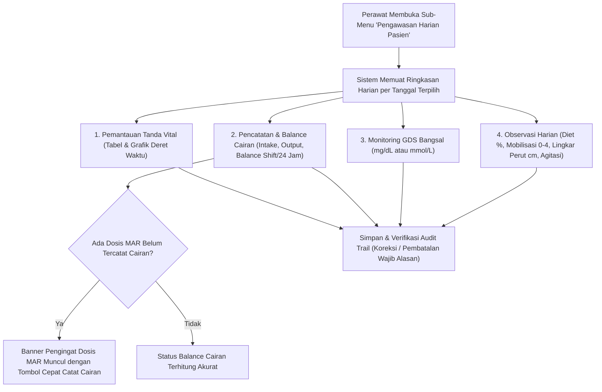

# Rencana Kerja Penyelarasan Modul Keperawatan — Menu 1: Pengawasan Harian Pasien (Daily Monitoring & Fluid Balance)

## 1. Ringkasan Eksekutif & Identitas Dokumen

| Atribut | Keterangan |
| :--- | :--- |
| **Nama Modul** | Pelayanan Kesehatan — Rawat Inap (*Inpatient Nursing Workspace*) |
| **Menu Sasaran** | Menu 1: Pengkajian Pasien (*Patient Assessment*) — Sub-Menu 5: Pengawasan Harian Pasien (*Daily Monitoring / Observation*) |
| **Dasar Penyelarasan** | Mengadopsi kelengkapan pencatatan observasi tanda vital harian, balance cairan terstruktur (intake & output), monitoring glukosa darah sewaktu (GDS), dan observasi fisik harian (diet, mobilisasi, lingkar perut) dari **QuilvianV1** (`formPengawasanHarian.jsx`, `compositePengawasanHarian.jsx`) ke dalam arsitektur modern **QuilvianFinal** (`EPIC KEP-13`, `FR-KEP-056` s.d. `FR-KEP-063`). |
| **Prinsip Kerja** | `QuilvianV1` berstatus **READ-ONLY**. Seluruh verifikasi fungsional dan pengujian dilakukan di **QuilvianFinal**. |
| **Status Database** | **Zero Migration Baru** (Tabel `TrxDailyFluidBalance`, `TrxDailyBloodGlucose`, `TrxDailyClinicalObservation`, dan `TrxPatientVitalSign` sudah tersedia dan termigrasi). |

---

## 2. Analisis Kebutuhan Bisnis & Perbandingan V1 vs Final

### 1. QuilvianV1 (`formPengawasanHarian.jsx`):
- Menyimpan snapshot pengawasan harian gabungan:
  - Tanda vital (TD, Nadi, Suhu, Pernapasan, Kesadaran/GCS, SpO2).
  - Skala nyeri & tindakan non-farmakologi.
  - Entri cairan: Intake (Infus, Oral, NGT, Darah, Obat), Output (Urin, Feses, NGT, IWL, Lainnya).
  - Balance cairan shift & 24 jam.
  - GDS, Lingkar Perut, Asupan Diet, Mobilisasi.

### 2. QuilvianFinal (`DailyMonitoringSection` & `DailyMonitoringService`):
- Arsitektur modular berstandar KARS & Akreditasi Rumah Sakit:
  - **Tanda Vital Terpadu (`FR-KEP-056`, `FR-KEP-049`)**: Menampilkan deret waktu dan visualisasi grafik interaktif per episode. Isian nyeri dilarang diinput langsung di form TTV (nyeri bersumber resmi dari pengkajian nyeri `latestPain` untuk menjaga integritas data klinis).
  - **Balance Cairan Terstruktur (`FR-KEP-057`, `FR-KEP-059`)**: Entri terpisah intake/output dengan kategori sumber lengkap, kalkulasi server-side murni per shift kerja dan akumulasi 24 jam.
  - **Penautan Dosis MAR (`FR-KEP-058`, `FR-KEP-063`)**: Intake obat terhubung langsung dengan dosis MAR teradministrasi lengkap dengan banner pengingat dosis tanpa intake.
  - **GDS Bangsal (`FR-KEP-061`, `VAL-KEP-25a`)**: Wajib memilih satuan `mg/dL` atau `mmol/L` tanpa default bawaan guna mencegah kesalahan interpretasi dosis insulin sliding-scale.
  - **Observasi Khusus (`FR-KEP-062`)**: Asupan makanan (%), mobilisasi terstruktur (0-4: Bedrest s.d. Mandiri), lingkar perut (cm), dan tingkat agitasi (RASS).
  - **Audit Trail Koreksi & Pembatalan (`FR-KEP-060`)**: Setiap koreksi atau pembatalan entri mewajibkan alasan minimal 5 karakter dan mencatat revisi log permanen.

---

## 3. Alur Kerja Pengawasan Harian Pasien

---

## 4. Rencana Eksekusi & Verifikasi
1. **Verifikasi Backend (`BE-RWI-119`, `BE-RWI-120`, `BE-RWI-122`)**:
   - `DailyMonitoringService.Fluid.cs`, `DailyMonitoringService.Glucose.cs`, `DailyMonitoringService.Observation.cs`.
   - Pastikan kompilasi backend bersih `0 Error`.
2. **Verifikasi Frontend (`FE-RWI-084`)**:
   - `DailyMonitoringSection.jsx` terhubung aktif di bawah navigasi Menu 1 Pengkajian (`assessment-form-nav.jsx` tab `daily-monitoring`).
   - Modal pencatatan: TTV, Cairan, GDS, Observasi.
3. **Pengujian Komprehensif**:
   - Jalankan `tests/unit/inpatient-daily-monitoring.test.mjs` (7 test cases).
   - Pastikan 100% PASS.
4. **Pelaporan**:
   - Terbitkan laporan keterlacakan pada `requirement-traceability-v2.md`.
