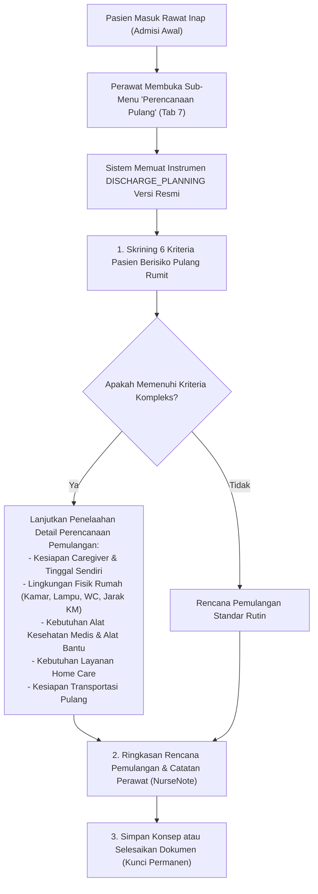

# Rencana Kerja Penyelarasan Modul Keperawatan — Menu 1: Perencanaan Pulang (Discharge Planning)

## 1. Ringkasan Eksekutif & Identitas Dokumen

| Atribut | Keterangan |
| :--- | :--- |
| **Nama Modul** | Pelayanan Kesehatan — Rawat Inap (*Inpatient Nursing Workspace*) |
| **Menu Sasaran** | Menu 1: Pengkajian Pasien (*Patient Assessment*) — Sub-Menu 7: Perencanaan Pulang (*Discharge Planning*) |
| **Dasar Penyelarasan** | Mengadopsi kelengkapan skrining kriteria kepulangan, kesiapan perawatan mandiri di rumah, lingkungan fisik rumah, pemakaian alat kesehatan/alat bantu, dan rencana tindak lanjut dari **QuilvianV1** (`add-rencana-pulang.jsx`) ke dalam arsitektur modern **QuilvianFinal** (`EPIC KEP-11`, `FR-KEP-047`, Standar KARS ARK 3 / ARK 4). |
| **Prinsip Kerja** | `QuilvianV1` berstatus **READ-ONLY**. Seluruh implementasi kode baru dan penyelarasan dilakukan di **QuilvianFinal**. |
| **Status Database** | **Zero Migration** (Menggunakan `TrxPatientAssessment` dengan tipe `DischargePlanning` = 3, `NurseNote`, dan `CliAssessmentInstrumentResponse`). |

---

## 2. Analisis Kebutuhan Bisnis & Standar KARS (ARK 3 / ARK 4)

Standar Akreditasi Rumah Sakit (KARS) pada Bab **Akses dan Kontinuitas Pelayanan (ARK 3 & 4)** mewajibkan perencanaan pemulangan (*discharge planning*) dimulai sejak awal pasien masuk rawat inap:
1. **Skrining Kriteria Pemulangan Kompleks (V1 Kriteria 1–6)**:
   - Pasien lanjut usia (> 65 tahun).
   - Riwayat percobaan bunuh diri atau masalah psikiatri berat.
   - Korban kasus kriminal, kekerasan fisik, atau penelantaran.
   - Keterbatasan mobilitas fisik atau ketergantungan aktivitas harian (ADL).
   - Memerlukan perawatan dan terapi pengobatan lanjutan yang kompleks di rumah.
   - Memerlukan bantuan orang lain untuk makan, minum obat, mandi, eliminasi.
2. **Kesiapan Perawatan di Rumah & Caregiver**:
   - Menilai apakah pasien tinggal sendiri setelah pulang dari rumah sakit.
   - Identifikasi penanggung jawab / pengasuh utama (*caregiver*) di rumah.
3. **Kesiapan Lingkungan Fisik Rumah (Faktor Keselamatan Pasien di Rumah)**:
   - Letak lantai kamar tidur pasien (Lantai 1, Lantai 2, dll.).
   - Kondisi penerangan di rumah (Cukup / Kurang).
   - Jarak kamar tidur ke kamar mandi (< 5 meter atau > 5 meter).
   - Jenis jamban/WC di rumah (WC Duduk atau WC Jongkok).
4. **Peralatan Medis & Kebutuhan Home Care**:
   - Pemakaian alat medis pasca pulang (kateter urin, NGT sonde, oksigen tabung/konsentrator, perawatan luka stoma/dekubitus).
   - Kebutuhan alat bantu mobilitas (kursi roda, walker, tongkat ketiak).
   - Kebutuhan layanan kunjungan rumah (*home visit / home care*).
5. **Transportasi Pulang & Rencana Kontrol Lanjutan**:
   - Moda transportasi kepulangan (kendaraan pribadi, taksi, ambulans transport/medis).
   - Catatan integrasi rencana pemulangan terikat pada kolom `NurseNote` (*Zero Migration*).

---

## 3. Alur Kerja Perencanaan Pemulangan Pasien

---

## 4. Rencana Eksekusi & Tahapan
1. **Tahap 1: Backend Baseline Alignment (`BE-RWI-133`)**:
   - Perbarui definisi `DISCHARGE_PLANNING` di `ClinicalInstrumentDraftSeeder.cs:720-736`.
   - Mengadopsi seksi komprehensif: Kriteria Pemulangan, Caregiver & Lingkungan Rumah, Alkes & Alat Bantu, Home Care, Transportasi & Rencana Kontrol, serta Catatan Perawat (`NurseNote`).
   - Selesaikan penanda tinjauan `G-10`.
   - Jalankan `dotnet build` (0 Error).
2. **Tahap 2: Frontend Verification (`FE-RWI-133`)**:
   - Pastikan form renderer menampilkan seluruh seksi terstruktur tanpa kesalahan binding.
   - Tambahkan clinical alerts kesiapan pulang jika terdapat kriteria risiko tinggi atau kebutuhan alkes khusus di rumah.
3. **Tahap 3: Pengujian & Laporan**:
   - Buat unit test khusus: `inpatient-discharge-planning-instruments.test.mjs`.
   - Jalankan seluruh suite test pengkajian rawat inap.
   - Terbitkan laporan task dan perbarui `requirement-traceability-v2.md`.
