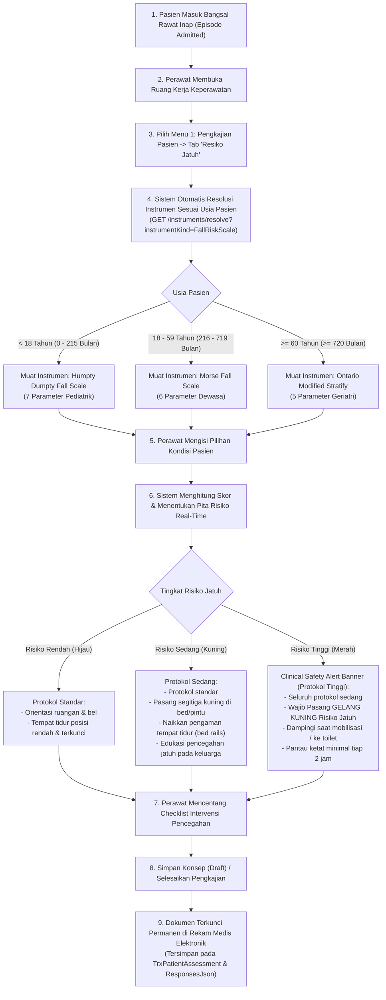
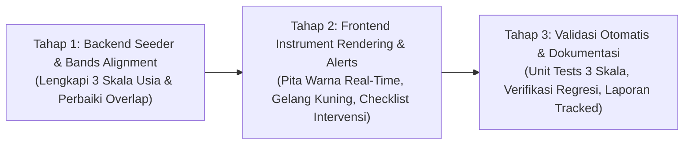

# Rencana Kerja Penyelarasan Modul Keperawatan — Menu 1: Resiko Jatuh (Fall Risk Assessment)

## 1. Ringkasan Eksekutif & Identitas Dokumen

| Atribut | Keterangan |
| :--- | :--- |
| **Nama Modul** | Pelayanan Kesehatan — Rawat Inap (*Inpatient Nursing Workspace*) |
| **Menu Sasaran** | Menu 1: Pengkajian Pasien (*Patient Assessment*) — Sub-Menu 2: Resiko Jatuh (*Fall Risk Assessment*) |
| **Dasar Penyelarasan** | Mengadopsi kelengkapan bisnis, parameter penilaian 3 skala usia (Humpty Dumpty Anak, Morse Dewasa, Ontario Modified Stratify Geriatri), dan checklist intervensi pencegahan jatuh dari **QuilvianV1** (acuan approved klien) ke dalam **QuilvianFinal** (arsitektur modern, bersih, dan berstandar KARS/SKP 6). |
| **Prinsip Kerja** | `QuilvianV1` berstatus **READ-ONLY** (hanya dibaca). Seluruh implementasi kode baru dan perbaikan dilakukan **hanya di QuilvianFinal**. |
| **Status Database** | **Zero Migration** (Tidak ada penambahan tabel atau perubahan skema database baru). Memanfaatkan entitas `TrxPatientAssessment` (`HasFallRisk`, `FallRiskStatus`, `FallRiskScore`, `FallRiskNote`), `CliClinicalInstrument`, `CliClinicalInstrumentVersion`, dan `ResponsesJson` pada `CliAssessmentInstrumentResponse`. |

---

## 2. Latar Belakang & Masalah Bisnis

Pengkajian risiko jatuh merupakan salah satu pilar keselamatan pasien paling fundamental di rumah sakit, diatur secara ketat dalam **Sasaran Keselamatan Pasien 6 (SKP 6 / IPSG 6)**: *Pengurangan Risiko Pasien Jatuh*. Rumah sakit wajib memastikan setiap pasien yang dirawat dinilai tingkat risiko jatuhnya saat masuk dan secara berkala, serta diberikan intervensi pencegahan yang sesuai.

### Temuan Perbandingan Bisnis V1 vs Final:

1. **QuilvianV1 (Kelebihan Bisnis Teruji):**
   - Menyediakan 3 formulir asesmen risiko jatuh terpisah yang disesuaikan dengan kelompok usia:
     - **Anak-Anak (*Pediatric*)**: Skala Humpty Dumpty Fall Scale.
     - **Dewasa (*Adult*)**: Skala Morse Fall Scale.
     - **Lansia / Geriatri (*Elderly*)**: Skala Ontario Modified Stratify - Sydney Scoring.
   - Dilengkapi tabel riwayat pemantauan berkala (*monitoring log*) per shift perawat.
   - Dilengkapi **Checklist Intervensi Pencegahan Jatuh** otomatis yang wajib dikonfirmasi perawat sesuai pita risiko pasien (pemasangan gelang kuning, penanda segitiga kuning di tempat tidur, pemasangan pengaman tempat tidur, dan edukasi keluarga).

2. **QuilvianFinal (Kelemahan & Kesenjangan Saat Ini):**
   - **Backend Seeder Belum Lengkap:**
     - `FALL_RISK_CHILD` (Humpty Dumpty) pada seeder instrumen (`ClinicalInstrumentDraftSeeder.cs:180`) saat ini masih berupa draf kosong tanpa butir parameter (`Sections = { new() { Code = "PENILAIAN", Label = "Penilaian" } }`).
     - `FALL_RISK_ELDERLY` (Ontario Modified Stratify - Sydney Scoring) pada seeder instrumen (`ClinicalInstrumentDraftSeeder.cs:241`) juga masih draf kosong tanpa butir parameter dan pita skor tinggi.
     - `FALL_RISK_ADULT` (Morse Fall Scale) sudah memiliki butir, namun konfigurasi rentang pita skor (*bands*) bertabrakan: Kategori Sedang `[25, 51)` dan Kategori Tinggi `[50, null)` tumpang tindih (*overlap*) pada skor 50, memicu peringatan validasi pada mesin instrumen.
   - **Frontend UI & Intervensi:**
     - Komponen `ClinicalInstrumentFormRenderer` sudah mampu merender butir dinamis, namun belum memiliki checklist intervensi pencegahan jatuh baku dan banner keselamatan klinis terpadu khusus risiko jatuh (protokol gelang kuning & pengaman tempat tidur) secara real-time.

Dokumen rencana kerja ini menetapkan langkah penuntasan menyeluruh agar pengkajian risiko jatuh di `QuilvianFinal` beroperasi dengan kelengkapan bisnis V1 dan keunggulan arsitektur modern.

---

## 3. Alur Proses Bisnis & Keselamatan Pasien (SKP 6 / IPSG 6)

Alur asesmen risiko jatuh berjalan otomatis dan terintegrasi dengan data demografi pasien:

### Skenario Nyata di Rumah Sakit:

#### Skenario 1: Pasien Pediatrik (Anak-Anak) — Ruang Perawatan Anak Melati
> **Profil:** An. Dito (4 tahun), dirawat dengan diagnosis bronkopneumonia dan riwayat kejang demam.  
> 1. Perawat Ns. Dewi membuka tab **Resiko Jatuh**. Sistem membaca usia pasien 4 tahun (48 bulan) dan secara otomatis memuat formulir **Humpty Dumpty Fall Scale**.  
> 2. Ns. Dewi memilih opsi:
>    - Usia: *3–7 tahun* (Skor: 3)
>    - Jenis Kelamin: *Laki-laki* (Skor: 2)
>    - Diagnosis: *Perubahan oksigenasi / pernapasan* (Skor: 3)
>    - Gangguan Kognitif: *Mengetahui kemampuan diri* (Skor: 1)
>    - Faktor Lingkungan: *Pasien di tempat tidur standar / boks* (Skor: 2)
>    - Pembedahan: *Tidak ada* (Skor: 1)
>    - Penggunaan Obat: *Tidak ada obat sedatif/diuretik* (Skor: 1)  
> 3. **Total Skor:** **13** (Kategori: **Risiko Tinggi** karena $\ge 12$).  
> 4. Sistem langsung memunculkan spanduk merah: *"PERHATIAN KLINIS: Pasien Anak Berisiko Tinggi Jatuh. Segera pasang gelang kuning risiko jatuh, pastikan pagar boks/tempat tidur terpasang penuh di kedua sisi, dan edukasi orang tua agar tidak meninggalkan anak sendirian."*  
> 5. Ns. Dewi mencentang checklist intervensi yang telah dilaksanakan dan menyimpan pengkajian.

#### Skenario 2: Pasien Dewasa — Ruang Bedah Wijaya Kusuma
> **Profil:** Tn. Herman (42 tahun), hari rawat ke-1 pasca operasi laparatomi eksplorasi apendisitis perforasi.  
> 1. Perawat Ns. Aris membuka tab **Resiko Jatuh**. Sistem membaca usia 42 tahun dan memuat formulir **Morse Fall Scale**.  
> 2. Ns. Aris mengisi parameter:
>    - Riwayat jatuh (3 bulan): *Tidak* (0)
>    - Diagnosis sekunder: *Ya* (15)
>    - Alat bantu jalan: *Tidak ada / tirah baring* (0)
>    - Terpasang infus intravena: *Ya* (20)
>    - Gaya berjalan: *Lemah (langkah pendek & lambat)* (10)
>    - Status mental: *Sadar kemampuan diri* (0)  
> 3. **Total Skor:** **45** (Kategori: **Risiko Tinggi** karena $\ge 45$).  
> 4. Sistem menampilkan banner peringatan risiko tinggi dan rekomendasi pemasangan gelang kuning serta bantuan penuh saat ambulasi pertama.

#### Skenario 3: Pasien Geriatri (Lansia) — Ruang Perawatan Paviliun
> **Profil:** Ny. Aminah (74 tahun), dirawat karena stroke infark dan hipertensi, mengeluh pusing saat bangkit dari tempat tidur.  
> 1. Perawat Ns. Rina membuka tab **Resiko Jatuh**. Sistem membaca usia 74 tahun ($\ge 60$ tahun) dan memuat formulir **Ontario Modified Stratify - Sydney Scoring**.  
> 2. Ns. Rina mengisi butir:
>    - Riwayat jatuh: *Pernah jatuh di rumah 2 minggu lalu* (Skor: 6)
>    - Status mental: *Mengalami disorientasi waktu* (Skor: 14)
>    - Penglihatan: *Memakai kacamata minus tebal* (Skor: 1)
>    - Kebiasaan berkemih: *Urgensi berkemih / inkontinensia* (Skor: 2)
>    - Transfer & mobilitas: *Membutuhkan bantuan 1 orang* (Skor: 3)  
> 3. **Total Skor:** **26** (Kategori: **Risiko Tinggi** karena $\ge 17$).  
> 4. Sistem memicu peringatan keselamatan geriatri, rekomendasi bel panggil dalam genggaman, pencahayaan malam memadai, dan pendampingan keluarga 24 jam.

---

## 4. Kamus Data & Spesifikasi 3 Skala Instrumen Klinis

Seluruh jawaban butir penilaian disimpan ke tabel `TrxPatientAssessment` (kolom terikat) dan `CliAssessmentInstrumentResponse.ResponsesJson` (butir dinamis instrumen).

### Skala 1: Humpty Dumpty Fall Scale (Anak-Anak / Pediatrik, Usia < 18 Tahun)
* **Kode Instrumen:** `FALL_RISK_CHILD`  
* **Nama Resmi:** Penilaian Resiko Jatuh Anak (Humpty Dumpty Fall Scale)  
* **Rentang Usia:** `0` s.d. `215` bulan (< 18 tahun)  
* **Metode Skoring:** `sum` (Penjumlahan Bobot Butir)  
* **Pita Skor (*Bands*):**
  - **Risiko Rendah (*Low Risk*):** Skor `7` s.d. `11` (Warna Hijau, `LowRisk`)
  - **Risiko Tinggi (*High Risk*):** Skor $\ge 12$ (Warna Merah, `HighRisk`, `isAlert = true`)

| Kode Butir | Label UI Parameter | Pilihan Nilai Jawaban | Bobot Skor | Keterangan Klinis |
| :--- | :--- | :--- | :---: | :--- |
| `HUMP_AGE` | Usia Pasien | `< 3 tahun` `3 - 7 tahun` `7 - 13 tahun` `>= 13 tahun` | `4` `3` `2` `1` | Anak balita memiliki risiko terjatuh paling tinggi karena koordinasi motorik belum matang. |
| `HUMP_GENDER` | Jenis Kelamin | `Laki-laki` `Perempuan` | `2` `1` | Secara statistik anak laki-laki lebih aktif dan memiliki insiden jatuh lebih tinggi. |
| `HUMP_DIAGNOSIS` | Diagnosis Medis | `Kelainan Neurologi` `Perubahan Oksigenasi / Dehidrasi / Anemia` `Masalah Perilaku / Psikis` `Diagnosis Medis Lain` | `4` `3` `2` `1` | Kejang, ensefalitis, hipoksia, anemia berat meningkatkan risiko jatuh secara drastis. |
| `HUMP_COGNITIVE` | Gangguan Kognitif | `Tidak sadar akan keterbatasan diri` `Lupa akan keterbatasan diri` `Mengetahui kemampuan diri` | `3` `2` `1` | Kemampuan anak memahami kondisi sakit dan keterbatasan fisiknya. |
| `HUMP_ENVIRONMENT` | Faktor Lingkungan | `Riwayat jatuh / bayi di tempat tidur khusus` `Pasien memakai alat bantu / bayi di ranjang standar` `Pasien di ranjang standar tanpa bantuan` `Area rawat jalan / di luar ranjang` | `4` `3` `2` `1` | Keamanan sarana tempat tidur dan perlengkapan di sekitar pasien anak. |
| `HUMP_SURGERY` | Pembedahan / Sedasi | `Dalam 24 jam terakhir` `Dalam 48 jam terakhir` `> 48 jam / Tidak ada tindakan` | `3` `2` `1` | Pengaruh sisa obat anestesi dan sedasi terhadap keseimbangan motorik. |
| `HUMP_MEDICATION` | Penggunaan Obat | `Bermacam obat (sedatif, hipnotik, antikonvulsan, laksatif, diuretik)` `Salah satu dari obat di atas` `Obat lain / Tanpa obat berisiko` | `3` `2` `1` | Efek samping obat yang menyebabkan kantuk, pusing, atau sering buang air. |

---

### Skala 2: Morse Fall Scale (Dewasa, Usia 18 – 59 Tahun)
* **Kode Instrumen:** `FALL_RISK_ADULT`  
* **Nama Resmi:** Penilaian Resiko Jatuh Dewasa (Morse Fall Scale)  
* **Rentang Usia:** `216` s.d. `719` bulan (18–59 tahun)  
* **Metode Skoring:** `sum` (Penjumlahan Bobot Butir)  
* **Pita Skor Baku (Perbaikan Overlap V1):**
  - **Risiko Rendah (*Low Risk* / Tidak Berisiko):** Skor `0` s.d. `24` (`[0, 25)`, Warna Hijau, `LowRisk`)
  - **Risiko Sedang (*Medium Risk*):** Skor `25` s.d. `44` (`[25, 45)`, Warna Kuning, `MediumRisk`)
  - **Risiko Tinggi (*High Risk*):** Skor $\ge 45$ (`[45, null)`, Warna Merah, `HighRisk`, `isAlert = true`)

| Kode Butir | Label UI Parameter | Pilihan Nilai Jawaban | Bobot Skor | Keterangan Klinis |
| :--- | :--- | :--- | :---: | :--- |
| `MORSE_HISTORY` | Riwayat Jatuh | `Tidak (Tidak pernah jatuh dlm 3 bln terakhir)` `Ya (Pernah jatuh dlm 3 bln terakhir)` | `0` `25` | Prediktor terkuat kejadian jatuh berulang. |
| `MORSE_SECONDARY_DX` | Diagnosis Sekunder | `Tidak (Hanya 1 diagnosis medis)` `Ya (Ada 2 atau lebih diagnosis medis)` | `0` `15` | Adanya komorbiditas memperberat kelemahan fisik. |
| `MORSE_AMBULATORY_AID` | Alat Bantu Berjalan | `Tidak ada / tirah baring / kursi roda / dibantu perawat` `Kruk / tongkat / walker` `Berpegangan pada perabot / dinding` | `0` `15` `30` | Pasien yang bertumpu pada perabot rentan jatuh saat perabot bergeser. |
| `MORSE_IV` | Terpasang Terapi IV | `Tidak` `Ya (Terpasang infus / heparin lock)` | `0` `20` | Selang infus membatasi gerakan dan meningkatkan risiko tersandung. |
| `MORSE_GAIT` | Gaya Berjalan (*Gait*) | `Normal / tirah baring / imobil` `Lemah (langkah pendek, diseret, kepala menunduk)` `Terganggu (langkah goyah, hilang keseimbangan)` | `0` `10` `20` | Evaluasi observasi saat pasien berdiri dan melangkah. |
| `MORSE_MENTAL` | Status Mental | `Sadar akan kemampuan diri` `Lupa keterbatasan diri / merasa mampu mandiri` | `0` `15` | Pasien yang overestimasi kemampuan fisiknya berisiko tinggi mencoba berdiri sendiri tanpa bantuan. |

---

### Skala 3: Ontario Modified Stratify - Sydney Scoring (Geriatri / Lansia, Usia $\ge$ 60 Tahun)
* **Kode Instrumen:** `FALL_RISK_ELDERLY`  
* **Nama Resmi:** Penilaian Resiko Jatuh Lansia (Ontario Modified Stratify - Sydney Scoring)  
* **Rentang Usia:** $\ge 720$ bulan ($\ge 60$ tahun)  
* **Metode Skoring:** `sum` (Penjumlahan Bobot Butir)  
* **Pita Skor Baku (Perbaikan Lubang V1):**
  - **Risiko Rendah (*Low Risk*):** Skor `0` s.d. `5` (`[0, 6)`, Warna Hijau, `LowRisk`)
  - **Risiko Sedang (*Medium Risk*):** Skor `6` s.d. `16` (`[6, 17)`, Warna Kuning, `MediumRisk`)
  - **Risiko Tinggi (*High Risk*):** Skor $\ge 17$ (`[17, null)`, Warna Merah, `HighRisk`, `isAlert = true`)

| Kode Butir | Label UI Parameter | Pilihan Nilai Jawaban | Bobot Skor | Keterangan Klinis |
| :--- | :--- | :--- | :---: | :--- |
| `SYD_HISTORY` | Riwayat Jatuh | `Tidak ada riwayat jatuh` `Pernah jatuh saat masuk RS atau dlm 1 bln terakhir` | `0` `6` | Riwayat jatuh pada lansia berbobot tinggi. |
| `SYD_MENTAL` | Status Mental / Kognitif | `Sadar penuh / orientasi baik` `Agitasi, bingung, disorientasi, atau demensia` | `0` `14` | Gangguan kognitif pada lansia berkontribusi besar pada insiden jatuh. |
| `SYD_VISION` | Penglihatan (*Vision*) | `Penglihatan normal / tanpa keluhan` `Gangguan penglihatan / memakai kacamata / katarak` | `0` `1` | Keterbatasan lapang pandang di kamar perawatan. |
| `SYD_TOILETING` | Kebiasaan Berkemih | `Pola berkemih normal / teratur` `Sering berkemih / tergesa-gesa / inkontinensia urin` | `0` `2` | Keinginan berkemih mendadak membuat lansia terburu-buru ke toilet. |
| `SYD_MOBILITY` | Transfer & Mobilitas | `Mandiri (bisa bangkit & berjalan sendiri tanpa bantuan)` `Butuh bantuan 1 orang / walker` `Tergantung penuh / butuh bantuan 2 orang` | `0` `3` `3` | Dinilai dari stabilitas saat berpindah tempat tidur ke kursi. |

---

### Seksi Terpadu: Checklist Intervensi Pencegahan Jatuh (SOP Rumah Sakit)

Selain butir skoring di atas, setiap asesmen risiko jatuh dilengkapi formulir intervensi pencegahan jatuh yang disimpan ke `ResponsesJson`:

| Kode Butir | Label Intervensi Pencegahan | Tipe | Kategori Wajib | Keterangan Tindakan |
| :--- | :--- | :---: | :---: | :--- |
| `INT_ORIENT_ROOM` | Orientasikan ruangan & letak bel panggil | `boolean` | Semua Kategori | Memastikan pasien dan keluarga tahu posisi bel darurat. |
| `INT_BED_LOCKED` | Posisi tempat tidur rendah & roda terkunci | `boolean` | Semua Kategori | Mengurangi jarak jatuh dan mencegah tempat tidur bergeser. |
| `INT_BED_RAILS` | Pasang pagar pengaman tempat tidur (*bed rails*) | `boolean` | Sedang & Tinggi | Mencegah pasien terguling keluar dari tempat tidur. |
| `INT_YELLOW_SIGN` | Pasang tanda risiko jatuh (segitiga kuning) | `boolean` | Sedang & Tinggi | Penanda visual bagi seluruh petugas di pintu dan atas ranjang. |
| `INT_YELLOW_WRIST`| Pasang GELANG KUNING pada pergelangan tangan | `boolean` | **Wajib Risiko Tinggi** | Identifikasi visual utama keselamatan pasien (SKP 6). |
| `INT_FAMILY_EDU` | Edukasi pencegahan jatuh pada pasien & keluarga | `boolean` | Semua Kategori | Memberikan pemahaman agar keluarga tidak meninggalkan pasien sendirian. |
| `INT_ASSIST_AMB` | Bantu dan dampingi saat mobilisasi / ke toilet | `boolean` | Sedang & Tinggi | Perawat atau keluarga wajib memegang pasien saat berjalan. |
| `INT_MONITOR_2H` | Pantau kondisi pasien secara berkala (tiap 2 jam)| `boolean` | **Wajib Risiko Tinggi** | Observasi ketat pencegahan insiden tidak diharapkan (KTD). |
| `INT_NOTE` | Catatan Tindakan Tambahan | `text` | Opsional | Informasi khusus tindakan keperawatan lainnya. |

---

## 5. Spesifikasi Antarmuka API (Swagger Style)

Penyelarasan ini memanfaatkan endpoint ASP.NET Core yang dikelompokkan dalam tag Swagger:  
`[Tags("Health Services / Clinical Management / Patient Assessment")]` dan  
`[Tags("Health Services / Clinical Management / Clinical Instrument")]`.

### Tabel Spesifikasi Endpoint:

| Method | Path Endpoint | Deskripsi Fungsi | Autentikasi / Izin | Format Request / Query | Format Respons Utama |
| :---: | :--- | :--- | :--- | :--- | :--- |
| `GET` | `/api/v1/health-services/clinical-management/patient-assessments/instruments/resolve` | Menyelesaikan instrumen aktif sesuai usia pasien episode ranap | Bearer JWT / `PatientAssessment:Read` | `?instrumentKind=2&episodeId={id}` | `200 OK` + `ResolvedInstrumentResponse` (Definisi instrumen, versi aktif, bands, items) |
| `POST` | `/api/v1/health-services/clinical-management/patient-assessments/instruments/preview-score` | Menghitung total skor & pita risiko secara real-time di server | Bearer JWT / `PatientAssessment:Read` | `PreviewScoreRequest` (versionId, responses) | `200 OK` + `ScorePreviewResponse` (totalScore, bandCode, isAlertBand, mappedStatus) |
| `GET` | `/api/v1/health-services/clinical-management/patient-assessments/episodes/{episodeId}` | Mengambil seluruh riwayat asesmen pasien pada episode ini | Bearer JWT / `PatientAssessment:Read` | `Path: episodeId` | `200 OK` + `List<PatientAssessmentResponse>` (riwayat asesmen berpaginasi) |
| `GET` | `/api/v1/health-services/clinical-management/patient-assessments/{id}` | Mengambil detail satu dokumen asesmen risiko jatuh | Bearer JWT / `PatientAssessment:Read` | `Path: id` | `200 OK` + `PatientAssessmentDetailResponse` (jawaban responsesJson, status, audit) |
| `PUT` | `/api/v1/health-services/clinical-management/patient-assessments/{id}` | Menyimpan pembaruan draf asesmen risiko jatuh | Bearer JWT / `PatientAssessment:Update` | `UpdatePatientAssessmentRequest` (concurrencyToken, responses, bindings) | `200 OK` + `PatientAssessmentResponse` |
| `PATCH`| `/api/v1/health-services/clinical-management/patient-assessments/{id}/complete` | Memfinalisasi dan mengunci dokumen ke rekam medis resmi | Bearer JWT / `PatientAssessment:Complete` | `CompletePatientAssessmentRequest` (concurrencyToken, verificationNote) | `200 OK` + Dokumen status `Completed` (2) |
| `POST` | `/api/v1/health-services/clinical-management/patient-assessments/{id}/addendums` | Menambahkan koreksi addendum berdasar jika dokumen sudah selesai | Bearer JWT / `PatientAssessment:Update` | `CreateAddendumRequest` (reason, correctedData) | `201 Created` + `ClinicalAddendumResponse` |

---

## 6. Rencana Tahapan Kerja (Vertical Slice Roadmap)

Penyelarasan Sub-Menu Resiko Jatuh dibagi menjadi 3 tahap berurutan dan terukur:

### Tahap 1: Backend Seeder & Bands Alignment (Target Backend)
- **Tujuan:** Melengkapi definisi butir klinis baku pada `ClinicalInstrumentDraftSeeder.cs` untuk ketiga instrumen risiko jatuh dan menyempurnakan rentang skor agar tidak terjadi ambiguitas (*overlap*).
- **Berkas Dimodifikasi:**
  - `NewQuilvianSystemBackend/Areas/HealthServices/ClinicalManagement/Seeders/ClinicalInstrumentDraftSeeder.cs`
- **Tindakan Konkret:**
  1. Melengkapi 7 butir parameter baku `FALL_RISK_CHILD` (Humpty Dumpty Fall Scale) dengan skoring 7–23 dan pita: Rendah (7–11), Tinggi ($\ge 12$).
  2. Memperbaiki rentang skor `FALL_RISK_ADULT` (Morse Fall Scale) menjadi: Rendah `[0, 25)`, Sedang `[25, 45)`, Tinggi `[45, null)`.
  3. Melengkapi 5 butir parameter baku `FALL_RISK_ELDERLY` (Ontario Modified Stratify - Sydney Scoring) dengan pita: Rendah `[0, 6)`, Sedang `[6, 17)`, Tinggi `[17, null)`.
  4. Menambahkan seksi checklist intervensi pencegahan jatuh pada masing-masing instrumen.
  5. Menjalankan kompilasi backend `dotnet build --no-incremental` (Wajib 0 error).
  6. Menyusun laporan backend tracked: `BE-RWI-128-resiko-jatuh-seeder-alignment.md`.

### Tahap 2: Frontend Instrument Rendering, Live Scoring, & Alerts (Target Frontend)
- **Tujuan:** Memastikan perawat mendapatkan pengalaman pengguna (*user experience*) terbaik saat menilai risiko jatuh dengan umpan balik visual instan.
- **Berkas Terkait:**
  - `QuilvianSystemFrontendDev/src/components/view/health-services/inpatient-management/nursing-workspace/sections/assessment/renderer/clinical-instrument-form-renderer.jsx`
  - `QuilvianSystemFrontendDev/src/components/view/health-services/inpatient-management/nursing-workspace/sections/assessment/assessment-section.jsx`
  - `QuilvianSystemFrontendDev/src/style/health-services/inpatient-management/nursing-workspace.module.css`
- **Tindakan Konkret:**
  1. Memastikan butir radio button pilihan klinis berskor dirender dengan rapi, jelas, dan mudah diklik oleh perawat di tablet maupun PC.
  2. Menampilkan lencana skor total dan warna pita risiko secara real-time (*live preview*):
     - Hijau: Risiko Rendah
     - Kuning / Amber: Risiko Sedang
     - Merah: Risiko Tinggi
  3. Memasang **Clinical Safety Alert Banner** khusus jika hasil kalkulasi menunjukkan Risiko Tinggi:
     - Notifikasi peringatan: *"Pasien Teridentifikasi Risiko Tinggi Jatuh. Segera pasang Gelang Kuning Risiko Jatuh, naikkan pengaman tempat tidur, dan pastikan bel darurat dalam jangkauan."*
  4. Memastikan checklist intervensi pencegahan jatuh tersimpan dengan benar ke `ResponsesJson`.

### Tahap 3: Validasi Otomatis & Pengujian Regresi (QA & Kepatuhan)
- **Tujuan:** Membuktikan bahwa tidak ada fungsi yang rusak dan seluruh logika kalkulasi ketiga instrumen berjalan 100% akurat.
- **Tindakan Konkret:**
  1. Membuat berkas unit test baru di frontend: `tests/unit/inpatient-fall-risk-instruments-and-alerts.test.mjs`.
  2. Menguji kalkulasi dan pita risiko:
     - Skenario Humpty Dumpty (skor 10 -> LowRisk, skor 14 -> HighRisk + Alert).
     - Skenario Morse (skor 20 -> LowRisk, skor 35 -> MediumRisk, skor 65 -> HighRisk + Alert).
     - Skenario Ontario Sydney (skor 4 -> LowRisk, skor 10 -> MediumRisk, skor 22 -> HighRisk + Alert).
  3. Menjalankan seluruh test suite rawat inap (`npm.cmd test tests/unit/inpatient-*.test.mjs`) untuk menjamin zero regresi.
  4. Menyusun laporan frontend tracked: `FE-RWI-128-resiko-jatuh-ui-dan-safety-alerts.md`.

---

## 7. Kriteria Selesai (Definition of Done — DoD)

Penyelarasan Sub-Menu Resiko Jatuh dinyatakan tuntas apabila memenuhi seluruh kriteria berikut:

1. [x] **Definisi Instrumen Lengkap:** Ketiga instrumen (`FALL_RISK_CHILD`, `FALL_RISK_ADULT`, `FALL_RISK_ELDERLY`) memiliki butir parameter baku lengkap di seeder backend dan tidak ada lagi pita skor yang tumpang tindih atau berlubang (Diselesaikan pada BE-RWI-128).
2. [x] **Kompilasi Backend Bersih:** Perintah `dotnet build --no-incremental` pada `NewQuilvianSystemBackend` menghasilkan **0 Error** (Diselesaikan pada BE-RWI-128).
3. [ ] **Resolusi Otomatis Berjalan:** Pasien anak, dewasa, dan lansia secara otomatis mendapatkan instrumen yang tepat saat perawat membuka tab Resiko Jatuh.
4. [ ] **Kalkulasi Server & Safety Banner Aktif:** Skor dihitung akurat oleh server dan spanduk keselamatan klinis (Protokol Gelang Kuning) muncul saat risiko tinggi terdeteksi.
5. [ ] **Checklist Intervensi Tersimpan:** Seluruh butir checklist tindakan pencegahan jatuh tersimpan aman di database tanpa penambahan kolom tabel baru (*Zero Migration*).
6. [ ] **Pengujian Unit 100% Lulus:** Seluruh unit test terkait risiko jatuh dan suite regresi ranap lulus tanpa kegagalan.
7. [ ] **Ketertelusuran Terpenuhi:** Laporan perubahan tracked (`BE-RWI-128` dan `FE-RWI-128`) diterbitkan dan diarsipkan rapi di blueprint modul.
