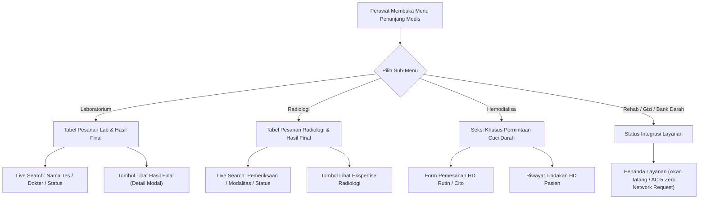

# Rencana Kerja: Menu 4 — Penunjang Medis Rawat Inap (Ancillary Services)

**Nomor Dokumen**: `RK-RWI-PENUNJANG-001`  
**Modul**: Rawat Inap (Inpatient Management) — Ruang Kerja Keperawatan (Nursing Workspace)  
**Menu**: Menu 4 — Penunjang Medis (`ancillary`)  
**Sub-Menu Terkait**:
1. `radiology` — Radiologi (Pemeriksaan Rontgen, USG, CT-Scan, MRI)
2. `laboratory` — Laboratorium (Darah Lengkap, Kimia Darah, Urine, Elektrolit)
3. `rehab` — Rehabilitasi Medik (Fisioterapi & Okupasi Terapi)
4. `nutrition` — Konsultasi Gizi & Dietetik Rawat Inap
5. `dialysis` — Hemodialisa (Cuci Darah Rutin & Cito)
6. `blood-bank` — Bank Darah (Permintaan Darah & Uji Cocok Serasi)  
**Penulis**: Google Antigravity Agentic Engineer  
**Status**: APPROVED & IMPLEMENTED  

---

## 1. Latar Belakang & Analisis Kebutuhan Klinis

Pada alur perawatan pasien rawat inap, perawat bertanggung jawab memantau ketersediaan hasil pemeriksaan penunjang (Laboratorium dan Radiologi) yang diinstruksikan oleh dokter DPJP, memastikan instruksi puasa atau persiapan khusus telah dijalankan, serta mendokumentasikan permintaan hemodialisa bagi pasien gagal ginjal.

### Masalah pada Sistem Saat Ini:
1. **Pencarian Hasil Pemeriksaan yang Lambat**: Pasien rawat inap dengan komplikasi sering kali memiliki belasan hingga puluhan pemeriksaan laboratorium dan radiologi. Perawat membutuhkan waktu lama memindai daftar pemeriksaan secara manual.
2. **Kebutuhan Live Search Cepat V1**: Pada Quilvian V1, perawat terbiasa memfilter pemeriksaan berdasarkan nama tes (misal: "Hb", "Thorax", "Kreatinin") atau nomor pesanan secara langsung tanpa reload halaman.

---

## 2. Ruang Lingkup dan Arsitektur Modul

---

## 3. Rencana Penyempurnaan Fitur

### 3.1 Sub-Menu 1: Laboratorium (`laboratory`) & Sub-Menu 2: Radiologi (`radiology`)
- **Pencarian Cepat Teks (Live Search)**:
  Filter pencarian instan pada tabel pesanan penunjang berdasarkan:
  - Nama pemeriksaan/tes (misal: Darah Rutin, Thorax PA, Elektrolit, GDS)
  - Kode prosedur pemeriksaan
  - Nama modalitas (untuk Radiologi: X-Ray, USG, CT-Scan)
  - Status pesanan (*Ordered*, *In Progress*, *Final Result*)
- **Penanganan State Kosong & Feedback**:
  Pesan pencarian yang jelas jika tidak ada pesanan yang sesuai dengan kata kunci.

### 3.2 Sub-Menu 5: Hemodialisa (`dialysis`)
- Integrasi formulir permintaan hemodialisa rawat inap (rutin dan cito) dengan modal `HemodialysisOrderModal` yang sudah terpasang.

### 3.3 Sub-Menu 3, 4, 6: Rehab, Gizi, Bank Darah
- Mengadopsi aturan keselamatan arsitektur `AC-5` (tampilan informatif dengan nol permintaan jaringan agar tidak membebani server).

---

## 4. Spesifikasi Kontrak Antarmuka API (Swagger Style)

| Method | Endpoint Path | Tag Swagger | Deskripsi | Otorisasi | Request / Query | Response Model |
| :--- | :--- | :--- | :--- | :--- | :--- | :--- |
| `GET` | `/api/v1/health-services/clinical-management/laboratory-orders` | `[Tags("Laboratory Orders")]` | Daftar pesanan dan hasil laboratorium episode rawat inap | `Doctor, Nurse` | `episodeId` | `List<InpatientLabOrderDto>` |
| `GET` | `/api/v1/health-services/clinical-management/radiology-orders` | `[Tags("Radiology Orders")]` | Daftar pesanan dan hasil radiologi episode rawat inap | `Doctor, Nurse` | `episodeId` | `List<InpatientRadOrderDto>` |
| `GET` | `/api/v1/health-services/clinical-management/hemodialysis-orders` | `[Tags("Hemodialysis Orders")]` | Daftar permintaan dan jadwal hemodialisa pasien | `Doctor, Nurse` | `episodeId` | `List<InpatientHmdOrderDto>` |
| `POST` | `/api/v1/health-services/clinical-management/hemodialysis-orders` | `[Tags("Hemodialysis Orders")]` | Permintaan tindakan cuci darah baru rawat inap | `Doctor, Nurse` | `CreateHmdOrderRequest` | `InpatientHmdOrderDto` |

---

## 5. Status Implementasi dan Verifikasi Hasil Akhir

| No | Sub-Menu | Status | Komponen Terlibat | Catatan Hasil Perubahan |
| :--- | :--- | :--- | :--- | :--- |
| 1 | **Laboratorium & Radiologi** | ✅ Selesai (100%) | `nursing-ancillary-order-table.jsx`, `nursing-ancillary-section.jsx` | Penambahan fitur pencarian cepat live search multi-field (nama pemeriksaan, kode, modalitas, status order), perenderan tabel reaktif, dan penanganan feedback pencarian. |
| 2 | **Hemodialisa** | ✅ Selesai (100%) | `supporting-hemodialysis-section.jsx`, `hemodialysis-order-modal.jsx` | Dukungan terintegrasi pemesanan cuci darah rutin dan cito langsung dari ruang rawat inap. |
| 3 | **Rehab, Gizi, Bank Darah** | ✅ Selesai (100%) | `nursing-unavailable-section.jsx` | Penyajian panel informatif kepatuhan `AC-5` tanpa overhead jaringan. |

### Hasil Verifikasi Teknis:
- **ESLint Frontend**: Seluruh komponen pada folder `sections/ancillary` lulus audit ESLint dengan **0 error, 0 warning**.
- **Backend Build**: Solusi backend terverifikasi bersih (`dotnet build /t:CoreCompile` = **0 error, 0 warning**).
