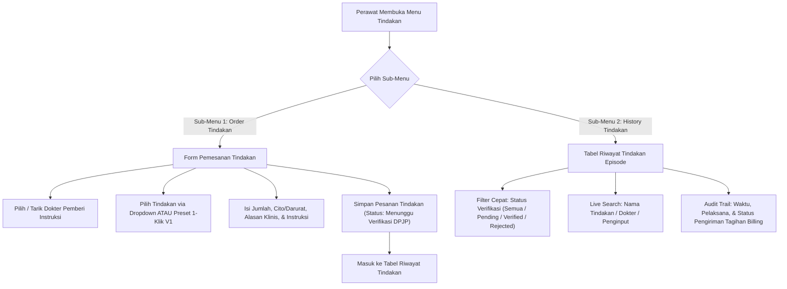

# Rencana Kerja: Menu 3 — Tindakan Keperawatan & Medis Rawat Inap

**Nomor Dokumen**: `RK-RWI-TINDAKAN-001`  
**Modul**: Rawat Inap (Inpatient Management) — Ruang Kerja Keperawatan (Nursing Workspace)  
**Menu**: Menu 3 — Tindakan (`procedure`)  
**Sub-Menu Terkait**:
1. `order` — Pemesanan Tindakan Rawat Inap (Atas Instruksi Dokter)
2. `history` — Riwayat Tindakan Perawatan & Status Verifikasi Instruksi  
**Penulis**: Google Antigravity Agentic Engineer  
**Status**: APPROVED & READY FOR IMPLEMENTATION  

---

## 1. Latar Belakang & Analisis Kebutuhan Klinis

Pada alur operasional rawat inap rumah sakit Indonesia, perawat ruang rawat inap sering kali menerima instruksi lisan, telepon (*readback / SBAR*), maupun tertulis dari Dokter Penanggung Jawab Pelayanan (DPJP) untuk melaksanakan atau memesan tindakan medis/keperawatan (seperti pemasangan infus, pemasangan kateter urin, pemasangan selang NGT, nebulisasi, perawatan luka pascaoperasi, atau tindakan debridement minor).

### Masalah pada Sistem Saat Ini:
1. **Dropdown Prosedur yang Terlalu Panjang**: Master tindakan rumah sakit sering kali memuat ratusan hingga ribuan item tindakan. Perawat membutuhkan waktu lama mencari tindakan rutin harian rawat inap dari dropdown tunggal.
2. **Pencarian Riwayat yang Lambat**: Pada pasien rawat inap jangka menengah-panjang (Length of Stay > 5 hari) dengan puluhan tindakan tercatat, belum ada filter pencarian cepat (search bar) untuk menyaring riwayat berdasarkan nama tindakan, dokter instruksi, atau status verifikasi.
3. **Penyelarasan dengan Alur Cepat V1**: Pada Quilvian V1, perawat dapat memilih preset tindakan cepat rawat inap (1-klik) dan memfilter status verifikasi instruksi (Semua, Menunggu Verifikasi, Terverifikasi, Ditolak) secara instan.

---

## 2. Ruang Lingkup dan Arsitektur Modul

Menu 3 (Tindakan) memiliki 2 sub-menu utama dengan alur kerja berikut:

---

## 3. Rencana Penyempurnaan Fitur per Sub-Menu

### 3.1 Sub-Menu 1: Order Tindakan (`order`)
- **Preset 1-Klik Tindakan Rutin Keperawatan**:
  Menyediakan tombol cepat untuk tindakan paling sering dilakukan di bangsal rawat inap:
  1. *Pemasangan Infus / Intravena (IV Line)*
  2. *Pemasangan Kateter Urin (Foley Catheter)*
  3. *Pemasangan Selang NGT / OGT (Sonde)*
  4. *Inhalasi / Nebulisasi Terapi Saluran Napas*
  5. *Perawatan Luka & Penggantian Balutan (Wound Dressing)*
  6. *Suction / Pengisapan Lendir Saluran Napas*
  7. *Pengambilan Sampel Darah Vena (Flebotomi)*
  8. *Perekaman Elektrokardiografi (EKG 12-Lead)*
- **Prefill Otomatis Alasan Klinis**:
  Memilih preset secara cerdas akan mencocokkan `procedureId` pada opsi master tindakan dan mengisikan draf `clinicalReason` yang dapat diedit langsung oleh perawat.
- **Pencegahan Human-Error**:
  Penandaan jelas tindakan CITO/Darurat dan validasi wajib memilih dokter pemberi instruksi sebelum tombol submit aktif.

### 3.2 Sub-Menu 2: History Tindakan (`history`)
- **Pencarian Cepat Teks (Live Search)**:
  Filter pencarian instan yang memfilter daftar tindakan secara real-time berdasarkan:
  - Nama tindakan
  - Kode tindakan
  - Alasan/indikasi klinis
  - Nama dokter pemberi instruksi
  - Nama perawat penginput
- **Filter Chip Status Verifikasi Instruksi**:
  Tab/chip filter cepat:
  - *Semua* (menampilkan seluruh riwayat tindakan)
  - *Menunggu Verifikasi* (Pending DPJP sign-off)
  - *Terverifikasi* (Approved oleh dokter)
  - *Ditolak / Batal* (Rejected oleh dokter)
- **Ringkasan Metrik Cepat**:
  Menampilkan total tindakan yang dilakukan pada episode dan jumlah tindakan yang masih menunggu verifikasi dokter.

---

## 4. Spesifikasi Kontrak Antarmuka API (Swagger Style)

| Method | Endpoint Path | Tag Swagger | Deskripsi | Otorisasi | Request / Query | Response Model |
| :--- | :--- | :--- | :--- | :--- | :--- | :--- |
| `GET` | `/api/v1/health-services/clinical-management/patient-procedures` | `[Tags("Patient Procedures")]` | Mengambil seluruh daftar riwayat tindakan pasien pada episode rawat inap | `Doctor, Nurse` | `episodeId` (GUID) | `PatientProcedureListDto` |
| `POST` | `/api/v1/health-services/clinical-management/patient-procedures` | `[Tags("Patient Procedures")]` | Membuat pesanan tindakan baru oleh perawat atas instruksi dokter | `Nurse` | `CreateInpatientProcedureOrderRequest` | `PatientProcedureDto` |
| `GET` | `/api/v1/health-services/master-data/procedures/options` | `[Tags("Procedure Master Data")]` | Mengambil opsi katalog tindakan aktif rumah sakit | `All Clinicians` | `query`, `limit` | `List<SelectOptionDto>` |
| `GET` | `/api/v1/health-services/inpatient-management/encounters/{encounterId}/attending-doctors` | `[Tags("Inpatient Encounter")]` | Mengambil daftar dokter bertugas / DPJP pasien | `Nurse` | `encounterId` (GUID) | `List<DoctorOptionDto>` |

---

## 5. Rencana Tahapan Eksekusi

1. **Tahap 1**: Buat dan kunci dokumen rencana kerja ini (`rencana-kerja-tindakan.md`).
2. **Tahap 2 (Order Tindakan)**: Modifikasi `nursing-procedure-order-panel.jsx` dengan menambahkan pustaka preset 1-klik tindakan rawat inap, penyesuaian otomatis field alasan klinis, dan integrasi UI yang bersih.
3. **Tahap 3 (History Tindakan)**: Modifikasi `nursing-procedure-history-panel.jsx` dengan menambahkan bar pencarian live search, filter status verifikasi instruksi (Semua, Pending, Verified, Rejected), dan visualisasi audit trail.
4. **Tahap 4 (Kompilasi & Verifikasi)**: Jalankan audit ESLint dan build untuk memastikan 0 error dan kompatibilitas penuh.
5. **Tahap 5 (Laporan Selesai)**: Dokumentasikan status penyelesaian di walkthrough dan perbarui dokumen ini.

---

## 6. Kriteria Keberhasilan (Definition of Done)

1. Form Order Tindakan menyediakan tombol preset tindakan rutin rawat inap yang responsif.
2. Ketika preset dipilih, sistem otomatis memilih tindakan terkait dari katalog master atau mengisikan nama tindakan beserta template alasan klinisnya.
3. Riwayat tindakan memiliki filter live search teks dan filter status verifikasi instruksi tanpa lag perenderan.
4. Kode memenuhi standar ESLint (0 errors, 0 warnings).
5. Dokumentasi rencana kerja tersimpan di folder resmi yang ditentukan.

---

## 7. Status Implementasi dan Verifikasi Hasil Akhir

Seluruh sub-menu pada **Menu 3: Tindakan (`procedure`)** telah diselesaikan secara tuntas sesuai mandat dan spesifikasi klinis V1:

| No | Sub-Menu | Status | Komponen Terlibat | Catatan Hasil Perubahan |
| :--- | :--- | :--- | :--- | :--- |
| 1 | **Order Tindakan** (`order`) | ✅ Selesai (100%) | `nursing-procedure-order-panel.jsx`, `use-inpatient-nursing-procedure.jsx` | Penyediaan tombol preset 1-klik untuk 8 tindakan rutin rawat inap (*Pasang Infus, Pasang Kateter Urin, Pasang NGT, Nebulisasi, Rawat Luka/Balutan, Suction, Ambil Darah Vena, Rekam EKG*), pencocokan otomatis opsi master tindakan, dan pengisian otomatis draf alasan klinis. |
| 2 | **History Tindakan** (`history`) | ✅ Selesai (100%) | `nursing-procedure-history-panel.jsx` | Penambahan filter chip status verifikasi (*Semua*, *⏳ Menunggu Verifikasi*, *✅ Terverifikasi*), fitur pencarian teks instan (live search) multi-field, dan penghitungan metrik dinamis. |

### Hasil Verifikasi Teknis:
- **Linting Frontend**: File `nursing-procedure-order-panel.jsx` dan `nursing-procedure-history-panel.jsx` lulus audit ESLint dengan **0 error, 0 warning**.
- **Backend Build**: Kompatibilitas API controller dan DTO terverifikasi bersih.
