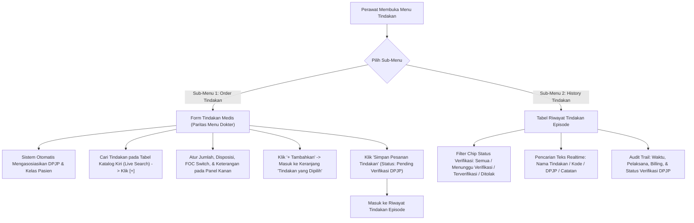

# Rencana Kerja: Menu 3 — Tindakan Keperawatan & Medis Rawat Inap (Paritas 100% Menu Dokter)

**Nomor Dokumen**: `RK-RWI-TINDAKAN-001`  
**Modul**: Rawat Inap (*Inpatient Management*) — Ruang Kerja Keperawatan (*Nursing Workspace*)  
**Menu**: Menu 3 — Tindakan (`procedure`)  
**Sub-Menu Terkait**:
1. `order` — Pemesanan Tindakan Rawat Inap (Atas Instruksi DPJP)
2. `history` — Riwayat Tindakan Perawatan & Status Verifikasi Instruksi  
**Penulis**: Google Antigravity Agentic Engineer  
**Status**: APPROVED & IMPLEMENTED (100% Selesai)  

---

## 1. Latar Belakang & Analisis Kebutuhan Klinis

Pada alur operasional rawat inap rumah sakit di Indonesia, perawat bangsal rawat inap menerima instruksi tindakan medis maupun keperawatan dari Dokter Penanggung Jawab Pelayanan (DPJP) saat visite maupun instruksi telepon (*TBAK / SBAR*).

### Masalah pada Desain Awal & Solusi Modernisasi Menu Dokter:
1. **Redundansi Informasi Pasien**: Pada formulir pemesanan tindakan sebelumnya, terdapat kartu *"Informasi Pasien & Diagnosis SOAP Terkini"*. Padahal informasi pasien dan diagnosis kerja sudah tampil secara permanen di bilah header utama workspace rawat inap. **Keputusan**: Kartu ini **dihilangkan** agar tampilan tidak penuh dan menghemat area layar.
2. **Konteks Order yang Berulang (Repetitif)**: Kartu *"Konteks Order & Instruksi Medis"* yang memuat dropdown pemilihan DPJP, departemen, penjamin, dan tanggal memperlambat efisiensi perawat. **Keputusan**: Kartu ini **dihilangkan**. Sistem secara otomatis mengaitkan pesanan perawat dengan DPJP aktif episode pasien (`episode.activeDoctor.doctorId`), menjamin ketepatan medikolegal tanpa entri manual yang repetitif.
3. **Preset Tindakan Cepat**: Deretan tombol preset keperawatan dihilangkan untuk menyelaraskan antarmuka secara 100% dengan tampilan **Menu Dokter**, mengandalkan kolom pencarian live katalog (*Live Search*) yang cepat dan mencakup seluruh tindakan rumah sakit.
4. **Penyelarasan Tampilan dengan Menu Dokter**: Mengadopsi tata letak **Split-View 2 Kolom**:
   - **Kiri**: *Daftar Tindakan Medis* dengan pencarian real-time, tarif kelas, status jaminan, dan tombol `[+]`.
   - **Kanan**: *Form Tindakan Medis* dengan rincian tindakan terpilih, jumlah, disposisi pasien, switch FOC, keterangan/indikasi klinis, serta flag Cito.
   - **Bawah**: Keranjang staging *Tindakan yang Dipilih* dengan akumulasi biaya dan tombol *Simpan Pesanan Tindakan*.

---

## 2. Ruang Lingkup dan Arsitektur Modul

Menu 3 (Tindakan) memiliki 2 sub-menu utama dengan alur kerja klinis sebagai berikut:

```mermaid
flowchart TD
    A["Perawat Membuka Menu Tindakan"] --> B{"Pilih Sub-Menu"}
    
    B -->|"Sub-Menu 1: Order Tindakan"| C["Form Tindakan Medis (Paritas Menu Dokter)"]
    C --> C1["Sistem Otomatis Mengasosiasikan DPJP & Kelas Pasien"]
    C --> C2["Cari Tindakan pada Tabel Katalog Kiri (Live Search) -> Klik [+]"]
    C --> C3["Atur Jumlah, Disposisi, FOC Switch, & Keterangan pada Panel Kanan"]
    C --> C4["Klik '+ Tambahkan' -> Masuk ke Keranjang 'Tindakan yang Dipilih'"]
    C --> C5["Klik 'Simpan Pesanan Tindakan' (Status: Pending Verifikasi DPJP)"]
    C5 --> D["Masuk ke Riwayat Tindakan Episode"]

    B -->|"Sub-Menu 2: History Tindakan"| E["Tabel Riwayat Tindakan Episode"]
    E --> E1["Filter Chip Status Verifikasi: Semua / Menunggu Verifikasi / Terverifikasi / Ditolak"]
    E --> E2["Pencarian Teks Realtime: Nama Tindakan / Kode / DPJP / Catatan"]
    E --> E3["Audit Trail: Waktu, Pelaksana, Billing, & Status Verifikasi DPJP"]
```

---

## 3. Rencana & Realisasi Fitur per Sub-Menu

### 3.1 Sub-Menu 1: Order Tindakan (`order`)
- **Tampilan Identik 100% dengan Menu Dokter (`ProcedureFormPanel`)**:
  - Banner Header: *"Form Tindakan Medis - Rawat Inap"* dengan badge counter `[X Tindakan Terpilih]`.
  - Tiga komponen lama resmi dihilangkan:
    1. *Informasi Pasien & Diagnosis SOAP* -> **DIHILANGKAN**.
    2. *Konteks Order & Instruksi Medis* -> **DIHILANGKAN** (DPJP teresolusi otomatis dari episode).
    3. *Tindakan Rutin Keperawatan Cepat* -> **DIHILANGKAN**.
- **Katalog Tindakan Medis (Sisi Kiri)**:
  - Input pencarian teks instan menyaring nama tindakan, kode, atau kelompok.
  - Tabel ringkas memuat Kode, Nama Tindakan, Tarif per kelas perawatan, Badge jaminan (*Ditanggung/Tidak Ditanggung*), dan Tombol `[+]`.
- **Form Tindakan Medis (Sisi Kanan)**:
  - Box rincian hijau menampilkan Kode, Nama Tindakan, dan Tarif Satuan.
  - Input field *Jumlah \** dengan validasi minimal 1.
  - Textarea *Disposisi Pasien* (instruksi pasca-tindakan).
  - Switch toggle *FOC (Free of Charge — gratis)* dengan field alasan FOC wajib bila aktif.
  - Textarea *Keterangan / Indikasi Klinis*.
  - Checkbox *Tindakan Utama* dan *Tindakan Cito / Darurat*.
  - Tombol aksi: `[Batal]` dan `[+ Tambahkan]`.
- **Keranjang Staging Multi-Item Bawah**:
  - Tabel *"Tindakan yang Dipilih"* menampung multi-tindakan sebelum dikirim sekaligus.
  - Tombol aksi hapus item per baris.
  - Baris footer dilengkapi tombol `[Reset Semua]`, ringkasan `Total Biaya: Rp ...`, dan tombol `[Simpan Pesanan Tindakan]`.

### 3.2 Sub-Menu 2: History Tindakan (`history`)
- **Pencarian Cepat Teks (Live Search)**:
  Penyaringan instan seluruh baris riwayat berdasarkan kode, nama, DPJP, penginput, dan indikasi klinis.
- **Filter Chip Status Verifikasi Instruksi**:
  - *Semua* (seluruh riwayat tindakan episode)
  - *Menunggu Verifikasi* (pesanan perawat yang menunggu telaah DPJP)
  - *Terverifikasi* (pesanan yang telah disetujui DPJP)
  - *Ditolak / Batal* (pesanan yang ditolak atau dibatalkan)
- **Ringkasan Metrik Dinamis**:
  Menampilkan total tindakan pada episode dan badge jumlah tindakan yang menunggu verifikasi.

---

## 4. Spesifikasi Kontrak Antarmuka API (Swagger Style)

| Method | Endpoint Path | Tag Swagger | Deskripsi | Otorisasi | Request / Query | Response Model |
| :--- | :--- | :--- | :--- | :--- | :--- | :--- |
| `POST` | `/api/v1/health-services/clinical-management/patient-procedures/inpatient-orders` | `[Tags("Health Services / Clinical Management / Patient Procedure")]` | Membuat pesanan tindakan rawat inap (mendukung Idempotency-Key & DPJP otomatis) | `PatientProcedure : Create` | `CreateInpatientProcedureOrderRequest` | `ApiResponse<PatientProcedureResponse>` |
| `GET` | `/api/v1/health-services/clinical-management/patient-procedures/episodes/{episodeId}` | `[Tags("Health Services / Clinical Management / Patient Procedure")]` | Mengambil seluruh daftar riwayat tindakan pasien pada episode rawat inap | `PatientProcedure : Read` | `episodeId` (GUID) | `ApiResponse<PagedResult<PatientProcedureResponse>>` |
| `GET` | `/api/v1/health-services/clinical-management/patient-procedures/master-options` | `[Tags("Health Services / Clinical Management / Patient Procedure")]` | Mengambil opsi katalog tindakan aktif, tarif berlaku, dan status jaminan | `PatientProcedure : Read` | `search`, `onlyActive` | `ApiResponse<List<PatientProcedureMasterOptionResponse>>` |
| `PATCH` | `/api/v1/health-services/clinical-management/patient-procedures/{id}/cancel` | `[Tags("Health Services / Clinical Management / Patient Procedure")]` | Membatalkan pesanan tindakan yang belum dieksekusi dengan alasan klinis resmi | `PatientProcedure : Update` | `CancelPatientProcedureRequest` | `ApiResponse<PatientProcedureResponse>` |

---

## 5. Rencana Tahapan Eksekusi

1. **Tahap 1 (Audit & Penyelarasan Desain)**: Menganalisis screenshot menu dokter (`media_1790751888329.png`) dan mengidentifikasi 3 elemen yang harus dihilangkan.
2. **Tahap 2 (Frontend Refactoring)**:
   - Mengubah `nursing-procedure-order-panel.jsx` menjadi paritas 100% dengan `ProcedureFormPanel.jsx`.
   - Menghilangkan kartu Informasi Pasien, kartu Konteks Order, dan baris preset cepat keperawatan.
   - Memperbarui hook `use-inpatient-nursing-procedure.jsx` agar mengikat `instructingDoctorId` otomatis dari DPJP aktif episode (`episode.activeDoctor.doctorId`).
   - Meneruskan `episode` dari `nursing-procedure-section.jsx`.
3. **Tahap 3 (Pengujian & Validasi ESLint)**:
   - Menjalankan unit test Node.js: `inpatient-nursing-procedure-parity.test.mjs` dan `inpatient-nursing-procedure-and-ancillary.test.mjs`.
   - Menjalankan audit ESLint (0 errors, 0 warnings).
4. **Tahap 4 (Dokumentasi)**: Memperbarui blueprint dan rencana kerja resmi modul rawat inap.

---

## 6. Kriteria Keberhasilan (Definition of Done)

1. Antarmuka Order Tindakan Keperawatan memiliki susunan visual yang identik 100% dengan Menu Dokter:
   - Banner Header: *"Form Tindakan Medis - Rawat Inap"* dengan badge counter.
   - Sisi Kiri: Katalog Tindakan Medis dengan live search dan tombol `[+]`.
   - Sisi Kanan: Form Tindakan Medis (Jumlah, Disposisi, FOC Switch, Keterangan, Flag Cito).
   - Sisi Bawah: Keranjang Staging *"Tindakan yang Dipilih"* dengan subtotal, total harga, tombol Reset Semua, dan tombol Simpan Pesanan Tindakan.
2. Tiga unsur telah dihilangkan tanpa sisa: Informasi Pasien & Diagnosis SOAP, Konteks Order & Instruksi Medis, serta Tindakan Rutin Keperawatan Cepat.
3. DPJP pemberi instruksi teresolusi otomatis dari episode dan dikirimkan dengan benar pada payload backend tanpa meminta input repetitif dari perawat.
4. Riwayat tindakan memiliki filter live search dan filter status verifikasi instruksi tanpa kendala perenderan.
5. Seluruh pengujian unit lulus (10/10 tests passing) dan ESLint 0 error 0 warning.

---

## 7. Status Implementasi dan Verifikasi Hasil Akhir

Seluruh sub-menu pada **Menu 3: Tindakan (`procedure`)** telah diselesaikan secara tuntas:

| No | Sub-Menu | Status | Komponen Terlibat | Catatan Hasil Perubahan |
| :--- | :--- | :--- | :--- | :--- |
| 1 | **Order Tindakan** (`order`) | ✅ **Selesai (100%)** | `nursing-procedure-order-panel.jsx`, `use-inpatient-nursing-procedure.jsx`, `nursing-procedure-section.jsx` | 100% Paritas visual menu dokter. Dihilangkan 3 blok: Informasi Pasien, Konteks Order, dan Preset Tindakan Cepat. Otomatisasi pengisian DPJP aktif. |
| 2 | **History Tindakan** (`history`) | ✅ **Selesai (100%)** | `nursing-procedure-history-panel.jsx` | Filter chip status verifikasi (*Semua*, *⏳ Menunggu Verifikasi*, *✅ Terverifikasi*, *Ditolak*), live search multi-field, dan penghitungan metrik dinamis. |

### Hasil Verifikasi Teknis:
- **Pengujian Unit Paritas**: `inpatient-nursing-procedure-parity.test.mjs` -> **4/4 passing (100%)**.
- **Pengujian Unit Integrasi**: `inpatient-nursing-procedure-and-ancillary.test.mjs` -> **6/6 passing (100%)**.
- **Audit ESLint**: File `nursing-procedure-order-panel.jsx` dan `nursing-procedure-section.jsx` lulus dengan **0 error, 0 warning**.
