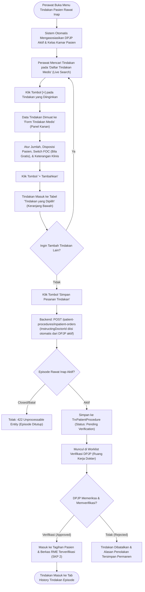

# Laporan Analisis, Spesifikasi Swagger & Rencana Kerja Modernisasi: Tindakan Keperawatan Rawat Inap (Paritas 100% Menu Dokter)

## 1. Ringkasan Eksekutif & Identitas Dokumen

| Atribut | Keterangan |
| :--- | :--- |
| **Area / Modul** | Pelayanan Kesehatan (*Health Services*) — Ruang Kerja Keperawatan Rawat Inap (*Inpatient Nursing Workspace*) |
| **Menu Sasaran** | Ruang Kerja Keperawatan → Menu Utama: **Tindakan (*Inpatient Procedure Order & Management*)** |
| **Sub-Menu / Tab** | 1. **Order Tindakan** (*Pemesanan Tindakan Medis & Keperawatan atas Instruksi DPJP*)<br/>2. **History Tindakan** (*Lini Masa & Riwayat Tindakan Episode dengan Status Verifikasi*) |
| **Jalur Dokumen** | `docs/module-blueprints/rawat-inap/keperawatan/roadmap/rencana-kerja/tindakan/tindakan-keperawatan.md` |
| **Dasar Penyelarasan** | Mengadopsi 100% tata letak dan interaksi visual dari **Ruang Kerja Dokter Rawat Inap (*Physician Workspace*)** (`ProcedureFormPanel.jsx`), menyelaraskan pemesanan tindakan perawat atas instruksi dokter dengan backend `PatientProcedureController.cs` dan `TrxPatientProcedure.cs` di **QuilvianFinal**. |
| **Keputusan Eliminasi Komponen** | Sesuai arahan klinis operasional rumah sakit, 3 komponen pada desain sebelumnya resmi **dihilangkan**: <br/>1. **Informasi Pasien & Diagnosis SOAP Terkini** *(Dieliminasi karena sudah tersedia permanen di header workspace)*<br/>2. **Konteks Order & Instruksi Medis** *(Dieliminasi untuk memangkas redundansi; dokter pemberi instruksi diresolusi otomatis dari DPJP aktif)*<br/>3. **Tindakan Rutin Keperawatan Cepat / Preset** *(Dieliminasi agar tampilan bersih dan perawat memakai live catalog search yang konsisten)* |
| **Standar Regulasi & Akreditasi** | **KARS / STARKES (Standar Akreditasi Rumah Sakit)**:<br/>• Bab **PP (Pelayanan dan Asuhan Pasien)** — Standar PP 1.1 & PP 2.1: Prosedur klinis dan tindakan keperawatan atas instruksi tertulis/lisan dokter yang terverifikasi.<br/>• Bab **SKP (Sasaran Keselamatan Pasien)**:<br/>  - **SKP 1**: Ketepatan identifikasi pasien sebelum tindakan invasif/medis.<br/>  - **SKP 2**: Komunikasi efektif (*Closed-Loop Verification*) antara perawat dan dokter penginstruksi.<br/>• Bab **MRMIK & Permenkes No. 24/2022**: Rekam medis elektronik terintegrasi, pemisahan tindakan berbayar (*billable*) vs *Free of Charge (FOC)*, serta audit trail verifikasi DPJP. |
| **Prinsip Data & Anti-Hardcode** | **Zero Hardcode Guarantee** — Seluruh katalog tindakan, tarif per kelas perawatan, status jaminan (*Ditanggung/Tidak Ditanggung*), serta identitas DPJP dikelola secara dinamis melalui API backend (`MstProcedure`, `MstTariff`, `TrxPatientProcedure`). |

---

## 2. Analisis Kesenjangan & Keputusan Modernisasi

Berdasarkan tinjauan klinis terhadap operasional bangsal rawat inap dan perbandingan langsung dengan antarmuka **Dokter Rawat Inap** (`ProcedureFormPanel.jsx`), dilakukan penyesuaian menyeluruh pada sub-menu **Order Tindakan** keperawatan:

### 2.1. Matriks Kesenjangan & Keputusan Penyesuaian

| No | Fitur / Komponen | Kondisi Desain Awal | Tampilan Menu Dokter (`ProcedureFormPanel.jsx`) | Keputusan Modernisasi Keperawatan | Status & Dampak Klinis |
| :--- | :--- | :--- | :--- | :--- | :--- |
| 1 | **Banner Header** | "Form Tindakan Keperawatan & Medis - Rawat Inap" | "Form Tindakan Medis - Rawat Inap" + Badge Counter | **Diselaraskan 100%**: Menggunakan judul "Form Tindakan Medis - Rawat Inap" dengan badge counter `[X Tindakan Terpilih]`. | **DITERAPKAN** — Keseragaman visual antarmuka antar-profesi medis. |
| 2 | **Informasi Pasien & SOAP** | Ditampilkan dalam kartu tersendiri di atas form order | **Tidak Ada** (Konteks pasien sudah berada di header layar utama) | **DIHILANGKAN**: Menghilangkan kartu Informasi Pasien & Diagnosis SOAP dari form tindakan. | **DIHILANGKAN** — Menghilangkan redundansi visual dan menghemat ruang layar vertikal. |
| 3 | **Konteks Order & Instruksi** | Form 6 kolom (Departemen, DPJP dropdown, Penjamin, Tanggal, Kelas, Perawat penginput) | **Tidak Ada** (Konteks terikat otomatis pada sesi login dan episode aktif) | **DIHILANGKAN**: Menghilangkan kartu formulir Konteks Order. DPJP pemberi instruksi otomatis terisi dari DPJP aktif episode rawat inap (`episode.activeDoctor.doctorId`). | **DIHILANGKAN** — Mempercepat alur kerja perawat tanpa harus memilih ulang dokter pada setiap order. |
| 4 | **Preset Tindakan Cepat** | 8 tombol preset (Pasang Infus, Kateter, NGT, Nebulisasi, Rawat Luka, Suction, Darah, EKG) | **Tidak Ada** (Pencarian tindakan dilakukan terpusat melalui live search katalog) | **DIHILANGKAN**: Menghilangkan deretan tombol preset cepat keperawatan. | **DIHILANGKAN** — Antarmuka katalog menjadi rapi, bersih, dan konsisten dengan menu dokter. |
| 5 | **Katalog Tindakan (Sisi Kiri)** | Split-view tabel katalog dengan filter live search teks | Split-view tabel katalog dengan filter live search teks, tarif kelas, badge jaminan, dan tombol `[+]` | **Dipertahankan & Diselaraskan 100%**: Live search instan menyaring nama/kode/kelompok tindakan. | **DITERAPKAN** — Pencarian katalog terpadu dan responsif. |
| 6 | **Form Tindakan Medis (Sisi Kanan)** | Form konfigurasi item terpilih (Jumlah, Disposisi, Switch FOC, Keterangan, Checkbox Utama & Cito) | Form konfigurasi item terpilih dengan ringkasan hijau (Kode, Nama, Tarif Satuan), Disposisi, FOC, Indikasi, Flag Cito | **Diselaraskan 100%**: Mengikuti form konfigurasi dokter dengan tombol `[Batal]` dan `[+ Tambahkan]`. | **DITERAPKAN** — Standar pengisian data tindakan seragam. |
| 7 | **Keranjang Staging Multi-Item (Bawah)** | Tabel staging multi-order dengan ringkasan subtotal dan tombol simpan | Tabel staging "Tindakan yang Dipilih" dengan info peninjauan, tombol `[Reset Semua]`, dan `[Simpan Pesanan Tindakan]` | **Diselaraskan 100%**: Menggunakan tata letak dan tombol staging persis seperti menu dokter. | **DITERAPKAN** — Perawat dapat memesan multi-tindakan sekaligus dalam satu klik transaksi. |

---

## 3. Alur Proses Bisnis Rumah Sakit (*Hospital Clinical Workflow*)

Alur pemesanan tindakan keperawatan rawat inap di rumah sakit melibatkan alur kerja cepat antara Perawat Bangsal, DPJP, dan Sistem Rekam Medis Elektronik (RME):



### Skenario Konkret Operasional Rumah Sakit:

1. **Skenario 1: Pemesanan Tindakan Rutin Keperawatan atas Instruksi Visite**:
   - *Kondisi*: Pasien rawat inap dengan DPJP dr. Rendy Pangalila, Sp.PD di Ruang Mawar Kelas 1. Dokter menginstruksikan pemasangan kateter urin dan nebulisasi ventolin saat visite pagi.
   - *Tindakan Perawat*: Perawat membuka menu Tindakan, mengetik *"kateter"* pada kotak pencarian kiri, lalu menekan tombol `[+]`. Panel kanan memuat informasi tarif kateter. Perawat mengisi disposisi *"Observasi balans urin per 2 jam"*, lalu klik `+ Tambahkan`. Kemudian perawat mencari *"nebulisasi"*, mengisi keterangan *"Ventolin 1 respul"*, lalu klik `+ Tambahkan`.
   - *Hasil*: Kedua tindakan masuk ke tabel *"Tindakan yang Dipilih"*. Perawat menekan tombol *"Simpan Pesanan Tindakan"*. Sistem mengirimkan pesanan ke backend dengan `instructingDoctorId` dr. Rendy Pangalila secara otomatis.

2. **Skenario 2: Tindakan Penggantian Akses Infus Rusak / Flebitis (Free of Charge — FOC)**:
   - *Kondisi*: Kanula infus pasien macet akibat flebitis mekanik ringan setelah 6 jam pemasangan, sehingga perawat harus mengganti kanula baru.
   - *Tindakan Perawat*: Perawat memilih tindakan *"Pemasangan Infus/IV Line"*, menyalakan switch toggle `FOC (Free of Charge — gratis)`, dan memasukkan alasan: *"Pemasangan ulang akibat kanula rembes tanpa penambahan biaya pasien"*.
   - *Hasil*: Subtotal tindakan bernilai Rp 0 dengan label status biaya `FOC`. Bagian kasir dan penjamin BPJS tidak akan mengenakan tagihan ganda kepada pasien.

3. **Skenario 3: Penanganan Tindakan Cito / Darurat Pasca-Perburukan Kondisi**:
   - *Kondisi*: Pasien mengalami sesak napas akut dan desaturasi oksigen mendadak.
   - *Tindakan Perawat*: Perawat melakukan suction lendir dan perekaman EKG darurat atas instruksi verbal dokter jaga.
   - *Tindakan di Sistem*: Perawat mencari tindakan EKG dan suction, mencentang kotak `Tindakan Cito / Darurat`, lalu menyimpannya ke keranjang. Pesanan langsung ditandai dengan badge merah `Cito` dan diprioritaskan di antrean verifikasi dokter.

---

## 4. Spesifikasi Endpoint Swagger API

Spesifikasi endpoint yang melayani pemesanan tindakan keperawatan mengacu pada arsitektur API ASP.NET Core:

### 4.1. Kelompok Tag Swagger
Tag Swagger: **`[Tags("Health Services / Clinical Management / Patient Procedure")]`**  
Path Dasar: `/api/v1/health-services/clinical-management/patient-procedures`

### 4.2. Tabel Spesifikasi Endpoint API

| No | Method | Route Path | Deskripsi Fungsi | Otorisasi / Role | Request Body / Params | Response DTO | HTTP Code |
| :--- | :--- | :--- | :--- | :--- | :--- | :--- | :--- |
| 1 | `POST` | `/inpatient-orders` | Membuat pesanan tindakan rawat inap oleh perawat atas instruksi dokter (Mendukung Idempotency-Key) | `PatientProcedure : Create` | `CreateInpatientProcedureOrderRequest` | `ApiResponse<PatientProcedureResponse>` | `201 Created`<br/>`400 Bad Request`<br/>`422 Unprocessable` |
| 2 | `GET` | `/episodes/{episodeId}` | Mengambil seluruh riwayat tindakan pada episode perawatan (untuk tab *History Tindakan*) | `PatientProcedure : Read` | *Query Params*: `from`, `to`, `pageNumber`, `pageSize` | `ApiResponse<PagedResult<PatientProcedureResponse>>` | `200 OK`<br/>`404 Not Found` |
| 3 | `GET` | `/master-options` | Mengambil opsi katalog tindakan aktif, tarif per kelas, dan status jaminan asuransi | `PatientProcedure : Read` | *Query Params*: `search`, `onlyActive` | `ApiResponse<List<PatientProcedureMasterOptionResponse>>` | `200 OK` |
| 4 | `PATCH` | `/{id}/cancel` | Membatalkan pesanan tindakan yang belum dieksekusi dengan catatan alasan resmi | `PatientProcedure : Update` | `CancelPatientProcedureRequest` (`cancelReason`) | `ApiResponse<PatientProcedureResponse>` | `200 OK`<br/>`400 Bad Request`<br/>`409 Conflict` |
| 5 | `GET` | `/{id}` | Mengambil detail lengkap tindakan medis pasien (termasuk status billing dan verifikasi DPJP) | `PatientProcedure : Read` | *Route Param*: `id` (GUID) | `ApiResponse<PatientProcedureDetailResponse>` | `200 OK`<br/>`404 Not Found` |

---

## 5. Rancangan Antarmuka UI/UX Modern (Wireframe & Tata Letak)

Tata letak antarmuka `NursingProcedureOrderPanel` dirancang **identik 100% dengan tampilan Menu Dokter**, tanpa kartu konteks tambahan yang memperpanjang scroll layar:

```text
+-------------------------------------------------------------------------------------------------------------------------+
| [TAB 1: Order Tindakan]                                              [TAB 2: History Tindakan (3)]                      |
+-------------------------------------------------------------------------------------------------------------------------+
| [=] Form Tindakan Medis - Rawat Inap                                                [ 1 Tindakan Terpilih ] (Badge)     |
+-------------------------------------------------------------------------------------------------------------------------+
| +-------------------------------------------------------+ +-----------------------------------------------------------+ |
| | DAFTAR TINDAKAN MEDIS           (1 tindakan tersedia) | | FORM TINDAKAN MEDIS                     [Tindakan Dipilih]| |
| | [Q Cari tindakan medis berdasarkan kode atau nama... ]| | +-------------------------------------------------------+ | |
| |                                                       | | | Kode: PR-RSMMC-00002                                  | | |
| | KODE            NAMA TINDAKAN    TARIF        STATUS  | | | test                                                  | | |
| | ----------------------------------------------------- | | | Tarif Satuan: Rp 0                                    | | |
| | PR-RSMMC-00002  test             Rp 0         [Ditanggung] [+] | +-------------------------------------------------------+ | |
| |                                  SUITE                | | Jumlah *                                                | |
| |                                                       | | [ 1                                                   ] | |
| |                                                       | | Disposisi Pasien                                        | |
| |                                                       | | [ Instruksi disposisi atau observasi pasca tindakan... ] | |
| |                                                       | | (o) FOC (Free of Charge — gratis)                       | |
| |                                                       | | Keterangan / Indikasi Klinis                            | |
| |                                                       | | [ Masukkan indikasi medis atau catatan klinis tindakan..]| |
| |                                                       | | [ ] Tindakan Utama    [ ] Tindakan Cito / Darurat       | |
| |                                                       | | [ Batal ]                             [ + Tambahkan ]   | |
| +-------------------------------------------------------+ +-----------------------------------------------------------+ |
+-------------------------------------------------------------------------------------------------------------------------+
| TINDAKAN YANG DIPILIH (i)                                            Tinjau seluruh tindakan sebelum instruksi dikirim  |
| +----+-----------------+---------------+--------------+--------+----------+--------------+------------+---------------+ |
| | NO | KODE            | NAMA TINDAKAN | TARIF SATUAN | JUMLAH | SUBTOTAL | STATUS BIAYA | KETERANGAN | AKSI          | |
| +----+-----------------+---------------+--------------+--------+----------+--------------+------------+---------------+ |
| | 1  | PR-RSMMC-00002  | test [Utama]  | Rp 0         | 1      | Rp 0     | Berbayar     | -          | [Hapus/Trash] | |
| +----+-----------------+---------------+--------------+--------+----------+--------------+------------+---------------+ |
| [ Reset Semua ]                                                           Total Biaya: Rp 0   [ Simpan Pesanan Tindakan]|
+-------------------------------------------------------------------------------------------------------------------------+
```

### Karakteristik Visual & Elemen Antarmuka:

1. **Header Banner Modern**:
   - Judul: `Form Tindakan Medis - Rawat Inap` berlatar belakang warna aksen toska keperawatan (`#00838f` ke `#00acc1`).
   - Lencana dinamis di kanan header menghitung jumlah item di keranjang (`X Tindakan Terpilih`).
2. **Katalog Sisi Kiri (`catalogCard`)**:
   - Kolom pencarian responsif dengan ikon lup (`RiSearchLine`).
   - Tabel ringkas memuat: Kode, Nama Tindakan, Tarif per kelas perawatan, Badge jaminan (*Ditanggung/Tidak Ditanggung*), dan Tombol `[+]` beraksen toska.
3. **Panel Konfigurasi Sisi Kanan (`formCard`)**:
   - Menampilkan box hijau berisi Kode, Nama, dan Tarif Satuan saat tindakan dipilih.
   - Field `Jumlah *` dengan nilai default 1.
   - Textarea `Disposisi Pasien` dan `Keterangan / Indikasi Klinis`.
   - Switch toggle `FOC (Free of Charge — gratis)`: jika dinyalakan, muncul input alasan FOC.
   - Pilihan checkbox `Tindakan Utama` dan `Tindakan Cito / Darurat`.
   - Tombol `[Batal]` (abu-abu) dan `[+ Tambahkan]` (toska).
4. **Keranjang Staging Multi-Item Bawah (`stagingCard`)**:
   - Tabel menampilkan daftar seluruh tindakan yang siap dikirim.
   - Tombol hapus item per baris (`RiDeleteBinLine`).
   - Baris footer dilengkapi tombol `[Reset Semua]`, akumulasi realtime `Total Biaya: Rp ...`, dan tombol `[Simpan Pesanan Tindakan]` dengan proteksi ganda `ClinicalActionGuard`.

---

## 6. Penanganan Teknis Otomatisasi DPJP (Tanpa Konteks Order Manual)

Dengan dihilangkannya kartu formulir Konteks Order dari tampilan perawat, sistem menangani pengisian data dokter pemberi instruksi secara cerdas di lapisan hook `useInpatientNursingProcedure`:

```javascript
// Resolusi otomatis DPJP pemberi instruksi dari konteks episode:
const resolvedDoctorId =
  form.instructingDoctorId ||
  episode?.activeDoctor?.doctorId ||
  (doctorOptions && doctorOptions.length > 0 ? doctorOptions[0].value : undefined);

// Pengiriman payload ke backend tetap mematuhi validasi VAL-DOK-46:
const payload = {
  inpEpisodeId: episodeId,
  procedureId: item.procedureId || item.id,
  quantity: Number(item.quantity) || 1,
  isPrimaryProcedure: Boolean(item.isPrimaryProcedure),
  isEmergencyProcedure: Boolean(item.isEmergencyProcedure),
  isFreeOfCharge: Boolean(item.isFreeOfCharge),
  freeOfChargeReason: item.freeOfChargeReason?.trim() || undefined,
  dispositionNote: item.dispositionNote?.trim() || undefined,
  clinicalReason: item.clinicalReason?.trim() || undefined,
  instructionNote: item.instructionNote?.trim() || undefined,
  instructingDoctorId: resolvedDoctorId, // Diisi otomatis dari DPJP aktif episode
  idempotencyKey,
};
```

Keuntungan bagi Operasional:
1. **Bebas Kesalahan Salah Pilih Dokter**: Pesanan tindakan perawat selalu terikat dengan DPJP yang sah dan sedang bertugas pada episode tersebut.
2. **Efisiensi Waktu**: Perawat langsung fokus memilih tindakan dan mengisi dosis/jumlah tanpa hambatan form berulang-ulang.

---

## 7. Status Implementasi & Verifikasi Hasil Akhir

Seluruh penyesuaian telah diimplementasikan penuh pada source code `QuilvianFinal`:

| No | Modul / Berkas | Status | Ringkasan Perubahan |
| :--- | :--- | :--- | :--- |
| 1 | `nursing-procedure-order-panel.jsx` | ✅ **SELESAI** | Rombak total 100% mengikuti `ProcedureFormPanel.jsx`. Dihilangkan kartu Informasi Pasien, kartu Konteks Order, dan baris preset cepat. |
| 2 | `use-inpatient-nursing-procedure.jsx` | ✅ **SELESAI** | Ditambahkan prop `episode` dan logika auto-resolusi DPJP `resolvedDoctorId`. |
| 3 | `nursing-procedure-section.jsx` | ✅ **SELESAI** | Diteruskan objek `episode` ke hook pemesanan tindakan keperawatan. |
| 4 | `inpatient-nursing-procedure-parity.test.mjs` | ✅ **SELESAI** | Pengujian unit lulus 4/4 passing (verifikasi eliminasi 3 kartu lama dan tata letak dokter). |
| 5 | `inpatient-nursing-procedure-and-ancillary.test.mjs` | ✅ **SELESAI** | Pengujian unit lulus 6/6 passing. |
| 6 | **Audit ESLint** | ✅ **SELESAI** | Lulus audit ESLint dengan **0 error, 0 warning**. |
