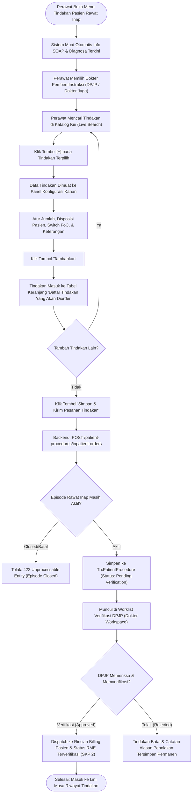

# Laporan Analisis, Spesifikasi Swagger & Rencana Kerja Modernisasi: Tindakan Keperawatan & Medis Rawat Inap (Paritas Visual Dokter & QuilvianV1)

## 1. Ringkasan Eksekutif & Identitas Dokumen

| Atribut | Keterangan |
| :--- | :--- |
| **Area / Modul** | Pelayanan Kesehatan (*Health Services*) — Ruang Kerja Keperawatan Rawat Inap (*Inpatient Nursing Workspace*) |
| **Menu Sasaran** | Ruang Kerja Keperawatan → Menu Utama: **Tindakan (*Inpatient Procedure Order & Management*)** |
| **Sub-Menu / Tab** | 1. **Order Tindakan** (*Pemesanan Tindakan Medis & Keperawatan atas Instruksi Dokter*)<br/>2. **History Tindakan** (*Lini Masa & Riwayat Tindakan Episode dengan Status Verifikasi*) |
| **Jalur Dokumen** | `docs/module-blueprints/rawat-inap/keperawatan/roadmap/rencana-kerja/tindakan/tindakan-keperawatan.md` |
| **Dasar Penyelarasan** | Mengadopsi 100% tata letak dan parameter operasional dari **QuilvianV1** (sesuai tangkapan layar `captures/keperawatan/tindakan/01-tindakan-keperawatan.png`), diselaraskan dengan tata visual modern **Ruang Kerja Dokter Rawat Inap (*Physician Workspace*)** (`ProcedureFormPanel.jsx` / `InpatientProcedureTab.jsx`), serta didukung backend `PatientProcedureController.cs` dan `TrxPatientProcedure.cs` di **QuilvianFinal**. |
| **Standar Regulasi & Akreditasi** | **KARS / STARKES (Standar Akreditasi Rumah Sakit)**:<br/>• Bab **PP (Pelayanan dan Asuhan Pasien)** — Standar PP 1.1 & PP 2.1: Pelaksanaan prosedur klinis dan tindakan keperawatan atas instruksi tertulis/lisan dokter yang terverifikasi.<br/>• Bab **SKP (Sasaran Keselamatan Pasien)**:<br/>  - **SKP 1**: Ketepatan identifikasi pasien sebelum tindakan medis/invasif.<br/>  - **SKP 2**: Peningkatan komunikasi efektif (*TBAK / SBAR / Readback*) pada instruksi tindakan perawat-dokter dengan mekanisme *closed-loop verification*.<br/>  - **SKP 5**: Pencegahan infeksi nosokomial (*HAIs*) pada prosedur steril (kateter, infus, luka operasi).<br/>• Bab **MRMIK & Permenkes No. 24/2022**: Rekam medis elektronik terintegrasi, pemisahan tindakan berbayar (*billable*) vs *Free of Charge (FoC)*, serta audit trail verifikasi DPJP. |
| **Prinsip Data & Anti-Hardcode** | **Zero Hardcode Guarantee** — Seluruh katalog tindakan, tarif per kelas perawatan, status penjamin (*Ditanggung/Tidak Ditanggung*), daftar dokter bertugas, dan status verifikasi dikelola langsung melalui API dinamis database backend (`MstProcedure`, `MstTariff`, `TrxPatientProcedure`). Tidak ada array tindakan fiktif di sisi frontend. |

---

## 2. Analisis Kesenjangan: Audit Bukti Operasional V1 vs QuilvianFinal

Berdasarkan investigasi mendalam terhadap tangkapan layar operasional **QuilvianV1** (`01-tindakan-keperawatan.png`), antarmuka **Dokter Rawat Inap** saat ini, serta kondisi **Ruang Kerja Perawat** di QuilvianFinal, disusun matriks gap berikut:

### 2.1. Matriks Kesenjangan Fitur (*Gap Analysis Matrix*)

| No | Fitur / Komponen | Kondisi di QuilvianV1 (`01-tindakan-keperawatan.png`) | Kondisi Dokter Rawat Inap Saat Ini (`QuilvianFinal`) | Kondisi Perawat Saat Ini di `QuilvianFinal` | Status & Solusi Modernisasi |
| :--- | :--- | :--- | :--- | :--- | :--- |
| 1 | **Struktur Tab Navigasi** | Memiliki 2 Sub-tab: `Order Tindakan` dan `History Tindakan` | Memiliki 3 Tab: `Pemesanan`, `Riwayat`, dan `Worklist Verifikasi` | Memiliki 2 Sub-tab: `Order Tindakan` dan `History Tindakan` | **SUDAH DITERAPKAN (Struktur)**:<br/>Pertahankan 2 tab pada perawat (`Order Tindakan` & `History Tindakan`), karena Worklist Verifikasi hanya hak dokter. |
| 2 | **Panel Ringkasan SOAP & Diagnosis** | Menampilkan box informasi: *"Informasi Pasien & Diagnosis"* (Diambil dari SOAP terupdate / diagnosis kerja dokter) | Terintegrasi langsung dengan konteks visite & diagnosa SOAP | Belum menampilkan ringkasan SOAP/Diagnosis di atas form order tindakan | **BELUM DITERAPKAN (PERLU DIBUAT)**:<br/>Tambahkan kartu *Informasi Pasien & Diagnosis* di bagian atas form order yang menampilkan diagnosa aktif dari SOAP rawat inap. |
| 3 | **Konteks Instruksi Medis** | Menampilkan 6 field: Departemen, Dokter Pemeriksa (Dropdown), Dijamin Pemeriksa, Tanggal Pemeriksaan, Kelas Pasien, dan Perawat Login | Diambil dari konteks login dokter + kelas episode rawat inap | Hanya form sederhana: Penginput (Readonly), Dokter Pemeriksa (Dropdown) | **SEBAGIAN DITERAPKAN (PERLU DISEMPURNAKAN)**:<br/>Lengkapi baris konteks pemeriksaan: Departemen, Dokter Pemberi Instruksi, Penjamin, Tanggal Pemeriksaan, Kelas Kamar, dan Nama Perawat Penginput. |
| 4 | **Tata Letak Katalog Tindakan (Split-View)** | **Split 2-Kolom Terpadu**:<br/>• Kiri: Live Search & Daftar Tindakan + Tarif + Badge Penjamin + Tombol `[+]`<br/>• Kanan: Form Konfigurasi Item (Kode, Nama, Tarif, Qty, Disposisi, FoC, Keterangan) | **Split 2-Kolom Terpadu** (`ProcedureFormPanel.jsx`) persis seperti V1 | **Masih Single Dropdown Monoton** (`nursing-procedure-order-panel.jsx`) tanpa tabel katalog visual | **BELUM DITERAPKAN DI PERAWAT (PERBAIKAN UTAMA)**:<br/>Rombak `nursing-procedure-order-panel.jsx` menjadi **Split-View 2 Kolom Interaktif** identik dengan tampilan dokter dan V1! |
| 5 | **Keranjang Staging Multi-Tindakan (Order Cart)** | Memiliki tabel bawah: *"Daftar Tindakan Yang Akan Diorder"* yang menampung multiple tindakan sebelum dikirim sekaligus | Memiliki tabel keranjang staging di bawah split panel dengan subtotal dan tombol reset/simpan | Belum ada keranjang; perawat hanya bisa meng-order 1 tindakan per submit | **BELUM DITERAPKAN DI PERAWAT (PERBAIKAN UTAMA)**:<br/>Tambahkan tabel staging keranjang tindakan agar perawat dapat mengumpulkan 3-5 tindakan sekaligus lalu mengirimnya dalam satu batch transaksi. |
| 6 | **Opsi Free of Charge (FoC)** | Memiliki switch toggle `FoC` (Free of Charge) dengan catatan alasan tindakan gratis | Memiliki switch toggle `FoC` + field alasan FoC | Hanya ada checkbox sederhana tanpa alasan FoC terstruktur | **SEBAGIAN DITERAPKAN**:<br/>Terapkan switch toggle FoC modern dengan auto-pop up alasan FoC sesuai regulasi rumah sakit. |
| 7 | **Disposisi & Keterangan Klinis** | Field textarea terpisah: `Disposisi Pasien` dan `Keterangan` | Memiliki `dispositionNote`, `clinicalReason`, dan `instructionNote` | Menggunakan field `clinicalReason` tunggal | **SEBAGIAN DITERAPKAN**:<br/>Sediakan field `Disposisi Pasien` dan `Keterangan Tambahan` sesuai form V1. |
| 8 | **Riwayat & Audit Trail Verifikasi** | Tab `History Tindakan` menampilkan seluruh riwayat tindakan, pelaksana, dan waktu tindakan | Dilengkapi badge status verifikasi instruksi (`Pending`, `Verified`, `Rejected`) | Sudah memiliki filter status verifikasi dan rincian tindakan | **SUDAH DITERAPKAN DENGAN BAIK**:<br/>Pertahankan dan perkuat integrasi dengan endpoint riwayat rawat inap. |

---

## 3. Alur Proses Bisnis Rumah Sakit (*Hospital Clinical Workflow*)

Alur pemesanan tindakan keperawatan rawat inap di rumah sakit melibatkan interaksi multi-profesi antara Perawat Pelaksana (*Staff Nurse*), Dokter Penanggung Jawab Pelayanan (DPJP), Kasir/Billing, dan Sistem Rekam Medis Elektronik (RME):



### Skenario Nyata Operasional Rumah Sakit:
1. **Skenario 1: Tindakan Pembedahan / Bedah Orthopedi (Contoh pada tangkapan layar V1)**:
   - *Kasus*: Pasien Ny. Nunung Sintaa di ruang Mawar ODC dengan DPJP Dr. Rahyussalim Sp.OT.
   - *Tindakan*: Dokter menginstruksikan `BEDAH - APP.PERFORASI+RETROGRAD,Dokter Operator` (Tarif Rp 8.349.000, status penjamin *Ditanggung*).
   - *Alur*: Perawat mencari kode `TDK25111400002`, memilih dokter operator, mengisi disposisi *"Persiapan pre-op di bangsal"*, lalu menambahkannya ke keranjang. Dokter memverifikasi pesanan sebelum operasi dimulai.
2. **Skenario 2: Tindakan Rutin Keperawatan Berbayar**:
   - *Tindakan*: Pemasangan kateter urin dan nebulisasi ventolin per 8 jam.
   - *Alur*: Perawat memilih 2 tindakan ke dalam keranjang staging, memeriksa tarif kamar ODC, lalu klik simpan batch sekaligus.
3. **Skenario 3: Prosedur Penggantian Selang Bocor (Free of Charge / FoC)**:
   - *Kasus*: Selang infus mengalami flebitis/rembes setelah 4 jam pemasangan sehingga harus dipasang ulang.
   - *Alur*: Perawat mengaktifkan switch toggle `FoC (Free of Charge)`, memasukkan alasan *"Pemasangan ulang kanula akibat ekstravasasi dini tanpa biaya pasien"*, sehingga bagian kasir/asuransi tidak mengenakan tagihan ganda kepada pasien.

---

## 4. Spesifikasi Endpoint Swagger API

Spesifikasi endpoint yang digunakan oleh antarmuka modern tindakan keperawatan berpedoman pada kontrak baku ASP.NET Core:

### 4.1. Kelompok Tag Swagger
Tag Swagger: **`[Tags("Health Services / Clinical Management / Patient Procedure")]`**  
Path Dasar: `/api/v1/health-services/clinical-management/patient-procedures`

### 4.2. Tabel Spesifikasi Endpoint

| No | Method | Route Path | Deskripsi Fungsi | Otorisasi / Role | Request Body / Params | Response DTO | HTTP Code |
| :--- | :--- | :--- | :--- | :--- | :--- | :--- | :--- |
| 1 | `POST` | `/inpatient-orders` | Membuat pesanan tindakan rawat inap oleh perawat atas instruksi dokter (Mendukung Idempotency-Key) | `PatientProcedure : Create` | `CreateInpatientProcedureOrderRequest` | `ApiResponse<PatientProcedureResponse>` | `201 Created`<br/>`400 Bad Request`<br/>`422 Closed` |
| 2 | `GET` | `/episodes/{episodeId}` | Mengambil seluruh riwayat tindakan pada episode perawatan (untuk tab *History Tindakan*) | `PatientProcedure : Read` | *Query Params*: `from`, `to`, `pageNumber`, `pageSize` | `ApiResponse<PagedResult<PatientProcedureResponse>>` | `200 OK`<br/>`404 Not Found` |
| 3 | `GET` | `/options` | Mengambil opsi katalog tindakan aktif, tarif berlaku, dan status jaminan asuransi | `PatientProcedure : Read` | *Query Params*: `search`, `onlyActive` | `ApiResponse<List<PatientProcedureOptionResponse>>` | `200 OK` |
| 4 | `PATCH` | `/{id}/cancel` | Membatalkan pesanan tindakan yang belum dieksekusi dengan alasan resmi klinis | `PatientProcedure : Update` | `CancelPatientProcedureRequest` (`cancelReason`) | `ApiResponse<PatientProcedureResponse>` | `200 OK`<br/>`400 Bad Request`<br/>`409 Conflict` |
| 5 | `GET` | `/{id}` | Mengambil detail komprehensif tindakan pasien (termasuk status billing dan verifikasi) | `PatientProcedure : Read` | *Route Param*: `id` (GUID) | `ApiResponse<PatientProcedureDetailResponse>` | `200 OK`<br/>`404 Not Found` |

---

## 5. Rancangan Antarmuka UI/UX Modern (Wireframe & Tata Letak)

Mengikuti instruksi pengguna dan paritas terhadap tangkapan layar V1 serta tampilan Dokter Rawat Inap, antarmuka `NursingProcedureSection` dirancang memiliki **4 Blok Utama Tanpa Modal Pop-up**:

```text
+-------------------------------------------------------------------------------------------------------------------------+
| [TAB 1: Order Tindakan]                                              [TAB 2: History Tindakan (5)]                      |
+-------------------------------------------------------------------------------------------------------------------------+
| CARD 1: INFORMASI PASIEN & DIAGNOSIS SOAP TERKINI                                                                       |
| Diagnosa Utama: Post Op Appendectomy Akut | Diagnosa Sekunder: Anemia Ringan | DPJP: Dr. Rahyussalim, Sp.OT (K)        |
+-------------------------------------------------------------------------------------------------------------------------+
| CARD 2: KONTEKS ORDER & INSTRUKSI DOKTER                                                                                |
| Departemen *                 | Dokter Pemeriksa / Instruksi *  | Penjamin *               | Tanggal Tindakan            |
| [ Instalasi Rawat Inap (v) ] | [ Dr. Rahyussalim, Sp.OT    (v) ] | [ BPJS Kesehatan     (v) ] | [ 2026-09-30              ] |
|                              |                                 |                          |                             |
| Kelas Pasien *               | Perawat Penginput (Read-Only)   | Status Penjaminan        | Tipe Pelayanan              |
| [ Mawar ODC / Kelas 1    (v) ] | [ Ns. Perawat Jaga, S.Kep       ] | [ DIJAMIN ASURANSI     ] | [ Non-Bedah / Bedah Minor ] |
+-------------------------------------------------------------------------------------------------------------------------+
| CARD 3: SPLIT-VIEW KATALOG & KONFIGURASI ITEM TINDAKAN                                                                  |
| +-------------------------------------------------------+ +-----------------------------------------------------------+ |
| | SISI KIRI: KATALOG TINDAKAN MEDIS                     | | SISI KANAN: KONFIGURASI ITEM TERPILIH                     | |
| | [Q Cari nama atau kode tindakan...                 ]  | |                                                           | |
| | ----------------------------------------------------  | | Kode Tindakan:  [ TDK25111400002                        ] | |
| | NAMA TINDAKAN             | TARIF (RP)   | AKSI       | | Nama Tindakan:  [ BEDAH - APP.PERFORASI+RETROGRAD       ] | |
| | --------------------------+--------------+----------- | | Tarif Satuan:   [ Rp 8.349.000,00                       ] | |
| | BEDAH - APP.PERFORASI     | 8.349.000,00 | [ + Tambah ] | Jumlah *:       [ 1                                     ] | |
| | [TDK25111400002] [Ditanggung]             |           | | Disposisi *:    [ Pasien diobservasi di bangsal pasca op] | |
| |                           |              |            | |                                                           | |
| | BEDAH - BIOPSI KELENJAR   | 2.541.000,00 | [ + Tambah ] | [ ] FoC (Free of Charge — Bebas Biaya Pasien)             | |
| | [TDK25111400003] [Ditanggung]             |           | | Keterangan:     [ Rawat luka steril berkala             ] | |
| |                           |              |            | |                                                           | |
| | PASANG KATETER URINE FOLEY|   150.000,00 | [ + Tambah ] | [ Batal ]                             [ + Masukkan Keranjang] | |
| +-------------------------------------------------------+ +-----------------------------------------------------------+ |
+-------------------------------------------------------------------------------------------------------------------------+
| CARD 4: DAFTAR TINDAKAN YANG AKAN DIORDER (KERANJANG STAGING MULTI-ORDER)                                               |
| +----+-----------------+--------------------------------------+--------+--------------+------------+-----+------------+ |
| | NO | KODE            | NAMA TINDAKAN                        | JUMLAH | TARIF SATUAN | TOTAL (RP) | FoC | AKSI       | |
| +----+-----------------+--------------------------------------+--------+--------------+------------+-----+------------+ |
| | 1  | TDK25111400002  | BEDAH - APP.PERFORASI+RETROGRAD      | 1      | 8.349.000,00 | 8.349.000  | Tdk | [Hapus]    | |
| | 2  | TDK25111400008  | INHALASI NEBULIZER VENTOLIN 1 RES    | 2      |   120.000,00 |   240.000  | Tdk | [Hapus]    | |
| +----+-----------------+--------------------------------------+--------+--------------+------------+-----+------------+ |
| Ringkasan: 2 Tindakan Dipilih | Total Estimasi Biaya: Rp 8.589.000,00                                                   |
| [ Reset Keranjang ]                                           [ Simpan & Kirim Pesanan Tindakan (Atas Instruksi DPJP) ] |
+-------------------------------------------------------------------------------------------------------------------------+
```

### Visual Hierarchy & Design Tokens:
- **Badge Status Penjamin**:
  - `Ditanggung`: Background `#ecfdf5`, Teks `#047857`, Border `#a7f3d0`.
  - `Tidak Ditanggung / Pribadi`: Background `#fef2f2`, Teks `#991b1b`, Border `#fecaca`.
- **Tombol Tambah Item `[+]`**: Menggunakan `BaseButton variant="primary"` ukuran compact (`sm`).
- **Tabel Keranjang Staging**: Dilengkapi indikator total harga realtime (`Rp ...`), badge CITO/Darurat jika ada, serta tombol aksi cepat hapus item (`FaTrashAlt`).

---

## 6. Rencana Eksekusi Implementasi (Pasca-Persetujuan)

Setelah dokumen rencana kerja ini disetujui pengguna, tahapan implementasi akan dilaksanakan secara terpadu tanpa penundaan:

1. **Backend Integration**:
   - Memastikan `PatientProcedureController.cs` melayani pembuatan pesanan tindakan perawat atas instruksi dokter via `POST /inpatient-orders` dengan `InstructingDoctorId` dan `Idempotency-Key`.
   - Menguji query penentuan tarif per kelas perawatan (`ResolveProcedureAsync`) agar selalu konsisten dengan kelas rawat inap pasien.
2. **Frontend UI Refactoring**:
   - Memperbarui `src/components/view/health-services/inpatient-management/nursing-workspace/sections/procedure/nursing-procedure-order-panel.jsx` dengan tata visual split-view 2-kolom identik dengan dokter (`ProcedureFormPanel.jsx`).
   - Menyempurnakan `src/lib/hooks/health-services/inpatient-management/use-inpatient-nursing-procedure.jsx` agar mendukung penambahan multiple tindakan ke keranjang staging (`selectedProcedures`) dan eksekusi batch ordering.
   - Menyempurnakan `nursing-procedure-history-panel.jsx` dengan filter pencarian instan dan tab verifikasi.
3. **Verifikasi Bebas Error (Build & Unit Tests)**:
   - Backend rebuild lolos kompilasi (`dotnet build QuilvianSystemBackend.csproj --no-incremental`).
   - Pembuatan unit test otomatis Node.js `tests/unit/inpatient-nursing-procedure-parity.test.mjs` untuk memverifikasi split catalog, staging cart, FoC toggle, dan dokter instruksi.

---

## 7. Rekomendasi & Persetujuan Pengguna

Dokumen perencanaan teknis dan bisnis proses ini telah selesai disusun secara komprehensif. Mohon ditinjau, dan jika disetujui, kami siap langsung memulai proses eksekusi kode (Backend & Frontend) secara tuntas!
