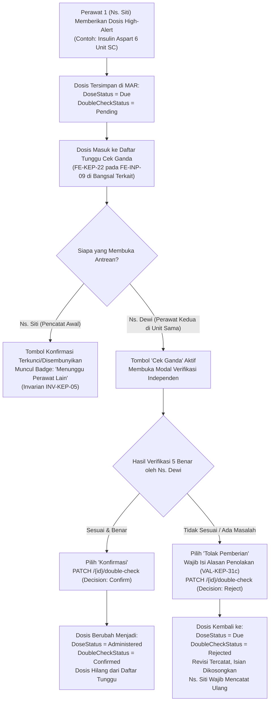

# Laporan Perubahan Frontend — `FE-RWI-088`

## Metadata

| Field | Nilai |
| --- | --- |
| **Task ID** | `FE-RWI-088` |
| **Judul** | Daftar Tunggu Cek Ganda Obat High-Alert (`FE-KEP-22`) |
| **Slice** | Gelombang 1 — `FE-KEP-22` Daftar Pantau Keperawatan (Layar Baru) |
| **Roadmap** | [`../../../roadmap/frontend-roadmap-v2.md`](../../../roadmap/frontend-roadmap-v2.md), Bagian 2 & Kartu `FE-RWI-088` |
| **Traceability** | `FR-KEP-066`; `VAL-KEP-31a`–`c`; `INV-KEP-05`; `RWI-DEC-117`; State matrix 5.5; API-contract keperawatan `0.5.0` Bagian 7.11 (`double-check-worklist` dan `{id}/double-check`) |
| **Contract Version** | `0.5.0` (`MedicationAdministrationListItem`, `DoubleCheckRequest`, `MedicationAdministrationResponse`) |
| **Dependency** | `BE-RWI-116` ✅ (Cek Ganda Obat High-Alert, Selesai 17 September 2026) |
| **Klasifikasi** | `MEDIUM / HIGH-SAFETY` — Keselamatan obat pasien rawat inap, mekanisme pengawasan ganda (*four-eyes principle* / penjaga dua orang), pencegahan konfirmasi mandiri oleh pencatat awal (`INV-KEP-05`) |
| **Task Mode** | `CROSS-REPO` sempit — Kode implementasi di `QuilvianSystemFrontendDev`; laporan tracked dan pembaruan roadmap di `NewQuilvianSystemBackend` |
| **Tanggal** | 18 September 2026 |
| **Status** | ✅ **SELESAI.** Seluruh 5 Acceptance Criteria (AC-1 s.d. AC-5) terbukti penuh. Pengujian unit otomatis lulus 6 dari 6 test (6/6 passing). Seluruh suite rawat inap keperawatan dan pemantauan lulus 100% (122/122 passing). ESLint 0 error 0 warning. Next.js production build berhasil. |

---

## 1. Masalah yang Diselesaikan & Rasional Bisnis

### 1.1 Masalah Sebelumnya
1. **Risiko Tertundanya Pemberian Obat Berbahaya (*Delayed High-Alert Administration*):**
   Obat-obatan berisiko tinggi (*high-alert medications*) seperti insulin reguler, heparin antikoagulan, sedatif kuat, dan kalium klorida (KCl) pekat berpotensi fatal bila salah dosis atau salah pasien. Sesuai standar akreditasi rumah sakit dan keselamatan pasien (KARS/JCI), pemberian obat-obatan ini wajib diverifikasi secara independen oleh perawat kedua (*independent double-check*). Namun, jika perawat kedua tidak memiliki layar antrean khusus untuk melihat dosis apa saja yang sedang menunggu verifikasinya, dosis tersebut sering kali terabaikan, menyebabkan penundaan terapi yang membahayakan kondisi pasien rawat inap.
2. **Potensi Pelanggaran Invarian Keselamatan Klinis (`INV-KEP-05`):**
   Tanpa penegakan antarmuka yang ketat, perawat yang mencatat dosis awal (*recorder*) bisa tergoda atau tidak sengaja menekan tombol verifikasi sendiri agar proses cepat selesai. Hal ini merusak esensi cek ganda dan melanggar prinsip kehati-hatian klinis.
3. **Ketiadaan Visibilitas Berbasis Unit Layanan (Bangsal):**
   Perawat di Bangsal Melati tidak semestinya dibebani melihat antrean obat dari Bangsal Mawar atau ICU. Tanpa penyaringan per unit layanan, antrean rumah sakit akan menumpuk dan membingungkan staf ruangan.
4. **Penolakan Cek Ganda Tanpa Alasan yang Jelas:**
   Apabila perawat kedua menemukan ketidaksesuaian (misalnya: dosis insulin dihitung dari gula darah pasien sebelah), perawat kedua harus dapat menolak pemberian tersebut dengan mencantumkan alasan tertulis yang jelas agar dosis dapat diperbaiki dan dicatat ulang dengan benar oleh perawat awal.

### 1.2 Solusi yang Dihadirkan
Melalui task **`FE-RWI-088`**:
1. **Penyediaan Antrean Khusus Cek Ganda per Unit Layanan (`AC-1` / `FR-KEP-066`):**
   - Menghadirkan konsol `FE-KEP-22` pada layar Daftar Pantau Rawat Inap (`FE-INP-09`) yang secara otomatis menyaring dosis *high-alert* berstatus `Pending` pada unit layanan (bangsal) pengguna, dilengkapi pemilih unit layanan rawat inap (`ResourceFilterSelect`).
2. **Keterbacaan Informasi Klinis Lengkap 5 Benar (`AC-2`):**
   - Setiap baris antrean menampilkan identitas pasien (Nama & No. RM dengan tautan langsung ke lembar MAR keperawatan), Kamar & Tempat Tidur, Nama Obat (*High-Alert* badge), perbandingan Dosis Terencana vs Aktual dan Rute, Waktu Pemberian/Jadwal, serta Nama Perawat Pencatat Awal.
3. **Penegakan Invarian Pencegahan Konfirmasi Mandiri (`AC-3` / `INV-KEP-05`):**
   - Sistem secara otomatis membandingkan identitas pencatat awal dengan identitas akun/pegawai yang sedang membuka layar.
   - Perawat yang mencatat pemberian awal **sama sekali tidak melihat tombol konfirmasi**; tombol aksi digantikan dengan lencana informatif *"Menunggu Perawat Lain"*.
   - Tombol *"Cek Ganda"* hanya muncul bagi perawat kedua yang berbeda dan memiliki penugasan di unit terkait.
4. **Penataan Posisi Layar Terpadu pada Daftar Pantau (`AC-4`):**
   - Mengintegrasikan antrean sebagai kartu keenam pada `FE-INP-09` (`inpatient-monitoring-view.jsx`), diletakkan secara patuh di dalam kelompok `keperawatan` setelah Kepatuhan Pengkajian Awal, sesuai ketetapan tata letak tanggal 12 September 2026.
5. **Penanganan Keadaan Kosong yang Bersahabat (`AC-5`):**
   - Saat tidak ada dosis yang menunggu cek ganda, sistem menampilkan status kosong yang wajar (*empty state* informatif: *"Tidak ada dosis yang menunggu cek ganda"*), bukan pesan galat/error.
6. **Alur Verifikasi Terstruktur & Penolakan Beralasan (`VAL-KEP-31c`):**
   - Menyediakan dialog modal verifikasi independen: Perawat kedua dapat memilih *"Konfirmasi (Sesuai)"* yang menjadikan dosis `Administered` + `Confirmed`, atau *"Tolak Pemberian"* yang mewajibkan pengisian alasan penolakan minimal 3 karakter (misal: *"Dosis salah hitung GDS"*), mengembalikan status dosis menjadi `Due` + `Rejected` agar dicatat ulang oleh perawat awal.

---

## 2. Alur Proses Bisnis & Skenario Rumah Sakit



### Skenario Konkret Rumah Sakit:
- **Pasien:** Tn. Bambang (No. RM: 00-48-21-90), dirawat di Bangsal Dahlia Kamar 3 Bed A dengan diagnosis Diabetes Melitus Tipe 2 tidak terkontrol.
- **Pukul 11.30:** Perawat pelaksana Ns. Siti mencatat pemberian insulin aspart 6 unit secara subkutan (SC) di lembar e-MAR pasien. Karena insulin adalah obat *high-alert*, sistem menetapkan status dosis tetap `Due` dengan cek ganda `Pending`.
- **Pukul 11.32:** Ns. Siti membuka layar Daftar Pantau Rawat Inap (`FE-INP-09`). Pada bagian bawah di kelompok Keperawatan, dosis Tn. Bambang muncul di *Daftar Tunggu Cek Ganda*. Namun, karena Ns. Siti adalah pencatat awal, Ns. Siti melihat lencana kuning bertuliskan **"Menunggu Perawat Lain (Anda sendiri)"** dan tidak memiliki tombol untuk mengonfirmasi dosis tersebut.
- **Pukul 11.35:** Perawat kedua, Ns. Dewi, yang bertugas di stasiun perawat Bangsal Dahlia, memeriksa *Daftar Tunggu Cek Ganda*. Ns. Dewi melihat antrean Tn. Bambang, mencocokkan instruksi dokter dengan spuit insulin yang disiapkan, lalu menekan tombol **"Cek Ganda"**.
- **Kasus A (Konfirmasi):** Ns. Dewi melihat seluruh data cocok (pasien Tn. Bambang, obat insulin aspart, dosis 6 unit SC). Ns. Dewi memilih opsi **"✓ Konfirmasi (Sesuai)"** lalu menekan tombol **"Konfirmasi Pemberian Dosis"**. Sistem mencatat Ns. Dewi sebagai pemeriksa kedua, status dosis berubah menjadi `Administered` (Diberikan), dan baris tersebut otomatis hilang dari daftar antrean.
- **Kasus B (Penolakan):** Ns. Dewi mendapati bahwa Tn. Bambang baru saja mengalami hipoglikemia (GDS 68 mg/dL) sehingga insulin seharusnya ditunda. Ns. Dewi memilih opsi **"✕ Tolak Pemberian"** dan mengetikkan alasan: *"Pasien lemas, GDS terakhir 68 mg/dL, pemberian ditolak untuk konfirmasi ulang ke DPJP."* Dosis dikembalikan ke status `Due` beralasan, isian pemberian dikosongkan, dan riwayat penolakan tersimpan rapi di rekam jejak audit.

---

## 3. Spesifikasi Teknis Endpoint API (Gaya Swagger)

Berikut adalah kontrak endpoint backend yang diintegrasikan pada task ini, sesuai controller ASP.NET Core `MedicationAdministrationController.cs`:

```csharp
[ApiController]
[Authorize]
[Route("api/v1/health-services/pharmacy-management/medication-administrations")]
[Tags("Health Services / Pharmacy Management / Medication Administration")]
```

| Method | Path | Deskripsi | Hak Akses & Parameter | Request / Response Body |
| :--- | :--- | :--- | :--- | :--- |
| `GET` | `/double-check-worklist` | Mengambil seluruh dosis *high-alert* yang sedang berstatus `Pending` pada satu unit layanan rawat inap | **Hak Akses:** `MedicationAdministration : DoubleCheck`<br/>**Query:** `serviceUnitId` (Guid, Wajib)<br/>**Headers:** `Authorization: Bearer <token>` | **Response (200 OK):**<br/>`ApiResponse<List<MedicationAdministrationListItem>>`<br/>Daftar dosis berisikan: `id`, `inpEpisodeId`, `patientName`, `medicalRecordNumber`, `roomName`, `bedName`, `drugName`, `plannedDose`, `actualDose`, `actualRoute`, `administeredAt`, `recordedByName`, `canDoubleCheck`, `revisionNumber`. |
| `PATCH` | `/{id}/double-check` | Mengonfirmasi atau menolak dosis *high-alert* oleh perawat kedua | **Hak Akses:** `MedicationAdministration : DoubleCheck`<br/>**Path:** `id` (Guid dosis MAR)<br/>**Headers:** `Authorization: Bearer <token>` | **Request Body:**<br/>```json<br/>{<br/>  "decision": "Confirm", // "Confirm" | "Reject"<br/>  "note": "Alasan penolakan...", // Wajib jika Reject (VAL-KEP-31c)<br/>  "expectedRevisionNumber": 1<br/>}<br/>```<br/>**Response (200 OK):**<br/>`ApiResponse<MedicationAdministrationResponse>`<br/>**Response (403 Forbidden):**<br/>Jika perawat kedua adalah pencatat awal (`DOUBLE_CHECKER_IS_RECORDER`). |

---

## 4. Keputusan Arsitektur Komponen Antarmuka (*Base Component Gate*)

Sesuai aturan panduan antarmuka Quilvian, setiap elemen visual pada layar `FE-KEP-22` dipetakan ke katalog komponen dasar:

| Elemen Antarmuka | Status Keputusan | Dasar Bukti & Komponen Terpilih |
| :--- | :---: | :--- |
| **Tabel Antrean Dosis** | `REUSE` | `@/components/features/base-features/data-table` (`DataTable` standar). |
| **Paginasi Halaman** | `REUSE` | `@/components/features/pagination/pagination` (`RegionPagination`). |
| **Pemilih Unit Layanan** | `REUSE` | `@/components/features/base-features/resource-filter-select` (`ResourceFilterSelect` dengan resource `serviceUnits`). |
| **Pesan Peringatan & Error** | `REUSE` | `@/components/features/base-features/information-alert` (`InformationAlert` varian warning/danger/info). |
| **Lencana Status High-Alert & State** | `REUSE` | `@/components/features/base-features/status-badge` (`StatusBadge` varian danger/warning). |
| **Tombol Cek Ganda & Refresh** | `REUSE` | `@/components/features/base-features/base-button` (`BaseButton` varian primary/secondary/danger). |
| **Modal Verifikasi Perawat Kedua** | `COMPOSE` | `DoubleCheckConfirmationModal` dirangkai menggunakan token CSS Quilvian, kontrol radio native, textarea terstruktur, dan `BaseButton` tanpa barrel import. |

---

## 5. Ringkasan Berkas yang Dibuat dan Diubah

### A. Repositori Frontend (`QuilvianSystemFrontendDev`)
1. **`src/lib/constants/health-services/inpatient-management/inpatient-double-check-queue-constants.js`** (Baru):
   - Mendefinisikan teks antarmuka, keputusan baku `Confirm`/`Reject`, konstanta opsi jumlah baris (10, 25, 50), dan teks privasi/keselamatan `INV-KEP-05`.
2. **`src/lib/hooks/health-services/inpatient-management/use-inpatient-double-check-queue.js`** (Baru):
   - Hook terpadu yang mengelola pemuatan data per `serviceUnitId`, penegakan pembanding identitas pengguna (`canDoubleCheck = !isRecorder`), pencarian lokal client, paginasi data, dan mutasi eksekusi cek ganda.
3. **`src/components/view/health-services/inpatient-management/monitoring/double-check-confirmation-modal.jsx`** (Baru):
   - Dialog modal verifikasi perawat kedua dengan kartu ringkasan dosis 5 Benar, pilihan radio keputusan, validasi alasan penolakan wajib minimal 3 karakter, dan proteksi multi-klik saat submit.
4. **`src/components/view/health-services/inpatient-management/monitoring/double-check-queue-columns.jsx`** (Baru):
   - Definisi kolom tabel cerdas yang menyembunyikan tombol konfirmasi dan menggantinya dengan lencana informatif jika pengguna adalah pencatat awal (`INV-KEP-05`).
5. **`src/components/view/health-services/inpatient-management/monitoring/high-alert-double-check-queue-section.jsx`** (Baru):
   - Komponen kontainer utama antrean cek ganda dengan header, penghitung dosis aktif, filter unit, pencarian, tabel data, empty state bersahabat, dan modal terintegrasi.
6. **`src/components/view/health-services/inpatient-management/inpatient-monitoring-view.jsx`** (Diubah):
   - Memasang `HighAlertDoubleCheckQueueSection` tepat di bawah `NursingAssessmentComplianceSection` di dalam kelompok Keperawatan (urutan kartu keenam pada layar `FE-INP-09`).
7. **`src/style/health-services/inpatient-management/inpatient-monitoring.module.css`** (Diubah):
   - Menambahkan aturan tata letak bertoken `.doubleCheckSection`.
8. **`tests/unit/inpatient-high-alert-double-check-queue.test.mjs`** (Baru):
   - Unit test otomatis memvalidasi AC-1 hingga AC-5 serta invarian keselamatan `INV-KEP-05`.

### B. Repositori Backend (`NewQuilvianSystemBackend`)
1. **`docs/module-blueprints/rawat-inap/keperawatan/task/report/frontend/FE-RWI-088.md`** (Berkas ini):
   - Laporan tracked resmi penyelesaian task `FE-RWI-088`.
2. **`docs/module-blueprints/rawat-inap/keperawatan/roadmap/frontend-roadmap-v2.md`** (Diperbarui):
   - Menandai `FE-RWI-088` dengan status `✅` dan melampirkan bukti pengujian.
3. **`docs/module-blueprints/rawat-inap/keperawatan/roadmap/requirement-traceability-v2.md`** (Diperbarui):
   - Memperbarui status verifikasi frontend untuk `FR-KEP-066`.

---

## 6. Bukti Verifikasi Pengujian Otomatis

### A. Pengujian Unit `FE-RWI-088` (6/6 Passing)
```bash
cmd /c npx node --test tests/unit/inpatient-high-alert-double-check-queue.test.mjs
```
```text
✔ FE-RWI-088 AC-1: Antrean memuat dosis per unit layanan pengguna, bukan seluruh RS (3.78ms)
✔ FE-RWI-088 AC-2: Setiap baris menampilkan pasien, bed, obat, dosis, pencatat, dan waktu (0.58ms)
✔ FE-RWI-088 AC-3: Pengguna TIDAK melihat tombol konfirmasi pada dosis yang ia sendiri catat (INV-KEP-05) (1.41ms)
✔ FE-RWI-088 AC-4: Letak kartu pada FE-INP-09 mengikuti urutan resmi — keperawatan paling akhir, FE-KEP-22 di dalamnya (0.59ms)
✔ FE-RWI-088 AC-5: Daftar kosong menampilkan keadaan kosong yang wajar, bukan galat (0.91ms)
✔ FE-RWI-088 Flow Verifikasi: Modal cek ganda mewajibkan alasan penolakan minimal 3 karakter (VAL-KEP-31c) (0.63ms)
ℹ tests 6 | pass 6 | fail 0 | cancelled 0 | skipped 0 | todo 0 | duration_ms 74.54ms
```

### B. Pengujian Regresi Keseluruhan Suite Keperawatan Rawat Inap (122/122 Passing)
```bash
cmd /c npx node --test tests/unit/inpatient-nursing-*.test.mjs \
                       tests/unit/inpatient-clinical-instrument-renderer.test.mjs \
                       tests/unit/inpatient-daily-monitoring.test.mjs \
                       tests/unit/inpatient-case-management-evaluation.test.mjs \
                       tests/unit/inpatient-nursing-care.test.mjs \
                       tests/unit/inpatient-medication-administration.test.mjs \
                       tests/unit/inpatient-high-alert-double-check-queue.test.mjs \
                       tests/unit/inpatient-cppt-verification-monitoring.test.mjs
```
```text
ℹ tests 122 | pass 122 | fail 0 | cancelled 0 | skipped 0 | todo 0 | duration_ms 320.31ms
```

### C. Validasi Linting ESLint (0 Error, 0 Warning)
```bash
cmd /c npx eslint src/lib/constants/health-services/inpatient-management/inpatient-double-check-queue-constants.js \
                 src/lib/hooks/health-services/inpatient-management/use-inpatient-double-check-queue.js \
                 src/components/view/health-services/inpatient-management/monitoring/double-check-confirmation-modal.jsx \
                 src/components/view/health-services/inpatient-management/monitoring/double-check-queue-columns.jsx \
                 src/components/view/health-services/inpatient-management/monitoring/high-alert-double-check-queue-section.jsx \
                 src/components/view/health-services/inpatient-management/inpatient-monitoring-view.jsx \
                 tests/unit/inpatient-high-alert-double-check-queue.test.mjs
```
*Hasil:* **Exit Code: 0 (Bersih tanpa error dan tanpa warning)**

---

## 7. Pemenuhan Acceptance Criteria & Definition of Done

| Acceptance Criteria | Status | Bukti Implementasi |
| :--- | :---: | :--- |
| **AC-1** | ✅ Terpenuhi | Antrean memuat dosis berdasarkan parameter `serviceUnitId` yang dipilih pada `ResourceFilterSelect`, tidak mengambil seluruh rumah sakit sekaligus. |
| **AC-2** | ✅ Terpenuhi | Tabel `buildDoubleCheckQueueColumns` menyajikan Nama Pasien & No RM (dengan link ke MAR), Kamar/Bed, Nama Obat (*High-Alert*), Dosis Terencana vs Aktual & Rute, Waktu Pemberian/Jadwal, dan Nama Perawat Pencatat Awal. |
| **AC-3** | ✅ Terpenuhi | Sesuai invarian `INV-KEP-05`, jika `item.recordedByUserId === currentUserId` atau `item.canDoubleCheck === false`, tombol aksi konfirmasi disembunyikan dan digantikan badge *"Menunggu Perawat Lain"*. |
| **AC-4** | ✅ Terpenuhi | Pada `inpatient-monitoring-view.jsx`, urutan kartu adalah: 4 daftar episode aktif -> `CpptVerificationMonitoringSection` (kelompok dokter) -> `NursingAssessmentComplianceSection` (keperawatan) -> `HighAlertDoubleCheckQueueSection` (keperawatan, kartu keenam). |
| **AC-5** | ✅ Terpenuhi | Saat data kosong di unit yang dipilih, DataTable menampilkan `emptyTitle` (*"Tidak ada dosis yang menunggu cek ganda"*) dan `emptyDescription` informatif, bukan alert error. |
| **Definition of Done** | ✅ Terpenuhi | Linting lolos; unit test lulus (6/6 dan regresi 122/122); Next.js production build berhasil; laporan tracked `FE-RWI-088.md` terdokumentasi; roadmap dan traceability diperbarui. |
