# Laporan Perubahan Frontend — `FE-RWI-089`

## Metadata

| Field | Nilai |
| --- | --- |
| **Task ID** | `FE-RWI-089` |
| **Judul** | Pemesanan Tindakan atas Instruksi Dokter (`FE-KEP-14`) & Integrasi Penunjang Medis (`FE-KEP-15`) |
| **Slice** | Gelombang 2 — Menu Tindakan dan Penunjang Medis pada Ruang Kerja Keperawatan V2 |
| **Roadmap** | [`../../../roadmap/frontend-roadmap-v2.md`](../../../roadmap/frontend-roadmap-v2.md), Bagian 2 & Kartu `FE-RWI-089` |
| **Traceability** | `FR-KEP-079`, `FR-KEP-080`; `RWI-DEC-113`, `RWI-DEC-153`; Kontrak `0.6.0` [DOK] `INT-DOK-19`; `03-frontend-architecture.md` 10.4.8 |
| **Contract Version** | `0.6.0` (`InpatientProcedureOrderRequest`, `PatientProcedureListItem`, `LabOrderListItem`, `RadOrderListItem`) |
| **Dependency** | `FE-RWI-081` ✅ (Ruang Kerja Keperawatan V2 Shell), `BE-RWI-125` ✅ (Backend Pemesanan Tindakan & Penunjang Keperawatan) |
| **Klasifikasi** | `MEDIUM / HIGH-INTEGRATION` — Alur kolaborasi interprofesional (perawat memesan atas instruksi dokter), pemantauan hasil laboratorium & radiologi, isolasi layanan belum tersedia tanpa beban jaringan |
| **Task Mode** | `CROSS-REPO` sempit — Kode implementasi di `QuilvianSystemFrontendDev`; laporan tracked dan pembaruan roadmap di `NewQuilvianSystemBackend` |
| **Tanggal** | 18 September 2026 |
| **Status** | ✅ **SELESAI.** Seluruh 6 Acceptance Criteria (AC-1 s.d. AC-6) terbukti penuh. Pengujian unit otomatis lulus 6 dari 6 test (6/6 passing). ESLint 0 error 0 warning. Next.js production build berhasil. |

---

## 1. Masalah yang Diselesaikan & Rasional Bisnis

### 1.1 Masalah Sebelumnya
1. **Ketiadaan Kanal Pemesanan Tindakan atas Instruksi Dokter (`FR-KEP-079`):**
   Pada alur rawat inap sehari-hari, dokter penanggung jawab pelayanan (DPJP) atau dokter jaga sering memberikan instruksi tindakan medis (misalnya: pemasangan NGT, kateter urin, nebulisasi, perawatan luka pasca-bedah, atau fisioterapi dada). Sebelumnya, perawat tidak memiliki form pemesanan terstruktur di dalam Ruang Kerja Keperawatan untuk mendokumentasikan instruksi ini secara langsung ke sistem dengan verifikasi dokter terkait.
2. **Risiko Ketidakpastian Dokter Pemberi Instruksi & Manipulasi Penginput (`AC-1`, `AC-2`):**
   Bila dropdown dokter tidak divalidasi dengan ketat terhadap dokter yang sedang bertugas/terjadwal pada episode, pesanan dapat ditujukan kepada dokter yang salah atau fiktif. Selain itu, identitas perawat yang mencatat (*ordered by*) rawan dimanipulasi bila disediakan input teks bebas, sehingga merusak rantai ketertelusuran medikolegal rekam medis rumah sakit.
3. **Ketiadaan Visibilitas Status Verifikasi Instruksi Dokter (`AC-3`):**
   Setiap tindakan yang dipesan oleh perawat wajib berstatus `Pending` verifikasi sampai dokter pemberi instruksi menyetujuinya di ruang kerja dokter. Tanpa riwayat tindakan yang menampilkan status verifikasi instruksi (`InstructionVerificationStatus`), perawat ruangan tidak dapat memastikan apakah instruksi tersebut sudah disahkan dokter atau masih menunggu telaah.
4. **Isolasi Pembacaan Hasil Penunjang Medis bagi Keperawatan (`FR-KEP-080`, `AC-4`):**
   Perawat ruangan membutuhkan akses langsung untuk memantau status pesanan dan hasil final Laboratorium (analisis darah rutin, elektrolit, gas darah) serta Radiologi (foto toraks, USG, CT-scan). Sebelumnya, perawat harus meminta dokter membuka ruang kerjanya atau menghubungi unit penunjang secara manual melalui telepon.
5. **Bahaya Permukaan Tiruan pada Layanan Belum Tersedia (`AC-5`, `RWI-DEC-108`):**
   Empat layanan penunjang lain (Rehabilitasi Medik, Konsultasi Gizi, Hemodialisa, dan Bank Darah) belum memiliki modul terintegrasi pada rilis ini. Membuat form tiruan (*mock forms*) atau memicu permintaan jaringan yang berujung galat 404/500 akan membebani server dan menyesatkan pengguna klinis.
6. **Kejelasan Status Pemesanan Penunjang oleh Perawat (`AC-6`, `RWI-DEC-153`):**
   Gerbang otorisasi `{GATE-LABRAD}` yang sebelumnya memblokir kontrol pemesanan penunjang dari perawat telah resmi disetujui dan ditutup oleh Yoga Aji pada 16 September 2026 (`RWI-DEC-153`). Namun, endpoint backend pemesanan khusus perawat (`BE-RWI-104`) masih dalam antrean pengembangan. Antarmuka harus menampilkan tombol kontrol pemesanan tersebut secara transparan namun dinonaktifkan (*disabled*) dengan penjelasan status dependensi yang jelas bagi perawat.

### 1.2 Solusi yang Dihadirkan
Melalui task **`FE-RWI-089`**:
1. **Penyediaan Form Pemesanan Tindakan Berbasis Instruksi Dokter (`AC-1`, `FR-KEP-079`):**
   - Menghadirkan sub-tab *"Order Tindakan"* pada menu Tindakan (`FE-KEP-14`).
   - Menyediakan dropdown **Dokter Pemberi Instruksi** yang wajib dipilih dari daftar dokter yang sedang bertugas pada episode (`fetchInpatientDoctorOptions`). Pesanan ditolak bila dokter belum dipilih.
2. **Penguncian Penginput ke Akun Login Perawat (`AC-2`):**
   - Mengambil identitas akun login secara otomatis dari Redux state (`selectUserInfo`).
   - Menampilkan nama dan peran perawat penginput dalam kolom teks nonaktif (*read-only/disabled*), mencegah pengetikan manual atau pemalsuan identitas pencatat.
3. **Riwayat Tindakan dengan Pelacakan Status Verifikasi Lengkap (`AC-3`):**
   - Menghadirkan sub-tab *"History Tindakan"* yang menampilkan tabel riwayat seluruh tindakan episode.
   - Menyajikan kolom *"Verifikasi Instruksi"* dengan lencana status jelas (*Menunggu Verifikasi*, *Terverifikasi*, *Ditolak*, atau *Tidak Perlu*), nama dokter pemberi instruksi, status klinis pelaksanaan, penginput, pelaksana, dan status penerbitan tagihan (*billing*).
4. **Integrasi Pembacaan Pesanan & Hasil Final Penunjang Medis (`AC-4`, `FR-KEP-080`):**
   - Menghadirkan menu Penunjang Medis (`FE-KEP-15`) dengan 6 sub-tab terpadu: Radiologi, Laboratorium, Rehab Medik, Konsultasi Gizi, Hemodialisa, dan Bank Darah.
   - Tab Laboratorium dan Radiologi membaca pesanan dan hasil final secara independen (`useInpatientSupportingService`). Kegagalan salah satu unit tidak menghapus tampilan unit lainnya.
   - Mengintegrasikan modal rincian hasil (`SupportingResultDetailModal`): Perawat dapat menekan tombol *"Lihat Hasil"* pada pemeriksaan berstatus final untuk membaca parameter lab dan rentang rujukan, atau membaca ekspertise dan kesimpulan dokter spesialis radiologi.
5. **Penegakan Nol Permintaan Jaringan pada 4 Layanan Belum Tersedia (`AC-5`):**
   - Keempat layanan (Rehab Medik, Konsultasi Gizi, Hemodialisa, Bank Darah) menampilkan kartu informatif `NursingUnavailableSection` berisikan deskripsi ruang lingkup layanan dan lencana *"Integrasi belum tersedia"*.
   - Evaluasi dilakukan secara lokal (`UNAVAILABLE_SERVICE_KEYS`) dengan pengembalian dini (*early return*), menjamin **nol panggilan jaringan** (0 HTTP requests) ke modul-modul tersebut.
6. **Penyajian Kontrol Pemesanan Penunjang Terproteksi (`AC-6`):**
   - Tombol `+ Pesan Laboratorium` dan `+ Pesan Radiologi` ditampilkan pada antarmuka sesuai penutupan `{GATE-LABRAD}` (`RWI-DEC-153`).
   - Tombol dikunci dalam keadaan nonaktif (*disabled*) dengan teks keterangan pendukung: *"Pemesanan dari sisi perawat menunggu BE-RWI-104 mendarat. Hasil pemeriksaan tetap dapat dibaca di bawah."*

---

## 2. Alur Proses Bisnis & Skenario Rumah Sakit

```mermaid
flowchart TD
    subgraph Alur_Tindakan["1. Alur Tindakan Keperawatan (FE-KEP-14)"]
        A["Dokter Memberikan Instruksi Tindakan<br/>(Contoh: Pasang NGT 16 Fr)"] --> B["Perawat Buka Menu 'Tindakan' -> Sub-tab 'Order Tindakan'"]
        B --> C["Sistem Mengunci Penginput: Akun Login Ns. Siti (AC-2)"]
        C --> D["Perawat Memilih Dokter Pemberi Instruksi dari Dropdown (AC-1)<br/>(Contoh: dr. Ahmad Subagyo, Sp.PD)"]
        D --> E["Perawat Memilih Tindakan Medis, Jumlah, Cito/Primer, Indikasi"]
        E --> F["Perawat Menekan 'Simpan Pesanan Tindakan'"]
        F --> G["API POST /patient-procedures<br/>Status Verifikasi Otomatis: Pending"]
        G --> H["Pesanan Muncul di Sub-tab 'History Tindakan' (AC-3)<br/>Badge: 'Menunggu Verifikasi (dr. Ahmad Subagyo)'"]
        H --> I["Dokter Membuka Tab Tindakan di Ruang Kerja Dokter<br/>-> Menekan 'Verifikasi Instruksi' -> Status Menjadi Verified"]
    end

    subgraph Alur_Penunjang["2. Alur Penunjang Medis (FE-KEP-15)"]
        J["Perawat Membuka Menu 'Penunjang Medis'"] --> K{"Pilih Sub-tab Layanan"}
        K -- "Laboratorium / Radiologi (AC-4)" --> L["Sistem Membaca Pesanan & Ketersediaan Hasil<br/>(GET /lab-orders /rad-orders by Episode)"]
        L --> M{"Apakah Hasil Sudah Final?"}
        M -- "Ya (Status FINAL)" --> N["Tombol 'Lihat Hasil' Aktif<br/>Membuka Modal Detail Hasil Parameter Lab / Ekspertise Rad"]
        M -- "Belum (Status NOT_FINAL / WAITING)" --> O["Badge 'Menunggu Hasil', Tombol Nonaktif (-)"]
        
        K -- "Rehab / Gizi / Dialisis / Bank Darah (AC-5)" --> P["Evaluasi Lokal UNAVAILABLE_SERVICE_KEYS<br/>Nol Permintaan Jaringan (0 Network Request)"]
        P --> Q["Tampil Kartu Informatif:<br/>'Integrasi belum tersedia di rilis ini'"]
    end
```



### Skenario Konkret Rumah Sakit:
- **Pasien:** Ny. Siti Rahma (No. RM: 00-52-19-44, Umur: 58 Tahun), dirawat di Bangsal Teratai Kamar 2 Bed B dengan diagnosis Sepsis ec Pneumonia dan Dehidrasi Sedang.
- **Pukul 08.30 (Visite Dokter):** DPJP dr. Ahmad Subagyo, Sp.PD memberikan instruksi verbal saat visite kepada perawat penanggung jawab pasien, Ns. Fitri: *"Suster, tolong pasang NGT nomor 16 untuk dekompresi lambung dan berikan nebulisasi combivent tiap 8 jam."*
- **Pukul 08.45 (Pencatatan Tindakan oleh Perawat):**
  1. Ns. Fitri membuka Ruang Kerja Keperawatan Ny. Siti Rahma, lalu mengklik menu **"Tindakan"** (sub-tab *Order Tindakan*).
  2. Kolom *Penginput (Perawat Login)* otomatis terisi nonaktif dengan teks: **"Ns. Fitri Handayani, S.Kep"** (`AC-2`).
  3. Pada dropdown *Dokter Pemberi Instruksi*, Ns. Fitri memilih **"dr. Ahmad Subagyo, Sp.PD"** dari daftar dokter yang aktif bertugas (`AC-1`).
  4. Ns. Fitri memilih tindakan **"Pemasangan Pipa Lambung / NGT"**, jumlah 1, alasan klinis: *"Dekompresi lambung dan retensi cairan lambung pasca-mual"*.
  5. Ns. Fitri menekan tombol **"Simpan Pesanan Tindakan"**. Sistem memvalidasi kelengkapan data, mengirimkan request ke backend, dan menampilkan notifikasi sukses.
- **Pukul 08.48 (Pengecekan Riwayat Tindakan):**
  1. Ns. Fitri berpindah ke sub-tab **"History Tindakan"** (`AC-3`).
  2. Tindakan pemasangan NGT tampak pada baris teratas dengan status klinis *"Direncanakan"*, penginput *"Ns. Fitri Handayani"*, dan kolom Verifikasi Instruksi menampilkan lencana kuning: **"Menunggu Verifikasi (dr. Ahmad Subagyo, Sp.PD)"**.
  3. Ketika dr. Ahmad membuka ruang kerja dokter di stasiun perawat, pesanan ini masuk ke antrean verifikasi dokter untuk ditandatangani secara elektronik.
- **Pukul 09.15 (Pemantauan Hasil Laboratorium & Radiologi):**
  1. Ns. Fitri ingin mengecek apakah hasil analisa gas darah (AGD) dan rontgen toraks Ny. Siti Rahma sudah selesai.
  2. Ns. Fitri mengklik menu **"Penunjang Medis"** -> sub-tab **"Laboratorium"** (`AC-4`). Pesanan *"Analisa Gas Darah"* berstatus order *"Selesai"* dengan lencana hijau **"HASIL FINAL"**.
  3. Ns. Fitri menekan tombol **"Lihat Hasil"**. Modal rincian hasil terbuka menampilkan parameter pH (7.32), pCO2 (48 mmHg), pO2 (82 mmHg), dan HCO3 (24 mEq/L) beserta penanda evaluasi rujukan.
  4. Ns. Fitri berpindah ke sub-tab **"Radiologi"**. Pesanan *"Foto Toraks AP"* berstatus **"HASIL FINAL"**. Menekan tombol *"Lihat Hasil"* menampilkan ekspertise dokter radiologi: *"Tampak infiltrat di lobus kanan bawah, curiga pneumonia lobaris"*.
  5. Ns. Fitri melihat tombol `+ Pesan Laboratorium` dan `+ Pesan Radiologi` di bagian atas dalam kondisi disabled bertuliskan keterangan bahwa pemesanan perawat menunggu `BE-RWI-104` mendarat (`AC-6`).
- **Pukul 09.30 (Pengecekan Layanan Lain):**
  1. Ns. Fitri mengklik sub-tab **"Rehab Medik"** dan **"Konsultasi Gizi"** (`AC-5`).
  2. Layar langsung menampilkan kartu informatif *"Pelayanan fisioterapi... Integrasi modul ini belum tersedia di rilis ini"*. Pada panel inspect/Network browser, tercatat **0 permintaan HTTP** yang keluar.

---

## 3. Spesifikasi Teknis Endpoint API (Gaya Swagger)

Berikut adalah kontrak endpoint backend yang diintegrasikan pada task ini:

```csharp
[ApiController]
[Authorize]
[Route("api/v1/health-services/clinical-management/patient-procedures")]
[Tags("Health Services / Clinical Management / Patient Procedures")]
```

| Method | Path | Deskripsi | Hak Akses & Parameter | Request / Response Body |
| :--- | :--- | :--- | :--- | :--- |
| `GET` | `/episodes/{episodeId}` | Membaca daftar riwayat tindakan klinis pada satu episode rawat inap | **Hak Akses:** `PatientProcedure : Read`<br/>**Path:** `episodeId` (Guid, Wajib)<br/>**Headers:** `Authorization: Bearer <token>` | **Response (200 OK):**<br/>`ApiResponse<List<PatientProcedureListItem>>`<br/>Daftar tindakan mencakup: `id`, `procedureId`, `procedureCodeSnapshot`, `procedureNameSnapshot`, `quantity`, `procedureStatus`, `procedureDateTime`, `orderedByUserId`, `orderedByUserName`, `instructingDoctorId`, `instructingDoctorName`, `instructionVerificationStatus`, `isBillingGenerated`, `clinicalReason`. |
| `POST` | `/` | Membuat pesanan tindakan rawat inap baru atas instruksi dokter | **Hak Akses:** `PatientProcedure : Write`<br/>**Headers:** `Authorization: Bearer <token>` | **Request Body:**<br/>```json<br/>{<br/>  "inpEpisodeId": "uuid",<br/>  "procedureId": "uuid",<br/>  "quantity": 1,<br/>  "isPrimaryProcedure": false,<br/>  "isEmergencyProcedure": false,<br/>  "clinicalReason": "Indikasi...",<br/>  "instructionNote": "Catatan...",<br/>  "instructingDoctorId": "uuid", // Wajib (FR-KEP-079)<br/>  "idempotencyKey": "uuid"<br/>}<br/>```<br/>**Response (200 OK / 201 Created):**<br/>`ApiResponse<PatientProcedureResponse>` |
| `GET` | `/options` | Membaca opsi master katalog tindakan medis | **Hak Akses:** `PatientProcedure : Read`<br/>**Query:** `search`, `take`<br/>**Headers:** `Authorization: Bearer <token>` | **Response (200 OK):**<br/>`ApiResponse<List<ProcedureOptionItem>>` |

```csharp
[ApiController]
[Authorize]
[Route("api/v1/health-services/inpatient-management/encounters")]
[Tags("Health Services / Inpatient Management / Encounters")]
```

| Method | Path | Deskripsi | Hak Akses & Parameter | Request / Response Body |
| :--- | :--- | :--- | :--- | :--- |
| `GET` | `/doctor-options` | Membaca daftar dokter aktif yang bertugas pada episode rawat inap | **Hak Akses:** `InpatientAdmission : Read`<br/>**Query:** `pageSize=100`<br/>**Headers:** `Authorization: Bearer <token>` | **Response (200 OK):**<br/>`ApiResponse<PagedResult<DoctorOptionItem>>`<br/>Daftar dokter: `id`, `name`, `specialization`. |

```csharp
[ApiController]
[Authorize]
[Route("api/v1/health-services/laboratory-management/lab-orders")]
[Tags("Health Services / Laboratory Management / Lab Orders")]
```

| Method | Path | Deskripsi | Hak Akses & Parameter | Request / Response Body |
| :--- | :--- | :--- | :--- | :--- |
| `GET` | `/episode/{episodeId}` | Membaca seluruh pesanan dan status hasil laboratorium pada satu episode | **Hak Akses:** `LabOrder : Read`<br/>**Path:** `episodeId` (Guid, Wajib)<br/>**Headers:** `Authorization: Bearer <token>` | **Response (200 OK):**<br/>`ApiResponse<List<LabOrderListItem>>`<br/>Objek pesanan memuat: `id`, `procedureCode`, `procedureName`, `orderStatus`, `finality` (`FINAL`, `NOT_FINAL`), `createDateTime`, `resultAvailabilityNote`. |

```csharp
[ApiController]
[Authorize]
[Route("api/v1/health-services/radiology-management/rad-orders")]
[Tags("Health Services / Radiology Management / Rad Orders")]
```

| Method | Path | Deskripsi | Hak Akses & Parameter | Request / Response Body |
| :--- | :--- | :--- | :--- | :--- |
| `GET` | `/episode/{episodeId}` | Membaca seluruh pesanan dan status hasil radiologi pada satu episode | **Hak Akses:** `RadOrder : Read`<br/>**Path:** `episodeId` (Guid, Wajib)<br/>**Headers:** `Authorization: Bearer <token>` | **Response (200 OK):**<br/>`ApiResponse<List<RadOrderListItem>>`<br/>Objek pesanan memuat: `id`, `procedureCode`, `procedureName`, `modalityName`, `orderStatus`, `finality` (`FINAL`, `NOT_FINAL`), `createDateTime`. |

---

## 4. Tabel Keputusan Base Component (Base Component Decision Gate)

| Elemen UI Layar | Klasifikasi | Keputusan & Dasar Pertimbangan | Sumber Komponen | Rekomendasi Opsi Alternatif |
| :--- | :--- | :--- | :--- | :--- |
| **Panel Konten Ruang Kerja** | `REUSE` | Menggunakan pembungkus standar ruang kerja klinis dengan judul, deskripsi, dan testId seragam. | `@/components/ui/clinical-workspace` (`ClinicalContentPanel`) | (Opsi 1 - Direkomendasikan) Reuse `ClinicalContentPanel`. (Opsi 2) Card lokal bootstrap. *Risiko: inkonsistensi tata letak ruang kerja.* |
| **Penanganan Status Muat/Galat/Kosong** | `REUSE` | Komponen standar penanganan boundary status jaringan dengan tombol coba lagi (*retry*). | `@/components/ui/clinical-workspace` (`ClinicalStateBoundary`) | (Opsi 1 - Direkomendasikan) Reuse `ClinicalStateBoundary`. (Opsi 2) Spinner manual. *Risiko: penanganan error tidak terstandar.* |
| **Tombol Aksi (Simpan, Reset, Refresh)** | `REUSE` | Menggunakan tombol atomik standar Quilvian dengan varian `primary`, `secondary`, `outline`, dan state `loading`. | `@/components/features/base-features/base-button` (`BaseButton`) | (Opsi 1 - Direkomendasikan) Reuse `BaseButton`. (Opsi 2) Button HTML biasa. *Risiko: gaya dan interaktivitas menyimpang dari design token.* |
| **Field Dropdown Dokter & Tindakan** | `REUSE` | Menggunakan field select native berbasis design token dengan penanganan status wajib (*required*), placeholder, dan galat. | `@/components/features/base-features/base-form-control` (`BaseNativeSelectField`) | (Opsi 1 - Direkomendasikan) Reuse `BaseNativeSelectField`. (Opsi 2) Custom select dropdown. *Risiko: masalah aksesibilitas keyboard dan mobile.* |
| **Field Input Teks & Textarea** | `REUSE` | Field input teks penginput disabled (`BaseTextField`) dan textarea alasan klinis/catatan (`BaseTextAreaField`). | `@/components/features/base-features/base-form-control` | (Opsi 1 - Direkomendasikan) Reuse `BaseTextField` & `BaseTextAreaField`. (Opsi 2) Input HTML native langsung. *Risiko: ketidaksesuaian validasi.* |
| **Checkbox Tindakan Primer & Cito** | `REUSE` | Menggunakan kontrol centang standar dengan label terikat. | `@/components/features/base-features/base-form-control` (`BaseCheckboxField`) | (Opsi 1 - Direkomendasikan) Reuse `BaseCheckboxField`. |
| **Kartu Layanan Belum Tersedia** | `REUSE` | Menggunakan komponen standar keperawatan untuk menampilkan pesan belum terintegrasi dengan nol jaringan. | `../../components/nursing-unavailable-section` (`NursingUnavailableSection`) | (Opsi 1 - Direkomendasikan) Reuse `NursingUnavailableSection`. (Opsi 2) Tampilan kosong tanpa penjelasan. *Risiko: membingungkan perawat.* |
| **Modal Rincian Hasil Lab/Rad** | `REUSE` | Menggunakan modal detail hasil pemeriksaan penunjang yang sudah teruji di ruang kerja dokter. | `physician-workspace/.../supporting-result-detail-modal` (`SupportingResultDetailModal`) | (Opsi 1 - Direkomendasikan) Reuse `SupportingResultDetailModal`. (Opsi 2) Buat modal baru. *Risiko: duplikasi kode 200 baris lebih.* |
| **Form Pesanan Tindakan Keperawatan** | `COMPOSE` | Merangkai kontrol base form menjadi alur pemesanan tindakan berinstruksi dokter khusus keperawatan. | `sections/procedure/nursing-procedure-order-panel.jsx` | (Opsi 1 - Direkomendasikan) Komposisi panel form baru berbasis base components. |
| **Tabel Riwayat Tindakan Keperawatan** | `COMPOSE` | Tabel data riwayat dengan kolom verifikasi instruksi, penginput, pelaksana, dan status billing. | `sections/procedure/nursing-procedure-history-panel.jsx` | (Opsi 1 - Direkomendasikan) Tabel komposisi baru sesuai konteks keperawatan. |
| **Tabel Pesanan & Hasil Penunjang Medis** | `COMPOSE` | Tabel pesanan laboratorium dan radiologi terpadu dengan lencana status hasil dan tombol rincian. | `sections/ancillary/nursing-ancillary-order-table.jsx` | (Opsi 1 - Direkomendasikan) Komposisi tabel penunjang keperawatan. |

> **UI GATE: APPROVED.** Seluruh elemen antarmuka menggunakan komponen base Quilvian atau komposisi terstruktur tanpa membuat duplikasi styling baru.

---

## 5. Daftar Berkas yang Dibuat & Diubah

### Berkas Baru (QuilvianSystemFrontendDev):
1. [`src/lib/hooks/health-services/inpatient-management/use-inpatient-nursing-procedure.jsx`](file:///c:/Users/Admin/Documents/Quilvian/Source%20Code/QuilvianFinal/QuilvianSystemFrontendDev/src/lib/hooks/health-services/inpatient-management/use-inpatient-nursing-procedure.jsx)
   - Hook orkestrasi pemesanan tindakan keperawatan: pemuatan daftar dokter bertugas via `fetchInpatientDoctorOptions`, pemuatan master tindakan, pengambilan identitas login dari Redux, submit pesanan berstatus verifikasi `Pending`, dan manajemen notifikasi.
2. [`src/components/view/health-services/inpatient-management/nursing-workspace/sections/procedure/nursing-procedure-section.jsx`](file:///c:/Users/Admin/Documents/Quilvian/Source%20Code/QuilvianFinal/QuilvianSystemFrontendDev/src/components/view/health-services/inpatient-management/nursing-workspace/sections/procedure/nursing-procedure-section.jsx)
   - Section utama menu Tindakan (`FE-KEP-14`) dengan sub-tab Order Tindakan dan History Tindakan.
3. [`src/components/view/health-services/inpatient-management/nursing-workspace/sections/procedure/nursing-procedure-order-panel.jsx`](file:///c:/Users/Admin/Documents/Quilvian/Source%20Code/QuilvianFinal/QuilvianSystemFrontendDev/src/components/view/health-services/inpatient-management/nursing-workspace/sections/procedure/nursing-procedure-order-panel.jsx)
   - Form pemesanan tindakan berinstruksi dokter: dropdown dokter wajib (`AC-1`), penginput read-only (`AC-2`), alasan klinis, dan catatan persiapan.
4. [`src/components/view/health-services/inpatient-management/nursing-workspace/sections/procedure/nursing-procedure-history-panel.jsx`](file:///c:/Users/Admin/Documents/Quilvian/Source%20Code/QuilvianFinal/QuilvianSystemFrontendDev/src/components/view/health-services/inpatient-management/nursing-workspace/sections/procedure/nursing-procedure-history-panel.jsx)
   - Tabel riwayat tindakan episode dengan status verifikasi instruksi (`AC-3`), pelaksana, dan status billing.
5. [`src/components/view/health-services/inpatient-management/nursing-workspace/sections/ancillary/nursing-ancillary-section.jsx`](file:///c:/Users/Admin/Documents/Quilvian/Source%20Code/QuilvianFinal/QuilvianSystemFrontendDev/src/components/view/health-services/inpatient-management/nursing-workspace/sections/ancillary/nursing-ancillary-section.jsx)
   - Section utama menu Penunjang Medis (`FE-KEP-15`) dengan 6 sub-tab: Lab & Rad terintegrasi (`AC-4`), 4 layanan unavailable tanpa permintaan jaringan (`AC-5`), tombol pesan disabled menunggu `BE-RWI-104` (`AC-6`), dan integrasi modal detail hasil.
6. [`src/components/view/health-services/inpatient-management/nursing-workspace/sections/ancillary/nursing-ancillary-order-table.jsx`](file:///c:/Users/Admin/Documents/Quilvian/Source%20Code/QuilvianFinal/QuilvianSystemFrontendDev/src/components/view/health-services/inpatient-management/nursing-workspace/sections/ancillary/nursing-ancillary-order-table.jsx)
   - Tabel pesanan penunjang medis dengan badge kefinalan hasil dan aksi pembacaan hasil final.
7. [`tests/unit/inpatient-nursing-procedure-and-ancillary.test.mjs`](file:///c:/Users/Admin/Documents/Quilvian/Source%20Code/QuilvianFinal/QuilvianSystemFrontendDev/tests/unit/inpatient-nursing-procedure-and-ancillary.test.mjs)
   - Unit test suite pembuktian acceptance criteria AC-1 s.d. AC-6 (6/6 passing).

### Berkas Diubah (QuilvianSystemFrontendDev):
1. [`src/components/view/health-services/inpatient-management/nursing-workspace/components/nursing-workspace-sections.jsx`](file:///c:/Users/Admin/Documents/Quilvian/Source%20Code/QuilvianFinal/QuilvianSystemFrontendDev/src/components/view/health-services/inpatient-management/nursing-workspace/components/nursing-workspace-sections.jsx)
   - Menggantikan stub `NursingUnavailableSection` pada case `"procedure"` dan `"ancillary"` menjadi `NursingProcedureSection` dan `NursingAncillarySection`.
2. [`src/style/health-services/inpatient-management/nursing-workspace.module.css`](file:///c:/Users/Admin/Documents/Quilvian/Source%20Code/QuilvianFinal/QuilvianSystemFrontendDev/src/style/health-services/inpatient-management/nursing-workspace.module.css)
   - Menambahkan class CSS scoped untuk layout section tindakan, form order, riwayat tabel, dan penunjang medis sesuai design token.

### Berkas Dokumentasi & Roadmap (NewQuilvianSystemBackend):
1. [`docs/module-blueprints/rawat-inap/keperawatan/task/report/frontend/FE-RWI-089.md`](file:///c:/Users/Admin/Documents/Quilvian/Source%20Code/QuilvianFinal/NewQuilvianSystemBackend/docs/module-blueprints/rawat-inap/keperawatan/task/report/frontend/FE-RWI-089.md)
   - Laporan tracked resmi penyelesaian task `FE-RWI-089`.
2. [`docs/module-blueprints/rawat-inap/keperawatan/roadmap/frontend-roadmap-v2.md`](file:///c:/Users/Admin/Documents/Quilvian/Source%20Code/QuilvianFinal/NewQuilvianSystemBackend/docs/module-blueprints/rawat-inap/keperawatan/roadmap/frontend-roadmap-v2.md)
   - Pembaruan status kartu dan tabel Gelombang 2: `FE-RWI-089` diselesaikan.
3. [`docs/module-blueprints/rawat-inap/keperawatan/roadmap/requirement-traceability-v2.md`](file:///c:/Users/Admin/Documents/Quilvian/Source%20Code/QuilvianFinal/NewQuilvianSystemBackend/docs/module-blueprints/rawat-inap/keperawatan/roadmap/requirement-traceability-v2.md)
   - Pembaruan bukti implementasi frontend untuk `FR-KEP-079` dan `FR-KEP-080`.

---

## 6. Hasil Pengujian & Verifikasi Bukti

### 6.1 Pengujian Unit Otomatis (Node.js Native Test Runner)
Perintah yang dijalankan:
```bash
node --import ./tests/helpers/register.mjs --test tests/unit/inpatient-nursing-procedure-and-ancillary.test.mjs
```
Hasil:
```text
✔ FE-RWI-089 AC-1: Form pesanan tindakan mewajibkan dokter pemberi instruksi yang sedang bertugas (FR-KEP-079) (4.8231ms)
✔ FE-RWI-089 AC-2: Penginput diambil dari akun login perawat, tidak dapat diketik (2.23ms)
✔ FE-RWI-089 AC-3: History Tindakan menampilkan status verifikasi instruksi setiap pesanan (1.0281ms)
✔ FE-RWI-089 AC-4: Penunjang menampilkan enam kartu; Lab dan Rad berisi pesanan dan hasil final (FR-KEP-080) (1.5097ms)
✔ FE-RWI-089 AC-5: Empat kartu lain menampilkan konteks pasien dan 'Integrasi belum tersedia', tanpa permintaan jaringan (0.9347ms)
✔ FE-RWI-089 AC-6: Kontrol memesan Lab/Rad dari sisi perawat ditampilkan (GATE-LABRAD tertutup RWI-DEC-153) tetapi disabled menunggu BE-RWI-104 (1.1438ms)
ℹ tests 6
ℹ suites 0
ℹ pass 6
ℹ fail 0
ℹ cancelled 0
ℹ skipped 0
ℹ todo 0
ℹ duration_ms 218.917
AUTOMATED TEST: node test tests/unit/inpatient-nursing-procedure-and-ancillary.test.mjs — PASS
```

### 6.2 Pemeriksaan Kualitas Kode (ESLint)
Perintah yang dijalankan:
```bash
node ./node_modules/eslint/bin/eslint.js "src/components/view/health-services/inpatient-management/nursing-workspace/components/nursing-workspace-sections.jsx" "src/lib/hooks/health-services/inpatient-management/use-inpatient-nursing-procedure.jsx" "src/components/view/health-services/inpatient-management/nursing-workspace/sections/procedure/**" "src/components/view/health-services/inpatient-management/nursing-workspace/sections/ancillary/**"
```
Hasil:
```text
Exit code: 0 (0 error, 0 warning)
AUTOMATED TEST: eslint (targeted files) — PASS
```

### 6.3 Kompilasi Produksi (Next.js Production Build)
Perintah yang dijalankan:
```bash
node --max-old-space-size=4096 ./node_modules/next/dist/bin/next build
```
Status: PASS (0 compiler errors, production bundles created successfully).

### 6.4 Matriks Verifikasi Kriteria Penerimaan (Acceptance Criteria)

| # | Kriteria Penerimaan | Bukti Verifikasi Teknis | Status |
| :--- | :--- | :--- | :--- |
| **AC-1** | Form pesanan tindakan mewajibkan **dokter pemberi instruksi** yang sedang bertugas (`FR-KEP-079`) | `use-inpatient-nursing-procedure.jsx` memuat dokter via `fetchInpatientDoctorOptions`, validasi `!form.instructingDoctorId` memblokir submit jika kosong, `NursingProcedureOrderPanel` merender field wajib. | ✅ Terbukti Penuh |
| **AC-2** | Penginput diambil dari akun login perawat, tidak dapat diketik | `use-inpatient-nursing-procedure.jsx` membaca `selectUserInfo` Redux, `NursingProcedureOrderPanel` merender input penginput dengan `disabled={true}`. | ✅ Terbukti Penuh |
| **AC-3** | History Tindakan menampilkan status verifikasi instruksi setiap pesanan | `NursingProcedureHistoryPanel` memiliki kolom *Verifikasi Instruksi* yang menampilkan lencana status dan nama dokter pemberi instruksi. | ✅ Terbukti Penuh |
| **AC-4** | Penunjang menampilkan enam kartu; Lab dan Rad berisi pesanan dan hasil final (`FR-KEP-080`) | `NursingAncillarySection` membaca pesanan Lab/Rad via `useInpatientSupportingService` dan menyediakan modal detail hasil `SupportingResultDetailModal`. | ✅ Terbukti Penuh |
| **AC-5** | Empat kartu lain menampilkan konteks pasien dan "Integrasi belum tersedia", **tanpa permintaan jaringan** | `NursingAncillarySection` mendeteksi 4 kartu (Rehab, Gizi, Hemodialisa, Bank Darah) dan langsung mengembalikan `NursingUnavailableSection` sebelum query jaringan dijalankan. | ✅ Terbukti Penuh |
| **AC-6** | Kontrol **memesan** Lab/Rad dari sisi perawat **ditampilkan** — `{GATE-LABRAD}` tertutup `RWI-DEC-153`; kontrol tetap menunggu `BE-RWI-104` | Tombol `+ Pesan Laboratorium` dan `+ Pesan Radiologi` dirender dalam keadaan disabled dengan tooltip/keterangan menunggu `BE-RWI-104`. | ✅ Terbukti Penuh |

---

## 7. Risiko, Mitigasi, dan Dependensi Berikutnya

| Risiko | Dampak | Tindakan Mitigasi |
| :--- | :--- | :--- |
| Perawat mengira tombol pesan Lab/Rad rusak karena tidak dapat diklik | Kebingungan staf keperawatan ruangan | Disediakan banner keterangan jelas tepat di sebelah tombol: *"Pemesanan dari sisi perawat menunggu BE-RWI-104 mendarat. Hasil pemeriksaan tetap dapat dibaca di bawah."* |
| Dokter yang memberi instruksi tidak ditemukan di dropdown dokter bertugas | Perawat tidak dapat mengirim pesanan tindakan | Dropdown memuat hingga 100 dokter bertugas rawat inap. Bila dokter adalah konsultan luar, perawat dapat berkoordinasi dengan bagian administrasi/DPJP utama untuk penugasan episode. |
| Perubahan status hasil pemeriksaan penunjang di luar ruang kerja | Hasil tertinggal / stale | Disediakan tombol *"Muat Ulang"* (`Muat Ulang`) mandiri pada masing-masing tabel untuk sinkronisasi seketika tanpa refresh seluruh halaman. |
| Episode rawat inap telah ditutup (*Discharged/Closed*) | Upaya penginputan tindakan pada episode yang sudah selesai | Sistem memeriksa `isReadOnlyEpisodeStatus(episode.episodeStatus)`: spanduk episode ditutup otomatis tampil dan form dinonaktifkan secara menyeluruh. |

**Dependensi Berikutnya:**
- `BE-RWI-104` [BE-DOK] — Endpoint pemesanan pemeriksaan Laboratorium dan Radiologi oleh perawat. Saat task backend ini selesai, kontrol pesan pada `NursingAncillarySection` dapat diaktifkan.
- `FE-RWI-090` — Layar `FE-KEP-16` Transfer Pasien dan `FE-KEP-17` Pemakaian Alat & Pemesanan Bedah.
