# Laporan Perubahan Frontend — `FE-RWI-090`

## Metadata

| Field | Nilai |
| --- | --- |
| **Task ID** | `FE-RWI-090` |
| **Judul** | Transfer Pasien (`FE-KEP-16`) & Permukaan Lintas Modul (`FE-KEP-17`) |
| **Slice** | Gelombang 2 — Menu Transfer Pasien dan Permukaan Lintas Modul pada Ruang Kerja Keperawatan V2 |
| **Roadmap** | [`../../../roadmap/frontend-roadmap-v2.md`](../../../roadmap/frontend-roadmap-v2.md), Bagian 2 & Kartu `FE-RWI-090` |
| **Traceability** | `FR-KEP-081`; `RWI-DEC-113`; Kontrak `0.6.0` [BED] `placements/transfer`; `03-frontend-architecture.md` 10.4.9, 10.4.10 |
| **Contract Version** | `0.6.0` (`InpatientBedTransferRequest`, `BedOccupancyPlacementDto`) |
| **Dependency** | `FE-RWI-081` ✅ (Ruang Kerja Keperawatan V2 Shell), `CAP-017` ✅ (Manajemen Tempat Tidur & Bed Occupancy) |
| **Klasifikasi** | `MEDIUM / LOW-RISK` — Pemanfaatan kapabilitas papan tempat tidur existing (`CAP-017`), penguncian otorisasi transfer tempat tidur, penegakan isolasi nol permintaan jaringan pada serah terima klinis, pemakaian alat, dan pemesanan kamar bedah |
| **Task Mode** | `CROSS-REPO` sempit — Kode implementasi di `QuilvianSystemFrontendDev`; laporan tracked dan pembaruan roadmap di `NewQuilvianSystemBackend` |
| **Tanggal** | 18 September 2026 |
| **Status** | ✅ **SELESAI.** Seluruh 5 Acceptance Criteria (AC-1 s.d. AC-5) terbukti penuh. Pengujian unit otomatis lulus 5 dari 5 test (5/5 passing). ESLint 0 error 0 warning. Next.js production build berhasil. |

---

## 1. Masalah yang Diselesaikan & Rasional Bisnis

### 1.1 Masalah Sebelumnya
1. **Ketiadaan Akses Mutasi Bed dari Ruang Kerja Keperawatan (`FR-KEP-081`):**
   Selama masa rawat inap, kondisi pasien sering kali memerlukan perpindahan ruangan atau perpindahan tempat tidur—misalnya pasien mengalami perburukan kondisi klinis sehingga harus dipindahkan dari bangsal umum ke unit perawatan intensif (ICU/HCU), atau dipindahkan ke ruang isolasi karena teridentifikasi penyakit menular, atau pasien meminta naik/turun kelas perawatan. Sebelumnya, perawat ruangan tidak memiliki menu khusus di dalam Ruang Kerja Keperawatan untuk melakukan mutasi tempat tidur ini dan melihat rekam jejak perpindahan sebelumnya.
2. **Risiko Duplikasi Logika & Ketidaksinkronan Penempatan Tempat Tidur (`AC-1`):**
   Sistem telah memiliki kapabilitas penempatan tempat tidur teruji (`CAP-017`), mencakup papan tempat tidur (*bed board*), penyaring unit layanan/kelas rawat, pemilahan kelayakan tempat tidur, penanganan tabrakan alokasi konkuren (*concurrency conflict* 409/422), dan fungsi pembuat payload transfer. Membangun logika pemindahan tempat tidur baru yang berjalan paralel berisiko tinggi merusak integritas ketersediaan tempat tidur rumah sakit.
3. **Risiko Pemalsuan atau Form Tiruan Serah Terima Klinis (`AC-2`, `RWI-DEC-113`):**
   Serah terima klinis antarruangan (*clinical handover* / transfer SBAR) belum memiliki fondasi domain backend yang disahkan pada rilis ini. Sesuai keputusan resmi arsitektur **`RWI-DEC-113`**, pendokumentasian serah terima klinis antarruangan berstatus ditangguhkan (**`DEFERRED`**). Kehadiran form tiruan (*mock input*) atau penyimpanan lokal tanpa backend berpotensi menimbulkan kerancuan hukum medis (medikolegal) karena catatan transfer klinis resmi belum terjamin keabsahannya.
4. **Kebutuhan Permukaan Berkonteks Pasien untuk Alat Medis & Kamar Bedah (`AC-3`, `FE-KEP-17`):**
   Perawat ruangan membutuhkan kejelasan alur ketika membuka menu "Pemakaian Alat Kesehatan" dan "Pemesanan Ruangan Bedah". Alih-alih menampilkan layar kosong (*blank screen*) atau pesan galat sistem yang membingungkan, antarmuka wajib menyajikan konteks pasien aktif disertai informasi operasional yang transparan bahwa modul tersebut belum terintegrasi.
5. **Bahaya Beban Jaringan & Galat Server pada Layanan Belum Terintegrasi (`AC-4`):**
   Bila menu serah terima klinis, pemakaian alat, dan pemesanan kamar operasi memicu permintaan jaringan (*network calls*) ke URL yang belum ada, hal ini akan membanjiri log sistem dengan galat HTTP 404/500 dan memperlambat kinerja aplikasi di ruang rawat.
6. **Integritas Skema & Efisiensi Backend Tanpa Duplikasi (`AC-5`):**
   Sesuai prinsip konstitusi Quilvian, perawat tidak boleh membuat tabel baru atau endpoint baru bila alur mutasi tempat tidur fisik sudah dapat dipenuhi secara sempurna oleh endpoint `CAP-017` yang ada (`bedOccupancyService.post("placements/transfer")`).

### 1.2 Solusi yang Dihadirkan
Melalui task **`FE-RWI-090`**:
1. **Penyediaan Form & Riwayat Transfer Berbasis `CAP-017` (`AC-1`, `FR-KEP-081`):**
   - Menghadirkan menu **Transfer Pasien** (`FE-KEP-16`) pada Ruang Kerja Keperawatan V2 dengan dua sub-tab terpadu: *"Pindah Tempat Tidur"* (`form`) dan *"Riwayat Perpindahan"* (`history`).
   - Memanfaatkan penuh komponen papan tempat tidur `InpatientBedBoard`, hook `useInpatientBedBoard`, helper otorisasi `resolveTransferAuthority`, helper validasi `validateTransferForm`, dan pembuat payload `buildTransferPayload`.
   - Mengintegrasikan penanganan galat kelayakan penempatan server (`PlacementFailureList`) untuk menampilkan rincian alasan jika tempat tidur tujuan terkunci atau tidak layak.
   - Menampilkan spanduk lokasi pasien saat ini (`describeLocation`) secara real-time dari data episode.
   - Menyajikan tabel kronologis mutasi bed pada sub-tab *Riwayat Perpindahan* membaca `episode.placements` via `normalizePlacements`, menampilkan nomor urut, bed/kamar tujuan, unit layanan, kelas perawatan, rentang waktu penempatan, status lencana aktif/selesai, dan alasan perpindahan.
2. **Pemberitahuan Transparan Serah Terima Klinis Berstatus `DEFERRED` (`AC-2`, `RWI-DEC-113`):**
   - Menampilkan kartu pemberitahuan resmi di bawah form pemindahan tempat tidur dengan lencana *"Integrasi belum tersedia"*.
   - Secara tegas menginformasikan bahwa mutasi tempat tidur di atas hanya mencatat perpindahan fisik/administratif tempat tidur, sedangkan dokumentasi serah terima klinis antarunit ditangguhkan sesuai `RWI-DEC-113`.
   - Tidak ada form input, textarea tiruan, atau data rekaan yang dimuat.
3. **Penyajian Permukaan Berkonteks Pasien untuk Alat Medis & Bedah (`AC-3`, `FE-KEP-17`):**
   - Menu **"Pemakaian Alat Kesehatan"** (`case "equipment"`) merender komponen standar `NursingUnavailableSection` dengan judul spesifik tab dan penjelasan operasional: *"Pencatatan pemakaian dan pemesanan alat kesehatan medis (ventilator, syringe pump, infus pump, dll.) belum terintegrasi pada rilis ini."*
   - Menu **"Pemesanan Ruangan Bedah"** (`case "surgery-booking"`) merender `NursingUnavailableSection` dengan penjelasan operasional: *"Pemesanan jadwal dan ruangan operasi bedah belum terintegrasi pada rilis ini. Seluruh koordinasi jadwal kamar operasi dilakukan langsung ke instalasi bedah sentral (IBS)."*
4. **Penegakan Mutlak Nol Permintaan Jaringan (`AC-4`):**
   - Keempat permukaan (serah terima klinis, pemakaian alat medis, pemesanan kamar operasi, dan penunjang medis berstatus *deferred*) terbukti menghasilkan **nol panggilan jaringan** (0 HTTP requests) ke modul terkait.
5. **Nol Tabel Baru dan Nol Endpoint Baru (`AC-5`):**
   - Seluruh mutasi bed memanfaatkan endpoint operasional `POST api/v1/health-services/inpatient-management/bed-occupancies/placements/transfer` yang sudah ada pada modul penempatan tempat tidur (`CAP-017`).

---

## 2. Alur Proses Bisnis & Skenario Rumah Sakit

```mermaid
flowchart TD
    subgraph Alur_Transfer["1. Alur Pindah Tempat Tidur Pasien (FE-KEP-16)"]
        A["Perawat Membuka Menu 'Transfer Pasien' -> Sub-tab 'Pindah Tempat Tidur'"] --> B["Sistem Menampilkan Spanduk Lokasi Saat Ini<br/>(Contoh: Teratai - Kamar 2 - Bed B / Kelas II)"]
        B --> C["Sistem Memuat InpatientBedBoard (CAP-017)<br/>Menampilkan Daftar Bed Kosong & Kelayakan Sesuai Kelas"]
        C --> D["Perawat Memilih Bed Tujuan<br/>(Contoh: Teratai - Kamar 1 - Bed A / Kelas I)"]
        D --> E["Perawat Mengisi 'Alasan Medis Perpindahan'<br/>(Contoh: Pasien meminta peningkatan kelas perawatan)"]
        E --> F["Perawat Menekan Tombol 'Pindahkan Pasien'"]
        F --> G["Muncul Dialog Konfirmasi 'Pindahkan Pasien'<br/>(Menegaskan lokasi asal dan lokasi tujuan)"]
        G --> H["Perawat Menekan 'Konfirmasi'"]
        H --> I["POST /placements/transfer (CAP-017)<br/>Penempatan Lama Ditutup, Penempatan Baru Aktif"]
        I --> J["Sistem Menampilkan Notifikasi Berhasil & Memperbarui Konteks"]
        J --> K["Perawat Membuka Sub-tab 'Riwayat Perpindahan'<br/>Penempatan Baru Ditandai Lencana 'Sekarang'"]
    end

    subgraph Alur_Serah_Terima["2. Serah Terima Klinis Antarunit (RWI-DEC-113)"]
        L["Perawat Melihat Kartu 'Serah Terima Klinis Antarunit' di Bawah Form"] --> M["Kartu Menampilkan Status DEFERRED (RWI-DEC-113)<br/>Lencana: 'Integrasi belum tersedia'"]
        M --> N["Nol Form Tiruan & Nol Permintaan Jaringan (0 Network Request)"]
    end

    subgraph Alur_Permukaan_Lain["3. Permukaan Alat & Kamar Bedah (FE-KEP-17)"]
        O["Perawat Memilih Menu 'Pemakaian Alat' atau 'Pemesanan Bedah'"] --> P["Sistem Membaca Konteks Pasien Aktif"]
        P --> Q["Sistem Merender NursingUnavailableSection<br/>Disertai Penjelasan Prosedural Rumah Sakit"]
        Q --> R["Nol Panggilan Jaringan (0 HTTP Requests)"]
    end
```



### Skenario Konkret Rumah Sakit:
- **Pasien:** Tn. Bambang Irawan (No. RM: 00-61-88-20, Umur: 62 Tahun), dirawat di Ruang Dahlia Kamar 3 Bed C (Kelas Perawatan: Kelas III).
- **Pukul 10.00 (Indikasi Perpindahan Tempat Tidur):**
  DPJP dan keluarga pasien menyetujui pemindahan tempat tidur Tn. Bambang ke Ruang Dahlia Kamar 1 Bed A (Kelas II) karena kondisi pasien membutuhkan ketenangan ekstra pasca-tindakan torakosentesis.
- **Pukul 10.15 (Proses Pemindahan oleh Perawat):**
  1. Perawat ruangan, Ns. Dimas, membuka Ruang Kerja Keperawatan Tn. Bambang Irawan, lalu mengklik menu **"Transfer Pasien"** (sub-tab default: *Pindah Tempat Tidur*).
  2. Spanduk lokasi asal menampilkan: *"Lokasi Tempat Tidur Saat Ini: Ruang Dahlia — Kamar 3 — Tempat Tidur C (Kelas III)"* (`AC-1`).
  3. Ns. Dimas melihat papan tempat tidur `InpatientBedBoard`. Ns. Dimas memfilter atau memilih unit Dahlia dan mengklik **Bed Dahlia-01-A**.
  4. Ns. Dimas mengisi kolom *Alasan Medis Perpindahan*: *"Pasien membutuhkan ruangan lebih tenang pasca-tindakan torakosentesis atas persetujuan DPJP dan keluarga."*
  5. Ns. Dimas menekan tombol **"Pindahkan Pasien"**. Dialog konfirmasi muncul menampilkan ringkasan perpindahan dari Dahlia-03-C ke Dahlia-01-A. Ns. Dimas menekan tombol konfirmasi.
  6. Sistem memproses permintaan ke backend `placements/transfer`. Penempatan lama otomatis ditutup dengan waktu selesai, dan penempatan baru diaktifkan. Notifikasi hijau sukses muncul di layar.
- **Pukul 10.20 (Verifikasi Riwayat Mutasi):**
  1. Ns. Dimas berpindah ke sub-tab **"Riwayat Perpindahan"** (`AC-1`).
  2. Tabel riwayat menampilkan 2 baris mutasi:
     - Baris 1: Bed Dahlia-03-C, Kelas III, periode tgl 15 Sept s.d. 18 Sept 10.20, status *"Selesai"*.
     - Baris 2: Bed Dahlia-01-A, Kelas II, periode 18 Sept 10.20 s.d. sekarang, berstatus lencana biru **"Sekarang"** dengan alasan perpindahan tercantum jelas.
- **Pukul 10.25 (Pengecekan Serah Terima Klinis & Modul Lain):**
  1. Ns. Dimas mencermati kartu pemberitahuan di bawah form transfer: tercantum jelas bahwa dokumentasi serah terima klinis berstatus **`DEFERRED`** (`RWI-DEC-113`), sehingga Ns. Dimas mengetahui bahwa serah terima fisik tetap dijalankan manual antarperawat dan tidak ada form digital yang perlu dicari-cari (`AC-2`).
  2. Ns. Dimas mengklik menu **"Pemakaian Alat"** dan **"Pemesanan Bedah"**. Layar dengan elegan menyajikan kartu informasi bahwa integrasi digital kedua modul ini belum tersedia di rilis saat ini dan koordinasi bedah dilakukan via telepon/loket IBS (`AC-3`).
  3. Seluruh aktivitas navigasi tersebut berlangsung instan dengan **0 request jaringan tambahan** (`AC-4`).

---

## 3. Spesifikasi Teknis Endpoint API (Gaya Swagger)

Berikut adalah kontrak endpoint backend yang digunakan oleh antarmuka Transfer Pasien:

```csharp
[ApiController]
[Authorize]
[Route("api/v1/health-services/inpatient-management/bed-occupancies")]
[Tags("Inpatient Placement & Bed Management")]
public class InpatientBedOccupancyController : ControllerBase
{
    /// <summary>
    /// Memindahkan penempatan tempat tidur pasien rawat inap ke tempat tidur baru (CAP-017).
    /// Menutup penempatan aktif sebelumnya dan membuat penempatan baru secara atomik.
    /// </summary>
    /// <param name="request">Payload pemindahan tempat tidur berisi Episode ID, Target Bed ID, dan alasan medis.</param>
    /// <returns>Hasil pemindahan tempat tidur pasien.</returns>
    [HttpPost("placements/transfer")]
    [ProducesResponseType(typeof(TransferPlacementResultDto), StatusCodes.Status200OK)]
    [ProducesResponseType(typeof(PlacementFailureDto), StatusCodes.Status409Conflict)]
    [ProducesResponseType(typeof(PlacementFailureDto), StatusCodes.Status422UnprocessableEntity)]
    public async Task<IActionResult> TransferPlacement([FromBody] TransferPlacementRequest request);
}
```

### Tabel Rincian Endpoint:

| Properti | Nilai Spesifikasi |
| :--- | :--- |
| **Grup Tag Swagger** | `[Tags("Inpatient Placement & Bed Management")]` |
| **Metode HTTP** | `POST` |
| **Jalur (Path)** | `/api/v1/health-services/inpatient-management/bed-occupancies/placements/transfer` |
| **Deskripsi** | Menutup penempatan tempat tidur aktif pada episode dan mengalokasikan tempat tidur tujuan baru beserta alasan medis perpindahan. |
| **Otorisasi** | Bearer JWT (Role: Perawat Rawat Inap, Admin Rawat Inap, Dokter) |
| **Header Wajib** | `Authorization: Bearer <token>`, `Content-Type: application/json` |
| **Skema Request Body** | `application/json`<br/>`{ "inpatientEpisodeId": "uuid", "targetBedId": "uuid", "transferReason": "string (maks 500 karakter)" }` |
| **Skema Respons 200 OK** | `application/json`<br/>`{ "success": true, "placementId": "uuid", "message": "Penempatan tempat tidur berhasil dipindahkan." }` |
| **Skema Respons 409/422** | `application/json`<br/>`{ "errorCode": "BED_OCCUPIED / CLASS_MISMATCH", "message": "Tempat tidur telah terisi atau tidak memenuhi kriteria isolasi/kelas.", "placementFailures": [...] }` |

### Status Permukaan Layanan Lain (0 Network Requests):

| Permukaan Modul | Status Integrasi | Jumlah Permintaan HTTP | Keterangan Kebijakan |
| :--- | :--- | :--- | :--- |
| **Serah Terima Klinis Antarunit** | `DEFERRED` | **0 (Nol)** | Sesuai keputusan `RWI-DEC-113`, form digital ditangguhkan. Mutasi fisik tempat tidur menggunakan endpoint di atas. |
| **Pemakaian Alat Kesehatan** | `DEFERRED` | **0 (Nol)** | Menampilkan kartu konteks pasien dengan pesan operasional. Nol request ke modul logistik/alat. |
| **Pemesanan Ruangan Bedah** | `DEFERRED` | **0 (Nol)** | Menampilkan kartu konteks pasien dengan pesan operasional. Nol request ke instalasi bedah sentral. |

---

## 4. Evaluasi Gerbang Keputusan Base Component (UI Gate)

Sesuai aturan arsitektur frontend Quilvian, seluruh elemen antarmuka dievaluasi sebelum penulisan kode:

| Elemen Antarmuka | Status Keputusan | Komponen / Sumber yang Dipakai | Rasional & Rekomendasi Arsitektural |
| :--- | :--- | :--- | :--- |
| **Papan Tempat Tidur** | `REUSE` | `InpatientBedBoard` (`CAP-017`) | Menggunakan komponen papan tempat tidur yang sudah ada di modul rawat inap lengkap dengan logika kelayakan dan seleksi. |
| **Daftar Galat Penempatan** | `REUSE` | `PlacementFailureList` (`CAP-017`) | Menampilkan pesan kegagalan penempatan (409/422) secara konsisten dengan alur admisi rawat inap. |
| **Tombol Aksi & Muat Ulang** | `REUSE` | `BaseButton` (`base-features`) | Standar tombol primer, sekunder, dan status loading sistem. |
| **Input Alasan Medis** | `REUSE` | `BaseTextAreaField` (`base-form-control`) | Standar textarea terintegrasi dengan validasi dan batas karakter. |
| **Modal Konfirmasi Transfer** | `REUSE` | `ConfirmationModal` (`base-features`) | Modal konfirmasi dialog baku untuk mencegah perpindahan tempat tidur yang tidak disengaja. |
| **Lencana Status Penempatan** | `REUSE` | `StatusBadge` (`base-features`) | Menampilkan penanda lencana *"Sekarang"* (`active`) pada riwayat mutasi tempat tidur. |
| **Panel Konten Klinis** | `REUSE` | `ClinicalContentPanel` (`clinical-workspace`) | Pembungkus baku section ruang kerja klinis dengan header terstandar. |
| **Bagian Layanan Tertunda** | `REUSE` | `NursingUnavailableSection` (`components/`) | Komponen informatif tanpa request jaringan untuk layanan yang belum terintegrasi. |
| **Panel Form Transfer** | `NEW (COMPOSE)` | `NursingTransferFormPanel` | Komposisi khusus form pemindahan tempat tidur dan notice serah terima klinis. |
| **Panel Riwayat Transfer** | `NEW (COMPOSE)` | `NursingTransferHistoryPanel` | Tabel kronologis riwayat penempatan tempat tidur episode. |
| **Section Utama Transfer** | `NEW (COMPOSE)` | `NursingTransferSection` | Pengendali state, pemanggil service `CAP-017`, dan navigasi sub-tab transfer. |

---

## 5. Bukti Verifikasi & Pengujian

### 5.1 Pengujian Unit Otomatis (Node.js Test Runner)
File pengujian: [`tests/unit/inpatient-nursing-transfer-and-unavailable.test.mjs`](file:///C:/Users/Admin/Documents/Quilvian/Source%20Code/QuilvianFinal/QuilvianSystemFrontendDev/tests/unit/inpatient-nursing-transfer-and-unavailable.test.mjs)

```bash
node --import ./tests/helpers/register.mjs --test tests/unit/inpatient-nursing-transfer-and-unavailable.test.mjs
```

**Hasil Eksekusi:**
```text
✔ FE-RWI-090 AC-1: Form dan History perpindahan tempat tidur memakai CAP-017 yang sudah ada (FR-KEP-081) (6.5244ms)
✔ FE-RWI-090 AC-2: Serah Terima Klinis tampil 'belum tersedia' tanpa form dan tanpa data tiruan (RWI-DEC-113) (3.2855ms)
✔ FE-RWI-090 AC-3: FE-KEP-17 Pemakaian Alat dan Pemesanan Ruangan Bedah tampil sebagai konteks pasien + 'Integrasi belum tersedia' (1.2317ms)
✔ FE-RWI-090 AC-4: Keempat permukaan (serah terima klinis, alat, bedah, penunjang deferred) menghasilkan nol permintaan jaringan (1.6632ms)
✔ FE-RWI-090 AC-5: Nol tabel baru dan nol endpoint baru dari task ini (0.8851ms)
ℹ tests 5
ℹ suites 0
ℹ pass 5
ℹ fail 0
ℹ cancelled 0
ℹ skipped 0
ℹ todo 0
ℹ duration_ms 131.6724
```
*Status: 5 PASS, 0 FAIL.*

### 5.2 Pengujian Kualitas Kode (ESLint)
```bash
node ./node_modules/eslint/bin/eslint.js "src/components/view/health-services/inpatient-management/nursing-workspace/components/nursing-workspace-sections.jsx" "src/components/view/health-services/inpatient-management/nursing-workspace/sections/transfer/**" "tests/unit/inpatient-nursing-transfer-and-unavailable.test.mjs"
```
**Hasil:** `Exit code 0` (0 error, 0 warning).

### 5.3 Kompilasi Produksi Next.js (Next Build)
```bash
node --max-old-space-size=4096 ./node_modules/next/dist/bin/next build
```
**Hasil:** Kompilasi seluruh route dan view berhasil tanpa galat build.

---

## 6. Daftar Berkas yang Diubah & Dibuat

### Repository Frontend (`QuilvianSystemFrontendDev`):
1. **Dibuat:** `src/components/view/health-services/inpatient-management/nursing-workspace/sections/transfer/nursing-transfer-section.jsx` — Komponen utama menu Transfer Pasien dengan kendali sub-tab, pemanggilan `bedOccupancyService`, dan otorisasi `resolveTransferAuthority`.
2. **Dibuat:** `src/components/view/health-services/inpatient-management/nursing-workspace/sections/transfer/nursing-transfer-form-panel.jsx` — Form pemindahan tempat tidur berbasis `InpatientBedBoard` (`CAP-017`), validasi alasan medis, dialog konfirmasi, dan spanduk Serah Terima Klinis (`RWI-DEC-113`).
3. **Dibuat:** `src/components/view/health-services/inpatient-management/nursing-workspace/sections/transfer/nursing-transfer-history-panel.jsx` — Tabel riwayat mutasi tempat tidur membaca `episode.placements` via `normalizePlacements`.
4. **Diperbarui:** `src/components/view/health-services/inpatient-management/nursing-workspace/components/nursing-workspace-sections.jsx` — Menghubungkan menu `transfer` ke `NursingTransferSection`, serta memastikan menu `equipment` dan `surgery-booking` merender `NursingUnavailableSection` dengan nol permintaan jaringan.
5. **Diperbarui:** `src/style/health-services/inpatient-management/nursing-workspace.module.css` — Gaya CSS scoped untuk antarmuka transfer tempat tidur, spanduk asal, dan kotak pemberitahuan serah terima klinis.
6. **Dibuat:** `tests/unit/inpatient-nursing-transfer-and-unavailable.test.mjs` — Suite pengujian unit otomatis mencakup AC-1 hingga AC-5.

### Repository Backend (`NewQuilvianSystemBackend`):
1. **Dibuat:** `docs/module-blueprints/rawat-inap/keperawatan/task/report/frontend/FE-RWI-090.md` — Laporan tracked komprehensif ini.
2. **Diperbarui:** `docs/module-blueprints/rawat-inap/keperawatan/roadmap/frontend-roadmap-v2.md` — Status `FE-RWI-090` diubah menjadi selesai dengan tautan laporan.
3. **Diperbarui:** `docs/module-blueprints/rawat-inap/keperawatan/roadmap/requirement-traceability-v2.md` — Status `FR-KEP-081` diperbarui dengan bukti pemenuhan `FE-RWI-090`.

---

## 7. Kesimpulan & Status Penyelesaian

Task **`FE-RWI-090`** telah **SELESAI 100%** dengan bukti verifikasi yang kuat dan memenuhi seluruh aturan rekayasa Quilvian. Menu Transfer Pasien telah beroperasi penuh menggunakan kapabilitas `CAP-017` tanpa membuat tabel atau endpoint baru, dan seluruh permukaan layanan yang belum terintegrasi telah terisolasi secara sempurna dengan nol permintaan jaringan.
