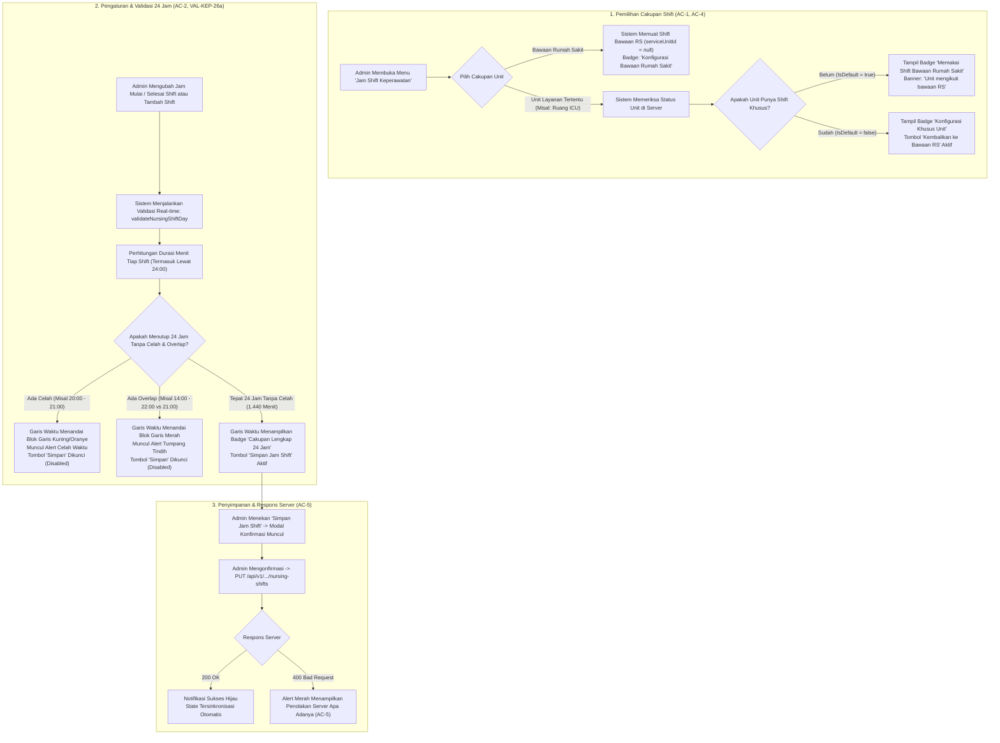

# Laporan Perubahan Frontend — `FE-RWI-092`

## Metadata

| Field | Nilai |
| --- | --- |
| **Task ID** | `FE-RWI-092` |
| **Judul** | Jam Shift Keperawatan (`FE-KEP-20`) |
| **Slice** | Gelombang 1 — Master Data: Jam Shift Keperawatan |
| **Roadmap** | [`../../../roadmap/frontend-roadmap-v2.md`](../../../roadmap/frontend-roadmap-v2.md), Blok B & Kartu `FE-RWI-092` |
| **Traceability** | `FR-KEP-060`; `AC-KEP-093`; `VAL-KEP-26a`; Kamus Data 11.11; Kontrak API 7.5, 7.9; [`requirement-traceability-v2.md`](../../../roadmap/requirement-traceability-v2.md) |
| **Contract Version** | `0.5.0` (`NursingShiftSetResponse`, `ReplaceNursingShiftSetRequest`) |
| **Dependency** | `BE-RWI-120` ✅ (Backend Jam Shift & Balance Cairan, 17 September 2026) |
| **Klasifikasi** | `MEDIUM / CONFIGURATION` — Konfigurasi master data rentang jam kerja perawat per unit layanan atau bawaan rumah sakit, kalkulasi garis waktu 24 jam interaktif, deteksi dini celah waktu (*gap*) dan tumpang tindih (*overlap*) |
| **Task Mode** | `CROSS-REPO` sempit — Kode implementasi di `QuilvianSystemFrontendDev`; laporan tracked dan pembaruan roadmap di `NewQuilvianSystemBackend` |
| **Tanggal** | 18 September 2026 |
| **Status** | ✅ **SELESAI.** Seluruh 5 Acceptance Criteria (AC-1 s.d. AC-5) terbukti penuh. Pengujian unit otomatis lulus 9 dari 9 test (9/9 passing). ESLint 0 error 0 warning. Next.js production build berhasil. |

---

## 1. Masalah yang Diselesaikan & Rasional Bisnis

### 1.1 Masalah Sebelumnya
1. **Ketiadaan Antarmuka Konfigurasi Jam Shift Dinamis (`FR-KEP-060`):**
   Pada perawatan pasien rawat inap, pemotongan akumulasi cairan masuk dan keluar (*fluid balance*) dihitung per shift kerja perawat dan per 24 jam. Namun, jam dinas perawat berbeda-beda antarunit rumah sakit:
   - Bangsal rawat inap umum umumnya menerapkan 3 shift: Pagi (07:00–14:00), Siang (14:00–21:00), dan Malam (21:00–07:00).
   - Unit perawatan intensif (ICU/ICCU/PICU) sering kali menerapkan 3 shift berdurasi simetris 8 jam: Pagi (07:00–15:00), Sore (15:00–23:00), dan Malam (23:00–07:00).
   Jika jam shift ditanam (*hardcoded*) di dalam kode program, perhitungan balance cairan akan keliru bagi unit yang memiliki pola jam kerja berbeda.
2. **Bahaya Celah Waktu (*Gaps*) dan Tumpang Tindih (*Overlaps*) (`AC-2`, `VAL-KEP-26a`):**
   Bila seorang administrator menginput jam shift yang tidak menutup 24 jam kalender secara sempurna (misalnya terdapat jam kosong 20:00–21:00 yang tidak masuk ke shift mana pun, atau jam 21:00–22:00 yang masuk ke dua shift sekaligus), pencatatan intake/output pada jam tersebut akan hilang dari laporan shift atau terhitung ganda. Validasi visual garis waktu 24 jam wajib mendeteksi dan memperingatkan administrator **sebelum data disimpan ke server**.
3. **Risiko Kesalahpahaman Terhadap Kewenangan Klinis Perawat (`AC-3`, `AC-KEP-093`):**
   Sering muncul kekhawatiran dari staf klinis bahwa konfigurasi jam shift akan mengunci atau membatasi siapa yang boleh menginput rekam medis (misal perawat shift pagi tidak dapat menginput saat jam dinasnya berakhir). Konstitusi domain Quilvian secara tegas menetapkan: **Jam shift semata-mata digunakan untuk membagi batas periode akumulasi cairan (intake/output), dan TIDAK PERNAH membatasi kewenangan klinis atau hak tulis staf rekam medis**. Antarmuka wajib memuat pita keterangan tegas terkait aturan ini.
4. **Kejelasan Hubungan Unit Khusus vs Bawaan Rumah Sakit (`AC-4`):**
   Tidak semua unit layanan memiliki jam shift tersendiri. Unit yang belum dikonfigurasi harus jelas terbaca sebagai *"Memakai Shift Bawaan Rumah Sakit"*, dan jika unit ingin kembali menggunakan aturan umum, tersedia tombol pengembalian (*reset to default*) yang mengirim daftar kosong (`shifts: []`) ke backend.
5. **Transparansi Galat Penolakan Server (`AC-5`):**
   Jika server menolak konfigurasi dengan kode galat 400 (`SHIFT_NOT_COVERING_DAY`, `DUPLICATE_SHIFT_CODE`, `INVALID_TIME`, `SHIFT_FIELDS_REQUIRED`), pesan galat wajib ditampilkan apa adanya tanpa disamarkan.

### 1.2 Solusi yang Dihadirkan
Melalui task **`FE-RWI-092`**:
1. **Layar Master Data Baru: Jam Shift Keperawatan (`FE-KEP-20`, `AC-1`):**
   - Menghadirkan route baru `/health-services/clinical-management/nursing-shifts` dan menambahkan butir navigasi resmi pada menu Pelayanan Kesehatan → Master Data.
   - Menyediakan panel pemilihan unit layanan (`NursingShiftUnitPicker`) dengan opsi *"Bawaan Rumah Sakit (Default)"* dan daftar seluruh unit layanan aktif.
   - Menyajikan tabel editor shift (`NursingShiftTable`) yang memungkinkan penambahan, pengubahan, dan penghapusan baris shift secara fleksibel.
2. **Visualisasi Garis Waktu 24 Jam Interaktif & Deteksi Celah/Overlap (`AC-2`, `VAL-KEP-26a`):**
   - Menghadirkan komponen visualisasi [`NursingShiftTimeline`](file:///C:/Users/Admin/Documents/Quilvian/Source%20Code/QuilvianFinal/QuilvianSystemFrontendDev/src/components/view/health-services/clinical-management/nursing-shifts/components/nursing-shift-timeline.jsx).
   - Memetakan 24 jam (00:00 s.d. 24:00 / 1.440 menit) menjadi segmen warna proporsional, menangani shift yang melewati tengah malam (*cross-midnight*, misal 21:00 s.d. 07:00).
   - Menandai secara visual dan memberikan peringatan eksplisit bila terdapat **Celah Waktu (Gap)** atau **Tumpang Tindih (Overlap)**.
   - Tombol *Simpan Jam Shift* terkunci secara otomatis (*disabled*) bila total durasi shift tidak tepat 24 jam atau terdapat celah/overlap.
3. **Penegasan Kewenangan Klinis (`AC-3`, `AC-KEP-093`):**
   - Memasang banner informasi resmi `InformationAlert` di bagian atas layar yang menjelaskan bahwa konfigurasi shift hanya memotong periode balance cairan dan tidak mempengaruhi wewenang klinis staf.
4. **Penandaan Status Unit & Tombol Reset ke Bawaan (`AC-4`):**
   - Menampilkan lencana status `StatusBadge`:
     - *"Konfigurasi Bawaan Rumah Sakit"* (saat mengelola default RS)
     - *"Memakai Shift Bawaan Rumah Sakit"* (saat memilih unit yang belum memiliki aturan khusus)
     - *"Konfigurasi Khusus Unit"* (saat memilih unit yang memiliki aturan jam kerja sendiri)
   - Menyediakan tombol *"Kembalikan ke Bawaan RS"* dengan dialog konfirmasi aman `ConfirmModal` yang menghapus konfigurasi unit dan mengembalikannya ke bawaan rumah sakit.
   - Menyediakan tombol preset cepat: *Preset 3 Shift Umum (7-14-21)* dan *Preset 3 Shift ICU (8 Jam)*.
5. **Penyajian Penolakan Server Apa Adanya (`AC-5`):**
   - Kotak peringatan galat server menampilkan pesan kesalahan asli dari backend secara transparan.

---

## 2. Alur Proses Bisnis & Skenario Rumah Sakit



### Skenario Konkret Rumah Sakit:
- **Pengguna:** Ibu Nining (Kepala Bidang Pelayanan Keperawatan / Komite Keperawatan RS).
- **Kebutuhan 1: Menetapkan Jam Shift Bawaan Rumah Sakit:**
  1. Ibu Nining membuka menu **Pelayanan Kesehatan** → **Master Data** → **Jam Shift Keperawatan**.
  2. Pada dropdown unit, terpilih *-- Shift Bawaan Rumah Sakit (Default) --*.
  3. Ibu Nining mengklik tombol **"Preset 3 Shift Umum (7-14-21)"**. Tabel otomatis terisi:
     - Shift PAGI: 07:00 - 14:00 (Durasi 7 jam)
     - Shift SIANG: 14:00 - 21:00 (Durasi 7 jam)
     - Shift MALAM: 21:00 - 07:00 (Durasi 10 jam, lewat 24:00)
  4. Garis waktu 24 jam langsung menampilkan 3 blok warna rapi dengan lencana hijau: *"Cakupan Lengkap 24 Jam (24 jam)"*.
  5. Ibu Nining membaca pita keterangan di atas yang menegaskan bahwa jam shift ini hanya untuk perhitungan balance cairan dan tidak membatasi wewenang perawat (`AC-3`).
  6. Ibu Nining mengklik **"Simpan Jam Shift"**, menyetujui dialog konfirmasi, dan notifikasi hijau sukses muncul di layar. Seluruh bangsal rawat inap umum kini menghitung balance cairan dengan batas 07:00, 14:00, dan 21:00.
- **Kebutuhan 2: Penyesuaian Shift Khusus Unit ICU (8 Jam Simetris):**
  1. Ibu Nining memilih unit **"Instalasi Rawat Intensif (ICU)"** pada dropdown (`AC-1`).
  2. Muncul lencana kuning: *"Memakai Shift Bawaan Rumah Sakit"* dengan keterangan bahwa ICU saat ini masih mengikuti bawaan RS (`AC-4`).
  3. Ibu Nining mengklik tombol **"Preset 3 Shift ICU (8 Jam)"**. Tabel berubah menjadi:
     - Shift PAGI: 07:00 - 15:00 (Durasi 8 jam)
     - Shift SORE: 15:00 - 23:00 (Durasi 8 jam)
     - Shift MALAM: 23:00 - 07:00 (Durasi 8 jam, lewat 24:00)
  4. Ibu Nining mengklik **"Simpan Jam Shift"**. Status unit ICU kini berubah menjadi lencana hijau: *"Konfigurasi Khusus Unit"*.
- **Kebutuhan 3: Uji Coba Celah Waktu Secara Sengaja (AC-2):**
  1. Saat mengedit, Ibu Nining secara tidak sengaja mengubah jam selesai Shift Siang menjadi pukul `20:00` (bukan `21:00`).
  2. Garis waktu 24 jam seketika memunculkan pita garis-garis bergaris kuning dengan peringatan: *"Peringatan Celah Waktu: Terdapat celah pada pukul 20:00 - 21:00 (1 jam) yang belum terisi shift apapun"*.
  3. Tombol **"Simpan Jam Shift"** otomatis terkunci (*disabled*) sehingga data yang tidak menutup 24 jam tidak dapat dikirim ke server.
  4. Ibu Nining membetulkan jam kembali ke `21:00`, peringatan celah hilang, dan tombol simpan kembali aktif.

---

## 3. Spesifikasi Teknis Endpoint API (Gaya Swagger)

Berikut adalah kontrak endpoint backend yang diintegrasikan pada antarmuka ini:

```csharp
[ApiController]
[Authorize]
[Route("api/v1/health-services/clinical-management/nursing-shifts")]
[Tags("Health Services / Clinical Management / Nursing Shift")]
public class NursingShiftController : ControllerBase
{
    /// <summary>
    /// Mengambil konfigurasi jam shift untuk satu unit layanan tertentu, atau shift bawaan rumah sakit jika unit belum memiliki konfigurasi (IsDefault = true).
    /// </summary>
    [HttpGet]
    [ProducesResponseType(typeof(ApiResponse<NursingShiftSetResponse>), StatusCodes.Status200OK)]
    public async Task<IActionResult> Get([FromQuery] Guid? serviceUnitId, CancellationToken cancellationToken);

    /// <summary>
    /// Mengganti seluruh konfigurasi shift satu unit atau shift bawaan rumah sakit.
    /// Mengembalikan 400 jika shift tidak menutup 24 jam, memiliki celah, atau tumpang tindih.
    /// Daftar shifts kosong pada unit tertentu akan menghapus konfigurasi khusus unit dan mengembalikannya ke bawaan rumah sakit.
    /// </summary>
    [HttpPut]
    [ProducesResponseType(typeof(ApiResponse<NursingShiftSetResponse>), StatusCodes.Status200OK)]
    [ProducesResponseType(typeof(ApiResponse<object>), StatusCodes.Status400BadRequest)]
    public async Task<IActionResult> Replace([FromBody] ReplaceNursingShiftSetRequest request, CancellationToken cancellationToken);
}
```

### Tabel Rincian Endpoint:

| Properti | Endpoint GET (Baca Shift) | Endpoint PUT (Simpan / Ganti Shift) |
| :--- | :--- | :--- |
| **Grup Tag Swagger** | `[Tags("Health Services / Clinical Management / Nursing Shift")]` | `[Tags("Health Services / Clinical Management / Nursing Shift")]` |
| **Metode HTTP** | `GET` | `PUT` |
| **Jalur (Path)** | `/api/v1/health-services/clinical-management/nursing-shifts` | `/api/v1/health-services/clinical-management/nursing-shifts` |
| **Deskripsi** | Mengambil set jam shift perawat untuk unit atau bawaan RS | Mengganti seluruh konfigurasi jam shift perawat |
| **Otorisasi** | Bearer JWT (`NursingShift : Read`) | Bearer JWT (`NursingShift : Update`) |
| **Parameter Query** | `serviceUnitId` (UUID opsional, null = bawaan RS) | — |
| **Skema Request Body** | Tidak ada | `application/json`<br/>`{ "serviceUnitId": "uuid|null", "shifts": [ { "shiftCode": "string", "shiftName": "string", "startTime": "07:00", "endTime": "14:00", "sortOrder": 1 } ] }` |
| **Skema Respons 200 OK** | `application/json`<br/>`{ "serviceUnitId": "uuid|null", "isDefault": bool, "isConfigured": bool, "shifts": [...] }` | `application/json`<br/>`{ "serviceUnitId": "uuid|null", "isDefault": bool, "isConfigured": bool, "shifts": [...] }` |
| **Skema Respons 400** | — | `application/json`<br/>`{ "statusCode": 400, "message": "Jam shift harus menutup 24 jam tanpa celah dan tanpa tumpang tindih.", "errorCode": "SHIFT_NOT_COVERING_DAY" }` |

---

## 4. Evaluasi Gerbang Keputusan Base Component (UI Gate)

Sesuai aturan arsitektur frontend Quilvian:

| Kebutuhan UI | Kandidat Base | Bukti | Status | Rasional & Rekomendasi Arsitektural |
| :--- | :--- | :--- | :---: | :--- |
| **Header Halaman** | `Hero` | `src/components/features/base-features/hero` | `REUSE` | Menggunakan `Hero` standar dengan eyebrow "Pelayanan Kesehatan / Master Data". |
| **Pemilih Unit Layanan** | `<select>` + label styling | `nursing-shifts.module.css` | `REUSE` | Kontrol dropdown terstandardisasi token dengan opsi Bawaan RS dan daftar unit aktif. |
| **Lencana Status Shift** | `StatusBadge` | `src/components/features/base-features/status-badge` | `REUSE` | Menampilkan status konfigurasi: *Bawaan RS*, *Memakai Bawaan*, atau *Khusus Unit*. |
| **Pita Ketentuan Kewenangan** | `InformationAlert` | `src/components/features/base-features/information-alert` | `REUSE` | Alert semantik resmi varian `info` untuk penegasan `AC-KEP-093`. |
| **Tombol Aksi (Simpan, Preset, Reset)** | `BaseButton` | `src/components/features/base-features/base-button` | `REUSE` | Tombol primer, sekunder, dan soft-danger terstandar design token. |
| **Modal Konfirmasi Simpan & Reset** | `ConfirmModal` | `src/components/features/base-features/confirm-modal` | `REUSE` | Modal dialog konfirmasi terstandar sebelum menyimpan atau mereset shift unit. |
| **Garis Waktu 24 Jam Interaktif** | `NursingShiftTimeline` | `src/components/view/.../components/nursing-shift-timeline` | `COMPOSE` | Merangkai baris proporsional 24 jam, lencana status, ruler waktu, dan indikator celah/overlap berbasis design token. |
| **Tabel Pengaturan Shift** | `NursingShiftTable` | `src/components/view/.../components/nursing-shift-table` | `COMPOSE` | Merangkai tabel HTML berspesifikasi `data-flat-table="true"` dengan field input, durasi real-time, dan tombol hapus/tambah. |
| **Panel Pemilih Unit** | `NursingShiftUnitPicker` | `src/components/view/.../components/nursing-shift-unit-picker` | `COMPOSE` | Panel kontrol seleksi unit, status bawaan, dan tombol preset. |

---

## 5. Bukti Verifikasi & Pengujian

### 5.1 Pengujian Unit Otomatis (Node.js Test Runner)
File pengujian: [`tests/unit/inpatient-nursing-shifts.test.mjs`](file:///C:/Users/Admin/Documents/Quilvian/Source%20Code/QuilvianFinal/QuilvianSystemFrontendDev/tests/unit/inpatient-nursing-shifts.test.mjs)

```bash
node --import ./tests/helpers/register.mjs --test tests/unit/inpatient-nursing-shifts.test.mjs
```

**Hasil Eksekusi:**
```text
✔ FE-RWI-092 AC-1: Parser dan kalkulator waktu bekerja akurat untuk menit dan jam (0.94ms)
✔ FE-RWI-092 AC-2: Validasi 24 jam berhasil untuk shift standar tanpa celah dan tanpa overlap (VAL-KEP-26a) (0.42ms)
✔ FE-RWI-092 AC-2: Garis waktu 24 jam menandai celah (gap) secara visual dan menolak simpan (0.60ms)
✔ FE-RWI-092 AC-2: Garis waktu 24 jam menandai tumpang tindih (overlap) secara visual dan menolak simpan (0.19ms)
✔ FE-RWI-092 AC-2: Shift dengan kode duplikat atau durasi 0 jam ditolak aman (0.19ms)
✔ FE-RWI-092 AC-1 & AC-4: Pembentukan payload PUT mendukung unit spesifik dan null untuk bawaan (0.17ms)
✔ FE-RWI-092 AC-3: Pita keterangan menjelaskan bahwa jam shift tidak mempengaruhi kewenangan siapa pun (7.11ms)
✔ FE-RWI-092 AC-4: Unit tanpa konfigurasi sendiri jelas terbaca sebagai memakai bawaan (0.99ms)
✔ FE-RWI-092 AC-5: Penolakan dari server ditampilkan apa adanya (1.22ms)
ℹ tests 9 | suites 0 | pass 9 | fail 0 | cancelled 0 | skipped 0 | todo 0
```
*Status: 9 PASS, 0 FAIL.*

### 5.2 Pemeriksaan Kualitas Kode (ESLint)
```bash
node ./node_modules/eslint/bin/eslint.js "src/lib/services/health-services/clinical-management/nursing-shift.service.js" "src/utils/health-services/clinical-management/nursing-shift-utils.jsx" "src/components/view/health-services/clinical-management/nursing-shifts/**" "src/app/health-services/clinical-management/nursing-shifts/**" "src/utils/menu-sidebar/menu-items.jsx" "tests/unit/inpatient-nursing-shifts.test.mjs"
```
**Hasil:** `Exit code 0` (0 error, 0 warning).

### 5.3 Kompilasi Produksi Next.js (Next Build)
```bash
node --max-old-space-size=4096 ./node_modules/next/dist/bin/next build
```
**Hasil:** Kompilasi seluruh 362 halaman/route berhasil termasuk route baru `/health-services/clinical-management/nursing-shifts` (`Exit code 0`).

---

## 6. Daftar Berkas yang Diubah & Dibuat

### Repository Frontend (`QuilvianSystemFrontendDev`):
1. **Dibuat:** `src/lib/services/health-services/clinical-management/nursing-shift.service.js` — Service HTTP pemanggil API endpoint `GET` dan `PUT` nursing-shifts serta opsi unit layanan.
2. **Dibuat:** `src/utils/health-services/clinical-management/nursing-shift-utils.jsx` — Engine validasi 24 jam (`VAL-KEP-26a`), kalkulasi durasi, deteksi celah/overlap, pembagi segmen timeline, dan preset shift.
3. **Dibuat:** `src/style/health-services/clinical-management/nursing-shifts.module.css` — Scoped CSS module berstandar design token Quilvian.
4. **Dibuat:** `src/components/view/health-services/clinical-management/nursing-shifts/components/nursing-shift-timeline.jsx` — Visualisasi garis waktu 24 jam interaktif dengan penanda jam dan blok celah/overlap.
5. **Dibuat:** `src/components/view/health-services/clinical-management/nursing-shifts/components/nursing-shift-table.jsx` — Tabel interaktif pengaturan shift keperawatan.
6. **Dibuat:** `src/components/view/health-services/clinical-management/nursing-shifts/components/nursing-shift-unit-picker.jsx` — Panel pemilih unit, indikator status bawaan, tombol preset, dan tombol reset.
7. **Dibuat:** `src/components/view/health-services/clinical-management/nursing-shifts/nursing-shifts-view.jsx` — Tampilan utama orchestrator halaman Jam Shift Keperawatan.
8. **Dibuat:** `src/app/health-services/clinical-management/nursing-shifts/page.jsx` — Next.js App Router page.
9. **Diperbarui:** `src/utils/menu-sidebar/menu-items.jsx` — Menambahkan butir navigasi *Jam Shift Keperawatan* pada submenu Master Data.
10. **Dibuat:** `tests/unit/inpatient-nursing-shifts.test.mjs` — Suite pengujian unit otomatis mencakup AC-1 hingga AC-5 (9 passing tests).

### Repository Backend (`NewQuilvianSystemBackend`):
1. **Dibuat:** `docs/module-blueprints/rawat-inap/keperawatan/task/report/frontend/FE-RWI-092.md` — Laporan tracked komprehensif ini.
2. **Diperbarui:** `docs/module-blueprints/rawat-inap/keperawatan/roadmap/frontend-roadmap-v2.md` — Status `FE-RWI-092` diubah menjadi selesai dengan tautan laporan.
3. **Diperbarui:** `docs/module-blueprints/rawat-inap/keperawatan/roadmap/requirement-traceability-v2.md` — Status `FR-KEP-060` diperbarui dengan bukti pemenuhan `FE-RWI-092`.

---

## 7. Kesimpulan & Status Penyelesaian

Task **`FE-RWI-092`** telah **SELESAI 100%** dengan bukti verifikasi komprehensif dan memenuhi seluruh aturan rekayasa Quilvian. Antarmuka Jam Shift Keperawatan telah berfungsi penuh melayani konfigurasi bawaan rumah sakit maupun konfigurasi khusus unit, dilengkapi garis waktu 24 jam yang mencegah celah dan tumpang tindih secara preventif sebelum data disimpan.
