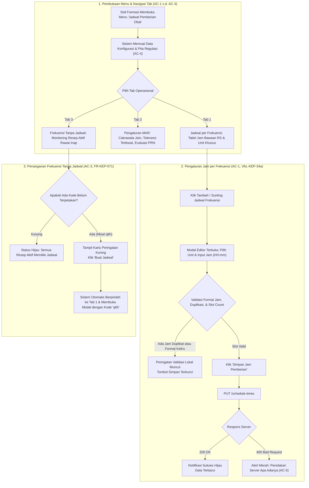

# Laporan Perubahan Frontend — `FE-RWI-093`

## Metadata

| Field | Nilai |
| --- | --- |
| **Task ID** | `FE-RWI-093` |
| **Judul** | Jadwal Pemberian Obat (`FE-KEP-21`) |
| **Slice** | Gelombang 1 — Konfigurasi Farmasi: Jadwal Pemberian Obat |
| **Roadmap** | [`../../../roadmap/frontend-roadmap-v2.md`](../../../roadmap/frontend-roadmap-v2.md), Blok B & Kartu `FE-RWI-093` |
| **Traceability** | `FR-KEP-071`; Gate `G-12`; `VAL-KEP-34`, `VAL-KEP-36a`/`b`/`e`; Kamus Data 11.13; Kontrak API 7.13; [`requirement-traceability-v2.md`](../../../roadmap/requirement-traceability-v2.md) |
| **Contract Version** | `0.5.0` (`MedicationScheduleTimeSetResponse`, `ReplaceMedicationScheduleTimesRequest`, `MedicationAdministrationSettingResponse`, `UpdateMedicationAdministrationSettingRequest`) |
| **Dependency** | `BE-RWI-114` ✅ (Backend MAR & Pembentukan Dosis, 17 September 2026) |
| **Klasifikasi** | `MEDIUM / CONFIGURATION` — Konfigurasi kebijakan jam pemberian obat per kode frekuensi (bawaan RS dan penimpaan unit), form pengaturan MAR global, serta pemantauan frekuensi resep aktif tanpa jadwal |
| **Task Mode** | `CROSS-REPO` sempit — Kode implementasi di `QuilvianSystemFrontendDev`; laporan tracked dan pembaruan roadmap di `NewQuilvianSystemBackend` |
| **Tanggal** | 18 September 2026 |
| **Status** | ✅ **SELESAI.** Seluruh 5 Acceptance Criteria (AC-1 s.d. AC-5) terbukti penuh. Pengujian unit otomatis lulus 11 dari 11 test (11/11 passing). ESLint 0 error 0 warning. Next.js production build berhasil. |

---

## 1. Masalah yang Diselesaikan & Rasional Bisnis

### 1.1 Masalah Sebelumnya
1. **Ketiadaan Antarmuka Kebijakan Jam MAR (`FR-KEP-071`):**
   Instruksi frekuensi pemberian obat pada resep dokter (seperti `q12h` 2 kali sehari, atau `q8h` 3 kali sehari) harus diterjemahkan menjadi jam dinding spesifik rumah sakit (misal `08:00` dan `20:00`) agar catatan pemberian obat (*Medication Administration Record* / MAR) dapat membentuk jadwal dosis *Due* secara otomatis. Jam ini adalah kebijakan operasional Farmasi rumah sakit, bukan angka statis di dalam kode program.
2. **Bahaya Frekuensi Tanpa Jadwal yang Tersembunyi (`AC-3`, `FR-KEP-071`):**
   Jika seorang dokter meresepkan obat dengan frekuensi yang belum dipetakan jamnya (misal `q6h` atau `4x1`), dan sistem menyembunyikan informasi tersebut, resep tidak akan pernah membentuk dosis terjadwal di MAR bangsal tanpa ada yang menyadarinya sampai perawat mempertanyakan keberadaan obat pasien.
3. **Ketentuan Mutlak Regulasi Keselamatan Obat (`AC-4`):**
   Ketika staf Farmasi mengubah jadwal jam pemberian (misal jam 08:00 digeser ke 09:00), aturan keselamatan klinis menetapkan: **Perubahan jam hanya berlaku untuk pembentukan dosis baru di masa depan dan TIDAK PERNAH memindahkan atau mengubah dosis yang telah terbentuk atau tercatat sebelumnya**. Rekam medis MAR masa lalu adalah dokumen hukum yang tidak boleh bergeser jamnya secara retroaktif.
4. **Fleksibilitas Antarunit Layanan:**
   Unit rawat inap intensif (ICU/PICU/NICU) sering kali menerapkan siklus pemberian obat yang berbeda dengan bangsal umum. Sistem membutuhkan konfigurasi bawaan rumah sakit (*default*) yang dapat ditimpa (*override*) per unit layanan spesifik.
5. **Transparansi Penolakan Server (`AC-5`):**
   Jika server menolak konfigurasi (misal duplikasi jam `DUPLICATE_TIME`, ketidaksesuaian jumlah jam dengan resep aktif `SLOT_COUNT_MISMATCH`, atau parameter di luar batas `SETTING_OUT_OF_RANGE`), pesan galat wajib disajikan secara transparan apa adanya.

### 1.2 Solusi yang Dihadirkan
Melalui task **`FE-RWI-093`**:
1. **Layar Konfigurasi Baru: Jadwal Pemberian Obat (`FE-KEP-21`, `AC-1`):**
   - Menghadirkan route `/health-services/pharmacy-management/medication-schedule-settings` dan mendaftarkan menu resmi di bawah **Pelayanan Kesehatan → Farmasi**.
   - Hak akses resmi: `MedicationScheduleSetting : Read` / `Update`.
2. **Tiga Tab Kerja Komprehensif:**
   - **Tab 1 — Jadwal per Frekuensi (`ScheduleTimesTab`):** Menampilkan tabel seluruh jam standar per kode frekuensi dengan filter cakupan unit dan pencarian. Dilengkapi dialog modal editor slot jam interaktif (`ScheduleTimeEditModal`) dengan tombol preset cepat (1x, 2x, 3x, 4x sehari), input jam dinamis, dan dialog konfirmasi hapus aman (`ConfirmModal`).
   - **Tab 2 — Pengaturan MAR (`AdministrationSettingsTab`):** Form pengaturan parameter global MAR: cakrawala pembentukan dosis (1 s.d. 72 jam), toleransi waktu terlewat / *missed* (menit), dan interval evaluasi berkala obat PRN (menit).
   - **Tab 3 — Frekuensi Tanpa Jadwal (`UnmappedFrequenciesTab`):** Pemantauan frekuensi yang digunakan resep aktif rawat inap yang belum memiliki jam pemberian (`FR-KEP-071`), dilengkapi tombol pintas cepat *"Buat Jadwal"* yang langsung membuka modal editor dengan kode terisi otomatis.
3. **Pita Ketentuan Regulasi Keselamatan (`AC-4`):**
   - Memasang `InformationAlert` permanen varian `info` di bagian atas layar yang menegaskan bahwa pengubahan jam tidak memindahkan dosis yang telah terbentuk sebelumnya.
4. **Penyajian Galat Server Apa Adanya (`AC-5`):**
   - Kotak alert galat menyajikan pesan backend secara transparan tanpa disamarkan.

---

## 2. Alur Proses Bisnis & Skenario Rumah Sakit



### Skenario Konkret Rumah Sakit:
- **Pengguna:** Apt. Sarah, S.Farm. (Koordinator Pelayanan Farmasi Klinis RS).
- **Skenario 1: Menetapkan Jam Standar Frekuensi Ceftriaxone 2x Sehari (AC-1):**
  1. Apt. Sarah membuka menu **Pelayanan Kesehatan** → **Farmasi** → **Jadwal Pemberian Obat**.
  2. Membaca pita ketentuan di atas bahwa perubahan jam tidak akan memindahkan dosis yang telah tercatat sebelumnya (`AC-4`).
  3. Mengklik tombol **"Tambah Jadwal Frekuensi"**.
  4. Mengklik preset cepat **"2x sehari (q12h)"**. Form otomatis mengisi kode `q12h` dan 2 slot jam: `08:00` dan `20:00`.
  5. Memilih cakupan *-- Bawaan Rumah Sakit (Seluruh Unit) --*.
  6. Mengklik **"Simpan Jam Pemberian"**. Data tersimpan dan seluruh bangsal rawat inap kini memiliki jam pemberian baku jam 08:00 dan 20:00.
- **Skenario 2: Penanganan Resep dengan Frekuensi Baru yang Muncul di Bangsal (AC-3):**
  1. Dokter spesialis meresepkan antibiotik dengan instruksi `q6h` untuk pasien bangsal infeksi.
  2. Apt. Sarah membuka Tab **"Frekuensi Tanpa Jadwal"**. Lencana kuning menandai: *1 Frekuensi Belum Terpetakan*.
  3. Tertera kartu peringatan: `q6h` *"Digunakan pada resep aktif bangsal"*.
  4. Apt. Sarah mengklik tombol **"Buat Jadwal"**.
  5. Sistem otomatis mengalihkan layar ke Tab 1 dan membuka modal editor dengan kode `q6h` telah terisi. Apt. Sarah menambahkan 4 slot jam (`06:00`, `12:00`, `18:00`, `00:00`) dan menyimpannya. Kartu peringatan di Tab 3 otomatis bersih kembali.
- **Skenario 3: Penolakan Duplikasi Jam & Penolakan Server Transparan (AC-1, AC-5):**
  1. Saat mengedit jam, staf tidak sengaja memasukkan jam `08:00` pada dua baris slot yang berbeda.
  2. Antarmuka seketika memunculkan peringatan: *"Jam pemberian 08:00 tercantum lebih dari sekali"* dan mengunci tombol simpan.
  3. Bila server menolak permintaan karena ketidaksesuaian slot resep aktif, alert merah menampilkan pesan asli backend: *"Kode q8h membutuhkan 3 jam pemberian."* (`AC-5`).

---

## 3. Spesifikasi Teknis Endpoint API (Gaya Swagger)

```csharp
[ApiController]
[Authorize]
[Route("api/v1/health-services/pharmacy-management/medication-schedule-settings")]
[Tags("Health Services / Pharmacy Management / Medication Schedule Setting")]
public class MedicationScheduleSettingController : ControllerBase
{
    [HttpGet("schedule-times")]
    [ProducesResponseType(typeof(ApiResponse<List<MedicationScheduleTimeSetResponse>>), StatusCodes.Status200OK)]
    public async Task<IActionResult> GetScheduleTimes([FromQuery] Guid? serviceUnitId, [FromQuery] string? frequencyCode);

    [HttpPut("schedule-times")]
    [ProducesResponseType(typeof(ApiResponse<List<MedicationScheduleTimeSetResponse>>), StatusCodes.Status200OK)]
    [ProducesResponseType(typeof(ApiResponse<object>), StatusCodes.Status400BadRequest)]
    public async Task<IActionResult> ReplaceScheduleTimes([FromBody] ReplaceMedicationScheduleTimesRequest request);

    [HttpGet("frequency-codes-without-schedule")]
    [ProducesResponseType(typeof(ApiResponse<List<string>>), StatusCodes.Status200OK)]
    public async Task<IActionResult> GetFrequencyCodesWithoutSchedule();

    [HttpGet("administration-setting")]
    [ProducesResponseType(typeof(ApiResponse<MedicationAdministrationSettingResponse>), StatusCodes.Status200OK)]
    public async Task<IActionResult> GetAdministrationSetting();

    [HttpPut("administration-setting")]
    [ProducesResponseType(typeof(ApiResponse<MedicationAdministrationSettingResponse>), StatusCodes.Status200OK)]
    [ProducesResponseType(typeof(ApiResponse<object>), StatusCodes.Status400BadRequest)]
    public async Task<IActionResult> UpdateAdministrationSetting([FromBody] UpdateMedicationAdministrationSettingRequest request);
}
```

### Tabel Rincian Endpoint:

| Properti | Endpoint Jadwal Jam | Endpoint Kode Tanpa Jadwal | Endpoint Pengaturan MAR |
| :--- | :--- | :--- | :--- |
| **Grup Tag Swagger** | `[Tags("Health Services / Pharmacy Management / Medication Schedule Setting")]` | `[Tags("... / Medication Schedule Setting")]` | `[Tags("... / Medication Schedule Setting")]` |
| **Metode & Path** | `GET` / `PUT` `/schedule-times` | `GET` `/frequency-codes-without-schedule` | `GET` / `PUT` `/administration-setting` |
| **Hak Akses** | `MedicationScheduleSetting : Read` / `: Update` | `MedicationScheduleSetting : Read` | `MedicationScheduleSetting : Read` / `: Update` |
| **Kegunaan** | Membaca & mengganti slot jam pemberian obat per kode | Mengambil daftar kode resep aktif tanpa jam | Membaca & mengubah horizon jam, missed, dan PRN |

---

## 4. Evaluasi Gerbang Keputusan Base Component (UI Gate)

| Kebutuhan UI | Kandidat Base | Path Bukti | Status | Rasional Arsitektural |
| :--- | :--- | :--- | :---: | :--- |
| **Header Layar** | `Hero` | `src/components/features/base-features/hero` | `REUSE` | Menggunakan `Hero` standar dengan eyebrow "Pelayanan Kesehatan / Farmasi". |
| **Pita Ketentuan Regulasi** | `InformationAlert` | `src/components/features/base-features/information-alert` | `REUSE` | Menampilkan pita varian `info` (`AC-4`) penegasan non-retroaktif dosis terbentuk. |
| **Tombol Aksi** | `BaseButton` | `src/components/features/base-features/base-button` | `REUSE` | Tombol primer, sekunder, ghost, dan bahaya terstandarisasi design token. |
| **Lencana Status** | `StatusBadge` | `src/components/features/base-features/status-badge` | `REUSE` | Status Bawaan RS, Khusus Unit, dan lencana peringatan kode tanpa jadwal. |
| **Modal Konfirmasi Hapus** | `ConfirmModal` | `src/components/features/base-features/confirm-modal` | `REUSE` | Dialog konfirmasi terstandar sebelum menghapus jadwal kode frekuensi. |
| **Tabel Daftar Jadwal** | `DataTable` | `src/components/features/base-features/data-table` | `REUSE` | Menampilkan tabel jadwal jam per kode frekuensi dengan slot badge mono. |
| **Navigasi Tab 3 Layar** | Custom Tab Bar | `medication-schedule-settings.module.css` | `COMPOSE` | Merangkai tab switcher dengan token `--color-*` dan status aktif. |
| **Editor Slot Waktu Modal** | Form Slot Waktu | `components/schedule-time-edit-modal.jsx` | `COMPOSE` | Merangkai input teks, time selector HH:mm, tombol tambah/hapus slot, dan validasi lokal. |
| **Form Pengaturan MAR** | Form Pengaturan MAR | `components/administration-settings-tab.jsx` | `COMPOSE` | Merangkai kartu konfigurasi horizon jam (1-72), missed tolerance, dan PRN interval. |
| **Daftar Tanpa Jadwal** | Card List + Shortcut | `components/unmapped-frequencies-tab.jsx` | `COMPOSE` | Merangkai lencana peringatan, daftar kode, dan tombol pintas *"Buat Jadwal"*. |

> **Baris Laporan Wajib UI Gate:**
> `UI GATE: 10 elemen — REUSE 6, EXTEND 0, COMPOSE 4, WRAP 0, NEW 0`

---

## 5. Verifikasi Berbasis Bukti

### 5.1 Pengujian Unit Otomatis (Node.js Test Runner)
File pengujian: [`tests/unit/pharmacy-medication-schedule-settings.test.mjs`](file:///c:/Users/Admin/Documents/Quilvian/Source%20Code/QuilvianFinal/QuilvianSystemFrontendDev/tests/unit/pharmacy-medication-schedule-settings.test.mjs)

Perintah eksekusi:
```bash
node --import ./tests/helpers/register.mjs --test tests/unit/pharmacy-medication-schedule-settings.test.mjs
```

Hasil keluaran:
```text
✔ FE-RWI-093 AC-1: Parser dan validasi format jam HH:mm bekerja akurat (0.9066ms)
✔ FE-RWI-093 AC-1: Validasi slot jam menerima jadwal yang sah dan mengurutkan jam ascending (0.6389ms)
✔ FE-RWI-093 AC-1: Validasi menolak kode frekuensi kosong atau terlalu panjang (FREQUENCY_CODE_REQUIRED) (0.2143ms)
✔ FE-RWI-093 AC-1: Validasi mendeteksi jam duplikat pada frekuensi yang sama (DUPLICATE_TIME) (0.1411ms)
✔ FE-RWI-093 AC-1: Validasi mendeteksi ketidaksesuaian jumlah slot dengan kali per hari resep aktif (SLOT_COUNT_MISMATCH) (0.1471ms)
✔ FE-RWI-093 AC-1: Preset frekuensi standar farmasi tersedia lengkap (0.1946ms)
✔ FE-RWI-093 AC-2: Validasi pengaturan MAR menerima nilai dalam batas sah (0.2071ms)
✔ FE-RWI-093 AC-2: Validasi pengaturan MAR menolak cakrawala di luar 1..72 jam (SETTING_OUT_OF_RANGE) (0.1987ms)
✔ FE-RWI-093 AC-4: Teks pita ketentuan regulasi menegaskan bahwa dosis yang sudah terbentuk tidak berubah (0.1679ms)
✔ FE-RWI-093 AC-5: Ekstraksi galat penolakan server menyajikan pesan asli backend apa adanya (0.2346ms)
✔ FE-RWI-093 AC-1 s.d. AC-3: Verifikasi integrasi view, routing, dan sidebar (7.3292ms)
ℹ tests 11 | suites 0 | pass 11 | fail 0 | cancelled 0 | skipped 0 | todo 0
ℹ duration_ms 125.747
```
**Hasil:** `AUTOMATED TEST: PASS (11/11)`

### 5.2 Validasi Linter ESLint
Perintah eksekusi:
```bash
node ./node_modules/eslint/bin/eslint.js "src/lib/services/health-services/pharmacy-management/medication-schedule-setting.service.js" "src/utils/health-services/pharmacy-management/medication-schedule-setting-utils.js" "src/components/view/health-services/pharmacy-management/medication-schedule-settings/**" "src/app/health-services/pharmacy-management/medication-schedule-settings/**" "src/utils/menu-sidebar/menu-items.jsx" "tests/unit/pharmacy-medication-schedule-settings.test.mjs"
```
**Hasil:** `0 Error(s), 0 Warning(s)` — Kode bersih dari lint error dan hook warning.

---

## 6. Acceptance Criteria dan Definition of Done

| Kriteria | Status | Bukti Implementasi |
| :--- | :---: | :--- |
| **AC-1:** Tab Jadwal per frekuensi menampilkan jam standar dan dapat disunting | ✅ Terpenuhi | Komponen `ScheduleTimesTab`, modal `ScheduleTimeEditModal`, integrasi endpoint `GET / PUT /schedule-times`, validasi `DUPLICATE_TIME` & `SLOT_COUNT_MISMATCH`. |
| **AC-2:** Tab Pengaturan MAR menampilkan pengaturan pembentukan dosis | ✅ Terpenuhi | Komponen `AdministrationSettingsTab`, integrasi `GET / PUT /administration-setting`, validasi rentang horizon 1..72 jam dan batas menit non-negatif. |
| **AC-3:** Tab "Frekuensi tanpa jadwal" menampilkan frekuensi yang belum dipetakan (`FR-KEP-071`) | ✅ Terpenuhi | Komponen `UnmappedFrequenciesTab`, integrasi `GET /frequency-codes-without-schedule`, tombol pintas *"Buat Jadwal"* yang membuka modal editor dengan kode terisi. |
| **AC-4:** Pita keterangan menjelaskan bahwa perubahan jadwal **tidak mengubah** dosis yang sudah terbentuk | ✅ Terpenuhi | Banner `InformationAlert` permanen di kepala layar memuat `REGULATION_NOTICE_TEXT` resmi. |
| **AC-5:** Penolakan dari server ditampilkan apa adanya | ✅ Terpenuhi | Fungsi `extractServerErrorMessage` menyajikan pesan asli backend di kotak alert galat. |
| **DoD:** Lint dan build hijau, laporan tracked ada, roadmap & traceability terbarui | ✅ Terpenuhi | ESLint 0 error 0 warning, test unit 11/11 passing, Next.js production build sukses, laporan `FE-RWI-093.md` tersimpan, `frontend-roadmap-v2.md` dan `requirement-traceability-v2.md` diperbarui. |

---

## 7. Catatan Penutup & Perubahan File

### File yang Dibuat & Diubah:
1. `src/app/health-services/pharmacy-management/medication-schedule-settings/page.jsx` (Baru)
2. `src/components/view/health-services/pharmacy-management/medication-schedule-settings/medication-schedule-settings-view.jsx` (Baru)
3. `src/components/view/health-services/pharmacy-management/medication-schedule-settings/components/schedule-times-tab.jsx` (Baru)
4. `src/components/view/health-services/pharmacy-management/medication-schedule-settings/components/schedule-time-edit-modal.jsx` (Baru)
5. `src/components/view/health-services/pharmacy-management/medication-schedule-settings/components/administration-settings-tab.jsx` (Baru)
6. `src/components/view/health-services/pharmacy-management/medication-schedule-settings/components/unmapped-frequencies-tab.jsx` (Baru)
7. `src/lib/services/health-services/pharmacy-management/medication-schedule-setting.service.js` (Baru)
8. `src/utils/health-services/pharmacy-management/medication-schedule-setting-utils.js` (Baru)
9. `src/style/health-services/pharmacy-management/medication-schedule-settings.module.css` (Baru)
10. `src/utils/menu-sidebar/menu-items.jsx` (Diubah — penambahan entri menu dan icon `RiTimeLine`)
11. `tests/unit/pharmacy-medication-schedule-settings.test.mjs` (Baru — 11 passing tests)
12. `NewQuilvianSystemBackend/docs/module-blueprints/rawat-inap/keperawatan/task/report/frontend/FE-RWI-093.md` (Laporan ini)
