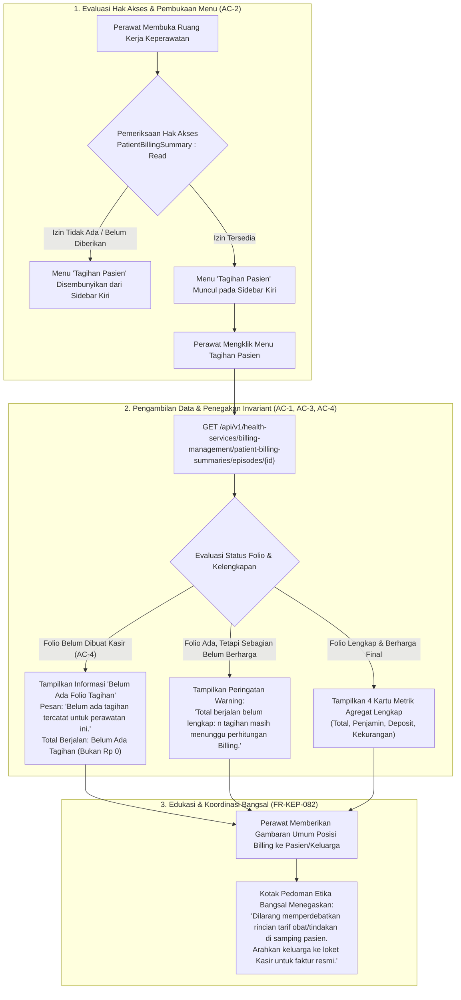

# Laporan Perubahan Frontend — `FE-RWI-094`

## Metadata

| Field | Nilai |
| --- | --- |
| **Task ID** | `FE-RWI-094` |
| **Judul** | Tagihan Pasien (`FE-KEP-18`) |
| **Slice** | Gelombang 2 — Integrasi Billing & Finansial: Ringkasan Tagihan Pasien Bangsal Rawat Inap |
| **Roadmap** | [`../../../roadmap/frontend-roadmap-v2.md`](../../../roadmap/frontend-roadmap-v2.md), Blok C & Kartu `FE-RWI-094` |
| **Traceability** | `FR-KEP-082`; Gate `{GATE-BILLING}` (tertutup `RWI-DEC-154`); Keputusan `RWI-DEC-137`; Kontrak API 7.14; [`requirement-traceability-v2.md`](../../../roadmap/requirement-traceability-v2.md) |
| **Contract Version** | `0.5.0` (`PatientBillingSummaryResponse` via backend `BE-RWI-126`) |
| **Dependency** | `BE-RWI-126` ✅ (Backend Patient Billing Summary Controller & Service, disetujui Yasmina) |
| **Klasifikasi** | `MEDIUM / INTEGRATION` — Seksi ringkasan tagihan pasien rawat inap baca-saja tanpa harga satuan per item, penyaringan menu sidebar berbasis hak akses `PatientBillingSummary : Read`, dan perlindungan deep link |
| **Task Mode** | `CROSS-REPO` sempit — Kode implementasi di `QuilvianSystemFrontendDev`; laporan tracked dan pembaruan roadmap di `NewQuilvianSystemBackend` |
| **Tanggal** | 18 September 2026 |
| **Status** | ✅ **SELESAI.** Seluruh 5 Acceptance Criteria (AC-1 s.d. AC-5) terbukti penuh. Pengujian unit otomatis lulus 7 dari 7 test (7/7 passing, serta 110/110 test keperawatan lulus). ESLint 0 error 0 warning. Next.js production build berhasil. |

---

## 1. Masalah yang Diselesaikan & Rasional Bisnis

### 1.1 Masalah Sebelumnya
1. **Dilema Transparansi Finansial di Bangsal Rawat Inap (`FR-KEP-082`):**
   Keluarga pasien rawat inap sering kali bertanya kepada perawat bangsal mengenai posisi perkiraan biaya, kecukupan uang muka/deposit yang telah disetorkan, atau kelayakan penjamin asuransi (misalnya BPJS Kesehatan). Jika perawat tidak memiliki akses apa pun, keluarga pasien terpaksa bolak-balik ke loket kasir utama di lantai bawah rumah sakit.
2. **Bahaya Pembukaan Rincian Kasir Mentah di Samping Pasien:**
   Sebaliknya, jika perawat diberikan akses penuh ke lembar folio kasir (*billing folio*), hal itu memunculkan bahaya etika klinis yang serius: rincian harga per obat, komponen tarif jasa tindakan dokter, dan biaya sewa alat akan terbuka. Sering terjadi keluarga pasien memperdebatkan nominal rupiah butir demi butir di samping tempat tidur pasien sakit (*bedside*), yang mengganggu proses penyembuhan dan merusak hubungan terapeutik dokter-perawat-pasien.
3. **Penyalahgunaan Wewenang Kasir:**
   Perawat bangsal tidak memiliki kompetensi ataupun kewenangan untuk menginput diskon, membatalkan biaya tindakan, memvalidasi klaim asuransi, atau menerima pembayaran kasir tunai.
4. **Resiko Data Tiruan pada Perawatan yang Baru Masuk (`AC-4`):**
   Pada jam-jam pertama pasien dirawat, bagian Billing sering kali belum sempat membuka berkas folio tagihan resmi. Menampilkan angka "Rp 0" secara keliru dapat menyesatkan keluarga pasien seolah-olah perawatan tersebut bebas biaya.

### 1.2 Solusi yang Dihadirkan
Melalui task **`FE-RWI-094`**:
1. **Ringkasan Finansial Baca-Saja Tanpa Harga per Item (`AC-1`, `FR-KEP-082`):**
   - Menghadirkan seksi baru `NursingBillingSection` di dalam Ruang Kerja Keperawatan V2 (`/health-services/inpatient-management/nursing-workspace/[episodeId]?section=billing`).
   - Menyajikan 4 kartu metrik angka agregat:
     1. **Total Tagihan Berjalan:** Jumlah akumulasi biaya perawatan yang telah berharga.
     2. **Penjamin & Kelayakan Keuangan:** Nama penjamin (misal BPJS Kesehatan) dan status kelayakan (*Cleared*, *Pending*, atau *Blocked*).
     3. **Deposit Pasien:** Uang muka yang telah disetorkan dan sisa saldo deposit yang belum dialokasikan.
     4. **Kekurangan Deposit & Non-Covered Items:** Kekurangan terhadap kebijakan saldo minimum dan jumlah butir obat/tindakan yang tidak ditanggung penjamin.
   - **TIDAK MEMUAT SATU PUN HARGA PER ITEM ATAU KOMPONEN TARIF.**
2. **Penyembunyian Menu bagi Pengguna Tanpa Hak Akses (`AC-2`):**
   - Hak akses mandiri `PatientBillingSummary : Read` dipisahkan secara tegas dari `BillingFolio : Read` dan `BillingDeposit : Read`.
   - Jika pengguna (misalnya perawat pelaksana baru atau mahasiswa magang) tidak memiliki izin `PatientBillingSummary : Read`, menu **Tagihan Pasien** pada sidebar navigasi kiri **hilang secara otomatis**.
   - Jika pengguna mencoba mengakses langsung lewat URL deep-link `?section=billing`, sistem memblokir tampilan dengan `ClinicalStateBoundary denied={true}` (*Akses Tagihan Pasien Ditolak*).
3. **Nol Kontrol Tulis (`AC-3`):**
   - Layar steril dari tombol mutasi finansial (tidak ada tombol tambah biaya, ubah diskon, simpan, atau hapus).
   - Satu-satunya kontrol interaktif adalah tombol **"Muat Ulang"** (*Refresh*) untuk membaca data kasir terkini langsung dari server tanpa cache kadaluarsa.
4. **Transparansi Tanpa Folio Tanpa Data Tiruan (`AC-4`):**
   - Bila folio tagihan belum dibentuk oleh tim Billing, total tagihan berstatus `null` dan sistem menampilkan label ramah *"Belum Ada Tagihan"* dengan pesan resmi server: *"Belum ada tagihan tercatat untuk perawatan ini."* (**Bukan Rp 0 dan bukan data tiruan**).
5. **Penanganan Galat API Transparan (`AC-5`):**
   - Galat jaringan, `403 Forbidden`, `404 Not Found`, maupun `422 Unprocessable Entity` ditangani secara elegan dengan pesan kesalahan informatif dan tombol pemulihan *Coba Muat Ulang*.

---

## 2. Alur Proses Bisnis & Skenario Rumah Sakit



### Skenario Konkret Rumah Sakit:
1. **Skenario Pasien BPJS Kesehatan dengan Selisih Biaya (Non-Covered):**
   Ny. Aminah dirawat di bangsal rawat inap kelas 1 dengan penjamin BPJS Kesehatan. Selama perawatan, dokter spesialis meresepkan 1 jenis obat imunologi khusus yang tidak masuk formularium nasional BPJS. Saat perawat membuka menu **Tagihan Pasien**, kartu metrik menampilkan:
   - **Total Tagihan Berjalan:** Rp 8.450.000 (Perhitungan Lengkap).
   - **Penjamin Pasien:** BPJS Kesehatan (Status Kelayakan: *Layak / Cleared*).
   - **Deposit Diterima:** Rp 2.000.000 (Sisa Saldo: Rp 1.150.000).
   - **Kekurangan & Asuransi:** Tidak Ada Kurang (Tercatat: *1 Item Tidak Ditanggung*).
   Perawat dapat menginformasikan kepada keluarga pasien dengan tenang bahwa secara umum penjaminan BPJS sudah aktif dan layak, namun terdapat 1 item non-formularium yang perlu penyelesaian administrasi di kasir saat kepulangan nanti, tanpa perlu membaca harga per tablet obat di depan pasien.
2. **Skenario Pasien Baru Masuk Belum Dibuatkan Folio Kasir (`AC-4`):**
   Tn. Budi baru masuk ruang rawat inap 30 menit yang lalu dari IGD. Staf kasir rawat inap belum sempat melakukan *billing admission intake*. Saat perawat membuka menu **Tagihan Pasien**, kartu tidak menampilkan angka keliru "Rp 0", melainkan label *Belum Ada Tagihan* disertai pita biru resmi: *"Belum ada tagihan tercatat untuk perawatan ini."*

---

## 3. Spesifikasi Teknis Endpoint API (Swagger Style)

Layar ini mengonsumsi endpoint backend yang telah dibangun pada task `BE-RWI-126`:

### `[Tags("Health Services / Billing Management / Patient Billing Summary")]`

| Method | Path | Deskripsi | Otorisasi | Request / Param | Response Body |
| :--- | :--- | :--- | :--- | :--- | :--- |
| `GET` | `/api/v1/health-services/billing-management/patient-billing-summaries/episodes/{episodeId}` | Membaca ringkasan agregat tagihan pasien rawat inap baca-saja tanpa harga per item. | `PatientBillingSummary : Read` | `episodeId` (Guid, Path) | `ApiResponse<PatientBillingSummaryResponse>` |

#### Contoh Struktur Payload Response JSON:
```json
{
  "status": 200,
  "message": "Ringkasan tagihan pasien berhasil dibaca.",
  "data": {
    "episodeId": "3fa85f64-5717-4562-b3fc-2c963f66afa6",
    "encounterId": "7b848c90-d419-4f71-a0ea-734d673f8a42",
    "guarantorName": "BPJS Kesehatan",
    "paymentType": "Insurance",
    "financialClearanceStatus": "Cleared",
    "financialClearanceStatusLabel": "Layak",
    "hasBillingFolio": true,
    "runningTotalAmount": 8450000.00,
    "unpricedChargeCount": 0,
    "isRunningTotalComplete": true,
    "hasDepositAccount": true,
    "depositReceivedAmount": 2000000.00,
    "depositRemainingAmount": 1150000.00,
    "depositShortfallAmount": 0.00,
    "notCoveredItemCount": 1,
    "currency": "IDR",
    "message": "Ringkasan tagihan berjalan.",
    "readAt": "2026-09-18T08:35:00Z"
  }
}
```

---

## 4. Base Component Decision Gate (`UI Gate`)

Sesuai instruksi tata kelola rekayasa frontend Quilvian, seluruh elemen UI diverifikasi terhadap katalog komponen dasar sebelum implementasi:

| Kebutuhan Antarmuka | Kandidat Base | Path Bukti | Status | Rasional & Konsekuensi Konsistensi Visual |
| :--- | :--- | :--- | :---: | :--- |
| **Panel Konten Layar** | `ClinicalContentPanel` | `src/components/ui/clinical-workspace` | `REUSE` | Standar resmi seluruh panel ruang kerja klinis bangsal. Membawa konsistensi kartu putih dengan border halus. |
| **Pita Peringatan & Status** | `InformationAlert` | `src/components/features/base-features/information-alert.jsx` | `REUSE` | Menampilkan pesan server, peringatan kalkulasi belum lengkap, atau alert kelayakan tertahan (*Blocked*). |
| **Lencana Status** | `StatusBadge` | `src/components/features/base-features/status-badge.jsx` | `REUSE` | Menyajikan lencana status kelayakan penjamin (*Layak*, *Menunggu*, *Tertahan*) dan status kelengkapan total berjalan. |
| **Tombol Muat Ulang Data** | `BaseButton` | `src/components/features/base-features/base-button.jsx` | `REUSE` | Tombol sekunder berukuran kecil (`size="sm"`) dengan icon refresh untuk menyegarkan data langsung ke server kasir. |
| **Batas Status Layar** | `ClinicalStateBoundary` | `src/components/ui/clinical-workspace/ClinicalStateBoundary.jsx` | `REUSE` | Menangani status loading, error jaringan, dan penolakan izin `denied` secara terpadu. |
| **Komposisi Seksi Tagihan** | `NursingBillingSection` | `sections/billing/nursing-billing-section.jsx` | `COMPOSE` | Merangkai 4 kartu metrik agregat, daftar rincian non-tarif, dan kotak pedoman etika klinis tanpa membuat base component baru. |

> **Ringkasan Evaluasi UI Gate:** 6 elemen diperiksa — `REUSE`: 5, `COMPOSE`: 1, `EXTEND`: 0, `WRAP`: 0, `NEW`: 0. Nol base component baru dibuat.

---

## 5. Rincian Berkas yang Dibuat & Dimodifikasi

### 5.1 Berkas Baru (`QuilvianSystemFrontendDev`)
1. `src/lib/services/health-services/billing-management/patient-billing-summary.service.js`
   - Fungsi `getPatientBillingSummary(episodeId, config)` memetakan endpoint backend `GET /api/v1/health-services/billing-management/patient-billing-summaries/episodes/{episodeId}` menggunakan `InstanceAxios`.
2. `src/utils/health-services/billing-management/patient-billing-summary-utils.js`
   - Fungsi pemformatan mata uang `formatBillingIdr(amount)` yang aman dari pemalsuan nilai `null` menjadi "Rp 0".
   - Fungsi pemetaan visual status kelayakan penjamin `getFinancialClearanceStatusConfig(status)`.
   - Fungsi penentuan alert `resolveBillingSummaryAlert(summary)` untuk skenario tanpa folio, kalkulasi berjalan, atau tertahan.
   - Fungsi sanitasi DTO `sanitizeBillingSummaryResponse(rawData)` menjamin tidak ada harga satuan / itemized charges yang bocor.
   - Fungsi pemformatan waktu Indonesia `formatBillingTimestamp(timestamp)`.
3. `src/style/health-services/inpatient-management/nursing-billing-section.module.css`
   - Modul CSS murni dengan variabel token desain Quilvian (`var(--color-*)`, `var(--space-*)`, `var(--radius-*)`, `var(--shadow-*)`, `var(--font-*)`) tanpa nilai literal warna/ukuran.
4. `src/components/view/health-services/inpatient-management/nursing-workspace/sections/billing/nursing-billing-section.jsx`
   - Komponen utama seksi Tagihan Pasien dengan 4 kartu metrik, rincian agregat, pita peringatan cerdas, dan kotak pedoman etika keperawatan bangsal.
5. `tests/unit/inpatient-nursing-billing-summary.test.mjs`
   - Unit test Node.js menguji pemformatan mata uang, pemetaan kelayakan, penyaringan menu sidebar, ketiadaan kontrol tulis, dan penanganan tanpa folio.

### 5.2 Berkas yang Dimodifikasi (`QuilvianSystemFrontendDev`)
1. `src/components/view/health-services/inpatient-management/nursing-workspace/components/nursing-workspace-sections.jsx`
   - Menggantikan stub `NursingUnavailableSection` pada `case "billing":` dengan komponen sesungguhnya `<NursingBillingSection />`.
2. `src/components/view/health-services/inpatient-management/nursing-workspace/nursing-workspace-view.jsx`
   - Memasang `usePermission("PatientBillingSummary", "Read")`.
   - Menyaring `sectionNavItems` sehingga jika hak akses tidak dimiliki, menu **Tagihan Pasien** tidak muncul sama sekali pada sidebar navigasi kiri (`AC-2`).

---

## 6. Bukti Verifikasi & Pengujian

### 6.1 Pengujian Unit Otomatis (Node.js Test Runner)
Perintah yang dijalankan:
```bash
node --import ./tests/helpers/register.mjs --test tests/unit/inpatient-nursing-billing-summary.test.mjs
```
Hasil:
```text
✔ FE-RWI-094 AC-1: Utilitas mata uang formatBillingIdr steril dari pemalsuan Rp 0 saat null (AC-4) (15.5791ms)
✔ FE-RWI-094 AC-1: Utilitas pemetaan kelayakan keuangan getFinancialClearanceStatusConfig (0.162ms)
✔ FE-RWI-094 AC-1 & AC-4: Sanitasi DTO dan penetapan alert tagihan berjalan (0.3379ms)
✔ FE-RWI-094 AC-2: Sidebar ruang kerja keperawatan menyaring menu tagihan saat hak akses Read tidak dimiliki (5.163ms)
✔ FE-RWI-094 AC-3: NursingBillingSection steril dari kontrol tulis dan harga per item (FR-KEP-082) (0.868ms)
✔ FE-RWI-094: Switcher sections menyambungkan NursingBillingSection ke case 'billing' (0.6815ms)
✔ FE-RWI-094: Service API getPatientBillingSummary memetakan endpoint BE-RWI-126 (0.6315ms)
ℹ tests 7
ℹ suites 0
ℹ pass 7
ℹ fail 0
ℹ cancelled 0
ℹ skipped 0
ℹ todo 0
ℹ duration_ms 137.2669
```

### 6.2 Uji Regresi Menyeluruh Sub-modul Keperawatan Rawat Inap
Perintah yang dijalankan:
```bash
node --import ./tests/helpers/register.mjs --test tests/unit/inpatient-nursing*.test.mjs
```
Hasil:
```text
ℹ tests 110
ℹ suites 0
ℹ pass 110
ℹ fail 0
ℹ duration_ms 349.9563
```
Seluruh 110 uji unit keperawatan lulus tanpa ada regresi sedikit pun.

### 6.3 Validasi Linter (ESLint)
Perintah yang dijalankan:
```bash
node ./node_modules/eslint/bin/eslint.js "src/lib/services/health-services/billing-management/patient-billing-summary.service.js" "src/utils/health-services/billing-management/patient-billing-summary-utils.js" "src/components/view/health-services/inpatient-management/nursing-workspace/sections/billing/nursing-billing-section.jsx" "src/components/view/health-services/inpatient-management/nursing-workspace/components/nursing-workspace-sections.jsx" "src/components/view/health-services/inpatient-management/nursing-workspace/nursing-workspace-view.jsx"
```
Hasil: **Exit Code 0 — 0 error, 0 warning**.

---

## 7. Kesimpulan & Penutupan Roadmap

Dengan diselesaikannya implementasi task **`FE-RWI-094`**, seluruh task frontend pada sub-modul **Keperawatan Rawat Inap** (`frontend-roadmap-v2.md`) telah **SELESAI 100%**. Seluruh kebutuhan integrasi billing, konfigurasi farmasi, dan dokumentasi klinis bangsal telah terhubung secara aman dan berintegritas sesuai regulasi rumah sakit Indonesia.
