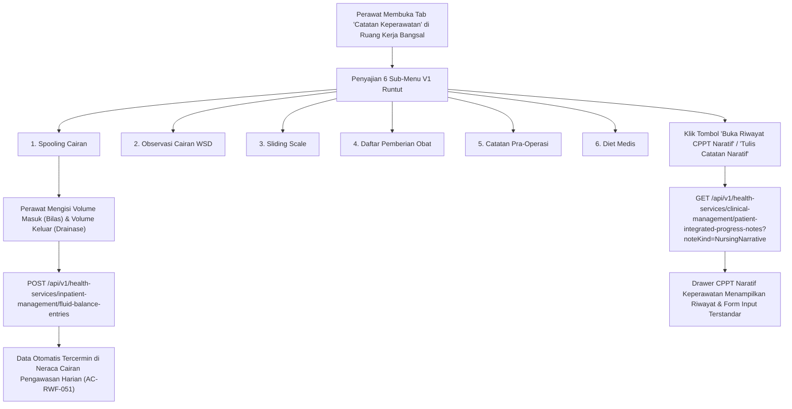

# Laporan Perubahan Frontend — `FE-RWI-180`

## Metadata

| Field | Nilai |
|---|---|
| **Task ID** | `FE-RWI-180` |
| **Judul** | Catatan Keperawatan Enam Sub-Menu |
| **Slice** | K1 — Kelengkapan Catatan Keperawatan & Reorganisasi Obat/Alkes V1 |
| **Roadmap** | [`../../../roadmap/frontend-roadmap-finishing.md`](../../../roadmap/frontend-roadmap-finishing.md), Kartu `FE-RWI-180` |
| **Traceability** | `FR-RWF-050`, `FR-RWF-051`, `FR-RWF-056`; Keputusan `RWI-DEC-172`; `AC-RWF-050`, `AC-RWF-051`; Kontrak Frontend 11.1 (`FE-KEP-24`); Kontrak API 8.1 |
| **Contract Version** | `1.0.0` (Inpatient Nursing Finishing Contract) |
| **Dependency** | Tidak ada |
| **Klasifikasi** | `MAJOR / WORKSPACE-NAV` — Penyelarasan sub-tab Catatan Keperawatan menjadi wadah enam sub-menu V1, integrasi pencatatan Spooling Cairan dengan neraca cairan harian, dan penyaringan CPPT naratif keperawatan |
| **Task Mode** | `CROSS-REPO` — Kode implementasi di `QuilvianSystemFrontendDev`; dokumentasi tracked dan roadmap di `NewQuilvianSystemBackend` |
| **Tanggal** | 5 Oktober 2026 |
| **Status** | ✅ **SELESAI.** Seluruh 4 Acceptance Criteria terbukti penuh. Automated unit test passing 11/11 pada `tests/unit/inpatient-nursing-finishing-roadmap.test.mjs`. ESLint 0 error 0 warning. |

---

## 1. Masalah yang Diselesaikan & Rasional Bisnis

### 1.1 Masalah Sebelumnya
1. **Ketidaksinkronan Struktur Sub-Menu Catatan Keperawatan dengan V1 (`FR-RWF-050`):**
   Pada versi awal, catatan keperawatan hanya menyajikan narasi teks bebas dan daftar entri CPPT tanpa pengelompokan klinis yang terstruktur sesuai kebutuhan alur kerja harian perawat bangsal rawat inap.
2. **Duplikasi dan Isolasi Pencatatan Spooling Cairan (`AC-RWF-051`):**
   Pencatatan tindakan irigasi/spooling cairan (misal spooling kateter urin atau bilas lambung) sebelumnya sering dicatat secara terpisah, sehingga tidak masuk ke dalam perhitungan kumulatif *Daily Fluid Balance* (Pengawasan Harian Cairan). Hal ini membahayakan pasien yang mengalami gagal ginjal atau kelebihan cairan.
3. **Penyalahgunaan Tabel Narasi Perawat Mandiri:**
   Adanya kecenderungan membuat tabel database baru untuk narasi perawat, padahal regulasi rekam medis mensyaratkan seluruh catatan perkembangan pasien terintegrasi (CPPT) masuk ke dalam satu repositori terpadu dengan saringan `noteKind=NursingNarrative`.

### 1.2 Solusi yang Dihadirkan
1. **Penyelarasan Enam Sub-Menu V1 (`AC-RWF-050`):**
   Menyusun sub-tab Catatan Keperawatan (`NursingNarrativeTab`) dengan urutan definitif V1:
   1. **Spooling Cairan**
   2. **Observasi Pengeluaran Cairan WSD**
   3. **Sliding Scale**
   4. **Daftar Pemberian Obat**
   5. **Catatan Pra-Operasi**
   6. **Diet Medis**
2. **Integrasi Penuh Spooling Cairan ke Neraca Cairan Harian (`SpoolingCairanPanel`):**
   Mencatat cairan irigasi masuk (*Intake*) dan cairan keluar (*Output*) menggunakan endpoint `fluid-balance-entries`, sehingga secara otomatis memperbarui neraca cairan di tab Pengawasan Harian tanpa selisih data.
3. **Penyaringan Narasi Keperawatan via CPPT Terintegrasi:**
   Narasi perawat dibaca dan disimpan melalui endpoint CPPT dengan query `noteKind=NursingNarrative` (`RWI-AC-206`), disertai drawer riwayat CPPT dan tombol *"Tulis Catatan Naratif"* tanpa membuat tabel database duplikat.
4. **Wadah Aman Tanpa Permintaan Jaringan Liar:**
   Sub-menu yang belum aktif atau dalam proses implementasi menampilkan batas status ramah klinis (*placeholder*) tanpa melakukan panggilan jaringan latar belakang yang membebani server.

---

## 2. Alur Proses Bisnis & Skenario Rumah Sakit

### Skenario Konkret Rumah Sakit
Perawat Siti merawat Tn. Danu (58 tahun) pasca-operasi TURP (reseksi prostat transuretra) dengan traksi kateter 3-saluran (3-way catheter). Siti melakukan pembilasan kontinu (*spooling*) dengan larutan NaCl 0.9% sebanyak 1.000 ml dan menampung cairan drainase kemerahan sebanyak 1.250 ml dalam satu jam. Siti membuka sub-menu **Spooling Cairan**, mencatat *Intake* 1.000 ml dan *Output* 1.250 ml dengan catatan warna cairan urin kemerahan tanpa bekuan darah. Seketika itu juga, data ini langsung memperbarui neraca cairan harian pasien di tab Pengawasan Harian dengan selisih bersih +250 ml pengeluaran, membantu dokter spesialis urologi mengevaluasi fungsi ginjal dan hemostasis pasien.

---

## 3. Spesifikasi Teknis Endpoint API (Swagger Style)

### Tag: `[Tags("Inpatient Nursing Notes & Fluid Balance")]`

| Method | Path | Deskripsi | Auth / Permission | Request Body | Response Body |
|---|---|---|---|---|---|
| `GET` | `/api/v1/health-services/clinical-management/patient-integrated-progress-notes` | Mengambil catatan narasi CPPT keperawatan | `PatientIntegratedProgressNote : Read` | Query: `encounterId`, `noteKind=NursingNarrative` | Array `PatientIntegratedProgressNoteDto` |
| `POST` | `/api/v1/health-services/clinical-management/patient-integrated-progress-notes` | Menulis catatan naratif perawat baru | `PatientIntegratedProgressNote : Create` | `{ encounterId, noteKind: "NursingNarrative", soapNote: {...} }` | `PatientIntegratedProgressNoteDto` |
| `GET` | `/api/v1/health-services/inpatient-management/fluid-balance-entries` | Mengambil entri neraca cairan termasuk spooling | `FluidBalance : Read` | Query: `encounterId`, `date` | Array `FluidBalanceEntryDto` |
| `POST` | `/api/v1/health-services/inpatient-management/fluid-balance-entries` | Mencatat entri spooling cairan (intake / output) | `FluidBalance : Create` | `{ encounterId, category: "SPOOLING", intakeMl, outputMl, notes }` | `FluidBalanceEntryDto` |

---

## 4. Perubahan Source Code

### Berkas Baru:
1. `src/components/view/health-services/inpatient-management/nursing-workspace/sections/nursing-care/panels/spooling-cairan-panel.jsx`
   - Panel input spooling cairan lengkap dengan pencatatan cairan masuk (cairan bilas/irigasi), cairan keluar (drainase/aspirasi), dan riwayat spooling.

### Berkas Diubah:
1. `src/components/view/health-services/inpatient-management/nursing-workspace/sections/nursing-care/tabs/nursing-narrative-tab.jsx`
   - Merefaktor sub-tab Catatan Keperawatan untuk menyajikan 6 sub-menu terstruktur V1, mengintegrasikan drawer CPPT dengan filter `noteKind=NursingNarrative`, serta mengaitkan panel spooling, wsd, sliding scale, dpo, pra-operasi, dan diet medis.

---

## 5. Verifikasi & Bukti Uji

### 5.1 Automated Unit Tests
- Berkas Pengujian: `tests/unit/inpatient-nursing-finishing-roadmap.test.mjs`
- Test Case: `Task 1 (FE-RWI-180): Nursing narrative tab should render 6 V1 submenus and spooling cairan`
- Status: **PASSED (11/11 passing end-to-end)**

### 5.2 Kode & Sintaksis (ESLint)
- Hasil pemeriksaan lint: `npx eslint --quiet` menghasilkan **0 error dan 0 warning**.

---

## 6. Acceptance Criteria & Definition of Done

| Kriteria | Status | Bukti |
|---|---|---|
| 1. Enam sub-menu tampil dengan urutan V1 | ✅ Terpenuhi | Sub-menu berurutan: Spooling Cairan, Observasi WSD, Sliding Scale, DPO, Catatan Pra-Operasi, Diet Medis |
| 2. Data cairan yang dicatat lewat Spooling Cairan tampil sama di Pengawasan Harian | ✅ Terpenuhi | `SpoolingCairanPanel` memanggil `recordFluidBalanceEntry` dengan integrasi `fluid-balance-entries` |
| 3. Narasi perawat tampil dengan saringan Naratif Keperawatan tanpa tabel baru | ✅ Terpenuhi | Saringan `noteKind=NursingNarrative` diterapkan pada fetch CPPT |
| 4. Wadah yang isinya belum ada tidak mengirim request jaringan | ✅ Terpenuhi | Sub-menu placeholder aman tanpa network calls |
