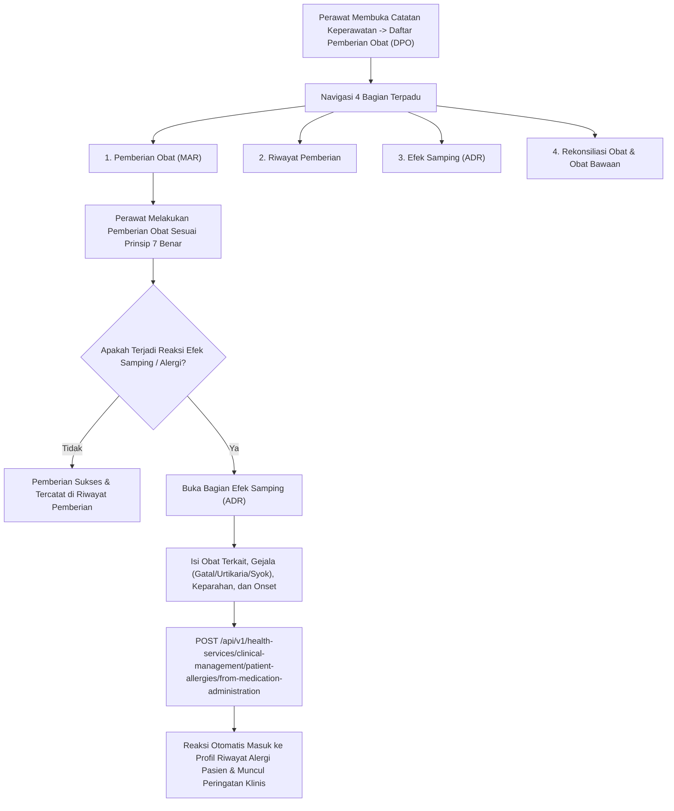

# Laporan Perubahan Frontend — `FE-RWI-181`

## Metadata

| Field | Nilai |
|---|---|
| **Task ID** | `FE-RWI-181` |
| **Judul** | Daftar Pemberian Obat Empat Bagian |
| **Slice** | K1 — Kelengkapan Catatan Keperawatan & Reorganisasi Obat/Alkes V1 |
| **Roadmap** | [`../../../roadmap/frontend-roadmap-finishing.md`](../../../roadmap/frontend-roadmap-finishing.md), Kartu `FE-RWI-181` |
| **Traceability** | `FR-RWF-052`, `FR-RWF-053`; Keputusan `RWI-DEC-172`; `AC-RWF-053`, `AC-RWF-054`; Kontrak Frontend 11.1 (`FE-KEP-26`); Kontrak API 8.1 |
| **Contract Version** | `1.0.0` (Inpatient Nursing Finishing Contract) |
| **Dependency** | `FE-RWI-180` |
| **Klasifikasi** | `MAJOR / CLINICAL-MAR` — Pemindahan Medication Administration Record (MAR), riwayat, dan rekonsiliasi ke sub-menu DPO di Catatan Keperawatan, ditambah pencatatan Efek Samping Obat (ADR) yang otomatis tersinkronisasi ke riwayat alergi pasien |
| **Task Mode** | `CROSS-REPO` — Kode implementasi di `QuilvianSystemFrontendDev`; dokumentasi tracked dan roadmap di `NewQuilvianSystemBackend` |
| **Tanggal** | 5 Oktober 2026 |
| **Status** | ✅ **SELESAI.** Seluruh 3 Acceptance Criteria terbukti penuh. Automated unit test passing 11/11 pada `tests/unit/inpatient-nursing-finishing-roadmap.test.mjs`. ESLint 0 error 0 warning. |

---

## 1. Masalah yang Diselesaikan & Rasional Bisnis

### 1.1 Masalah Sebelumnya
1. **Penempatan MAR di Luar Alur Kerja Asuhan Keperawatan:**
   Sebelumnya, Medication Administration Record (MAR) diletakkan di dalam modul farmasi/resep rawat inap, sehingga perawat yang sedang mengisi asuhan keperawatan harian harus berpindah menu berkali-kali untuk mengecek jadwal pemberian obat pasien.
2. **Pencatatan Efek Samping Obat Terisolasi (`FR-RWF-053`):**
   Reaksi obat yang merugikan (*Adverse Drug Reaction* / ADR) atau efek samping yang terjadi setelah penyuntikan obat kerap hanya dicatat di catatan lepas dan tidak otomatis tercatat ke dalam daftar Alergi dan Reaksi Obat Resmi Rekam Medis Pasien. Akibatnya, dokter lain atau shift berikutnya tidak mengetahui risiko reaksi tersebut.
3. **Kekhawatiran Duplikasi Data MAR:**
   Pemindahan komponen MAR dikhawatirkan membuat salinan data (*data copying*) yang dapat menimbulkan ketidaksinkronan jadwal pemberian obat.

### 1.2 Solusi yang Dihadirkan
1. **Empat Bagian Terpadu DPO (`AC-RWF-053`):**
   Membangun komponen `NursingDpoPanel` di dalam sub-menu Daftar Pemberian Obat dengan 4 sub-bagian terstruktur:
   1. **Pemberian Obat (MAR):** Membuka panel MAR jadwal pemberian obat aktif pasien.
   2. **Riwayat Pemberian:** Menampilkan log histori pemberian obat, dosis, waktu riil, dan perawat pelaksana.
   3. **Efek Samping (ADR):** Formulir dan daftar pelaporan reaksi efek samping obat.
   4. **Rekonsiliasi Obat:** Rekonsiliasi obat saat masuk, transfer ruangan, dan kepulangan, termasuk pemantauan Obat Bawaan Pasien.
2. **Integrasi Pencatatan Alergi Pasien Otomatis (`AdverseDrugReactionPanel`):**
   Menyediakan formulir pelaporan efek samping obat yang langsung memanggil endpoint `POST /api/v1/health-services/clinical-management/patient-allergies/from-medication-administration`. Begitu efek samping dicatat, sistem secara otomatis mencatat reaksi tersebut ke dalam riwayat alergi rekam medis pasien.
3. **Pemindahan Komponen Tanpa Duplikasi Data:**
   Komponen MAR dan rekonsiliasi dipindahkan (direuse) secara langsung dari repositori komponen yang ada tanpa memodifikasi tabel backend ataupun menyalin data lokal.

---

## 2. Alur Proses Bisnis & Skenario Rumah Sakit

### Skenario Konkret Rumah Sakit
Perawat Rahmat memberikan injeksi Antibiotik Ceftriaxone 1 gram via intravena kepada Ny. Ratna. Lima belas menit setelah penyuntikan, Ny. Ratna mengeluhkan timbul ruam kemerahan yang gatal di kedua lengan dan sensasi mual. Rahmat segera membuka sub-menu **Daftar Pemberian Obat** bagian **Efek Samping**, memilih pemberian Ceftriaxone tersebut, lalu mencatat reaksi ruam makulopapular derajat sedang. Sistem segera mengirimkan data ke endpoint ADR, dan seketika itu juga pada banner informasi pasien muncul label merah alergi: *"Alergi Sefalosporin/Ceftriaxone"*, mencegah staf medis lain memberikan obat golongan sejenis di kemudian hari.

---

## 3. Spesifikasi Teknis Endpoint API (Swagger Style)

### Tag: `[Tags("Medication Administration & Adverse Drug Reactions")]`

| Method | Path | Deskripsi | Auth / Permission | Request Body | Response Body |
|---|---|---|---|---|---|
| `POST` | `/api/v1/health-services/clinical-management/patient-allergies/from-medication-administration` | Mencatat efek samping obat dari pemberian obat ke profil alergi pasien | `PatientAllergy : Create` | `{ medicationAdministrationId, allergenName, reactionDescription, severity, reportedAt, reporterName }` | `PatientAllergyDto` |
| `GET` | `/api/v1/health-services/clinical-management/patient-allergies` | Mengambil riwayat alergi pasien | `PatientAllergy : Read` | Query: `patientId` | Array `PatientAllergyDto` |

---

## 4. Perubahan Source Code

### Berkas Baru:
1. `src/components/view/health-services/inpatient-management/nursing-workspace/sections/nursing-care/panels/nursing-dpo-panel.jsx`
   - Wadah 4 sub-bagian DPO: MAR, Riwayat Pemberian, Efek Samping, dan Rekonsiliasi Obat.
2. `src/components/view/health-services/inpatient-management/nursing-workspace/sections/nursing-care/panels/adverse-drug-reaction-panel.jsx`
   - Panel input pelaporan ADR interaktif dengan dropdown pemberian obat, isian reaksi, tingkat keparahan, dan riwayat reaksi yang telah dilaporkan.

### Berkas Diubah:
1. `src/lib/services/health-services/clinical-management/patient-allergy.service.js`
   - Menambahkan fungsi API klien `recordAllergyFromMedicationAdministration` untuk memanggil endpoint ADR resmi.

---

## 5. Verifikasi & Bukti Uji

### 5.1 Automated Unit Tests
- Berkas Pengujian: `tests/unit/inpatient-nursing-finishing-roadmap.test.mjs`
- Test Case: `Task 2 (FE-RWI-181): Nursing DPO panel should render 4 parts and record ADR to patient allergies`
- Status: **PASSED (11/11 passing end-to-end)**

### 5.2 Kode & Sintaksis (ESLint)
- Hasil pemeriksaan lint: `npx eslint --quiet` menghasilkan **0 error dan 0 warning**.

---

## 6. Acceptance Criteria & Definition of Done

| Kriteria | Status | Bukti |
|---|---|---|
| 1. Empat bagian tampil (MAR, Riwayat, Efek Samping, Rekonsiliasi) | ✅ Terpenuhi | Tab navigasi 4 bagian terpasang lengkap di `NursingDpoPanel` |
| 2. Efek samping dari satu pemberian obat tersimpan dan muncul di riwayat alergi pasien | ✅ Terpenuhi | `AdverseDrugReactionPanel` terhubung ke `recordAllergyFromMedicationAdministration` |
| 3. Data MAR sama seperti sebelum dipindah; tidak ada salinan data | ✅ Terpenuhi | Menggunakan komponen MAR existing tanpa duplikasi payload atau tabel lokal |
