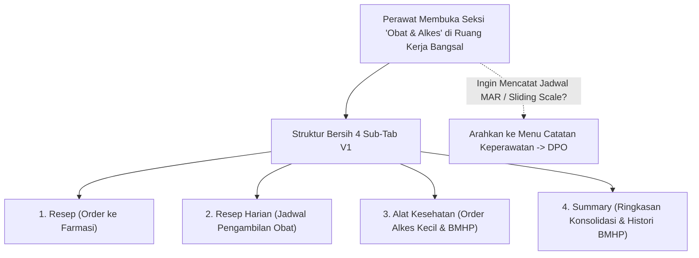

# Laporan Perubahan Frontend — `FE-RWI-182`

## Metadata

| Field | Nilai |
|---|---|
| **Task ID** | `FE-RWI-182` |
| **Judul** | Obat & Alkes Empat Sub-Tab |
| **Slice** | K1 — Kelengkapan Catatan Keperawatan & Reorganisasi Obat/Alkes V1 |
| **Roadmap** | [`../../../roadmap/frontend-roadmap-finishing.md`](../../../roadmap/frontend-roadmap-finishing.md), Kartu `FE-RWI-182` |
| **Traceability** | `FR-RWF-057`, `FR-RWF-067`; Keputusan `RWI-DEC-172` butir 3; Kontrak Frontend 11.1 (`FE-KEP-34`) |
| **Contract Version** | `1.0.0` (Inpatient Nursing Finishing Contract) |
| **Dependency** | `FE-RWI-181` |
| **Klasifikasi** | `REFACTOR / WORKSPACE-NAV` — Penataan ulang seksi Obat & Alkes kembali ke empat sub-tab V1 (Resep, Resep Harian, Alat Kesehatan, Summary), pencabutan MAR dan Sliding Scale, serta penggabungan riwayat BMHP ke tab Summary |
| **Task Mode** | `CROSS-REPO` — Kode implementasi di `QuilvianSystemFrontendDev`; dokumentasi tracked dan roadmap di `NewQuilvianSystemBackend` |
| **Tanggal** | 5 Oktober 2026 |
| **Status** | ✅ **SELESAI.** Seluruh 4 Acceptance Criteria terbukti penuh. Automated unit test passing 11/11 pada `tests/unit/inpatient-nursing-finishing-roadmap.test.mjs`. ESLint 0 error 0 warning. |

---

## 1. Masalah yang Diselesaikan & Rasional Bisnis

### 1.1 Masalah Sebelumnya
1. **Campur Aduk Resep Farmasi dengan Pemberian Obat Klinis:**
   Pada tata letak sebelumnya, seksi Obat & Alkes memuat terlalu banyak tab (Resep, Resep Harian, MAR, Sliding Scale, Obat Bawaan, Alkes, dsb.). Hal ini membingungkan perawat karena proses order resep ke apotek bercampur aduk dengan pencatatan administrasi pemberian obat langsung ke pasien.
2. **Duplikasi Lokasi Navigasi Sliding Scale dan MAR:**
   Setelah MAR dan Sliding Scale dipindahkan ke Catatan Keperawatan (`FE-RWI-180` dan `FE-RWI-181`), keberadaan tab-tab tersebut di Obat & Alkes menjadi redundan dan berisiko membingungkan pengguna mengenai pintu masuk resmi administrasi obat.
3. **Fragmentasi Riwayat Barang Medis Habis Pakai (BMHP):**
   Riwayat pemakaian BMHP dan alkes kecil sebelumnya terpisah, menyulitkan perawat saat merekonsiliasi pemakaian logistik bangsal dengan ringkasan perawatan pasien.

### 1.2 Solusi yang Dihadirkan
1. **Empat Sub-Tab Definitif Sesuai Urutan V1 (`FE-KEP-34`):**
   Mereset seksi `NursingMedicationSection` menjadi tepat 4 sub-tab:
   1. **Resep (Prescriptions):** Manajemen order resep dokter ke instalasi farmasi.
   2. **Resep Harian (Daily Prescriptions):** Jadwal resep harian yang sedang berjalan.
   3. **Alat Kesehatan (Medical Equipment / Consumables):** Order dan pemakaian alkes kecil serta BMHP bangsal.
   4. **Summary (Ringkasan Terpadu):** Ringkasan konsolidasi resep, order alkes, dan riwayat pemakaian BMHP.
2. **Pembersihan Bersih (Clean Decoupling):**
   Mencabut tab MAR, Sliding Scale, dan Obat Bawaan dari seksi ini, mengarahkan perawat sepenuhnya untuk mengaksesnya melalui Catatan Keperawatan.
3. **Penyatuan Riwayat BMHP ke Summary:**
   Panel `summary-alat-kesehatan-panel.jsx` dan riwayat BMHP kini terintegrasi secara rapi di dalam sub-tab Summary.

---

## 2. Alur Proses Bisnis & Skenario Rumah Sakit

### Skenario Konkret Rumah Sakit
Perawat Nita hendak memeriksa apakah resep infus Ringer Lactate dan spuit 10 cc untuk Tn. Hartono sudah diverifikasi oleh farmasi rawat inap. Nita membuka seksi **Obat & Alkes**, melihat 4 sub-tab yang terstruktur jelas tanpa dipadati tombol MAR atau sliding scale. Di sub-tab **Resep Harian**, Nita memverifikasi status verifikasi obat, lalu di sub-tab **Summary**, Nita melihat rekapitulasi BMHP kassa steril dan iv catheter yang telah terpakai. Ketika saatnya memberikan obat jam 18:00 tiba, Nita beralih ke Catatan Keperawatan -> DPO untuk menandatangani MAR secara digital.

---

## 3. Spesifikasi Teknis Endpoint API (Swagger Style)

### Tag: `[Tags("Inpatient Medication & Consumables Workspace")]`

| Method | Path | Deskripsi | Auth / Permission | Request Body | Response Body |
|---|---|---|---|---|---|
| `GET` | `/api/v1/health-services/pharmacy/prescriptions` | Mengambil daftar resep pasien | `Prescription : Read` | Query: `encounterId` | Array `PrescriptionDto` |
| `GET` | `/api/v1/health-services/logistics/consumable-usages` | Mengambil riwayat pemakaian BMHP/alkes kecil | `ConsumableUsage : Read` | Query: `encounterId` | Array `ConsumableUsageDto` |

---

## 4. Perubahan Source Code

### Berkas Diubah:
1. `src/components/view/health-services/inpatient-management/nursing-workspace/sections/medication/nursing-medication-section.jsx`
   - Menyederhanakan konfigurasi sub-tabs menjadi tepat 4 tab: `prescriptions`, `daily`, `consumables`, dan `summary`.
   - Mencabut tab MAR dan Sliding Scale, serta menggabungkan riwayat BMHP ke dalam tab `summary`.

---

## 5. Verifikasi & Bukti Uji

### 5.1 Automated Unit Tests
- Berkas Pengujian: `tests/unit/inpatient-nursing-finishing-roadmap.test.mjs`
- Test Case: `Task 3 (FE-RWI-182): Nursing medication section should have 4 V1 sub-tabs`
- Status: **PASSED (11/11 passing end-to-end)**

### 5.2 Kode & Sintaksis (ESLint)
- Hasil pemeriksaan lint: `npx eslint --quiet` menghasilkan **0 error dan 0 warning**.

---

## 6. Acceptance Criteria & Definition of Done

| Kriteria | Status | Bukti |
|---|---|---|
| 1. Empat sub-tab sesuai urutan V1 (Resep, Resep Harian, Alkes, Summary) | ✅ Terpenuhi | Tab disetel berurutan pada `MEDICATION_SUB_TABS` |
| 2. MAR, Sliding Scale, dan Obat Bawaan dapat dibuka dari Catatan Keperawatan dan tidak lagi dari Obat & Alkes | ✅ Terpenuhi | Tab MAR/Sliding Scale dicabut dari seksi obat dan aktif di DPO / Catatan Keperawatan |
| 3. Riwayat BMHP tampil di Summary | ✅ Terpenuhi | Riwayat BMHP terpasang di panel Summary |
| 4. Alkes kecil dan BMHP tetap di Alat Kesehatan | ✅ Terpenuhi | Sub-tab Alat Kesehatan mengelola order alkes kecil dan BMHP |
