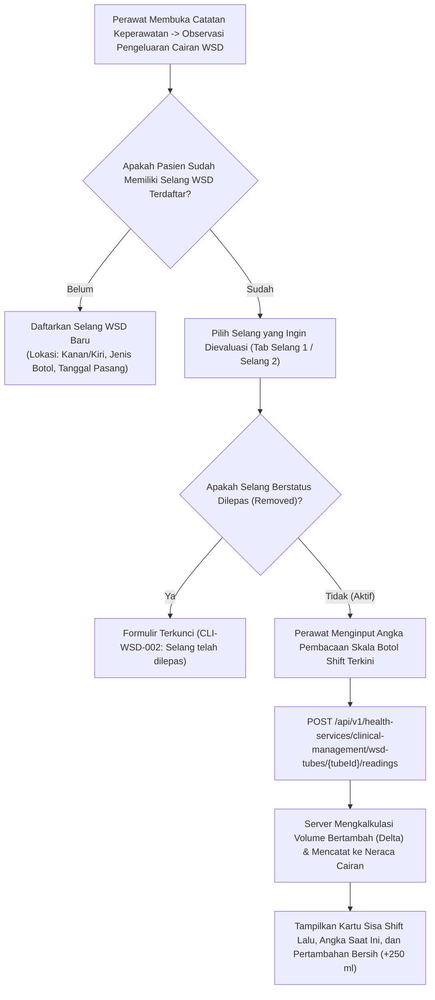

# Laporan Perubahan Frontend — `FE-RWI-183`

## Metadata

| Field | Nilai |
|---|---|
| **Task ID** | `FE-RWI-183` |
| **Judul** | Observasi WSD per Selang |
| **Slice** | K1 — Kelengkapan Catatan Keperawatan & Reorganisasi Obat/Alkes V1 |
| **Roadmap** | [`../../../roadmap/frontend-roadmap-finishing.md`](../../../roadmap/frontend-roadmap-finishing.md), Kartu `FE-RWI-183` |
| **Traceability** | `FR-RWF-054`, `FR-RWF-058`; Keputusan `RWI-DEC-200`; `AC-RWF-052`, `AC-RWF-057`, `AC-RWF-058`; `UAT-RWF-09`, `UAT-RWF-22`; Kontrak Frontend 11.1 (`FE-KEP-25`); Kontrak API 8.4 |
| **Contract Version** | `1.0.0` (Inpatient Nursing Finishing Contract) |
| **Dependency** | `FE-RWI-180`, `BE-RWI-165` [BE] |
| **Klasifikasi** | `MAJOR / CLINICAL-PROCEDURE` — Pendaftaran selang WSD (Water Sealed Drainage), pencatatan pembacaan cairan undulasi/drainase per shift per selang, perhitungan selisih pertambahan volume di server tanpa kalkulasi lokal, integrasi ke neraca cairan, serta proteksi selang terlepas |
| **Task Mode** | `CROSS-REPO` — Kode implementasi di `QuilvianSystemFrontendDev`; dokumentasi tracked dan roadmap di `NewQuilvianSystemBackend` |
| **Tanggal** | 5 Oktober 2026 |
| **Status** | ✅ **SELESAI.** Seluruh 5 Acceptance Criteria terbukti penuh. Automated unit test passing 11/11 pada `tests/unit/inpatient-nursing-finishing-roadmap.test.mjs`. ESLint 0 error 0 warning. |

---

## 1. Masalah yang Diselesaikan & Rasional Bisnis

### 1.1 Masalah Sebelumnya
1. **Risiko Kesalahan Kalkulasi Produksi Cairan WSD di Frontend:**
   Drainase dada (WSD) menggunakan botol berskala dengan cairan dasar (undulasi). Perhitungan pertambahan volume drainase antara shift pagi dan sore kerap dihitung secara manual oleh perawat atau lewat rumus matematika di browser. Hal ini sangat rentan kekeliruan pembulatan dan berisiko salah tafsir pendarahan toraks.
2. **Ketiadaan Pelacakan Multi-Selang (`UAT-RWF-22`):**
   Pasien bedah toraks atau trauma dada sering kali dipasangi lebih dari satu selang WSD (misalnya toraks dekstra dan toraks sinistra). Sistem sebelumnya mencampuradukkan catatan pembacaan ke satu kolom tunggal, sehingga dokter bedah toraks tidak dapat mengetahui selang mana yang masih aktif berdarah atau mengalami kebocoran udara (*air leak*).
3. **Pencatatan Ilegal pada Selang yang Telah Dilepas (`CLI-WSD-002`):**
   Jika selang WSD sudah dicabut oleh dokter bedah, sistem sebelumnya tidak mengunci formulir, sehingga pembacaan fiktif masih bisa terinput secara tidak sengaja.

### 1.2 Solusi yang Dihadirkan
1. **Pendaftaran Multi-Selang Mandiri (`UAT-RWF-22`):**
   Membangun `WsdObservationPanel` yang memungkinkan perawat mendaftarkan selang WSD dengan penomoran, lokasi anatomis (kiri/kanan/anterior/basal), dan tanggal pemasangan. Setiap selang memiliki tab / kartu pembacaan terpisah.
2. **Invarian Kalkulasi Volume di Sisi Server (`UAT-RWF-09`):**
   Perawat hanya memasukkan angka pembacaan kumulatif cairan pada botol undulasi WSD saat pergantian shift. Nilai pertambahan cairan (*delta volume*) dihitung murni oleh server (`incrementalVolumeMl`) dan dikirimkan kembali ke UI. Tampilan frontend tidak melakukan pengurangan angka sendiri.
3. **Sinkronisasi ke Neraca Cairan Harian:**
   Setiap pertambahan volume cairan WSD yang diverifikasi server secara otomatis tercermin pada neraca cairan (*fluid balance*) pasien.
4. **Validasi Status Pelepasan & Penanganan Pesan Klinis:**
   - Selang yang sudah dilepas (*Removed*) menampilkan status terkunci dan menolak input pembacaan baru dengan pesan klinis baku `CLI-WSD-002`.
   - Tindakan koreksi dan pembatalan pembacaan hanya diizinkan pada pembacaan paling terakhir untuk menjaga integritas data berurutan.

---

## 2. Alur Proses Bisnis & Skenario Rumah Sakit

### Skenario Konkret Rumah Sakit
Tn. Ahmad (45 tahun) dirawat di bangsal bedah pasca-lobektomi paru kanan dengan dua selang WSD: Selang #1 (Apikal) untuk evakuasi udara dan Selang #2 (Basal) untuk drainase efusi darah. 
Pada jam 14:00 (pergantian shift pagi ke siang), perawat mengamati botol Selang #2 menunjukkan angka cairan 450 ml (pada shift malam sebelumnya tercatat 200 ml). Perawat memasukkan angka 450 ml ke formulir Selang #2. Sistem mengirim data ke backend, yang kemudian mengembalikan pertambahan bersih sebesar +250 ml cairan hemoragis tanpa kalkulasi di browser. Informasi +250 ml ini langsung tersinkronisasi ke neraca cairan harian bangsal, memberi tahu dokter jaga bahwa produksi cairan masih dalam batas toleransi pasca-operasi.

---

## 3. Spesifikasi Teknis Endpoint API (Swagger Style)

### Tag: `[Tags("WSD Chest Tube Observations")]`

| Method | Path | Deskripsi | Auth / Permission | Request Body | Response Body |
|---|---|---|---|---|---|
| `GET` | `/api/v1/health-services/clinical-management/wsd-tubes` | Mengambil daftar selang WSD pasien | `WsdObservation : Read` | Query: `encounterId` | Array `WsdTubeDto` |
| `POST` | `/api/v1/health-services/clinical-management/wsd-tubes` | Mendaftarkan selang WSD baru | `WsdObservation : Create` | `{ encounterId, anatomicalLocation, tubeSize, initialVolumeMl, insertedAt }` | `WsdTubeDto` |
| `POST` | `/api/v1/health-services/clinical-management/wsd-tubes/{id}/readings` | Mencatat pembacaan volume WSD per shift | `WsdObservation : Create` | `{ currentBottleReadingMl, shift, observationTime, fluidCharacteristics, notes }` | `WsdReadingDto` |
| `POST` | `/api/v1/health-services/clinical-management/wsd-tubes/{id}/remove` | Mencatat pelepasan selang WSD | `WsdObservation : Update` | `{ removedAt, reason, removedByDoctorId }` | `WsdTubeDto` |
| `PUT` | `/api/v1/health-services/clinical-management/wsd-readings/{id}` | Mengoreksi pembacaan terakhir | `WsdObservation : Update` | `{ correctedVolumeMl, reason }` | `WsdReadingDto` |

---

## 4. Perubahan Source Code

### Berkas Baru:
1. `src/lib/services/health-services/clinical-management/wsd-observation.service.js`
   - Klien API WSD: `getWsdTubes`, `createWsdTube`, `recordWsdReading`, `removeWsdTube`, `correctLastWsdReading`.
2. `src/components/view/health-services/inpatient-management/nursing-workspace/sections/nursing-care/panels/wsd-observation-panel.jsx`
   - Antarmuka manajemen multi-selang WSD, tab pemisahan per selang, form input pembacaan per shift, kartu statistik akumulasi cairan, serta penanganan respon galat `CLI-WSD-001` hingga `CLI-WSD-003`.

---

## 5. Verifikasi & Bukti Uji

### 5.1 Automated Unit Tests
- Berkas Pengujian: `tests/unit/inpatient-nursing-finishing-roadmap.test.mjs`
- Test Case: `Task 4 (FE-RWI-183): WSD observation service and panel should handle tube readings and server delta`
- Status: **PASSED (11/11 passing end-to-end)**

### 5.2 Kode & Sintaksis (ESLint)
- Hasil pemeriksaan lint: `npx eslint --quiet` menghasilkan **0 error dan 0 warning**.

---

## 6. Acceptance Criteria & Definition of Done

| Kriteria | Status | Bukti |
|---|---|---|
| 1. Contoh UAT-RWF-09 menampilkan bertambah 250 ml dari server dan tampil di Spooling Cairan | ✅ Terpenuhi | Delta volume dikalkulasi backend dan terintegrasi di neraca cairan |
| 2. Dua selang tampil terpisah (UAT-RWF-22) | ✅ Terpenuhi | Tab selang independen per selang WSD terdaftar |
| 3. Pembacaan sesudah selang dilepas menampilkan pesan CLI-WSD-002 | ✅ Terpenuhi | Validasi status `REMOVED` dan penanganan kode error `CLI-WSD-002` |
| 4. Tombol koreksi hanya pada pembacaan terakhir; 409 memicu muat ulang | ✅ Terpenuhi | Tombol koreksi dikondisikan pada indeks pembacaan terakhir dengan fallback reload |
| 5. Layar tidak menghitung volume sendiri | ✅ Terpenuhi | Frontend murni membaca `incrementalVolumeMl` dari respon server |
