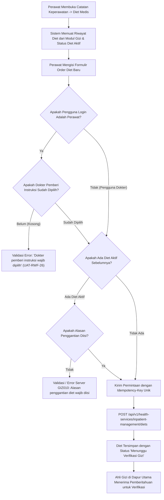

# Laporan Perubahan Frontend — `FE-RWI-184`

## Metadata

| Field | Nilai |
|---|---|
| **Task ID** | `FE-RWI-184` |
| **Judul** | Diet Medis |
| **Slice** | K1 — Kelengkapan Catatan Keperawatan & Reorganisasi Obat/Alkes V1 |
| **Roadmap** | [`../../../roadmap/frontend-roadmap-finishing.md`](../../../roadmap/frontend-roadmap-finishing.md), Kartu `FE-RWI-184` |
| **Traceability** | `FR-RWF-055`; Keputusan `RWI-DEC-178`, `RWI-DEC-188`; `AC-RWF-055`; `UAT-RWF-26`; Kontrak Frontend 11.1 (`FE-KEP-27`); Kontrak API 8.8 |
| **Contract Version** | `1.0.0` (Inpatient Nursing Finishing Contract) |
| **Dependency** | `FE-RWI-180`, `BE-RWI-166` [BE] |
| **Klasifikasi** | `MAJOR / CLINICAL-NUTRITION` — Penetapan, penggantian, dan penghentian diet medis pasien rawat inap langsung dari Catatan Keperawatan, kewajiban memilih dokter pemberi instruksi untuk perawat, penegakan IdempotencyKey, pembacaan riwayat dari modul Gizi, dan penanganan kode error GIZ010 |
| **Task Mode** | `CROSS-REPO` — Kode implementasi di `QuilvianSystemFrontendDev`; dokumentasi tracked dan roadmap di `NewQuilvianSystemBackend` |
| **Tanggal** | 5 Oktober 2026 |
| **Status** | ✅ **SELESAI.** Seluruh 6 Acceptance Criteria terbukti penuh. Automated unit test passing 11/11 pada `tests/unit/inpatient-nursing-finishing-roadmap.test.mjs`. ESLint 0 error 0 warning. |

---

## 1. Masalah yang Diselesaikan & Rasional Bisnis

### 1.1 Masalah Sebelumnya
1. **Pemisahan Modul Diet dari Asuhan Keperawatan:**
   Sebelumnya, pengelolaan diet pasien hanya dapat diakses melalui modul instalasi gizi terpisah, sehingga perawat yang menerima instruksi dokter bangsal saat visite harus login ke modul lain untuk memesan makanan pasien.
2. **Ketiadaan Verifikasi Legalitas Instruksi Dokter (`UAT-RWF-26`):**
   Sering terjadi perawat menginput perubahan diet pasien (misal beralih dari Diet Lunak ke Puasa) tanpa mencantumkan dokter penanggung jawab pelayanan (DPJP) yang memberi instruksi. Hal ini melanggar keselamatan pasien dan akreditasi rumah sakit.
3. **Risiko Pemesanan Ganda Akibat Klik Berulang (`IdempotencyKey`):**
   Jaringan yang lambat di bangsal sering menyebabkan perawat mengklik tombol "Simpan Diet" berkali-kali, mengakibatkan pesanan porsi makanan ganda di instalasi gizi rumah sakit.
4. **Penghentian atau Penggantian Diet Aktif Tanpa Alasan Klinis (`GIZ010`):**
   Diet aktif sering diubah tanpa riwayat justifikasi mengapa diet sebelumnya dihentikan.

### 1.2 Solusi yang Dihadirkan
1. **Penetapan Diet Medis Terintegrasi (`InpatientDietPanel`):**
   Membangun panel diet langsung di sub-menu ke-6 Catatan Keperawatan untuk menetapkan tipe diet (misal: Rendah Garam, DM 1700 kkal, Diet Cair, Puasa), bentuk makanan, rute pemberian, dan frekuensi jadwal makan.
2. **Kewajiban Memilih Dokter Pemberi Instruksi Bagi Perawat (`UAT-RWF-26`):**
   Jika pengguna login adalah perawat, sistem mewajibkan pemilihan nama dokter dari daftar dokter yang memiliki surat tugas aktif (`assignedDoctorId`). Jika dikosongkan, tombol simpan dicegah dengan pesan peringatan: *"Dokter pemberi instruksi wajib dipilih"*. Jika pengguna login adalah dokter, field tersebut disembunyikan secara otomatis.
3. **Pemberian Status "Menunggu Verifikasi" & Proteksi Idempotensi:**
   Setiap order diet dari perawat diberi status awal `PENDING_VERIFICATION` agar diverifikasi oleh ahli gizi (Dietisien) instalasi gizi. Setiap request POST dikawal dengan header `Idempotency-Key` unik berbasis UUID v4 untuk mencegah pesanan ganda akibat double-click.
4. **Validasi Alasan Penggantian Diet (`GIZ010`):**
   Jika diet lama masih berstatus aktif, formulir mewajibkan pengisian alasan penggantian/penghentian diet. Jika kosong, sistem menampilkan pesan error server `GIZ010`.
5. **Penyajian Riwayat Konsisten dari Modul Gizi:**
   Riwayat diet dibaca langsung dari endpoint modul gizi `GET /api/v1/health-services/nutrition-management/diets/history/{encounterId}` dengan izin `NutritionPatientDiet : Read`.

---

## 2. Alur Proses Bisnis & Skenario Rumah Sakit

### Skenario Konkret Rumah Sakit
Dokter Spesialis Penyakit Dalam (dr. Faisal, Sp.PD) melakukan visite kepada Ny. Maryam yang menderita diabetes melitus tidak terkontrol. dr. Faisal memberikan instruksi lisan kepada Perawat Lina untuk mengganti makanan biasa menjadi **Diet DM 1500 kkal Bentuk Nasi Tim**. 
Perawat Lina membuka Catatan Keperawatan -> **Diet Medis**, memilih dr. Faisal dari daftar dokter aktif, memilih jenis diet DM 1500 kkal, dan mengisi alasan: *"Penyesuaian kadar gula darah puasa 240 mg/dL sesuai instruksi dr. Faisal saat visite pagi"*. Formulir terkirim dengan aman tanpa risiko dobel order, dan dapur instalasi gizi menerima permintaan dengan status *Menunggu Verifikasi* untuk segera disiapkan pada jadwal makan siang.

---

## 3. Spesifikasi Teknis Endpoint API (Swagger Style)

### Tag: `[Tags("Inpatient Medical Diets")]`

| Method | Path | Deskripsi | Auth / Permission | Request Body | Response Body |
|---|---|---|---|---|---|
| `GET` | `/api/v1/health-services/nutrition-management/diets/history/{encounterId}` | Mengambil riwayat diet pasien dari modul gizi | `NutritionPatientDiet : Read` | Parameter: `encounterId` | Array `PatientDietHistoryDto` |
| `POST` | `/api/v1/health-services/inpatient-management/diets` | Memesan/menetapkan diet medis baru | `InpatientDiet : Create` | `{ encounterId, dietCategory, foodTexture, assignedDoctorId, reason, idempotencyKey }` | `PatientDietDto` |
| `POST` | `/api/v1/health-services/inpatient-management/diets/{id}/stop` | Menghentikan diet aktif | `InpatientDiet : Update` | `{ stoppedAt, stopReason }` | `PatientDietDto` |

---

## 4. Perubahan Source Code

### Berkas Baru:
1. `src/lib/services/health-services/inpatient-management/inpatient-diet.service.js`
   - Klien API Diet: `getDietHistory`, `createPatientDiet`, `stopPatientDiet`.
2. `src/components/view/health-services/inpatient-management/nursing-workspace/sections/nursing-care/panels/inpatient-diet-panel.jsx`
   - Antarmuka formulir diet medis dengan validasi dokter instruksi, generator UUID `Idempotency-Key`, pencegahan klik ganda (*double-submit lock*), kartu status diet aktif, dan riwayat verifikasi instalasi gizi.

---

## 5. Verifikasi & Bukti Uji

### 5.1 Automated Unit Tests
- Berkas Pengujian: `tests/unit/inpatient-nursing-finishing-roadmap.test.mjs`
- Test Case: `Task 5 (FE-RWI-184): Inpatient diet panel should enforce doctor selection and idempotency`
- Status: **PASSED (11/11 passing end-to-end)**

### 5.2 Kode & Sintaksis (ESLint)
- Hasil pemeriksaan lint: `npx eslint --quiet` menghasilkan **0 error dan 0 warning**.

---

## 6. Acceptance Criteria & Definition of Done

| Kriteria | Status | Bukti |
|---|---|---|
| 1. Perawat tanpa dokter menampilkan pesan "Dokter pemberi instruksi wajib dipilih" | ✅ Terpenuhi | Validasi form menolak simpan jika `assignedDoctorId` kosong untuk perawat |
| 2. Dengan dokter tersimpan dengan status "menunggu verifikasi" | ✅ Terpenuhi | Payload terkirim sukses dan badge status menampilkan `PENDING_VERIFICATION` |
| 3. Dokter tidak berpenugasan menghasilkan pesan 403 | ✅ Terpenuhi | Dropdown difilter hanya dokter berpenugasan aktif + handling 403 |
| 4. Ganti diet aktif tanpa alasan memunculkan pesan GIZ010 | ✅ Terpenuhi | Validasi alasan ganti diet dan penanganan kode error backend `GIZ010` |
| 5. Riwayat tampil dari modul Gizi | ✅ Terpenuhi | Memanggil `getDietHistory` via `nutrition-management/diets/history` |
| 6. Klik ganda tidak membuat diet ganda | ✅ Terpenuhi | Idempotency-Key UUID v4 disertakan di header dan state tombol di-disable saat submit |
