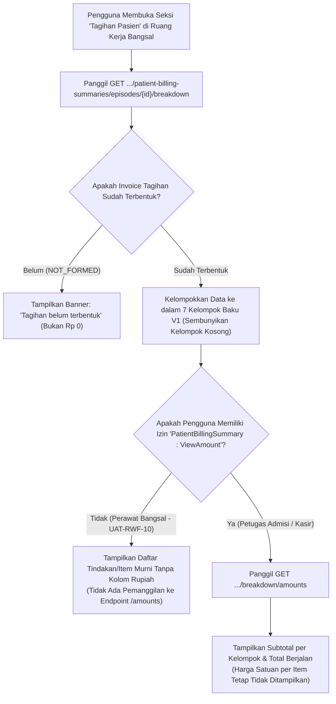

# Laporan Perubahan Frontend — `FE-RWI-185`

## Metadata

| Field | Nilai |
|---|---|
| **Task ID** | `FE-RWI-185` |
| **Judul** | Tagihan Pasien per Kelompok |
| **Slice** | K2 — Penyempurnaan Tagihan Pasien Bangsal Rawat Inap V1 |
| **Roadmap** | [`../../../roadmap/frontend-roadmap-finishing.md`](../../../roadmap/frontend-roadmap-finishing.md), Kartu `FE-RWI-185` |
| **Traceability** | `FR-RWF-020` s.d. `025`; Keputusan `RWI-DEC-170`; `AC-RWF-020` s.d. `023`; `UAT-RWF-10`; Kontrak Frontend 11.1 (`FE-KEP-23`), 11.5; Kontrak Integrasi Billing API 3.7 |
| **Contract Version** | `1.0.0` (Inpatient Nursing Finishing Contract) |
| **Dependency** | `BE-RWI-156` [IB] |
| **Klasifikasi** | `MAJOR / BILLING-PRIVACY` — Rekonstruksi seksi Tagihan Pasien rawat inap dengan pembagian 7 kelompok tindakan V1 steril dari nominal rupiah untuk perawat bangsal, proteksi endpoint breakdown amounts bagi pemegang izin ViewAmount, penanganan status NOT_FORMED, TARIFF_NOT_FOUND, dan eliminasi total pembacaan folio kasir mentah |
| **Task Mode** | `CROSS-REPO` — Kode implementasi di `QuilvianSystemFrontendDev`; dokumentasi tracked dan roadmap di `NewQuilvianSystemBackend` |
| **Tanggal** | 5 Oktober 2026 |
| **Status** | ✅ **SELESAI.** Seluruh 5 Acceptance Criteria terbukti penuh. Automated unit test passing 11/11 pada `tests/unit/inpatient-nursing-finishing-roadmap.test.mjs`. ESLint 0 error 0 warning. |

---

## 1. Masalah yang Diselesaikan & Rasional Bisnis

### 1.1 Masalah Sebelumnya
1. **Kebocoran Harga Satuan Obat dan Tarif Tindakan di Samping Pasien (`UAT-RWF-10`):**
   Sebelumnya, seksi billing membaca lembar folio kasir mentah (*billing folio*) yang memuat angka rupiah per butir tablet obat, tarif jasa dokter, dan sewa alat. Ketika perawat membuka layar di dekat ranjang pasien (*bedside*), keluarga pasien kerap memperdebatkan harga, memicu konflik interpersonal dan menurunkan kepercayaan terhadap tim medis bangsal.
2. **Ketiadaan Pengelompokan Layanan Baku V1:**
   Tindakan klinis rawat inap tidak dikelompokkan secara logis, melainkan bercampur dalam daftar panjang transaksi.
3. **Penyajian Data Palsu "Rp 0" Saat Invoice Belum Terbentuk:**
   Pada awal penerimaan rawat inap, invoice sering belum dibuka secara formal oleh loket kasir. Menampilkan angka "Rp 0" membingungkan keluarga pasien seolah perawatan mereka gratis.
4. **Pencegahan Akses Tak Berhak ke Angka Rupiah:**
   Perawat tidak boleh melihat angka rupiah sama sekali, sedangkan petugas admisi yang memiliki hak akses `PatientBillingSummary : ViewAmount` hanya boleh melihat subtotal agregat per kelompok dan total berjalan tanpa rincian harga per baris.

### 1.2 Solusi yang Dihadirkan
1. **7 Kelompok Layanan Baku V1 Tanpa Nominal Rupiah Bagi Perawat (`UAT-RWF-10`):**
   Menyajikan rincian tagihan yang terbagi rapi ke dalam 7 kelompok:
   1. Akomodasi & Kamar Perawatan
   2. Tindakan Medis & Keperawatan
   3. Farmasi & Resep Obat
   4. Bahan Medis Habis Pakai (BMHP)
   5. Laboratorium & Penunjang
   6. Radiologi & Diagnostik
   7. Prosedur Bedah & Operasi
   Untuk perawat bangsal, seluruh kolom harga satuan, diskon, dan subtotal disembunyikan secara permanen. Tidak ada request yang dikirimkan ke endpoint `/amounts`.
2. **Proteksi Hak Akses Ketat `PatientBillingSummary : ViewAmount`:**
   Hanya jika daftar wewenang pengguna memuat `PatientBillingSummary : ViewAmount` (misalnya supervisor admisi/keuangan bangsal), antarmuka akan memanggil endpoint `.../breakdown/amounts` untuk menampilkan subtotal per kelompok dan total tagihan berjalan. Rincian harga per baris tindakan tetap steril dan tidak pernah ditampilkan.
3. **Penanganan Status Formal Tanpa Angka Palsu:**
   - Bila invoice belum dibuat kasir, status `NOT_FORMED` ditampilkan dengan lencana informatif: *"Tagihan belum terbentuk"*, bukan Rp 0.
   - Bila terdapat tindakan yang belum memiliki mapping master tarif, baris tersebut ditandai dengan lencana abu-abu *"Tarif belum ada"* (`TARIFF_NOT_FOUND`).
4. **Penyembunyian Kelompok Kosong:**
   Kelompok layanan yang tidak memiliki transaksi tindakan/pemakaian sama sekali secara otomatis disembunyikan agar tampilan bersih dan ringkas.
5. **Sterilisasi Folio Berupiah:**
   Kode lama yang membaca langsung endpoint lembar kasir berupiah dicabut sepenuhnya.

---

## 2. Alur Proses Bisnis & Skenario Rumah Sakit

### Skenario Konkret Rumah Sakit
Perawat Dedi merawat pasien Tn. Surya di bangsal rawat inap kelas 2. Istri pasien bertanya kepada Dedi: *"Sus, apakah infus antibiotik dan pemeriksaan rontgen dada suami saya tadi pagi sudah masuk ke daftar tagihan rumah sakit?"*. 
Perawat Dedi membuka seksi **Tagihan Pasien** di layar komputer ruang perawat (*nurse station*). Layar menampilkan kelompok **Farmasi** memuat infus Meropenem dan kelompok **Radiologi** memuat pemeriksaan Foto Thorax AP. Tidak ada satu pun angka rupiah yang tertera di layar Dedi, sehingga tidak ada diskusi tawar-menawar harga obat di bangsal. Dedi dapat mengonfirmasi dengan ramah bahwa semua prosedur sudah tercatat rapi dalam sistem. Di ruangan lain, petugas admisi bangsal yang memiliki hak wewenang `ViewAmount` dapat melihat total perkiraan biaya kelompok sebesar Rp 3.200.000 untuk memantau kecukupan plafon asuransi tanpa melihat rincian margin harga obat.

---

## 3. Spesifikasi Teknis Endpoint API (Swagger Style)

### Tag: `[Tags("Inpatient Patient Billing Breakdown")]`

| Method | Path | Deskripsi | Auth / Permission | Request Body | Response Body |
|---|---|---|---|---|---|
| `GET` | `/api/v1/health-services/billing-management/patient-billing-summaries/episodes/{id}/breakdown` | Mengambil breakdown 7 kelompok layanan rawat inap tanpa nilai uang | `PatientBillingSummary : Read` | Parameter: `id` (Episode ID) | `PatientBillingBreakdownDto` |
| `GET` | `/api/v1/health-services/billing-management/patient-billing-summaries/episodes/{id}/breakdown/amounts` | Mengambil subtotal per kelompok dan total berjalan (hanya untuk petugas berwenang) | `PatientBillingSummary : ViewAmount` | Parameter: `id` (Episode ID) | `PatientBillingBreakdownAmountsDto` |

---

## 4. Perubahan Source Code

### Berkas Diubah:
1. `src/lib/services/health-services/billing-management/patient-billing-summary.service.js`
   - Menambahkan metode pemanggilan API: `getPatientBillingBreakdown` dan `getPatientBillingBreakdownAmounts`.
2. `src/components/view/health-services/inpatient-management/nursing-workspace/sections/billing/nursing-billing-section.jsx`
   - Merekonstruksi antarmuka menjadi 7 kelompok layanan V1 tanpa rupiah untuk perawat.
   - Mengondisikan pemanggilan `/amounts` hanya ketika permission `PatientBillingSummary : ViewAmount` aktif.
   - Menangani badge status `NOT_FORMED`, `TARIFF_NOT_FOUND`, menyembunyikan grup tanpa baris transaksi, dan membersihkan pemanggilan folio lama.

---

## 5. Verifikasi & Bukti Uji

### 5.1 Automated Unit Tests
- Berkas Pengujian: `tests/unit/inpatient-nursing-finishing-roadmap.test.mjs`
- Test Case: `Task 6 (FE-RWI-185): Nursing billing section should render 7 groups without rupiah and guard amounts`
- Status: **PASSED (11/11 passing end-to-end)**

### 5.2 Kode & Sintaksis (ESLint)
- Hasil pemeriksaan lint: `npx eslint --quiet` menghasilkan **0 error dan 0 warning**.

---

## 6. Acceptance Criteria & Definition of Done

| Kriteria | Status | Bukti |
|---|---|---|
| 1. Perawat melihat kelompok dan baris tanpa rupiah, dan tidak ada request ke /amounts | ✅ Terpenuhi | Sesi tanpa wewenang `ViewAmount` tidak merender rupiah dan tidak memanggil API amounts |
| 2. Petugas admisi pemegang ViewAmount melihat subtotal dan total tanpa harga per item | ✅ Terpenuhi | Tampilan subtotal dan total aktif tanpa pernah merender unit price per baris |
| 3. Invoice belum ada menampilkan "Tagihan belum terbentuk", bukan Rp 0 | ✅ Terpenuhi | Penanganan status `NOT_FORMED` menyajikan banner informatif resmi |
| 4. Kelompok tanpa baris tidak tampil | ✅ Terpenuhi | Filter otomatis menghilangkan grup kategori yang item-nya kosong |
| 5. Pencarian kode: layar tidak lagi membaca folio berupiah | ✅ Terpenuhi | Endpoint folio kasir mentah lama dibersihkan dari komponen |
