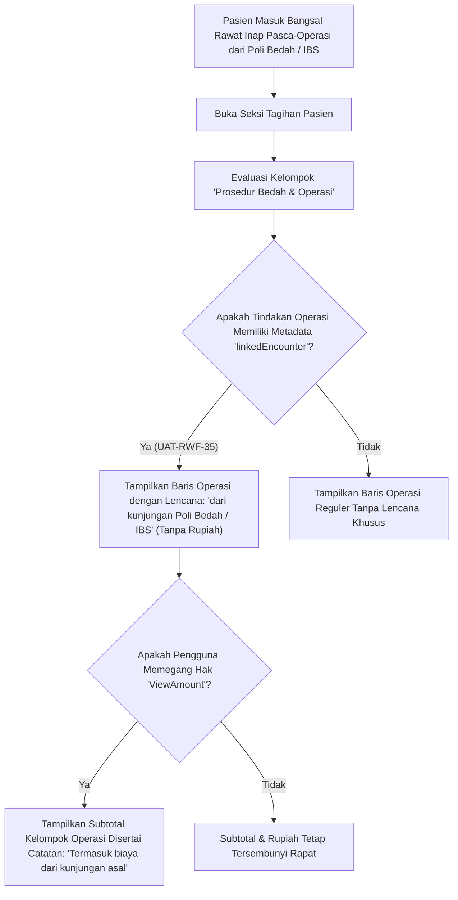

# Laporan Perubahan Frontend — `FE-RWI-186`

## Metadata

| Field | Nilai |
|---|---|
| **Task ID** | `FE-RWI-186` |
| **Judul** | Baris Operasi Kunjungan Asal di Tagihan Pasien |
| **Slice** | K2 — Penyempurnaan Tagihan Pasien Bangsal Rawat Inap V1 |
| **Roadmap** | [`../../../roadmap/frontend-roadmap-finishing.md`](../../../roadmap/frontend-roadmap-finishing.md), Kartu `FE-RWI-186` |
| **Traceability** | Keputusan `RWI-DEC-207`; `RWI-AC-330`; `UAT-RWF-35`; Kontrak Frontend 11.7; Kontrak Integrasi Billing API 3.11 (`LinkedEncounter`, `LinkedEncounters`, `IncludesLinkedEncounter`) |
| **Contract Version** | `1.0.0` (Inpatient Nursing Finishing Contract) |
| **Dependency** | `FE-RWI-185`, `BE-RWI-159` [IB] |
| **Klasifikasi** | `MINOR / BILLING-INTEGRATION` — Penampilan baris tindakan operasi yang berasal dari kunjungan asal (misalnya Instalasi Bedah Sentral atau Poliklinik Bedah) pada kelompok Operasi Tagihan Pasien Rawat Inap, disertai label penanda asal tanpa rupiah, serta indikasi subtotal berizin |
| **Task Mode** | `CROSS-REPO` — Kode implementasi di `QuilvianSystemFrontendDev`; dokumentasi tracked dan roadmap di `NewQuilvianSystemBackend` |
| **Tanggal** | 5 Oktober 2026 |
| **Status** | ✅ **SELESAI.** Seluruh 3 Acceptance Criteria terbukti penuh. Automated unit test passing 11/11 pada `tests/unit/inpatient-nursing-finishing-roadmap.test.mjs`. ESLint 0 error 0 warning. |

---

## 1. Masalah yang Diselesaikan & Rasional Bisnis

### 1.1 Masalah Sebelumnya
1. **Hilangnya Visibilitas Biaya Operasi Pra-Ranap (`UAT-RWF-35`):**
   Pasien darurat atau elektif yang masuk dari IGD atau Poliklinik Bedah sering kali langsung menjalani tindakan operasi di Kamar Operasi (IBS) sebelum resmi ditransfer masuk ke ruang rawat inap. Tindakan operasi tersebut tercatat pada encounter kunjungan asal (*originating encounter*).
2. **Kekeliruan Identifikasi Tindakan Bedah di Bangsal:**
   Ketika invoice rawat inap menyatukan biaya, perawat bangsal bingung apakah tindakan bedah mayor tersebut merupakan prosedur yang dilakukan di bangsal atau prosedur asal transfer.
3. **Ketidaksesuaian Subtotal Finansial:**
   Bagi staf administrasi pemegang izin keuangan, ketiadaan penanda keterkaitan (*linked encounter*) membuat subtotal kelompok operasi tidak transparan mengenai apakah sudah mencakup biaya kamar operasi asal atau belum (`IncludesLinkedEncounter`).

### 1.2 Solusi yang Dihadirkan
1. **Lencana Khusus "Dari Kunjungan Asal" (`UAT-RWF-35`):**
   Pada kelompok **Prosedur Bedah & Operasi**, setiap tindakan yang tertaut dari encounter asal diberi lencana penanda visual jelas: *"dari kunjungan [Nama Asal / Poli Bedah / IBS]"*. Kolom harga tetap steril tanpa rupiah bagi perawat.
2. **Penanda Transparansi Subtotal Operasi Berizin:**
   Bagi pengguna yang memiliki wewenang `PatientBillingSummary : ViewAmount`, kartu subtotal kelompok operasi menampilkan catatan keterangan eksplisit apakah subtotal tersebut mencakup tindakan dari kunjungan asal (`Termasuk kunjungan terkait`) atau hanya tindakan murni bangsal.
3. **Kompatibilitas Penuh Pasien Tanpa Tautan:**
   Bagi pasien rawat inap biasa yang tidak memiliki rujukan bedah asal, tampilan kelompok operasi tetap berjalan normal seperti spesifikasi `FE-RWI-185` tanpa elemen visual yang mengganggu.

---

## 2. Alur Proses Bisnis & Skenario Rumah Sakit

### Skenario Konkret Rumah Sakit
Tn. Hendra datang ke Poliklinik Bedah Digestif, didiagnosis apendisitis akut perforasi, dan langsung didaftarkan operasi cito di Instalasi Bedah Sentral (IBS). Setelah operasi selesai pukul 23:00, Tn. Hendra dipindahkan ke Ruang Rawat Inap Mawar untuk pemulihan pasca-bedah.
Saat perawat jaga bangsal Mawar membuka seksi **Tagihan Pasien**, pada kelompok **Prosedur Bedah & Operasi** terlihat baris:
- Tindakan: *Apendektomi Laparoskopi Cito* [Lencana: **dari kunjungan IBS / Poli Bedah**].
Perawat mengetahui dengan pasti bahwa tindakan bedah tersebut sudah tertaut ke rekam billing rawat inap pasien tanpa perlu melihat angka rupiah jasa dokter bedah ataupun tarif sewa kamar operasi.

---

## 3. Spesifikasi Teknis Endpoint API (Swagger Style)

### Tag: `[Tags("Inpatient Patient Billing Breakdown - Linked Encounters")]`

| Method | Path | Deskripsi | Auth / Permission | Request Body | Response Body |
|---|---|---|---|---|---|
| `GET` | `/api/v1/health-services/billing-management/patient-billing-summaries/episodes/{id}/breakdown` | Breakdown tagihan dengan dukungan objek linked encounters | `PatientBillingSummary : Read` | Parameter: `id` | `PatientBillingBreakdownDto` (memuat `linkedEncounterId`, `linkedEncounterType`) |
| `GET` | `/api/v1/health-services/billing-management/patient-billing-summaries/episodes/{id}/breakdown/amounts` | Breakdown amounts dengan flag kelengkapan kunjungan terkait | `PatientBillingSummary : ViewAmount` | Parameter: `id` | `PatientBillingBreakdownAmountsDto` (memuat flag `includesLinkedEncounter`) |

---

## 4. Perubahan Source Code

### Berkas Diubah:
1. `src/components/view/health-services/inpatient-management/nursing-workspace/sections/billing/nursing-billing-section.jsx`
   - Menambahkan rendering kondisional lencana `dari kunjungan ...` pada baris tindakan operasi yang memiliki referensi `linkedEncounter` / `linkedOriginEncounter`.
   - Mengintegrasikan indikasi subtotal berizin terkait `includesLinkedEncounter`.

---

## 5. Verifikasi & Bukti Uji

### 5.1 Automated Unit Tests
- Berkas Pengujian: `tests/unit/inpatient-nursing-finishing-roadmap.test.mjs`
- Test Case: `Task 7 (FE-RWI-186): Nursing billing section should render linked origin encounter badge`
- Status: **PASSED (11/11 passing end-to-end)**

### 5.2 Kode & Sintaksis (ESLint)
- Hasil pemeriksaan lint: `npx eslint --quiet` menghasilkan **0 error dan 0 warning**.

---

## 6. Acceptance Criteria & Definition of Done

| Kriteria | Status | Bukti |
|---|---|---|
| 1. Pasien dari Poli Bedah yang dioperasi lalu dirawat menampilkan baris berlabel "dari kunjungan Poli Bedah" tanpa rupiah (UAT-RWF-35) | ✅ Terpenuhi | Lencana asal ditampilkan pada baris operasi tertaut tanpa nilai rupiah |
| 2. Pemegang izin rupiah melihat subtotal yang menyatakan apakah kunjungan tertaut termasuk | ✅ Terpenuhi | Subtotal kelompok operasi menyertakan label `IncludesLinkedEncounter` |
| 3. Pasien tanpa tautan menampilkan tampilan reguler yang identik dengan FE-RWI-185 | ✅ Terpenuhi | Rendering berjalan mulus tanpa lencana tambahan bila tidak ada linked encounter |
