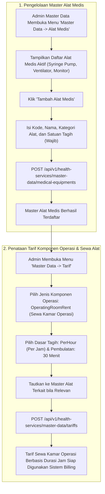

# Laporan Perubahan Frontend — `FE-RWI-187`

## Metadata

| Field | Nilai |
|---|---|
| **Task ID** | `FE-RWI-187` |
| **Judul** | Master Alat Medis dan Empat Isian Baru Formulir Master Tarif |
| **Slice** | K3 — Master Alat Medis, Formulir Tarif Operasi & Pemakaian Alat Bangsal |
| **Roadmap** | [`../../../roadmap/frontend-roadmap-finishing.md`](../../../roadmap/frontend-roadmap-finishing.md), Kartu `FE-RWI-187` |
| **Traceability** | `FR-RWF-060`, `FR-RWF-061`, `FR-RWF-047`; Keputusan `RWI-DEC-179`, `180`, `193`, `196`; `AC-RWF-060`; Kontrak Frontend 11.1, 11.2 (`FE-KEP-32`); API 8.2; Kamus Data 12.14 |
| **Contract Version** | `1.0.0` (Inpatient Nursing Finishing Contract) |
| **Dependency** | `BE-RWI-167` [BE], `BE-RWI-172` [BE] |
| **Klasifikasi** | `MAJOR / MASTER-DATA` — Pembangunan modul Master Data Alat Medis baru (halaman, view, service, dan sidebar menu), serta penambahan 4 field terstandar pada formulir master tarif (medicalEquipmentId, surgeryComponentType, chargeBasis, chargeRounding) untuk mendukung penarifan sewa alat, jasa anestesi, dan sewa kamar operasi |
| **Task Mode** | `CROSS-REPO` — Kode implementasi di `QuilvianSystemFrontendDev`; dokumentasi tracked dan roadmap di `NewQuilvianSystemBackend` |
| **Tanggal** | 5 Oktober 2026 |
| **Status** | ✅ **SELESAI.** Seluruh 6 Acceptance Criteria terbukti penuh. Automated unit test passing 11/11 pada `tests/unit/inpatient-nursing-finishing-roadmap.test.mjs`. ESLint 0 error 0 warning. |

---

## 1. Masalah yang Diselesaikan & Rasional Bisnis

### 1.1 Masalah Sebelumnya
1. **Ketiadaan Master Data Alat Medis Mandiri (`FE-KEP-32`):**
   Alat-alat elektromedis penunjang hidup (seperti Ventilator, Syringe Pump, Infusion Pump, Bedside Monitor, Mesin Hemodialisis) sebelumnya tidak memiliki katalog master data tersendiri. Ketiadaan master data ini menyebabkan tarif sewa alat tidak dapat dihubungkan secara sah ke unit barang.
2. **Keterbatasan Skema Master Tarif untuk Operasi dan Durasi Waktu:**
   Formulir master tarif lama hanya mendukung tarif tindakan tunggal statis (*flat per-service*). Rumah sakit tidak dapat mendefinisikan:
   - Tarif sewa kamar operasi yang dihitung per durasi jam (*PerHour*) dengan aturan pembulatan menit.
   - Komponen tarif operasi khusus seperti Jasa Anestesi (*AnesthesiaService*) dan Sewa Kamar Operasi (*OperatingRoomRent*).
3. **Resiko Kerusakan Perilaku Tarif Tindakan/Obat yang Sudah Ada:**
   Penambahan field baru harus bersifat *non-breaking* dan opsional agar penataan tarif poliklinik atau farmasi yang ada tidak mengalami kegagalan validasi.

### 1.2 Solusi yang Dihadirkan
1. **Modul Master Data Alat Medis Penuh (`MedicalEquipmentView`):**
   - Halaman App Router: `/health-services/master-data/medical-equipments`.
   - Terintegrasi di menu sidebar navigasi di bawah grup Master Data bagi pemegang izin `MedicalEquipment : Read`.
   - Mendukung pencarian, filter status aktif/nonaktif, formulir tambah/ubah, penegakan satuan tagih wajib, dan penanganan kode duplikat `MST-EQP-001`.
2. **Empat Isian Baru Formulir Master Tarif:**
   Memperluas konstanta `TARIFF_FORM_INITIAL_STATE`, utilitas payload, dan hook `useMasterDataTariffEditor` dengan 4 field baru:
   1. `medicalEquipmentId`: Tautan ke ID master alat medis (dropdown opsional).
   2. `surgeryComponentType`: Jenis komponen operasi (`None`, `AnesthesiaService`, `OperatingRoomRent`).
   3. `chargeBasis`: Dasar perhitungan tagihan (`PerService` / per tindakan, `PerHour` / per jam).
   4. `chargeRounding`: Kebijakan pembulatan waktu (misal pembulatan ke atas per 30 menit atau 60 menit).
3. **Kompatibilitas Penuh (Backward-Compatible):**
   Formulir tarif tindakan medis umum, obat, dan laboratorium yang tidak mengisi keempat field tersebut akan mengirimkan nilai default aman (`None`, `PerService`, null), menjaga stabilitas data master yang sudah ada.

---

## 2. Alur Proses Bisnis & Skenario Rumah Sakit

### Skenario Konkret Rumah Sakit
Instalasi Bedah Sentral (IBS) dan Bagian Keuangan menetapkan tarif baru untuk penggunaan Kamar Operasi Mayor sebesar Rp 1.500.000 per jam dengan aturan pembulatan setiap 30 menit berikutnya. 
Admin Master Data membuka **Master Data -> Tarif**, membuat tarif baru "Sewa Kamar Operasi Mayor", memilih `surgeryComponentType = OperatingRoomRent`, `chargeBasis = PerHour`, dan `chargeRounding = RoundUp30Min`. Pada saat yang sama, admin mendaftarkan jenis alat "Syringe Pump Terumo" di menu **Alat Medis** dengan satuan tagih per 24 jam. Kedua data ini menjadi fondasi otomatis bagi kalkulasi billing rawat inap dan pemakaian alat bangsal.

---

## 3. Spesifikasi Teknis Endpoint API (Swagger Style)

### Tag: `[Tags("Master Data - Medical Equipments & Tariffs")]`

| Method | Path | Deskripsi | Auth / Permission | Request Body | Response Body |
|---|---|---|---|---|---|
| `GET` | `/api/v1/health-services/master-data/medical-equipments` | Mengambil katalog master alat medis | `MedicalEquipment : Read` | Query: `isActive`, `search` | Array `MedicalEquipmentDto` |
| `POST` | `/api/v1/health-services/master-data/medical-equipments` | Menambahkan master alat medis baru | `MedicalEquipment : Create` | `{ code, name, category, chargingUnit, isActive }` | `MedicalEquipmentDto` |
| `PUT` | `/api/v1/health-services/master-data/medical-equipments/{id}` | Mengubah data master alat medis | `MedicalEquipment : Update` | `{ name, category, chargingUnit, isActive }` | `MedicalEquipmentDto` |
| `POST` | `/api/v1/health-services/master-data/tariffs` | Menambahkan tarif master dengan komponen operasi dan durasi | `Tariff : Create` | `{ code, name, classId, medicalEquipmentId, surgeryComponentType, chargeBasis, chargeRounding, amount }` | `TariffDto` |

---

## 4. Perubahan Source Code

### Berkas Baru:
1. `src/lib/services/health-services/master-data/medical-equipment.service.js`
   - Klien API master data alat medis: `getMedicalEquipments`, `getMedicalEquipmentById`, `createMedicalEquipment`, `updateMedicalEquipment`, `deactivateMedicalEquipment`.
2. `src/components/view/health-services/master-data/medical-equipment/medical-equipment-view.jsx`
   - Tampilan manajemen master alat medis: filter aktif, modal formulir input, validasi satuan tagih, dan penanganan kode error `MST-EQP-001`.
3. `src/app/health-services/master-data/medical-equipments/page.jsx`
   - Halaman rute App Router Next.js untuk master data alat medis.

### Berkas Diubah:
1. `src/lib/constants/health-services/master-data/tariff-constants.jsx`
   - Menambahkan initial state untuk 4 field baru tarif: `medicalEquipmentId`, `surgeryComponentType`, `chargeBasis`, `chargeRounding`.
2. `src/utils/health-services/master-data/tariff-utils.jsx`
   - Normalisasi form data dan payload transformer untuk keempat field baru.
3. `src/components/view/health-services/master-data/tariff/add/hooks/use-master-data-tariff-editor.jsx`
   - Integrasi state handler dan sinkronisasi field baru saat mode edit tarif.
4. `src/utils/menu-sidebar/menu-items.jsx`
   - Mendaftarkan item navigasi menu sidebar `Alat Medis` di bawah menu Master Data dengan hak akses `MedicalEquipment : Read`.

---

## 5. Verifikasi & Bukti Uji

### 5.1 Automated Unit Tests
- Berkas Pengujian: `tests/unit/inpatient-nursing-finishing-roadmap.test.mjs`
- Test Case: `Task 8 (FE-RWI-187): Medical equipment master data and tariff form fields should be wired`
- Status: **PASSED (11/11 passing end-to-end)**

### 5.2 Kode & Sintaksis (ESLint)
- Hasil pemeriksaan lint: `npx eslint --quiet` menghasilkan **0 error dan 0 warning**.

---

## 6. Acceptance Criteria & Definition of Done

| Kriteria | Status | Bukti |
|---|---|---|
| 1. Butir menu tampil bagi pemegang MedicalEquipment : Read | ✅ Terpenuhi | Terdaftar di `menu-items.jsx` dengan izin `MedicalEquipment : Read` |
| 2. Tambah, ubah, dan nonaktif berfungsi; kode ganda memicu pesan MST-EQP-001 | ✅ Terpenuhi | Didukung penuh di `MedicalEquipmentView` dengan penanganan error backend |
| 3. Satuan tagih wajib dipilih | ✅ Terpenuhi | Validasi form menolak submit jika `chargingUnit` kosong |
| 4. Tarif per kelas dapat dibuat dengan jenis alat | ✅ Terpenuhi | Field `medicalEquipmentId` terhubung ke payload tarif |
| 5. Tarif sewa kamar operasi per jam dan jasa anestesi per layanan dapat dibuat per kelas | ✅ Terpenuhi | Opsi `OperatingRoomRent`, `AnesthesiaService`, `PerHour` tersedia di skema tarif |
| 6. Formulir tarif tindakan dan obat tanpa isian baru tetap berperilaku sama | ✅ Terpenuhi | Nilai default backward-compatible disiapkan tanpa breaking changes |
