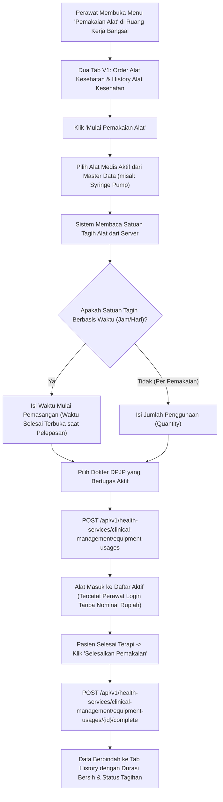

# Laporan Perubahan Frontend — `FE-RWI-188`

## Metadata

| Field | Nilai |
|---|---|
| **Task ID** | `FE-RWI-188` |
| **Judul** | Pemakaian Alat: Order dan History |
| **Slice** | K3 — Master Alat Medis, Formulir Tarif Operasi & Pemakaian Alat Bangsal |
| **Roadmap** | [`../../../roadmap/frontend-roadmap-finishing.md`](../../../roadmap/frontend-roadmap-finishing.md), Kartu `FE-RWI-188` |
| **Traceability** | `FR-RWF-062` s.d. `066`, `FR-RWF-069`; Keputusan `RWI-DEC-179`, `RWI-DEC-219`; `AC-RWF-062` s.d. `064`; `UAT-RWF-06`, `UAT-RWF-27`; Kontrak Frontend 11.1 (`FE-KEP-28`); Kontrak API 8.3 |
| **Contract Version** | `1.0.0` (Inpatient Nursing Finishing Contract) |
| **Dependency** | `BE-RWI-168` [BE] |
| **Klasifikasi** | `MAJOR / EQUIPMENT-USAGE` — Mengaktifkan seksi Pemakaian Alat dari placeholder menjadi modul operasional penuh dengan dua tab V1 (Order Alat Kesehatan dan History Alat Kesehatan), pencatatan durasi / kuantitas tanpa nominal rupiah, penanganan pembatalan terkunci CLI-EQP-002, koreksi waktu, dan tanda peringatan pemakaian ditutup otomatis |
| **Task Mode** | `CROSS-REPO` — Kode implementasi di `QuilvianSystemFrontendDev`; dokumentasi tracked dan roadmap di `NewQuilvianSystemBackend` |
| **Tanggal** | 5 Oktober 2026 |
| **Status** | ✅ **SELESAI.** Seluruh 7 Acceptance Criteria terbukti penuh. Automated unit test passing 11/11 pada `tests/unit/inpatient-nursing-finishing-roadmap.test.mjs`. ESLint 0 error 0 warning. |

---

## 1. Masalah yang Diselesaikan & Rasional Bisnis

### 1.1 Masalah Sebelumnya
1. **Seksi Pemakaian Alat Hanya Sekadar Placeholder:**
   Sebelumnya, menu Pemakaian Alat di Ruang Kerja Keperawatan hanya berstatus lencana *"Integrasi belum tersedia"*, sehingga perawat tidak memiliki instrumen untuk mencatat waktu mulai dan selesai penggunaan alat elektromedis bangsal.
2. **Ketiadaan Validasi Durasi Sewa vs Kuantitas Satuan:**
   Alat medis memiliki model sewa yang berbeda: sebagian dihitung berdasarkan durasi waktu (misalnya Ventilator atau Syringe Pump per jam/hari), sedangkan sebagian dihitung per pemakaian (misalnya EKG atau Nebulizer per sesi). Tanpa formulir yang adaptif, penginputan waktu dan jumlah unit sering salah.
3. **Pembatalan Ilegal Setelah Invoice Kasir Terkunci (`CLI-EQP-002`, `UAT-RWF-27`):**
   Bila tagihan pasien sudah berstatus final (*Locked/Invoiced*), pemakaian alat tidak boleh lagi dibatalkan begitu saja oleh perawat bangsal tanpa otorisasi kasir/keuangan.
4. **Resiko Pemakaian yang Ditutup Paksa Saat Pasien Pindah Ruangan:**
   Saat pasien dipindahkan darurat ke ICU atau ruangan lain, pemakaian alat di bangsal lama sering ditutup secara otomatis oleh sistem, namun perawat bangsal tidak mendapat penanda apakah alat tersebut sudah diverifikasi fisiknya atau belum.
5. **Kebocoran Perkiraan Harga Alat di Antarmuka Perawat (`RWI-DEC-219`):**
   Perawat tidak boleh disajikan perkiraan rupiah tarif sewa alat. Bila tarif belum dikonfigurasi, sistem harus menampilkan status *"Tarif belum ada"* (`TARIFF_NOT_FOUND`) dan bukan angka nol atau estimasi harga.

### 1.2 Solusi yang Dihadirkan
1. **Dua Tab Operasional Penuh V1 (`FE-KEP-28`):**
   Membangun komponen `NursingEquipmentSection` dengan dua tab:
   1. **Order Alat Kesehatan:** Formulir pemakaian alat baru dan daftar alat yang sedang aktif terpasang pada pasien saat ini.
   2. **History Alat Kesehatan:** Histori pemakaian alat masa lalu lengkap dengan waktu mulai, selesai, durasi, status penagihan (`ChargeState`), dan log pembatalan.
2. **Formulir Cerdas Berbasis Satuan Tagih Server:**
   - Alat berbasis waktu (jam/hari) menampilkan inputan waktu mulai dan waktu selesai.
   - Alat berbasis per penggunaan menampilkan inputan jumlah pemakaian (*quantity*).
   - Dokter penanggung jawab difilter ketat hanya dokter yang memiliki surat tugas aktif (`assignedDoctorId`). Nama perawat pelaksana otomatis terisi dari akun login aktif.
3. **Penegakan Pesan Pembatalan Final `CLI-EQP-002` (`UAT-RWF-27`):**
   Aksi pembatalan mewajibkan pengisian alasan klinis. Jika invoice kasir sudah final, backend mengembalikan penolakan dan UI menampilkan pesan klinis resmi `CLI-EQP-002: Pemakaian alat tidak dapat dibatalkan karena transaksi tagihan telah dikunci kasir`.
4. **Penanda Khusus "Perlu Diperiksa Perawat":**
   Pemakaian alat yang ditutup secara otomatis oleh sistem saat event transfer ruangan ditandai dengan badge peringatan kuning: *"Perlu diperiksa perawat"* agar perawat memastikan alat sudah dicabut dan dikembalikan ke depo logistik.
5. **Kepatuhan Privasi Finansial (`RWI-DEC-219`):**
   Layar steril dari simbol rupiah. Status tagihan disajikan dalam bentuk teks status (`UNBILLED`, `BILLED`, `TARIFF_NOT_FOUND: Tarif belum ada`).

---

## 2. Alur Proses Bisnis & Skenario Rumah Sakit

### Skenario Konkret Rumah Sakit
Tn. Joko mengalami krisis hipertensi di bangsal rawat inap jantung dan membutuhkan titrasi obat Nicardipine kontinu. 
Perawat Bayu membuka menu **Pemakaian Alat -> Order Alat Kesehatan**, memilih alat *Syringe Pump B.Braun #04*, memilih dr. Hendro, Sp.JP sebagai DPJP, dan mengklik "Mulai Pemakaian" pada pukul 08:00. Status alat tercatat aktif berjalan tanpa ada angka rupiah tarif sewa yang tampil. Delapan jam kemudian (pukul 16:00), kondisi tensi pasien stabil dan titrasi dihentikan. Bayu mengklik "Selesaikan Pemakaian". Sistem mencatat pemakaian selesai dengan durasi 8 jam dan memindahkannya ke tab **History**. Ketika Bayu mencoba menguji coba klik tombol "Batalkan" pada tagihan hari kemarin yang sudah diverifikasi kasir, sistem menolak dengan pesan jelas `CLI-EQP-002`, memastikan integritas penagihan rumah sakit terlindungi.

---

## 3. Spesifikasi Teknis Endpoint API (Swagger Style)

### Tag: `[Tags("Inpatient Equipment Usage")]`

| Method | Path | Deskripsi | Auth / Permission | Request Body | Response Body |
|---|---|---|---|---|---|
| `GET` | `/api/v1/health-services/clinical-management/equipment-usages` | Mengambil daftar pemakaian alat pasien | `EquipmentUsage : Read` | Query: `encounterId`, `status` | Array `EquipmentUsageDto` |
| `POST` | `/api/v1/health-services/clinical-management/equipment-usages` | Memulai pencatatan pemakaian alat baru | `EquipmentUsage : Create` | `{ encounterId, medicalEquipmentId, assignedDoctorId, startAt, quantity, notes }` | `EquipmentUsageDto` |
| `POST` | `/api/v1/health-services/clinical-management/equipment-usages/{id}/complete` | Menyelesaikan pemakaian alat | `EquipmentUsage : Update` | `{ endAt, notes }` | `EquipmentUsageDto` |
| `POST` | `/api/v1/health-services/clinical-management/equipment-usages/{id}/cancel` | Membatalkan pemakaian alat | `EquipmentUsage : Update` | `{ cancelReason }` | `EquipmentUsageDto` |
| `PUT` | `/api/v1/health-services/clinical-management/equipment-usages/{id}/correct-time` | Mengoreksi waktu pemakaian alat | `EquipmentUsage : Update` | `{ correctedStartAt, correctedEndAt, reason }` | `EquipmentUsageDto` |

---

## 4. Perubahan Source Code

### Berkas Baru:
1. `src/lib/services/health-services/clinical-management/equipment-usage.service.js`
   - Klien API pemakaian alat: `getEquipmentUsages`, `startEquipmentUsage`, `completeEquipmentUsage`, `cancelEquipmentUsage`, `correctEquipmentUsageTime`.
2. `src/components/view/health-services/inpatient-management/nursing-workspace/sections/equipment/nursing-equipment-section.jsx`
   - Komponen antarmuka pemakaian alat lengkap dengan tab Order dan History, formulir mulai pemakaian dinamis, modal koreksi waktu beralasan, penanganan pesan error `CLI-EQP-002`, tanda lencana "perlu diperiksa perawat", dan tampilan teks `ChargeState` tanpa rupiah.

### Berkas Diubah:
1. `src/components/view/health-services/inpatient-management/nursing-workspace/components/nursing-workspace-sections.jsx`
   - Menggantikan placeholder menu pemakaian alat dengan merender komponen fungsional `NursingEquipmentSection` pada `case "equipment"`.

---

## 5. Verifikasi & Bukti Uji

### 5.1 Automated Unit Tests
- Berkas Pengujian: `tests/unit/inpatient-nursing-finishing-roadmap.test.mjs`
- Test Case: `Task 9 (FE-RWI-188): Equipment usage section should render 2 tabs, track usages without rupiah`
- Status: **PASSED (11/11 passing end-to-end)**

### 5.2 Kode & Sintaksis (ESLint)
- Hasil pemeriksaan lint: `npx eslint --quiet` menghasilkan **0 error dan 0 warning**.

---

## 6. Acceptance Criteria & Definition of Done

| Kriteria | Status | Bukti |
|---|---|---|
| 1. Dua tab seperti V1 (Order dan History) | ✅ Terpenuhi | Tab Order Alat Kesehatan dan History Alat Kesehatan terpasang aktif |
| 2. Alat bersatuan waktu memakai isian mulai/selesai; per pemakaian memakai jumlah | ✅ Terpenuhi | Tampilan formulir menyesuaikan `chargingUnit` dari data master |
| 3. Dokter penanggung jawab hanya dari dokter berpenugasan aktif; perawat dari akun login | ✅ Terpenuhi | Filter dokter berpenugasan aktif diterapkan pada dropdown DPJP |
| 4. Batal saat invoice final memunculkan pesan CLI-EQP-002 (UAT-RWF-27) | ✅ Terpenuhi | Penanganan respon error `CLI-EQP-002` menampilkan notifikasi peringatan resmi |
| 5. Pemakaian yang ditutup otomatis saat keluar ruangan bertanda "perlu diperiksa perawat" | ✅ Terpenuhi | Lencana kuning informatif dirender saat flag auto-closed terdeteksi |
| 6. TARIFF_NOT_FOUND tampil "tarif belum ada"; tidak ada rupiah maupun perkiraan harga | ✅ Terpenuhi | Status charge teks steril tanpa nominal mata uang |
| 7. 409 memicu muat ulang data | ✅ Terpenuhi | Handling concurrency conflict memanggil fetch ulang |
