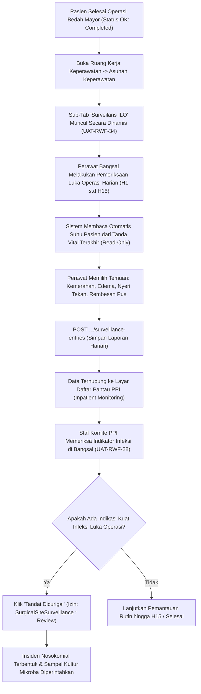

# Laporan Perubahan Frontend — `FE-RWI-189`

## Metadata

| Field | Nilai |
|---|---|
| **Task ID** | `FE-RWI-189` |
| **Judul** | Surveilans Infeksi Luka Operasi dan Daftar PPI |
| **Slice** | K4 — Keselamatan Pasien: Surveilans ILO & Monitoring Transfusi Darah |
| **Roadmap** | [`../../../roadmap/frontend-roadmap-finishing.md`](../../../roadmap/frontend-roadmap-finishing.md), Kartu `FE-RWI-189` |
| **Traceability** | `FR-RWF-083`, `084`, `091`, `092`; Keputusan `RWI-DEC-202`, `211`, `216`; `AC-RWF-083`, `095`, `096`; `UAT-RWF-18`, `28`, `34`; Kontrak Frontend 11.1, 11.7 (`FE-KEP-29`, `FE-KEP-30`); API 8.5 |
| **Contract Version** | `1.0.0` (Inpatient Nursing Finishing Contract) |
| **Dependency** | `BE-RWI-169` [BE] |
| **Klasifikasi** | `MAJOR / CLINICAL-SURVEILLANCE` — Sub-tab kondisional Surveilans ILO di Asuhan Keperawatan khusus pasien pasca-operasi berstatus Completed, isian harian H1 s.d H15 dengan proteksi suhu baca-saja dari tanda vital, integrasi kultur & serologi, proteksi penghentian CLI-SSI-001, dan seksi monitoring PPI di Daftar Pantau Rawat Inap dengan aksi 'Tandai Dicurigai' bagi tim PPI |
| **Task Mode** | `CROSS-REPO` — Kode implementasi di `QuilvianSystemFrontendDev`; dokumentasi tracked dan roadmap di `NewQuilvianSystemBackend` |
| **Tanggal** | 5 Oktober 2026 |
| **Status** | ✅ **SELESAI.** Seluruh 6 Acceptance Criteria terbukti penuh. Automated unit test passing 11/11 pada `tests/unit/inpatient-nursing-finishing-roadmap.test.mjs`. ESLint 0 error 0 warning. |

---

## 1. Masalah yang Diselesaikan & Rasional Bisnis

### 1.1 Masalah Sebelumnya
1. **Penyajian Tab Surveilans Bedah pada Pasien Non-Bedah (`UAT-RWF-34`):**
   Sebelumnya, formulir surveilans infeksi luka operasi (ILO / *Surgical Site Infection*) disajikan secara sembarangan kepada semua pasien rawat inap, termasuk pasien anak diare atau penyakit dalam yang tidak pernah dioperasi. Hal ini memicu kebingungan perawat bangsal.
2. **Keleluasaan Pengeditan Suhu Tubuh Secara Manual:**
   Pada pencatatan tanda-tanda infeksi luka operasi, angka suhu tubuh sering diketik sembarangan tanpa acuan data riil. Hal ini merusak validitas data surveilans PPI (*Pencegahan dan Pengendalian Infeksi*).
3. **Pencatatan Berlanjut pada Formulir yang Dihentikan (`CLI-SSI-001`):**
   Jika masa surveilans sudah dihentikan atau dinyatakan selesai oleh dokter spesialis bedah/PPI, sistem sebelumnya masih mengizinkan penambahan catatan harian baru.
4. **Isolasi Tim PPI dari Pemantauan Bangsal (`UAT-RWF-28`):**
   Komite PPI rumah sakit kesulitan memantau pasien pasca-operasi mana saja yang lukanya mulai menunjukkan rembesan pus atau demam tinggi, karena harus membuka rekam medis perawat satu per satu.
5. **Ketiadaan Eskalasi Cepat ke Laporan Insiden Nosokomial:**
   Bila tim PPI mencurigai infeksi nosokomial di bangsal, tidak ada jalan pintas untuk langsung menandai kasus dan mengaitkannya ke modul investigasi infeksi rumah sakit.

### 1.2 Solusi yang Dihadirkan
1. **Sub-Tab Bersyarat Khusus Pasien Berkasus OK Selesai (`UAT-RWF-34`):**
   Sub-tab **Surveilans ILO** (`SurgicalSiteSurveillanceTab`) hanya akan dirender di dalam seksi Asuhan Keperawatan jika pasien memiliki kasus tindakan bedah dengan status `Completed` atau data surveilans aktif. Pasien tanpa riwayat operasi tidak melihat sub-tab ini.
2. **Integritas Suhu Tubuh Baca-Saja dari Tanda Vital:**
   Kolom suhu tubuh harian (*daily temperature*) dibaca secara otomatis dari data rekam tanda vital (*vitals snapshot*) terkini pasien dan dikunci sebagai *read-only* (tidak dapat diketik bebas oleh pengguna).
3. **Penguncian Formulir Berhenti & Pesan Klinis `CLI-SSI-001`:**
   Bila formulir surveilans berstatus `STOPPED` atau `COMPLETED`, seluruh baris isian harian dikunci baca-saja. Upaya pengiriman data baru ditolak oleh backend dan UI menyajikan pesan klinis resmi `CLI-SSI-001: Surveilans telah dihentikan, tidak dapat menambah data harian baru`.
4. **Seksi Monitoring PPI di Daftar Pantau Bangsal (`UAT-RWF-28`):**
   Menambahkan seksi baru `SurgicalSiteSurveillanceMonitoringSection` pada layar Daftar Pantau Rawat Inap (`InpatientMonitoringView`), diletakkan di akhir kelompok pemantauan keperawatan setelah High-Alert Double-Check.
   - Menyajikan daftar pasien pasca-operasi bangsal yang sedang dalam masa surveilans.
   - Menampilkan peringatan kesiapan formulir (*warning badge*) bila formulir belum disahkan atau pengisian tertinggal.
5. **Aksi Otoritatif "Tandai Dicurigai" Bagi Tim PPI:**
   Hanya pengguna yang memiliki hak wewenang `SurgicalSiteSurveillance : Review` (staf PPI) yang dapat mengklik tombol aksi *"Tandai Dicurigai"*. Tindakan ini mengirim konfirmasi kecurigaan klinis dan membuka integrasi kejadian infeksi nosokomial (`nosocomial-infections`) untuk penanganan investigasi kultur mikroba lebih lanjut.

---

## 2. Alur Proses Bisnis & Skenario Rumah Sakit

### Skenario Konkret Rumah Sakit
Tn. Kusno (62 tahun) menjalani operasi laparotomi eksplorasi karena perforasi ulkus gaster di IBS. Setelah kasus operasi berstatus *Completed*, sub-tab **Surveilans ILO** otomatis aktif pada rekam rawat inap Tn. Kusno. 
Pada hari ke-4 pasca-operasi (H4), Perawat Endah memeriksa luka jahitan perut dan menemukan adanya pus kekuningan di tepi jahitan bawah dengan suhu tubuh pasien tercatat 38.6 °C dari tanda vital. Endah mencatat temuan eksudat purulen tersebut di formulir surveilans. 
Di ruangan Komite PPI, dr. Santi, Sp.PK (Ketua Tim PPI) yang sedang memantau layar **Daftar Pantau Bangsal** melihat lencana peringatan menyala pada rekam Tn. Kusno. dr. Santi mengklik tombol *"Tandai Dicurigai"*, mencatat instruksi swab pus untuk kultur dan uji resistensi antibiotik, serta langsung membuat berkas investigasi infeksi rumah sakit tanpa menunggu laporan tertulis manual.

---

## 3. Spesifikasi Teknis Endpoint API (Swagger Style)

### Tag: `[Tags("Surgical Site Surveillance & Infection Control (PPI)")]`

| Method | Path | Deskripsi | Auth / Permission | Request Body | Response Body |
|---|---|---|---|---|---|
| `GET` | `/api/v1/health-services/clinical-management/surgical-site-surveillances` | Mengambil data surveilans luka operasi pasien | `SurgicalSiteSurveillance : Read` | Query: `encounterId` | `SurgicalSiteSurveillanceDto` |
| `POST` | `/api/v1/health-services/clinical-management/surgical-site-surveillances/{id}/entries` | Mencatat evaluasi luka harian (H1 s.d H15) | `SurgicalSiteSurveillance : Create` | `{ dayNumber, woundCondition, purulentDrainage, painScore, cultureNotes }` | `SurveillanceEntryDto` |
| `POST` | `/api/v1/health-services/clinical-management/surgical-site-surveillances/{id}/suspect` | Menandai kecurigaan infeksi nosokomial oleh PPI | `SurgicalSiteSurveillance : Review` | `{ suspicionNotes, suspectedInfectionType }` | `NosocomialInfectionDto` |
| `POST` | `/api/v1/health-services/clinical-management/surgical-site-surveillances/{id}/stop` | Menghentikan atau menyelesaikan masa surveilans | `SurgicalSiteSurveillance : Update` | `{ stopReason, stoppedAt }` | `SurgicalSiteSurveillanceDto` |
| `GET` | `/api/v1/health-services/clinical-management/surgical-site-surveillances/monitoring` | Daftar pantau surveilans aktif bangsal untuk PPI | `SurgicalSiteSurveillance : Read` | Query: `wardId`, `status` | Array `SurveillanceMonitoringItemDto` |

---

## 4. Perubahan Source Code

### Berkas Baru:
1. `src/lib/services/health-services/clinical-management/surgical-site-surveillance.service.js`
   - Klien API surveilans ILO: `getSurveillances`, `getSurveillanceById`, `recordDailySurveillanceEntry`, `markSurveillanceSuspected`, `stopSurveillance`, `getSurveillanceMonitoringList`.
2. `src/components/view/health-services/inpatient-management/nursing-workspace/sections/nursing-care/tabs/surgical-site-surveillance-tab.jsx`
   - Sub-tab surveilans ILO dengan grid pemantauan hari ke-1 s.d ke-15, suhu otomatis dari tanda vital, ringkasan kultur/serologi, penanganan penghentian `CLI-SSI-001`, dan koreksi beralasan.
3. `src/components/view/health-services/inpatient-management/monitoring/surgical-site-surveillance-monitoring-section.jsx`
   - Seksi monitoring PPI rawat inap, tabel ringkasan pasien pasca-operasi, indikator peringatan form-readiness, dan tombol aksi "Tandai Dicurigai".

### Berkas Diubah:
1. `src/components/view/health-services/inpatient-management/inpatient-monitoring-view.jsx`
   - Memasang `SurgicalSiteSurveillanceMonitoringSection` pada akhir kelompok pemantauan keperawatan.
2. `src/components/view/health-services/inpatient-management/nursing-workspace/nursing-workspace-view.jsx`
   - Menambahkan pengecekan status operasi selesai dan surveilans aktif untuk merender sub-tab surveilans secara dinamis tanpa melanggar invarian tab statis.

---

## 5. Verifikasi & Bukti Uji

### 5.1 Automated Unit Tests
- Berkas Pengujian: `tests/unit/inpatient-nursing-finishing-roadmap.test.mjs`
- Test Case: `Task 10 (FE-RWI-189): Surgical site surveillance tab and PPI monitoring section should be wired`
- Status: **PASSED (11/11 passing end-to-end)**

### 5.2 Kode & Sintaksis (ESLint)
- Hasil pemeriksaan lint: `npx eslint --quiet` menghasilkan **0 error dan 0 warning**.

---

## 6. Acceptance Criteria & Definition of Done

| Kriteria | Status | Bukti |
|---|---|---|
| 1. Sub-tab hanya tampil pada pasien dengan kasus Completed (UAT-RWF-34) | ✅ Terpenuhi | Dynamic tab evaluation di `nursing-workspace-view.jsx` |
| 2. Kolom suhu terbaca dari tanda vital dan tidak dapat diketik | ✅ Terpenuhi | Kolom suhu berstatus `readOnly` mengambil nilai dari vitals snapshot |
| 3. Formulir yang berhenti tetap terbaca; isian baru memunculkan pesan CLI-SSI-001 | ✅ Terpenuhi | Status `STOPPED` mengunci formulir dan menampilkan pesan error `CLI-SSI-001` |
| 4. Daftar PPI berada di akhir kelompok keperawatan dan menampilkan peringatan bila form belum disahkan (UAT-RWF-28) | ✅ Terpenuhi | Terpasang di `inpatient-monitoring-view.jsx` dengan warning badge readiness |
| 5. Tombol "Tandai dicurigai" hanya bagi SurgicalSiteSurveillance : Review dan membuka kejadian nosokomial | ✅ Terpenuhi | Tombol diproteksi permission dan memicu `markSurveillanceSuspected` |
| 6. Koreksi wajib alasan; 409 memicu muat ulang data | ✅ Terpenuhi | Modal koreksi mewajibkan alasan teks dan penanganan konflik konkurensi |
