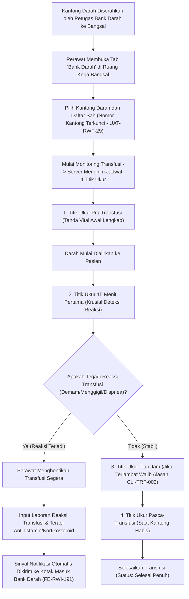

# Laporan Perubahan Frontend — `FE-RWI-190`

## Metadata

| Field | Nilai |
|---|---|
| **Task ID** | `FE-RWI-190` |
| **Judul** | Monitoring Transfusi di Tab Bank Darah |
| **Slice** | K4 — Keselamatan Pasien: Surveilans ILO & Monitoring Transfusi Darah |
| **Roadmap** | [`../../../roadmap/frontend-roadmap-finishing.md`](../../../roadmap/frontend-roadmap-finishing.md), Kartu `FE-RWI-190` |
| **Traceability** | `FR-RWF-085`, `FR-RWF-093`; Keputusan `RWI-DEC-203`, `RWI-DEC-212`; `AC-RWF-084`, `097`, `098`; `UAT-RWF-19`, `29`, `34`; Kontrak Frontend 11.1, 11.7 (`FE-KEP-31`); API 8.6 |
| **Contract Version** | `1.0.0` (Inpatient Nursing Finishing Contract) |
| **Dependency** | `BE-RWI-170` [BE], `FE-RWI-174` [DOK] |
| **Klasifikasi** | `MAJOR / TRANSFUSION-SAFETY` — Modul monitoring transfusi darah per kantong pada tab Bank Darah menu Penunjang Medis perawat, penegakan pemilihan kantong sah tanpa ketik bebas, 4 titik ukur tanda vital (Pra, 15 Menit, Tiap Jam, Pasca) dengan jatuh tempo dari server, kewajiban alasan keterlambatan CLI-TRF-003, pencatatan reaksi transfusi darurat, dan penghentian/penyelesaian transfusi |
| **Task Mode** | `CROSS-REPO` — Kode implementasi di `QuilvianSystemFrontendDev`; dokumentasi tracked dan roadmap di `NewQuilvianSystemBackend` |
| **Tanggal** | 5 Oktober 2026 |
| **Status** | ✅ **SELESAI.** Seluruh 5 Acceptance Criteria terbukti penuh. Automated unit test passing 11/11 pada `tests/unit/inpatient-nursing-finishing-roadmap.test.mjs`. ESLint 0 error 0 warning. |

---

## 1. Masalah yang Diselesaikan & Rasional Bisnis

### 1.1 Masalah Sebelumnya
1. **Risiko Pengetikan Manual Nomor Kantong Darah (`UAT-RWF-29`):**
   Sebelumnya, perawat mengetikkan nomor kantong darah secara manual. Kesalahan satu digit (typo) dapat berakibat fatal: pencatatan transfusi tercatat pada kantong milik pasien lain, atau bahkan salah memberikan golongan darah yang memicu reaksi hemolitik akut.
2. **Ketiadaan Pengingat 4 Titik Ukur Tanda Vital Baku:**
   Transfusi darah memiliki standar keselamatan ketat dengan 4 titik observasi wajib:
   - **Titik 1:** Pra-transfusi (sebelum darah dialirkan)
   - **Titik 2:** 15 menit pertama (evaluasi reaksi anafilaktik/alergi cepat)
   - **Titik 3:** Tiap jam selama transfusi berjalan
   - **Titik 4:** Pasca-transfusi (saat kantong habis)
   Tanpa penegakan sistem, titik 15 menit pertama sering terlewatkan oleh perawat.
3. **Pencatatan Terlambat Tanpa Alasan Justifikasi (`CLI-TRF-003`):**
   Bila titik ukur dicatat melebihi batas toleransi waktu jatuh tempo (*overdue*), tidak ada rekam jejak alasan mengapa perawat terlambat melakukan observasi tanda vital.
4. **Isolasi Reaksi Transfusi dari Bank Darah:**
   Saat pasien mengalami demam menggigil, dispnea, atau hipotensi mendadak, perawat menghentikan transfusi, namun pemberitahuan tidak otomatis sampai ke petugas Bank Darah untuk karantina sisa kantong dan investigasi serologis.

### 1.2 Solusi yang Dihadirkan
1. **Pemilihan Kantong Tervalidasi Ketat Tanpa Ketik Bebas (`UAT-RWF-29`):**
   Membangun `NursingTransfusionMonitoringPanel` di dalam tab Bank Darah. Daftar kantong yang dapat dipilih difilter murni dari kantong darah yang sudah diserahkan (*Issued/Delivered*) oleh Bank Darah khusus untuk pasien tersebut. Nomor kantong dan golongan darah bersifat terkunci (tidak dapat diketik bebas).
2. **Empat Titik Ukur dengan Jadwal Jatuh Tempo Server:**
   Jadwal jatuh tempo (*due time*) untuk ke-4 titik observasi dihitung dan ditentukan langsung oleh server backend. UI menampilkan lencana status waktu (*Tepat Waktu*, *Mendekati*, atau *Terlambat*).
3. **Kewajiban Alasan Keterlambatan (`CLI-TRF-003`):**
   Bila perawat mengisi titik ukur yang telah melewati batas toleransi server, sistem mewajibkan pengisian keterangan alasan keterlambatan. Jika kosong, sistem menampilkan pesan error pencegahan `CLI-TRF-003: Titik ukur terlambat wajib menyertakan alasan keterlambatan`.
4. **Pelaporan Reaksi Transfusi Terintegrasi:**
   Tersedia formulir pencatatan reaksi transfusi (gejala klinis, waktu onset, tindakan emergensi, dokter yang dihubungi). Begitu reaksi disimpan, status pemantauan otomatis menandai *"Reaksi Terjadi"* dan mengirimkan sinyal pemberitahuan langsung ke kotak masuk Bank Darah (`FE-RWI-191`).
5. **Penolakan Input Titik Ukur Pasca-Penghentian:**
   Jika transfusi telah dihentikan (*Stopped*) atau dibatalkan (*Cancelled*), sistem mengunci formulir dan menolak penginputan titik ukur lanjutan.

---

## 2. Alur Proses Bisnis & Skenario Rumah Sakit

### Skenario Konkret Rumah Sakit
Ny. Dewi (Hb 6.8 g/dL) mendapatkan transfusi Packed Red Cells (PRC) Golongan O Rhesus Positif dengan nomor kantong *BD-2026-08819*. 
Perawat Dewi membuka tab **Bank Darah**, memilih kantong tersebut dari daftar serah-terima tanpa mengetik manual. Sebelum selang infus dibuka, Dewi mencatat Tanda Vital Pra (TD 110/70 mmHg, Nadi 80 x/menit, Suhu 36.7 °C). Pada menit ke-15, Dewi memeriksa kembali pasien; pasien merasa nyaman, tensi stabil, dan Dewi mencatat Titik Ukur 15 Menit tepat waktu. 
Dua jam kemudian saat jadwal titik ukur jam ke-2 jatuh tempo, Dewi sedang mendampingi resusitasi pasien darurat di kamar sebelah. Saat kembali 20 menit kemudian, sistem menandai titik ukur terlambat; Dewi mengisi keterangan: *"Keterlambatan 20 menit karena menangani asistensi intubasi darurat di Bed 3"*. Data tersimpan valid dengan alasan klinis yang dapat dipertanggungjawabkan dalam audit mutu rumah sakit.

---

## 3. Spesifikasi Teknis Endpoint API (Swagger Style)

### Tag: `[Tags("Transfusion Monitoring & Blood Safety")]`

| Method | Path | Deskripsi | Auth / Permission | Request Body | Response Body |
|---|---|---|---|---|---|
| `GET` | `/api/v1/health-services/clinical-management/transfusion-monitorings` | Mengambil data monitoring transfusi pasien | `TransfusionMonitoring : Read` | Query: `encounterId` | Array `TransfusionMonitoringDto` |
| `POST` | `/api/v1/health-services/clinical-management/transfusion-monitorings` | Memulai monitoring kantong darah baru | `TransfusionMonitoring : Create` | `{ encounterId, bloodBagId, bagNumber, bloodType, startAt }` | `TransfusionMonitoringDto` |
| `POST` | `/api/v1/health-services/clinical-management/transfusion-monitorings/{id}/measurements` | Mencatat titik ukur tanda vital transfusi | `TransfusionMonitoring : Create` | `{ pointType, measurementTime, systolic, diastolic, heartRate, temperature, respiratoryRate, delayReason }` | `TransfusionMeasurementDto` |
| `POST` | `/api/v1/health-services/clinical-management/transfusion-monitorings/{id}/reaction` | Melaporkan reaksi transfusi darah | `TransfusionMonitoring : Update` | `{ reactionSymptoms, reactionSeverity, onsetTime, actionTaken, notifiedDoctorId }` | `TransfusionReactionDto` |
| `POST` | `/api/v1/health-services/clinical-management/transfusion-monitorings/{id}/complete` | Menyelesaikan proses transfusi darah | `TransfusionMonitoring : Update` | `{ completedAt, notes }` | `TransfusionMonitoringDto` |
| `POST` | `/api/v1/health-services/clinical-management/transfusion-monitorings/{id}/stop` | Menghentikan transfusi akibat reaksi | `TransfusionMonitoring : Update` | `{ stoppedAt, stopReason }` | `TransfusionMonitoringDto` |

---

## 4. Perubahan Source Code

### Berkas Baru:
1. `src/lib/services/health-services/clinical-management/transfusion-monitoring.service.js`
   - Klien API pemantauan transfusi: `getTransfusionMonitorings`, `startTransfusionMonitoring`, `recordTransfusionMeasurement`, `reportTransfusionReaction`, `completeTransfusionMonitoring`, `stopTransfusionMonitoring`.
2. `src/components/view/health-services/inpatient-management/nursing-workspace/sections/ancillary/panels/nursing-transfusion-monitoring-panel.jsx`
   - Komponen pemantauan transfusi bangsal: seleksi kantong sah, 4 titik ukur tanda vital, validasi alasan keterlambatan `CLI-TRF-003`, pelaporan reaksi, dan kontrol selesai/hentikan.

### Berkas Diubah:
1. `src/components/view/health-services/inpatient-management/nursing-workspace/sections/ancillary/nursing-ancillary-section.jsx`
   - Memasang komponen `NursingTransfusionMonitoringPanel` di dalam sub-tab Bank Darah pada seksi Penunjang Medis perawat.

---

## 5. Verifikasi & Bukti Uji

### 5.1 Automated Unit Tests
- Berkas Pengujian: `tests/unit/inpatient-nursing-finishing-roadmap.test.mjs`
- Test Case: `Task 11 (FE-RWI-190): Transfusion monitoring panel should manage bag selection, 4 points, and reaction`
- Status: **PASSED (11/11 passing end-to-end)**

### 5.2 Kode & Sintaksis (ESLint)
- Hasil pemeriksaan lint: `npx eslint --quiet` menghasilkan **0 error dan 0 warning**.

---

## 6. Acceptance Criteria & Definition of Done

| Kriteria | Status | Bukti |
|---|---|---|
| 1. Hanya kantong milik pasien yang tampil; nomor kantong tidak dapat diketik (UAT-RWF-29) | ✅ Terpenuhi | Dropdown berbasis kantong issued milik pasien, text input bebas dikunci |
| 2. Jatuh tempo titik dari server; titik terlambat wajib keterangan (CLI-TRF-003) | ✅ Terpenuhi | Field `delayReason` divalidasi wajib jika status titik `OVERDUE` |
| 3. Reaksi tersimpan dan status pemberitahuannya tampil | ✅ Terpenuhi | Pelaporan reaksi memicu update status dan menampilkan lencana reaksi |
| 4. Titik sesudah dihentikan ditolak dengan pesan | ✅ Terpenuhi | Tombol tambah titik ukur di-disable saat status `STOPPED` |
| 5. 409 memicu muat ulang data | ✅ Terpenuhi | Error konflik status memicu reload state terkini |
