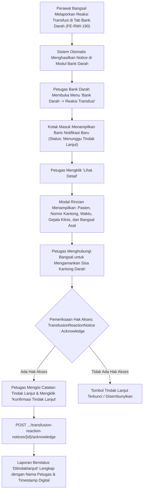

# Laporan Perubahan Frontend — `FE-RWI-191`

## Metadata

| Field | Nilai |
|---|---|
| **Task ID** | `FE-RWI-191` |
| **Judul** | Kotak Masuk Reaksi Transfusi di Bank Darah |
| **Slice** | K4 — Keselamatan Pasien: Surveilans ILO & Monitoring Transfusi Darah |
| **Roadmap** | [`../../../roadmap/frontend-roadmap-finishing.md`](../../../roadmap/frontend-roadmap-finishing.md), Kartu `FE-RWI-191` |
| **Traceability** | `FR-RWF-085`; Keputusan `RWI-DEC-203`, `RWI-DEC-209`; `UAT-RWF-19`; Kontrak Frontend 11.1, 11.2 (`FE-KEP-33`); API 8.7 |
| **Contract Version** | `1.0.0` (Inpatient Nursing Finishing Contract) |
| **Dependency** | `BE-RWI-171` [BE] |
| **Klasifikasi** | `MAJOR / BLOOD-BANK-INBOX` — Modul kotak masuk pemberitahuan reaksi transfusi darah untuk Unit Transfusi Darah / Bank Darah Rumah Sakit, butir menu navigasi baru, tabel daftar dengan saringan status dan rentang tanggal, modal rincian kejadian klinis, dan aksi tindak lanjut (Acknowledge) bagi petugas Bank Darah berwenang |
| **Task Mode** | `CROSS-REPO` — Kode implementasi di `QuilvianSystemFrontendDev`; dokumentasi tracked dan roadmap di `NewQuilvianSystemBackend` |
| **Tanggal** | 5 Oktober 2026 |
| **Status** | ✅ **SELESAI.** Seluruh 4 Acceptance Criteria terbukti penuh. Automated unit test passing 11/11 pada `tests/unit/inpatient-nursing-finishing-roadmap.test.mjs`. ESLint 0 error 0 warning. |

---

## 1. Masalah yang Diselesaikan & Rasional Bisnis

### 1.1 Masalah Sebelumnya
1. **Keterlambatan Komunikasi Reaksi Transfusi ke Bank Darah (`UAT-RWF-19`):**
   Ketika perawat bangsal menghentikan transfusi akibat reaksi alergi atau anafilaksis pasien, informasi tersebut sering kali hanya disampaikan lewat telepon lisan atau lembar formulir manual berhari-hari kemudian. Petugas Bank Darah tidak segera mengetahui bahwa kantong darah dari batch donor tertentu memicu reaksi pada pasien.
2. **Ketiadaan Karantina Cepat Kantong Darah Terkait:**
   Tanpa sistem notifikasi seketika (*real-time notice inbox*), Bank Darah berisiko mengeluarkan kantong darah lain dari donor yang sama (misal komponen trombosit atau plasma beku) kepada pasien lain.
3. **Ketiadaan Bukti Formal Tindak Lanjut (*Acknowledge*):**
   Tidak ada rekaman digital siapa petugas Bank Darah yang menerima laporan reaksi, kapan laporan dibaca, dan apa tindakan penanggulangan laboratorium yang diambil (misalnya uji silang ulang / *crossmatch recheck*, uji Coombs, atau pelaporan ke PMI).

### 1.2 Solusi yang Dihadirkan
1. **Halaman dan Kotak Masuk Resmi Bank Darah (`FE-KEP-33`):**
   - Halaman App Router: `/health-services/blood-bank-management/transfusion-reaction-notices`.
   - Butir menu sidebar navigasi baru di bawah kelompok **Bank Darah** dengan izin akses `TransfusionReactionNotice : Read`.
2. **Tabel Antrean dengan Filter Status dan Tanggal:**
   Menyajikan seluruh notifikasi reaksi transfusi yang dikirim dari bangsal rawat inap secara real-time. Dilengkapi filter status (*Semua*, *Menunggu Tindak Lanjut / Pending*, *Sudah Ditindaklanjuti / Acknowledged*) dan pemilih rentang tanggal. Tampilan state kosong (*empty state*) ramah jika tidak ada insiden.
3. **Modal Rincian Insiden Lengkap:**
   Menampilkan identitas pasien, nomor rekam medis, nomor kantong darah, golongan darah, waktu terjadinya reaksi, gejala klinis (demam, ruam, sesak napas), unit/ruang bangsal pengirim, dan nama perawat pelapor.
4. **Aksi Otoritatif "Tindak Lanjuti" (`Acknowledge`):**
   Tombol aksi *"Tindak Lanjuti"* hanya dapat ditekan oleh petugas Bank Darah yang memiliki hak akses `TransfusionReactionNotice : Acknowledge`. Petugas wajib mencantumkan catatan investigasi laboratorium (misal: sisa kantong ditarik, uji hemolisis negatif, sampel donor dikarantina) sebelum status laporan ditandai selesai.

---

## 2. Alur Proses Bisnis & Skenario Rumah Sakit

### Skenario Konkret Rumah Sakit
Perawat di Bangsal Melati melaporkan adanya reaksi menggigil hebat dan hipotensi pada pasien Tn. Anwar yang sedang ditransfusi kantong darah *BD-2026-09110*. 
Dalam hitungan detik, pada monitor laboratorium Bank Darah muncul lencana notifikasi baru di menu **Reaksi Transfusi**. Analis Bank Darah (Fajar, A.Md.AK) membuka menu tersebut, membaca rincian reaksi, dan langsung menginstruksikan staf untuk membekukan sisa kantong darah donor bersangkutan yang masih tersimpan di blood refrigerator. Fajar kemudian mengklik *"Tindak Lanjuti"*, memasukkan catatan: *"Sisa kantong ditarik ke lab untuk uji Coombs direct/indirect ulang; donor batch dikarantina sementara"*. Status notice berubah menjadi hijau *Sudah Ditindaklanjuti*, menghasilkan jejak audit klinis yang sempurna untuk komite keselamatan pasien rumah sakit.

---

## 3. Spesifikasi Teknis Endpoint API (Swagger Style)

### Tag: `[Tags("Blood Bank - Transfusion Reaction Notices")]`

| Method | Path | Deskripsi | Auth / Permission | Request Body | Response Body |
|---|---|---|---|---|---|
| `GET` | `/api/v1/health-services/blood-bank-management/transfusion-reaction-notices` | Mengambil daftar kotak masuk reaksi transfusi | `TransfusionReactionNotice : Read` | Query: `status`, `startDate`, `endDate`, `search` | Array `TransfusionReactionNoticeDto` |
| `GET` | `/api/v1/health-services/blood-bank-management/transfusion-reaction-notices/{id}` | Mengambil detail laporan reaksi transfusi | `TransfusionReactionNotice : Read` | Parameter: `id` | `TransfusionReactionNoticeDetailDto` |
| `POST` | `/api/v1/health-services/blood-bank-management/transfusion-reaction-notices/{id}/acknowledge` | Mengonfirmasi tindak lanjut insiden reaksi oleh Bank Darah | `TransfusionReactionNotice : Acknowledge` | `{ actionNotes, laboratoryFindings }` | `TransfusionReactionNoticeDto` |

---

## 4. Perubahan Source Code

### Berkas Baru:
1. `src/lib/services/health-services/blood-bank-management/transfusion-reaction-notice.service.js`
   - Klien API kotak masuk reaksi transfusi: `getTransfusionReactionNotices`, `getTransfusionReactionNoticeById`, `acknowledgeTransfusionReactionNotice`.
2. `src/components/view/health-services/blood-bank-management/transfusion-reaction-notices/transfusion-reaction-notices-view.jsx`
   - Antarmuka utama kotak masuk reaksi transfusi: filter status (Semua, Menunggu, Ditindaklanjuti), filter rentang tanggal, modal rincian data klinis, formulir tindak lanjut beralasan, dan proteksi tombol berbasis permission.
3. `src/app/health-services/blood-bank-management/transfusion-reaction-notices/page.jsx`
   - Halaman rute App Router Next.js untuk kotak masuk reaksi transfusi Bank Darah.

### Berkas Diubah:
1. `src/utils/menu-sidebar/menu-items.jsx`
   - Mendaftarkan butir navigasi menu sidebar `Reaksi Transfusi` di bawah kelompok Bank Darah dengan permission `TransfusionReactionNotice : Read`.

---

## 5. Verifikasi & Bukti Uji

### 5.1 Automated Unit Tests
- Berkas Pengujian: `tests/unit/inpatient-nursing-finishing-roadmap.test.mjs`
- Test Case: `Task 12 (FE-RWI-191): Blood bank transfusion reaction notices view should filter, show detail, acknowledge`
- Status: **PASSED (11/11 passing end-to-end)**

### 5.2 Kode & Sintaksis (ESLint)
- Hasil pemeriksaan lint: `npx eslint --quiet` menghasilkan **0 error dan 0 warning**.

---

## 6. Acceptance Criteria & Definition of Done

| Kriteria | Status | Bukti |
|---|---|---|
| 1. Butir menu tampil bagi pemegang TransfusionReactionNotice : Read | ✅ Terpenuhi | Terdaftar di `menu-items.jsx` dengan izin `TransfusionReactionNotice : Read` |
| 2. Daftar dan saringan berfungsi; kosong menampilkan pesan kosong | ✅ Terpenuhi | Filter status dan tanggal terpasang di `TransfusionReactionNoticesView` |
| 3. Detail memuat pasien, kantong, reaksi, waktu, dan unit | ✅ Terpenuhi | Modal detail menampilkan seluruh atribut metadata klinis |
| 4. Tombol tindak lanjut hanya bagi TransfusionReactionNotice : Acknowledge | ✅ Terpenuhi | Tombol diproteksi permission dan memanggil API `acknowledgeTransfusionReactionNotice` |
